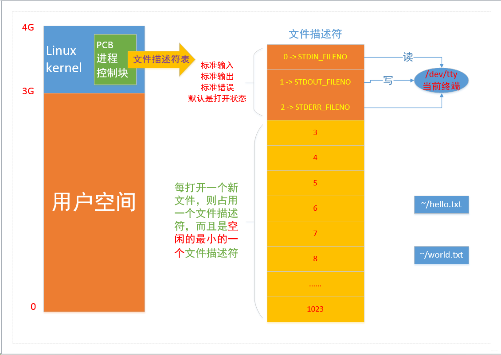

## 文件描述符
- pcb：结构体
- 一个进程有一个文件描述符：1024
- 文件描述符：寻找磁盘文件



## open和openat原型
```
include<sys/stst.h>
#include<fcntl.h>
 
int open(const char *pathname, int flags);
int open(const char *pathname, int flags, mode_t mode);
 
int openat(int fd, const char *pathname, int flags);
int openat(int fd, const char *pathname, int flags, mode_t mode);
                                   函数的返回值：若成功，返回文件描述符; 若出错，返回-1
————————————————

```

原文链接：https://blog.csdn.net/isunbin/article/details/83472459


## 相同点

当传给函数的路径名是绝对路径时，二者无区别.（openat()自动忽略第一个参数fd）

## 不同点
- 当传给函数的是相对路径时，如果openat()函数的第一个参数fd是常量AT_FDCWD时，则其后的第二个参数路径名是以当前工作目录为基址的；否则以fd指定的目录文件描述符为基址。
- 目录文件描述符的取得通常分为两步，先用opendir()函数获得对应的DIR结构的目录指针，再使用int dirfd(DIR*)函数将其转换成目录描述符，此时就可以作为openat()函数的第一个参数使用了。

## 实例

- 1.打开采用绝对路径表示的文件/home/leon/test.c,如果文件不存在就创建它。

```
fd = open("/home/leon/test.c", O_RDWR | O_CREAT, 0640);

fd = openat(anything, "/home/leon/test.c", O_RDWR | O_CREAT, 0640);
```

- 2.打开采用相对路径表示的文件

a.打开当前目录文件下的test.c

```
fd = open("./test.c", O_RDWR | O_CREAT, 0640);

fd = openat( AT_FDCWD, O_RDWR | O_CREAT, 0640);
```

b.打开用户chalion家目录中的test.c文件,且此时你在自己的家目录

```
DIR* dir_chalion = opendir(/home/chalion);

fd_chalion = dirfd(dir_chalion);

fd = openat(fd_chalion, "test.c" ,O_RDWR | O_CREAT, 0640);
```

原文链接：https://blog.csdn.net/liangzc1124/article/details/83475246