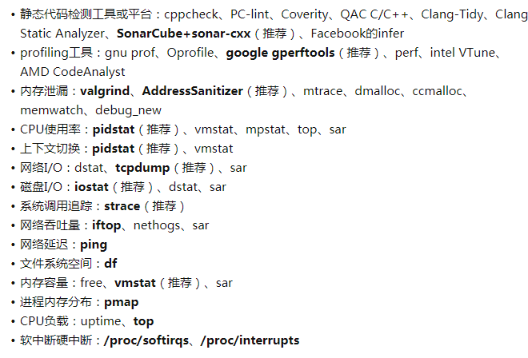

# Address Sanitizer 用法


# 参考资料

AddressSanitizer
 [https://github.com/google/sanitizers/wiki/AddressSanitizer](https://links.jianshu.com/go?to=https%3A%2F%2Fgithub.com%2Fgoogle%2Fsanitizers%2Fwiki%2FAddressSanitizer)

# 1. 简介

Address Sanitizer（ASan）是一个快速的内存错误检测工具。它非常快，只拖慢程序两倍左右（比起Valgrind快多了）。它包括一个编译器instrumentation模块和一个提供malloc()/free()替代项的运行时库。

从gcc 4.8开始，AddressSanitizer成为gcc的一部分。当然，要获得更好的体验，最好使用4.9及以上版本，因为gcc 4.8的AddressSanitizer还不完善，最大的缺点是没有符号信息。

# 2. 使用步骤

-   用-fsanitize=address选项编译和链接你的程序。
-   用-fno-omit-frame-pointer编译，以得到更容易理解stack trace。
-   可选择-O1或者更高的优化级别编译


```cpp
gcc -fsanitize=address -fno-omit-frame-pointer -O1 -g use-after-free.c -o use-after-free
```

运行use-after-fee。如果发现了错误，就会打印出类似下面的信息：


```csharp
==9901==ERROR: AddressSanitizer: heap-use-after-free on address 0x60700000dfb5 
  at pc 0x45917b bp 0x7fff4490c700 sp 0x7fff4490c6f8
READ of size 1 at 0x60700000dfb5 thread T0
    #0 0x45917a in main use-after-free.c:5
    #1 0x7fce9f25e76c in __libc_start_main /build/buildd/eglibc-2.15/csu/libc-start.c:226
    #2 0x459074 in _start (a.out+0x459074)
0x60700000dfb5 is located 5 bytes inside of 80-byte region [0x60700000dfb0,0x60700000e000)
freed by thread T0 here:
    #0 0x4441ee in __interceptor_free projects/compiler-rt/lib/asan/asan_malloc_linux.cc:64
    #1 0x45914a in main use-after-free.c:4
    #2 0x7fce9f25e76c in __libc_start_main /build/buildd/eglibc-2.15/csu/libc-start.c:226
previously allocated by thread T0 here:
    #0 0x44436e in __interceptor_malloc projects/compiler-rt/lib/asan/asan_malloc_linux.cc:74
    #1 0x45913f in main use-after-free.c:3
    #2 0x7fce9f25e76c in __libc_start_main /build/buildd/eglibc-2.15/csu/libc-start.c:226
SUMMARY: AddressSanitizer: heap-use-after-free use-after-free.c:5 main
```

-   第一部分（ERROR）指出错误类型是heap-use-after-free；
-   第二部分（READ）, 指出线程名thread T0，操作为READ，发生的位置是use-after-free.c:5。
    -   该heapk块之前已经在use-after-free.c:4被释放了；
    -   该heap块是在use-fater-free.c:3分配
-   第三部分 (SUMMARY) 前面输出的概要说明。

# 3. 错误类型

# 3.1 (heap) use after free 释放后使用

下面的代码中，分配array数组并释放，然后返回它的一个元素。


```cpp
  5 int main (int argc, char** argv)
  6 {
  7     int* array = new int[100];
  8     delete []array;
  9     return array[1];
 10 }
```

下面的错误信息与前面的“使用步骤”一节中的类似。


```python
==3189==ERROR: AddressSanitizer: heap-use-after-free on address 0x61400000fe44 
at pc 0x0000004008f1 bp 0x7ffc9b6e2630 sp 0x7ffc9b6e2620
READ of size 4 at 0x61400000fe44 thread T0
    #0 0x4008f0 in main /home/ron/dev/as/use_after_free.cpp:9
    #1 0x7f3763aa882f in __libc_start_main (/lib/x86_64-linux-gnu/libc.so.6+0x2082f)
    #2 0x4007b8 in _start (/home/ron/dev/as/build/use_after_free+0x4007b8)

0x61400000fe44 is located 4 bytes inside of 400-byte region [0x61400000fe40,0x61400000ffd0)
freed by thread T0 here:
    #0 0x7f3763ef1caa in operator delete[](void*) (/usr/lib/x86_64-linux-gnu/libasan.so.2+0x99caa)
    #1 0x4008b5 in main /home/ron/dev/as/use_after_free.cpp:8
    #2 0x7f3763aa882f in __libc_start_main (/lib/x86_64-linux-gnu/libc.so.6+0x2082f)

previously allocated by thread T0 here:
    #0 0x7f3763ef16b2 in operator new[](unsigned long) (/usr/lib/x86_64-linux-gnu/libasan.so.2+0x996b2)
    #1 0x40089e in main /home/ron/dev/as/use_after_free.cpp:7
    #2 0x7f3763aa882f in __libc_start_main (/lib/x86_64-linux-gnu/libc.so.6+0x2082f)

SUMMARY: AddressSanitizer: heap-use-after-free /home/ron/dev/as/use_after_free.cpp:9 main
```

# 3.2 heap buffer overflow 堆缓存访问溢出

如下代码中，访问的位置超出堆上数组array的边界。

```cpp
  2 int main (int argc, char** argv)
  3 {
  4     int* array = new int[100];
  5     int res = array[100];
  6     delete [] array;
  7     return res;
  8 } 
```

下面的错误信息指出：

-   错误类型是heap-buffer-overflow
-   不合法操作READ发生在线程T0, heap_buf_overflow.cpp:5
-   heap块分配发生在heap_buf_overflow.cpp

```csharp
==3322==ERROR: AddressSanitizer: heap-buffer-overflow on address 0x61400000ffd0 
at pc 0x0000004008e0 bp 0x7ffeddce53a0 sp 0x7ffeddce5390
READ of size 4 at 0x61400000ffd0 thread T0
    #0 0x4008df in main /home/ron/dev/as/heap_buf_overflow.cpp:5
    #1 0x7f3b83d0882f in __libc_start_main (/lib/x86_64-linux-gnu/libc.so.6+0x2082f)
    #2 0x4007b8 in _start (/home/ron/dev/as/build/heap_buf_overflow+0x4007b8)

0x61400000ffd0 is located 0 bytes to the right of 400-byte region [0x61400000fe40,0x61400000ffd0)
allocated by thread T0 here:
    #0 0x7f3b841516b2 in operator new[](unsigned long) (/usr/lib/x86_64-linux-gnu/libasan.so.2+0x996b2)
    #1 0x40089e in main /home/ron/dev/as/heap_buf_overflow.cpp:4
    #2 0x7f3b83d0882f in __libc_start_main (/lib/x86_64-linux-gnu/libc.so.6+0x2082f)

SUMMARY: AddressSanitizer: heap-buffer-overflow /home/ron/dev/as/heap_buf_overflow.cpp:5 main
```

# 3.2 stack buffer overflow 栈缓存访问溢出

如下代码中，访问的位置超出栈上数组array的边界。


```cpp
  2 int main (int argc, char** argv)
  3 {
  4     int array[100];
  5     return array[100];
  6 }
```

下面的错误信息指出：

-   错误类型是stack-buffer-overflow
-   不合法操作READ发生在线程T0, stack_buf_overflow.cpp:5
-   栈块在线程T0的栈上432偏移位置上。


```kotlin
==3389==ERROR: AddressSanitizer: stack-buffer-overflow on address 0x7ffd061fa4a0 
at pc 0x0000004009ff bp 0x7ffd061fa2d0 sp 0x7ffd061fa2c0
READ of size 4 at 0x7ffd061fa4a0 thread T0
    #0 0x4009fe in main /home/ron/dev/as/stack_buf_overflow.cpp:5
    #1 0x7fbade4e882f in __libc_start_main (/lib/x86_64-linux-gnu/libc.so.6+0x2082f)
    #2 0x400858 in _start (/home/ron/dev/as/build/stack_buf_overflow+0x400858)

Address 0x7ffd061fa4a0 is located in stack of thread T0 at offset 432 in frame
    #0 0x400935 in main /home/ron/dev/as/stack_buf_overflow.cpp:3

  This frame has 1 object(s):
    [32, 432) 'array' <== Memory access at offset 432 overflows this variable
HINT: this may be a false positive if your program uses some custom stack unwind mechanism or swapcontext
      (longjmp and C++ exceptions *are* supported)
SUMMARY: AddressSanitizer: stack-buffer-overflow /home/ron/dev/as/stack_buf_overflow.cpp:5 main
```

# 3.3 global buffer overflow 全局缓冲访问溢出

如下代码中，访问的位置超出全局数组array的边界。


```cpp
  2 int array[100];
  3 
  4 int main (int argc, char** argv)
  5 {
  6     return array[100];
  7 }
```

下面的错误信息指出：

-   错误类型是global-buffer-overflow
-   不合法操作READ发生在线程T0, global_buf_overflow.cpp:6
-   缓存块在global_buf_overflow.cpp:2 定义。


```csharp
==3499==ERROR: AddressSanitizer: global-buffer-overflow on address 0x000000601270 
at pc 0x000000400915 bp 0x7ffd8e80c020 sp 0x7ffd8e80c010
READ of size 4 at 0x000000601270 thread T0
    #0 0x400914 in main /home/ron/dev/as/global_buf_overflow.cpp:6
    #1 0x7f613c1c882f in __libc_start_main (/lib/x86_64-linux-gnu/libc.so.6+0x2082f)
    #2 0x400808 in _start (/home/ron/dev/as/build/global_buf_overflow+0x400808)

0x000000601270 is located 0 bytes to the right of global variable 'array' defined in 
'/home/ron/dev/as/global_buf_overflow.cpp:2:5' (0x6010e0) of size 400
SUMMARY: AddressSanitizer: global-buffer-overflow /home/ron/dev/as/global_buf_overflow.cpp:6 main
```

# 3.4 use after return

# 3.5 use after scope

# 3.6 initializations order bugs

# 3.7 memory leaks 内存泄露

检测内存的LeakSanitizer是集成在AddressSanitizer中的一个相对独立的工具，它工作在检查过程的最后阶段。

下面代码中，p指向的内存没有释放。


```cpp
  4 void* p;
  5 
  6 int main ()
  7 {
  8     p = malloc (7);
  9     p = 0;
 10     return 0;
 11 }
```

下面的错误信息指出 detected memory leaks

-   内存在mem_leak.cpp:8分配
-   缓存块在global_buf_overflow.cpp:2 定义。


```csharp
==4088==ERROR: LeakSanitizer: detected memory leaks

Direct leak of 7 byte(s) in 1 object(s) allocated from:
    #0 0x7ff9ae510602 in malloc (/usr/lib/x86_64-linux-gnu/libasan.so.2+0x98602)
    #1 0x4008d3 in main /home/ron/dev/as/mem_leak.cpp:8
    #2 0x7ff9ae0c882f in __libc_start_main (/lib/x86_64-linux-gnu/libc.so.6+0x2082f)

SUMMARY: AddressSanitizer: 7 byte(s) leaked in 1 allocation(s).
```

目前，并不是所有的平台都默认检测内存泄露，可以指定ASAN_OPTIONS开启如下：


```undefined
ASAN_OPTIONS=detect_leaks=1 yourapp
```

而且不是所有的平台支持检测内存泄露，比如ARM，就会得到这样的提示：


```csharp
==1901==AddressSanitizer: detect_leaks is not supported on this platform.
```

# 4. 工作原理

# 4.1 概要说明

AddressSanitizer的运行时库替换malloc()/free()。分配缓存前后的空间标记为poisoned，已经被释放的缓存也被标记为poisoned。内存访问的代码都被编译器替换如下：

替换之前：


```undefined
*address = ...;
```

替换之后：


```undefined
if (IsPoisoned(address))
{
    ReportError(address, kAccessSize, kIsWrite);
}
*address = ...;
```

访问之前检查访问地址是否poisoned，如果是，报告错误。

# 4.2 memory mapping 和 instrumentation

进程的虚拟地址空间划分为两个不相连的部分：

-   main application memory (Mem)。这是程序自身代码使用的内存；
-   Shadow memory (Shadow)。这里放的是shadow value（meta data）。从Mem到Shadow之间有映射关系。将Mem的一个字节标记为poisoned，其实就是在对应的Shadow内存中写入指定值。

伪代码如下。它先从Mem中地址计算对应的Shadow地址。


```undefined
shadow_address = MemToShadow (address);
if (ShadowIsPoisoned(shadow_address))
{
    ReportError (address, kAccessSize, kIsWrite);
}
```

# 4.3 mapping

Mem中的8字节映射到Shadow memory中是1字节。
 这个字节可能有9种不同的值：

-   所有8字节都是unpoisoned的，则值为0；
-   所有8字节都是poisoned的，则值为负；
-   前k字节为unpoisoned，后面8-k字节为poisoned， 则值为k。
    -   malloc()分配的内存总是8字节的倍数，如果要分配的缓存不是8字节的倍数，则尾部的8个字节poisoned状态不同。比如分配13字节，会得到两个8字节。前1个全是unpoisoned，后一个只有前5个字节是unpoisoned，后3个字节是poisoned。

# 4.4 栈的处理

为了捕捉栈的访问溢出，AddressSanitizer在缓存前后加上保护区。这里可以看到设置对应Shadow memory的代码。

改编之前为：


```cpp
void foo() 
{
  char a[8];
  ...
  return;
}
```

改编之后为：


```cpp
void foo() 
{
  char redzone1[32];  // 32-byte aligned
  char a[8];          // 32-byte aligned
  char redzone2[24];
  char redzone3[32];  // 32-byte aligned
  int  *shadow_base = MemToShadow(redzone1);
  shadow_base[0] = 0xffffffff;  // poison redzone1
  shadow_base[1] = 0xffffff00;  // poison redzone2, unpoison 'a'
  shadow_base[2] = 0xffffffff;  // poison redzone3
  ...
  shadow_base[0] = shadow_base[1] = shadow_base[2] = 0; // unpoison all
  return;
}
```

# 4.5 malloc()/free()的处理

运行时库用自己的函数替换malloc() / free()。

-   malloc()在缓存前后分配保护区。缓存本身标记为unpoisoned，保护区标记为poisoned。
-   free() 将整个区域，包括缓存和保护区，都标记为poisoned，并将该区域放入一个特别的队列中，以保证malloc()在相当长的时间内不会再次使用它）。





https://www.jianshu.com/p/3a2df9b7c353