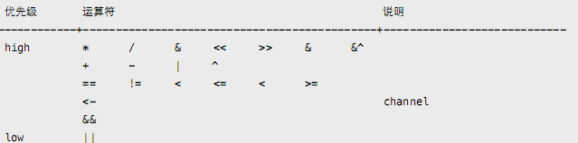

## 一、运算符

#### 运算符结合律

运算符结合律全部从左到右



#### 1. 位运算

```
package main

import "fmt"

func main() {
	a := 0
	a |= 1<<2
	fmt.Println(a)
	a |= 1<<6
	fmt.Println(a)
	a = a &^(1<<6)
	fmt.Println(a)
}
```

知识点：

1. |=用法
2.  ^用法
3. & 用法

不支持~，使用^代替

不支持运算符重载

++ ，--是语句而非表达式（不可放赋值语句右边）

#### 2.初始化

```
package main

import "fmt"

func main() {
	var a = struct {
		x int
		y int
	}{100, 200}
	var b = []int{1, 2, 3}
	fmt.Println(a, b)

	//a1 := []int{
	//	1,
	//	2            // Error: need trailing comma before newline in composite literal
	//}
	a2 := []int{
		1,
		2, 
	}
	b1 := []int{
		1,
		2}
	fmt.Println(a2, b1)
	fmt.Println(len(a2))
}
```

输出结果：

```
{100 200} [1 2 3]
[1 2] [1 2]
2
```

知识点：

1. struct定义与初始化的方法（多个变量换行或者分号分隔）
2. 数组初始化方法
3. 初始化值以 "," 分隔。可以分多⾏，但最后⼀⾏必须以 "," 或 "}" 结尾
4. 数组长度以实际含有多少值为准（比如a2），而非以逗号数目为准

#### 3.if语句

```
package main

func main() {
	a := 10
	if str:="abcdef";a>10{
		println(str,a)
	} else if a<20 {
		println(string(str[1]),a)
	}else {
		println(string(str[4]),a)
	}
	//println(string(str[4]),a)     str无法被识别
}
```

输出：

```
b 10
```

知识点：

- 不管当前if条件是否成立，赋值语句都会执行
- 在条件判断语句后不能使用赋值语句
- if中的赋值语句在if之外不可见

不支持三元操作符?:

#### 4. for语句

```
package main

func main() {
	s := "abc"
	for i, n := 0, len(s); i < n; i++ {   // 常⻅的 for 循环，⽀持初始化语句。
		println(s[i])
	}
	n := len(s)
	for n > 0 {                           // 替代 while (n > 0) {}
		println(s[n-1])                     // 替代 for (; n > 0;) {}
		n--
	}
	for {                                 // 替代 while (true) {}
		println(s)                        // 替代 for (;;) {}
	}
}
```

知识点：

- for的三种用法

#### 5. range语句

类似迭代器操作，返回 (索引, 值) 或 (键, 值)。

```
package main

import "fmt"

func main() {
	s := "abc"
	for i := range s {                  // 忽略 2nd value，⽀持 string/array/slice/map。
		println(s[i])
	}
	for _, c := range s {               // 忽略 index。
		println(c)
	}
	for range s {                       // 忽略全部返回值，仅迭代。
		println(s)
	}
	m := map[string]int{"a": 1, "b": 2}
	for k, v := range m {               // 返回 (key, value)。
		println(k, v)
	}

	a := [3]int{0, 1, 2}
	for i, v := range a {             // index、value 都是从复制品中取出。
		if i == 0 {                   // 在修改前，我们先修改原数组。
			a[1], a[2] = 999, 999
			fmt.Println(a)            // 确认修改有效，输出 [0, 999, 999]。
		}
		a[i] = v + 100                // 使⽤复制品中取出的 value 修改原数组。
	}
	fmt.Println(a)

	a2 := []int{0, 1, 2}
	for i, v := range a2 {             // index、value 都是直接从a2中取出。
		if i == 0 {                   // 在修改前，我们先修改原数组。
			a2[1], a2[2] = 999, 999
			fmt.Println(a2)            // 确认修改有效，输出 [0, 999, 999]。
		}
		a2[i] = v + 100                // 使⽤复制品中取出的 value 修改原数组。
	}
	fmt.Println(a2)
}
```

输出结果：

```
97
98
99
97
98
99
abc
abc
abc
a 1
b 2
[0 999 999]
[100 101 102]
[0 999 999]
[100 1099 1099]
```

range用法的知识点：

- 忽略第二个值,可以不写对应变量或者使用下划线
- 如果不接收range的值,代表只迭代
- range会复制对象(比如a为对象,v+100操作的是复制的对象的值)
- range不复制引用(比如a2为引用,v+100操作的是a2修改过后的数据的值)

#### 6. switch

如果想执行完当前case后继续下一个case,使用fallthrough;这与C语言很不同,C语言是默认继续往后执行,如果想中断,则需要加break

#### 7.Goto, Break, Continue

