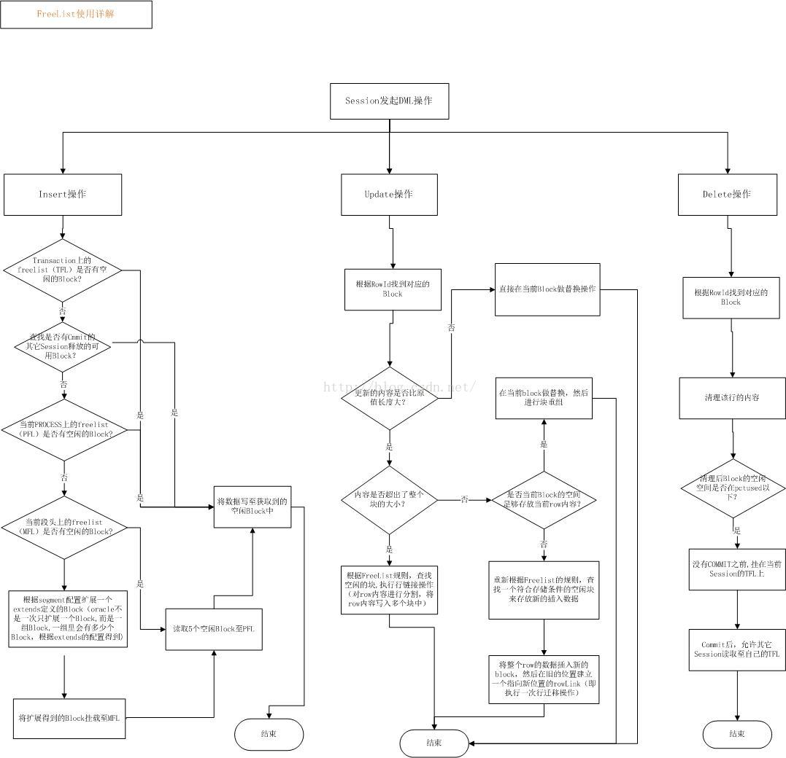
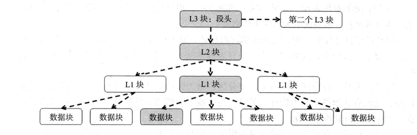

## MSSM

具体实现方式是通过在段头（Segment Header）分配自由列表（freelist）来管理Block的使用，简单一点，可以把自由列表想象成一个数据表，Oracle依赖一系列的算法通过向自由列表中加入或移出Block来实现段空间管理

当向一个对象中插入数据时，假设PCTFREE=20，PCTUSED=40，这就表明当一个Block的空间使用率达到了80%时，这个block就不再允许被用于新增数据（insert），而保留下来的这20%的空间则被预留为行更新（update）所可能需要的空间扩展，此时这个Block就从freelist上被移除；当这个Block中有数据被删除（delete）时，空间不断被释放，当空间使用低于PCTUSED参数设置时（此处即为40%），这个数据块块才会重新被加入到freelists中，加入freelist后这个Block又可以被插入新的数据

缺点：如果一个段的操作非常频繁，那么很多用户就会同时请求访问freelist，并对freelist进行修改，这就很容易产生竞争。对于表来说，缺省的freelist为1，这就很容易引发竞争，虽然可以通过增加freelist的方法缓解这种竞争，但是我们已经看到这种管理方式存在的缺陷

## ASSM

自动段空间管理（ASSM），只有在Locally Managed Tablespace中可以使用ASSM，system tablespace不可以使用ASSM

只有一个关键的SQL参数控制空间分配： PCTFREE

#### ASSM整体结构是3层位图块 + 数据块，共4层树状架构

1. 第一个L3块一般是段头。如果一个段头不够，可以通过指针链接第二个第三个L3块，但一般不会有第三个，第二个也罕见。
2. 一个L3可以有多个L2块地址。一个L2可以有多个L1块地址，一个L1可以有多个数据块地址

#### 确定块插入的步骤

1. 查找数据字典（dba_segments数据字典师徒的基表），确定段头位置
2. 在段头找到L2块位置信息
3. 在L2块中找到执行插入操作进程的PID，做hash运算，得到随机数N，找到L2中第N个L1块位置信息
4. 在上一步确定的L1中，再根据执行插入操作的进程PID，做hash运算得到一个随机数M，在L1中找到第M号块
5. 向第M号数据库插入

这意味着：

1. 相同的pid，插入到相同的块
2. 不同的pid插入到不同的块
3. 堆表不是顺序的

优点：Oracle宣称显著地提高了DML并发操作的性能，因为位图数组的不同部分可以被同时使用，这样就消除了寻找剩余空间的串行化。根据Oracle的测试结果，使用位图数组会显著地消除所有对段头的竞争，还能获得超快的并发插入性能

参考链接：

https://www.cnblogs.com/lyywml/p/12177520.html

《Oracle内核技术揭秘》