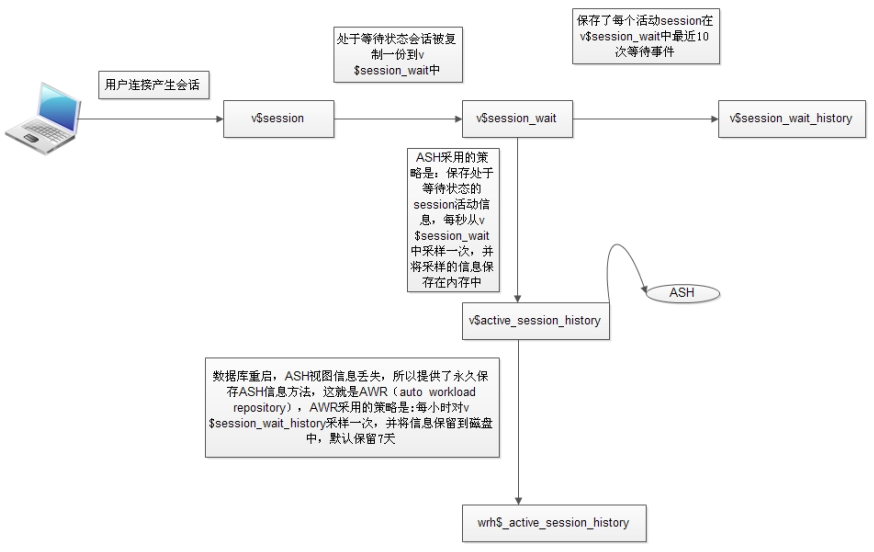

## 一、AWR（Automatic Workload Repository）自动工作负载信息库

  AWR是Oracle10g中的一个新特性，类似于10g以前的statspack.不过在使用上要比statspack简单，提供的性能指标要比statspack多很多，能更好的帮助DBA来发现数据库的性能瓶颈。

  AWR 是Oracle安装好后自动启动的，不需要特别的设置。收集的统计信息存储在SYSAUX表空间SYS模式下，以WRM$_和WRH$_的格式命名，默认会保留最近7天收集的统计信息。每个小时将收集到的信息写到数据库中，这一系列操作是由一个叫MMON的进程来完成的。

1、AWR[存储]的数据分类：

WRM$表存储AWR的元数据（awrinfo.sql脚本）

WRH$表存储采样快照的历史数据（awrrpt.sql脚本）

WRI$表存储同数据库建议功能相关的数据（ADDM相关数据）

2、生成AWR报告：

SQL>@?/rdbms/admin/awrrpt.sql

  根据向导来完成AWR报告的生成。需要注意的是，在选择时间范围的时候，中间不能有停机（如果显示的时间中间有空白行，表示有停机情况）。在选择报告类型的时候一般使用默认的HTML，方便查看。

3、查看数据库的AWR的设置：

SQL> select snap_interval, retention from dba_hist_wr_control;

SNAP_INTERVAL

\---------------------------------------------------------------------------

RETENTION

\---------------------------------------------------------------------------

+00000 01:00:00.0（每小时收集一次）

+00007 00:00:00.0（保留7天）

4、修改默认设置：

begin

DBMS_WORKLOAD_REPOSITORY.MODIFY_SNAPSHOT_SETTINGS（interval => 20,retention => 22460）；

end;

注：修改成每20分钟收集一次统计量，保留最近的2天统计量信息。

5、手动收集一次数据库的统计信息：

exec DBMS_WORKLOAD_REPOSITORY.CREATE_SNAPSHOT;

我们还可以通过DBMS_WORKLOAD_REPOSITORY包完成对基线，默认设置的修改等操作。

 

二、ASH （Active Session History）

  ASH以V$SESSION为基础，每秒采样一次，记录活动会话等待的事件。不活动的会话不会采样，采样工作由新引入的后台进程MMNL来完成。

  ASH buffers 的最小值为1MB,最大值不超过30MB.内存中记录数据。期望值是记录一小时的内容。

 

生成ASH报告：

SQLPLUS>@?/rdbms/ashrpt.sql

  ASH 内存记录数据始终是有限的，为了保存历史数据，引入了自动负载信息库（AutomaticWorkload Repository ,AWR） 由后台进程MMON完成。ASH信息同样被采集写出到AWR负载库中。由于内存不是足够的，所以MMNL进程在ASH写满后会将信息写出到AWR负载库中。ASH全部写出是不可接受的，所以一般只写入收集的10%的数据量，而且使用direct-pathinsert完成，尽量减少日志的生成，从而最小化数据库性能影响。 写出到AWR负载库的ASH信息记录在AWR的基础表wrh$active_session_hist中，wrh$active_session_hist是一个分区表，Oracle会自动进行数据清理。

 

三、ADDM （Automatic Database Diagnostic Monitor AWR）

  是Oracle内部的一个顾问系统，能够自动的完成最数据库的一些优化的建议，给出SQL的优化，索引的创建，统计量的收集等建议。

ADDM报告生成：

SQLPLUS>@?/rdbms/addmrpt.sql

  Oracle 性能调整最重要的就是对最影响性能的SQL的调整。在一个应用中，能够影响到数据库的只有SQL,也只能是SQL.我们不能一味依靠增强硬件，修改系统、数据库参数来提高数据库的性能。更多的应该关注那些最影响性能的SQL语句。ASH报告、AWR报告、ADDM报告都能够找出最影响性能的SQL的工具。在分析ASH报告、AWR报告的时候，最重要的就是关注SQL Statistics,SQL Statistics中最应该关注的是SQL ordered byGets和SQL ordered byReads两个指标。大量的Gets（逻辑读）会占用大量的CPU时间。大量的Reads（物理读）会引起IO的瓶颈出现。一般情况下，大量的Gets会伴随着大量的Reads出现。当然，我们可以通过增大SGA的大小来减少Reads的量。通过这两个指标找到了最影响性能的SQL,这是首要的，也是必要的。下一步就可以通过创建索引，调整SQL来提高SQL单独执行时的性能。减少SQL执行时出现的高Gets,Reads.当然整体的性能影响还和 excutions有关，如果这条SQL执行的次数过多，累加起来量还是很大的。那么就可以考虑通过在应用上缓存等手段来减少SQL执行的次数。另外还有一个需要注意的问题就是在开发过程中SQL一定要使用绑定变量，来减少硬解析（大量的硬解析也会消耗大量的CPU时间，占用大量的Latch）。在开发过程中有个原则就是：小事务。操作完成及时的提交。

  我们使用这么多种方式、报告只有一个唯一的目的：找出最影响系统性能的SQL语句。找到SQL下一步就是对它进行调整了。

  我们在监控数据库时，如果是当前正在发生的问题，我们可以通过v$session+v$sqlarea来找出性能最差的SQL语句。如果在一个小时以内发生的我们可以通过生成ASH报告来找出SQL.如果是1小时以上或几天我们可以通过AWR报告来找出几小时，几天以来最影响系统的SQL语句。ADDM报告基于AWR库，默认可以保存30天的ADDM报告。

 

我们也可以直接查询试图：

v$session （当前正在发生）

v$session_wait （当前正在发生）

v$session_wait_history （会话最近的10次等待事件）

v$active_session_history （内存中的ASH采集信息，理论为1小时）

wrh$_active_session_history （写入AWR库中的ASH信息，理论为1小时以上）

dba_hist_active_sess_history （根据wrh$_active_session_history生成的视图）

四、實用腳本如下

@?rdbms/admin/awrrpt.sql是以前statspack的扩展，收集信息更详细，查看长期的数据库情况。
@?rdbms/admin/ashrpt.sql查看当前的数据库情况，因为ash是每秒从v$session进行进行取样，awr收集的数据要比ash多得多。
一般收集数据库信息的话要结合awr和ash。

@?rdbms/admin/addmrpt .sql相当于是驻留在oracle里的一位专家，是一个自我诊断引擎。产生symptom，problem，infomation，提供解决问题的建议，并自动修复一些具体的故障。
@?rdbms/admin/awrinfo.sql显示的都是awr的相关信息，包括快照信息、sysaux空间使用、awr组件、ash等信息。

五、總結
1、awr与ash的最主要的区别在于：awr是平面的，全面的，ash是立体的，更侧重于session的event跟踪，由于业务量大的数据库的event wait是瞬息万变，awr很可能会监控不到，为了弥补这个不足，ash才可以对session的event进行跟踪。

2、ash与addm的区别在于：addm偶重于基于对当据库当前状态的分析，对存在的问题提供指导性的意见，可以说ash，addm是awr的补充。

3、awr全面地收集数据库的状态，但ash/addm是侧重要对收集的数据进行分析，并提供一些有益的建议。

参考：https://www.cnblogs.com/remote-antiquity/p/7815747.html