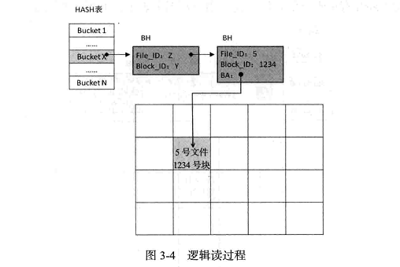
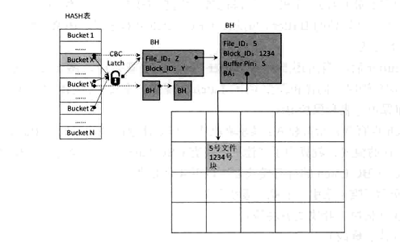

如果使用得当，HASH算法是所有搜索算法中最快的。

**在 Oracle中，几乎所有在内存中搜索数据的算法都采用HASH算法。**
HASH算法中有一个重要的概念：Bucket. 
HASH Bucket数量，由_db_block_hash_buckets参数设置，该参数是隐藏参数。一般情Bucket 3况下，不需要修改此参数（后文会有一个关于此参数调节的案例）。

```
SELECT ksppinm, ksppstvl, ksppdesc
  FROM x$ksppi x, x$ksppcv y
 WHERE x.indx = y.indx
   AND ksppinm = '_db_block_hash_buckets';
```

**哈希冲突，采用链表法解决（为什么不采用开放寻址法？）。**

Bucket N当进程要读取某一个数据块时，它将根据文件号、块号来计算HASH值。假设此处计算出的HASH值为X，那么进程将根据此值，直接定位到 Bucket HASH表X，然后读取CBC（cache buffer chain）表头，再搜索链表逐个比对文件号和块号，直到找到文件为止。

BA：buffer address





## latch和mutex

SGA中是公共内存，哪怕要访问公共内存中的一个字节，都需要有某种锁机制保护。
**Oracle采用的锁机制就是 Latch和 Mutex。**

在以上逻辑读的过程中，搜索 Bucket后的链表，还有访问BH中的BA，都需要 Latch的保护。这个 Latch就是 Cache Buffers Chain Latch（简称 CBC Latch）。



一个CBC latch可以加锁几个bucket，以节约内存

开始访问buffer的时候，CBA latch已经被释放，buffer的访问再buffer pin的保护下完成

**读流程描述如下：**

1. 独占方式获得cbc latch
2. 在独占latch保护下，修改buffer pin为S
3. 修改完毕后释放cbc latch
4. 由buffer pin保护BH中的ba 

整个流程是的CBC latch是独占的。对于数据结构，比如索引的根块、枝块的访问，也是有独占latch，但由于访问频率很高，所以效率比较低。

**如何优化？**

1. 共享方式获得cbc latch
2. 在cbc latch保护下，搜索链表（不修改buffer pin）
3. 查询数据
4. 释放cbc latch

该流程cbc一直持有，时间较长，但状态是共享，所以并发度高。

#### latch竞争

主要有两种情况

1. 多个进程频繁以不兼容的模式申请某一cbc latch，以保护不同链表和不同BH（热链竞争）
2. 多个进程频繁以不兼容的模式申请某一cbc latch，以保护同一链表下的同一BH（热块竞争，难解决，但一般不出现）

