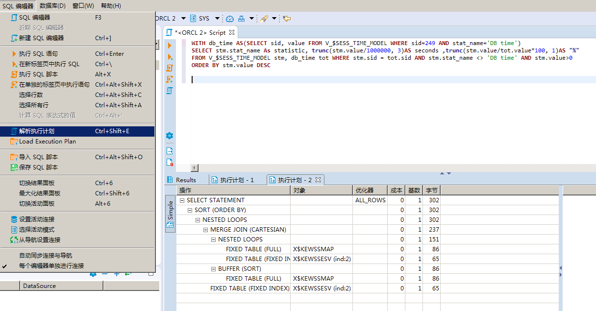

查询计划查看，有几种方式

## set AUTOtrace

```
SET AUTOTRACE ON;
SQL> select * from test;

未选定行


执行计划
----------------------------------------------------------
Plan hash value: 1357081020

--------------------------------------------------------------------------
| Id  | Operation         | Name | Rows  | Bytes | Cost (%CPU)| Time     |
--------------------------------------------------------------------------
|   0 | SELECT STATEMENT  |      |     1 |    26 |     2   (0)| 00:00:01 |
|   1 |  TABLE ACCESS FULL| TEST |     1 |    26 |     2   (0)| 00:00:01 |
--------------------------------------------------------------------------

Note
-----
   - dynamic statistics used: dynamic sampling (level=2)


统计信息
----------------------------------------------------------
          4  recursive calls
          0  db block gets
          7  consistent gets
          0  physical reads
          0  redo size
        408  bytes sent via SQL*Net to client
        533  bytes received via SQL*Net from client
          1  SQL*Net roundtrips to/from client
          0  sorts (memory)
          0  sorts (disk)
          0  rows processed

SQL> set autotrace off;
```

autotrace命令如下

| 序号 | 命令                        | 解释                             |
| ---- | --------------------------- | -------------------------------- |
| 1    | SET AUTOTRACE OFF           | 此为默认值，即关闭Autotrace      |
| 2    | SET AUTOTRACE ON EXPLAIN    | 只显示执行计划                   |
| 3    | SET AUTOTRACE ON STATISTICS | 只显示执行的统计信息             |
| 4    | SET AUTOTRACE ON            | 包含2,3两项内容                  |
| 5    | SET AUTOTRACE TRACEONLY     | 与ON相似，但不显示语句的执行结果 |

## explain plan for

```
SQL> explain plan for select * from test;

已解释。

SQL> select * from table(dbms_xplan.display);

PLAN_TABLE_OUTPUT
--------------------------------------------------------------------------------
Plan hash value: 1357081020

--------------------------------------------------------------------------
| Id  | Operation         | Name | Rows  | Bytes | Cost (%CPU)| Time     |
--------------------------------------------------------------------------
|   0 | SELECT STATEMENT  |      |     1 |    26 |     2   (0)| 00:00:01 |
|   1 |  TABLE ACCESS FULL| TEST |     1 |    26 |     2   (0)| 00:00:01 |
--------------------------------------------------------------------------

Note
-----

PLAN_TABLE_OUTPUT
--------------------------------------------------------------------------------
   - dynamic statistics used: dynamic sampling (level=2)

已选择 12 行。
```

## 使用客户端

