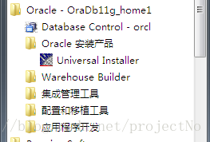
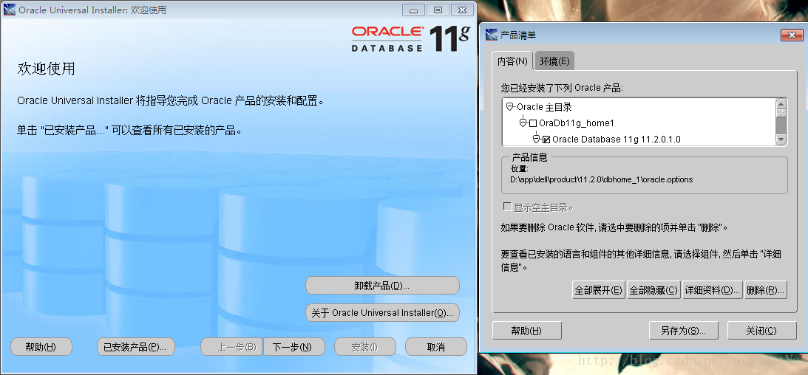
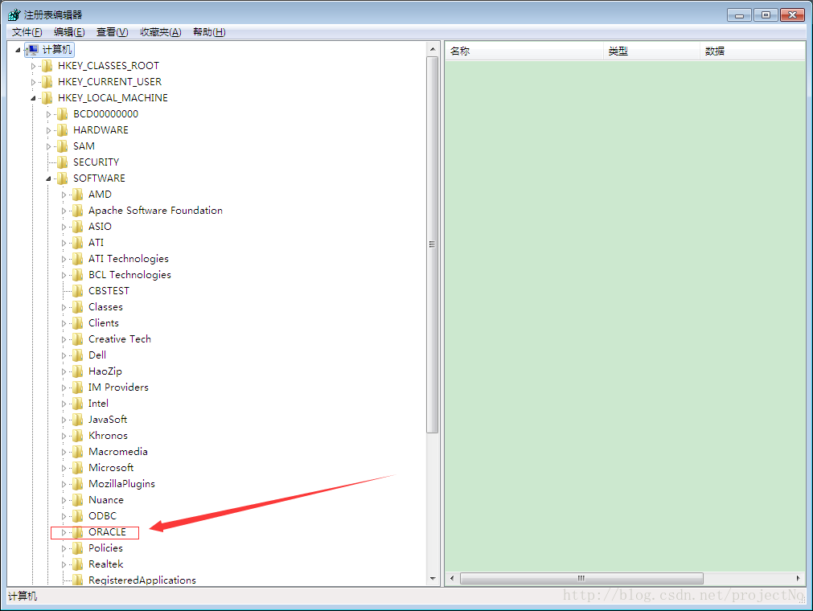

oracle的卸载

完全卸载oracle11g步骤： 
1、 开始－-＞设置－-＞控制面板－-＞管理工具－-＞服务 停止所有Oracle服务。 

2、 开始－-＞程序－-＞oracle - OraHome81－-＞Oracle Installation Products－-＞ Universal Installer，单击“卸载产品”–“全部展开”，选中除“OraDb11g_home1”外的所有目录，然后删除。 

3、 运行输入regedit，选择HKEY_LOCAL_MACHINE\SOFTWARE\ORACLE，按delete键删除这个入口。 

4、 运行输入regedit，选择HKEY_LOCAL_MACHINE\SYSTEM\CurrentControlSet\Services，删除全部Oracle入口(以oracle或OraWeb开头的键)。 
5、 运行输入regedit，HKEY_LOCAL_MACHINE\SYSTEM\CurrentControlSet\Services\Eventlog\Application，删除全部Oracle入口。 
6、 删除HKEY_CLASSES_ROOT目录下全部以Ora、Oracle、Orcl或EnumOra为前缀的键。 
7、 删除HKEY_CURRENT_USER\Software\Microsoft\Windows\CurrentVersion\Explorer\MenuOrder\Start Menu\Programs中全部以oracle开头的键。 
8、删除HKEY_LOCAL_MACHINE\SOFTWARE\ODBC\ODBCINST.INI中除Microsoft ODBC for Oracle注册表键以外的全部含有Oracle的键。 
9、我的电脑—>属性—>高级—>环境变量，删除环境变量CLASSPATH和PATH中有关Oracle设定。 
10、从桌面上、STARTUP（启动）组、程序菜单中，删除全部有关Oracle的组和图标。 
11、删除全部与Oracle相关的目录(如果删不掉，重启计算机后再删就可以了)包括： 
a.C:\Program file\Oracle的目录。 
b.ORACLE_BASE目录(oracle安装目录)。 
c.C:\WINDOWS\system32\config\systemprofile\Oracle的目录。 
d.C:\Users\Administrator\Oracle或C:\Documents and Settings\Administrator\Oracle的目录。 
e.C:\WINDOWS下删除以下文件ORACLE.INI、oradim73.INI、oradim80.INI、oraodbc.ini等。 
f.C:\WINDOWS下的WIN.INI文件中若有[ORACLE]的标记段，删除该段。 
12、如有必要，删除全部Oracle相关的ODBC的DSN 
13、到事件查看器中，删除Oracle相关的日志。说明： 如果有个别DLL文件无法删除的情况下，则不用理会，重启，开始新的安装，安装时，选择一个新的目录，安装完毕并重新启动后，老的目录及文件就可以删除掉了