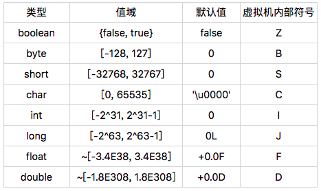
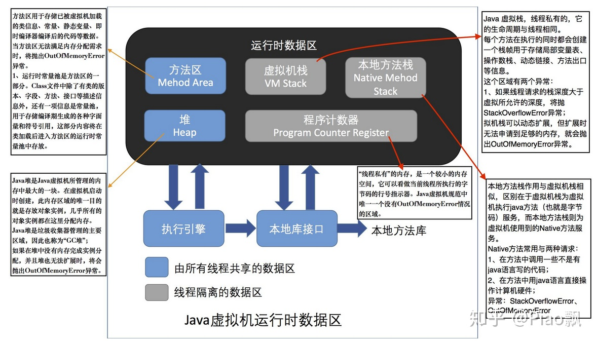

java源代码Foo.java

```
public class Foo {
 public static void main(String[] args) {
  boolean flag = true;
  if (flag) System.out.println("Hello, Java!");
  if (flag == true) System.out.println("Hello, JVM!");
 }
}
```

编译成Foo.class，用D-gui查看（各版本可能不太一样）

```
public class Foo {
  public static void main(String[] paramArrayOfString) {
    boolean bool = true;
    if (bool)
      System.out.println("Hello, Java!"); 
    if (bool == true)
      System.out.println("Hello, JVM!"); 
  }
}
```

## 由 class 文件生成 jasm 文件

```
java -jar asmtools.jar jdis Foo.class > Foo.jasm

```

## 由 jasm 文件生成 class 文件

执行如下命令：

```
java -jar asmtools.jar jasm Foo.jasm
```

这时再用 JD-GUI 打开 Foo.class 文件，内容如下：

```
public class Foo {
  public static void main(String[] paramArrayOfString) {
    byte b = 2;
    if (b != 0)
      System.out.println("Hello, Java!"); 
    if (b == 1)
      System.out.println("Hello, JVM!"); 
  }
}
```

执行

```
# java Foo
Hello, Java!
```

实际上java的boolean类型，在虚拟机里是int类型




除 long 和 double 外，其他基本类型与引用类型在解释执行的方法栈帧中占用的大小是一致的，但它们在堆中占用的大小确不同。在将 boolean、byte、char 以及 short 的值存入字段或者数组单元时，Java 虚拟机会进行掩码操作。在读取时，Java 虚拟机则会将其扩展为 int 类型。


