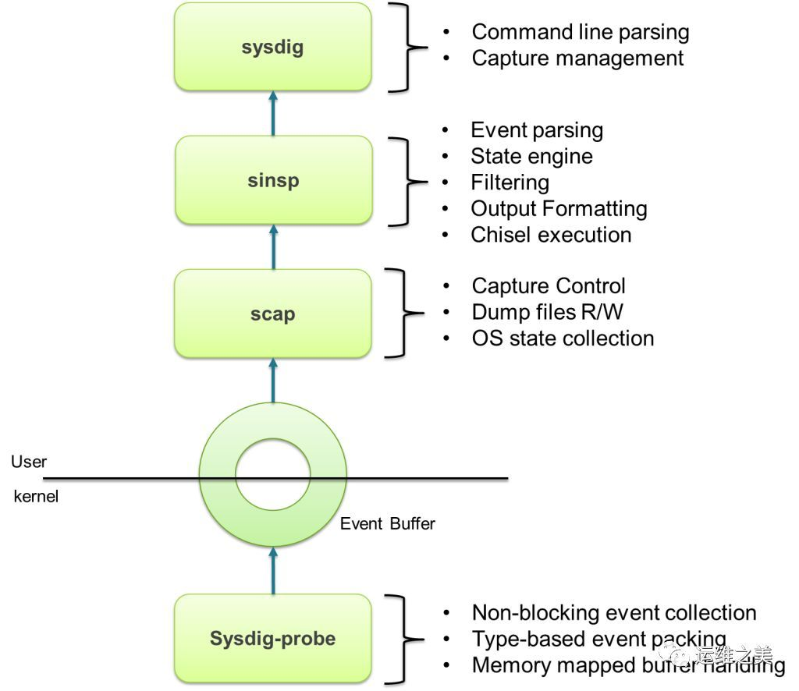
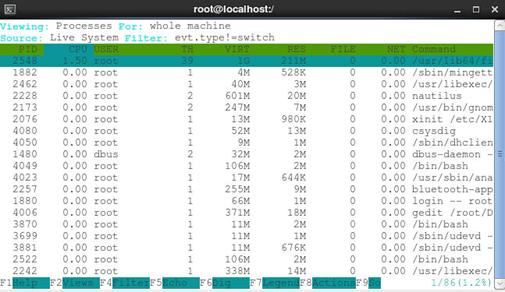
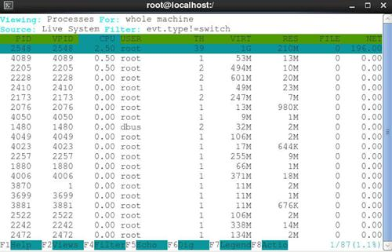

## sysdig简介

Sysdig 官网 上对自己的介绍是：

> Open Source Universal System Visibility With Native Contaier Support.

它的定位是系统监控、分析和排障的工具，其实在 Linux 平台上，已经有很多这方面的工具 strace、tcpdump、htop、iftop、lsof、netstat，它们都能用来分析 Linux 系统的运行情况，而且还有很多日志、监控工具。为什么还需要 Sysdig 呢？在我看来，Sysdig 的优点可以归纳为三个词语：整合、强大、灵活。

#### 整合

虽然 Linux 有很多系统分析和调优的工具，但是它们一般都负责某个特殊的功能，并且使用方式有很大的差异，如果要分析和定位问题，一般都需要熟练掌握需要命令的使用。而且这些工具的数据无法进行共享，只能相互独立工作。Sysdig 一个工具就能实现上述所有工具的功能，并且提供了统一的使用语法。

#### 强大

Sysdig 能获取实时的系统数据，也能把信息保存到文件中以供后面分析。捕获的数据包含系统的个个方面：

全方面的系统参数：CPU、Memory、Disk IO、网络 IO

支持各种 IO 活动：进程、文件、网络连接等

除了帮你捕获信息之外，Sysdig 还预先还有有用的工具来分析这些数据，从大量的数据中找到有用的信息变得非常简单。比如你能还简单地做到下面这些事情：

1. 按照 CPU 的使用率对进程进行排序，找到 CPU 使用率最高的那个
2. 按照发送网络数据报文的多少对进程进行排序
3. 找到打开最多文件描述符的进程
4. 查看哪些进程修改了指定的文件
5. 打印出某个进程的 HTTP 请求报文
6. 找到用时最久的系统调用
7. 查看系统中所有的用户都执行了哪些命令……
8. 基本上自带的工具就能满足大部分的分析需求。

## sysdig工作原理

工作原理

Sysdig 通过在内核的 driver 模块注册系统调用的 hook，这样当有系统调用发生和完成的时候，它会把系统调用信息拷贝到特定的 buffer，然后用户模块的组件对数据信息处理（解压、解析、过滤等），并最终通过 Sysdig 命令行和用户进行交互。




## sysdig安装

```
rpm --import https://s3.amazonaws.com/download.draios.com/DRAIOS-GPG-KEY.public
curl -s -o /etc/yum.repos.d/draios.repo http://download.draios.com/stable/rpm/draios.repo
yum list dkms
rpm -i http://mirror.us.leaseweb.net/epel/7/x86_64/Packages/e/epel-release-7-13.noarch.rpm
#rpm -i http://mirror.us.leaseweb.net/epel/8/Everything/x86_64/Packages/e/epel-release-8-10.el8.noarch.rpm
yum -y install kernel-devel-$(uname -r) #可能安装失败，直接安装相似的软件 yum list kernel-devel-*
yum -y install sysdig
```

执行sysdig，如果报错

```
error opening device /dev/sysdig0. Make sure you have root credentials and that the sysdig-probe module is loaded.
```

则先执行

```
sysdig-probe-loader
```

## sysdig 的命令输出

```
[root@VM-112-34-centos ~]# sysdig | more
7 11:40:27.428353292 0 sysdig (339001) > switch next=339003(sadc) pgft_maj=0 pgft_min=934 vm_size=74084 vm_rss=14224 vm_swap=0 
8 11:40:27.428359038 0 sadc (339003) < read res=32 data=............GNU................. 
9 11:40:27.428363991 0 sadc (339003) > fstat fd=3(<f>/usr/lib64/libsensors.so.4.4.0) 
10 11:40:27.428365347 0 sadc (339003) < fstat res=0 
11 11:40:27.428366844 0 sadc (339003) > mmap addr=0 length=8192 prot=3(PROT_READ|PROT_WRITE) flags=10(MAP_PRIVATE|MAP_ANONYMOUS) fd=4294967295 offset=0 
12 11:40:27.428374100 0 sadc (339003) < mmap res=7F2F28343000 vm_size=464 vm_rss=4 vm_swap=0 
13 11:40:27.428381953 0 sadc (339003) > lseek fd=3(<f>/usr/lib64/libsensors.so.4.4.0) offset=53872 whence=0(SEEK_SET) 
14 11:40:27.428383277 0 sadc (339003) < lseek res=53872 
15 11:40:27.428383821 0 sadc (339003) > read fd=3(<f>/usr/lib64/libsensors.so.4.4.0) size=32 
16 11:40:27.428385814 0 sadc (339003) < read res=32 data=............GNU................. 
17 11:40:27.428386905 0 sadc (339003) > mmap addr=0 length=2155208 prot=5(PROT_READ|PROT_EXEC) flags=1026(MAP_PRIVATE|MAP_DENYWRITE) fd=3(<f>/usr/lib64/libsensors.so.4.4.0) offset=0 
18 11:40:27.428389820 0 sadc (339003) < mmap res=7F2F27F1B000 vm_size=2572 vm_rss=4 vm_swap=0 
19 11:40:27.428390379 0 sadc (339003) > mprotect 
20 11:40:27.428396405 0 sadc (339003) < mprotect 
21 11:40:27.428396975 0 sadc (339003) > mmap addr=7F2F28128000 length=8192 prot=3(PROT_READ|PROT_WRITE) flags=1030(MAP_PRIVATE|MAP_FIXED|MAP_DENYWRITE) fd=3(<f>/usr/lib64/libsensors.so.4.4.0) offset=53248 
22 11:40:27.428403067 0 sadc (339003) < mmap res=7F2F28128000 vm_size=2572 vm_rss=308 vm_swap=0 
23 11:40:27.428443360 0 sadc (339003) > switch next=10 pgft_maj=1 pgft_min=226 vm_size=2572 vm_rss=308 vm_swap=0 
24 11:40:27.428447883 0 <NA> (10) > switch next=9 pgft_maj=0 pgft_min=0 vm_size=0 vm_rss=0 vm_swap=0 
25 11:40:27.428528621 0 <NA> (9) > switch next=10 pgft_maj=0 pgft_min=0 vm_size=0 vm_rss=0 vm_swap=0 
26 11:40:27.428530257 0 <NA> (10) > switch next=0 pgft_maj=0 pgft_min=0 vm_size=0 vm_rss=0 vm_swap=0 
27 11:40:27.428730149 0 <NA> (0) > switch next=10 pgft_maj=0 pgft_min=0 vm_size=0 vm_rss=0 vm_swap=0 
28 11:40:27.428731351 0 <NA> (10) > switch next=9 pgft_maj=0 pgft_min=0 vm_size=0 vm_rss=0 vm_swap=0 
29 11:40:27.428741512 0 <NA> (9) > switch next=0 pgft_maj=0 pgft_min=0 vm_size=0 vm_rss=0 vm_swap=0 
30 11:40:27.428910127 0 <NA> (0) > switch next=339001(sysdig) pgft_maj=0 pgft_min=0 vm_size=0 vm_rss=0 vm_swap=0 
151 11:40:27.429373091 0 sysdig (339001) > switch next=339002(more) pgft_maj=0 pgft_min=942 vm_size=74084 vm_rss=14224 vm_swap=0 
152 11:40:27.429378428 0 more (339002) < read res=2485 data=7 11:40:27.428353292 0 sysdig (339001) > switch next=339003(sadc) pgft_maj=0 pgf 
153 11:40:27.429397678 0 more (339002) > fstat fd=1(<f>/dev/pts/5) 
154 11:40:27.429399086 0 more (339002) < fstat res=0 
155 11:40:27.429404058 0 more (339002) > write fd=1(<f>/dev/pts/5) size=128 
156 11:40:27.429413150 0 more (339002) < write res=128 data=7 11:40:27.428353292 0 sysdig (339001) > switch next=339003(sadc) pgft_maj=0 pgf 
157 11:40:27.429419362 0 more (339002) > write fd=1(<f>/dev/pts/5) size=90 
158 11:40:27.429420372 0 more (339002) < write res=90 data=8 11:40:27.428359038 0 sadc (339003) < read res=32 data=............GNU......... 
159 11:40:27.429425991 0 more (339002) > write fd=1(<f>/dev/pts/5) size=86 

```

第一列是事件序号，它是自动增长的；
第二列是发生事件的时间戳；
第三列是 CPU ID；
第四列是命令；
第五列是线程 ID；
第六列是事件方向，比如进入 ioctl 函数为 >，离开为 <；
第七列是事件名称（比如 ioctl）；
第八列是事件参数。

说明：像 tcpdump 一样，Sysdig 命令也可以用 CTRL+C 来强制停止命令行输出。

## Sysdig 的输出文件的基本操作

==Sysdig 语法和 tcpdump 类似==，特别是保存和读取输出文件的时候。Sysdig 所有的输出都可以保存成一个文件。

写入输出文件：
```
# sysdig -w <output file>
```
例如：
```
# sysdig -w cyq.scap
```
读取记录文件

你一旦写了一个输出文件，就需要用 Sysdig 读取这个文件，这可以通过 -r 参数：
```
# sysdig -r output file
```

## Sysdig 的过滤器

```	
sysdig -l
```

----------------------
Field Class: fd
过滤器|说明
---|---
fd.num  |  the unique number identifying the file descriptor.
fd.type  |  type of FD. Can be 'file', 'directory', 'ipv4', 'ipv6', 'unix','pipe', 'event', 'signalfd', 'eventpoll', 'inotify' or 'signalfd'.
fd.typechar  |  type of FD as a single character. Can be 'f' for file, 4 for IPv4 socket, 6 for IPv6 socket, 'u' for unix socket, p for pipe,'e' for eventfd, 's' for signalfd, 'l' for eventpoll, 'i' for inotify, 'o' for unknown.
fd.name  |  FD full name. If the fd is a file, this field contains the fullpath. If the FD is a socket, this field contain the connection tuple.
fd.directory  |  If the fd is a file, the directory that contains it.
fd.filename  |  If the fd is a file, the filename without the path.
fd.ip  |  (FILTER ONLY) matches the ip address (client or server) of the fd.
fd.cip  |  client IP address.
fd.sip  |  server IP address.
fd.lip  |  local IP address.
fd.rip  |  remote IP address.
fd.port  |  (FILTER ONLY) matches the port (either client or server) of the fd.
fd.cport  |  for TCP/UDP FDs, the client port.
fd.sport  |  for TCP/UDP FDs, server port.
fd.lport  |  for TCP/UDP FDs, the local port.
fd.rport  |  for TCP/UDP FDs, the remote port.
fd.l4proto  |  the IP protocol of a socket. Can be 'tcp', 'udp', 'icmp' or 'raw'.
fd.sockfamily  |  the socket family for socket events. Can be 'ip' or 'unix'.
fd.is_server  |  'true' if the process owning this FD is the server endpoint in the connection.
fd.uid  |  a unique identifier for the FD, created by chaining the FD number and the thread ID.
fd.containername | chaining of the container ID and the FD name. Useful when trying to identify which container an FD belongs to.
fd.containerdirectory|  chaining of the container ID and the directory name. Useful when trying to identify which container a directory belongs to.
fd.proto  |  (FILTER ONLY) matches the protocol (either client or server) of the fd.
fd.cproto  |  for TCP/UDP FDs, the client protocol.
fd.sproto  |  for TCP/UDP FDs, server protocol.
fd.lproto  |  for TCP/UDP FDs, the local protocol.
fd.rproto  |  for TCP/UDP FDs, the remote protocol.
fd.net  |  (FILTER ONLY) matches the IP network (client or server) of the fd.
fd.cnet  |  (FILTER ONLY) matches the client IP network of the fd.
fd.snet  |  (FILTER ONLY) matches the server IP network of the fd.
fd.lnet  |  (FILTER ONLY) matches the local IP network of the fd.
fd.rnet  |  (FILTER ONLY) matches the remote IP network of the fd.
fd.connected  |  for TCP/UDP FDs, 'true' if the socket is connected.
fd.name_changed |True when an event changes the name of an fd used by this event . This can occur in some cases such as udp connections where the connection tuple changes.
fd.cip.name  |  Domain name associated with the client IP address.
fd.sip.name  |  Domain name associated with the server IP address.
fd.lip.name  |  Domain name associated with the local IP address.
fd.rip.name  |  Domain name associated with the remote IP address.
fd.dev  |  device number (major/minor) containing the referenced file
fd.dev.major  |  major device number containing the referenced file
fd.dev.minor  |  minor device number containing the referenced file

----------------------
Field Class: process
过滤器|说明
---|---
proc.pid  |  the id of the process generating the event.
proc.exe  |  the first command line argument (usually the executable name ora custom one).
proc.name  |  the name (excluding the path) of the executable generating the event.
proc.args  |  the arguments passed on the command line when starting the process generating the event.
proc.env  |  the environment variables of the process generating the event.
proc.cmdline  |  full process command line, i.e. proc.name + proc.args.
proc.exeline  |  full process command line, with exe as first argument, i.e. proc.exe + proc.args.
proc.cwd  |  the current working directory of the event.
proc.nthreads  |  the number of threads that the process generating the event currently has, including the main process thread.
proc.nchilds  |  the number of child threads that the process generating the event currently has. This excludes the main process thread.
proc.ppid  |  the pid of the parent of the process generating the event.
proc.pname  |  the name (excluding the path) of the parent of the process generating the event.
proc.pcmdline  |  the full command line (proc.name + proc.args) of the parent of the process generating the event.
proc.apid  |  the pid of one of the process ancestors. E.g. proc.apid[1] returns the parent pid, proc.apid[2] returns the grandparent pid, and so on. proc.apid[0] is the pid of the current process. proc.apid without arguments can be used in filters only and matches any of the process ancestors, e.g. proc.apid=1234.
proc.aname  |  the name (excluding the path) of one of the process ancestors. E.g. proc.aname[1] returns the parent name, proc.aname[2] returns the grandparent name, and so on. proc.aname[0] is the name of the current process. proc.aname without arguments can be usedin filters only and matches any of the process ancestors, e.g.proc.aname=bash.
proc.loginshellid  |  the pid of the oldest shell among the ancestors of the current process, if there is one. This field can be used to separate different user sessions, and is useful in conjunction with chisels like spy_user.
proc.duration  |  number of nanoseconds since the process started.
proc.fdopencount  |  number of open FDs for the process
proc.fdlimit  |  maximum number of FDs the process can open.
proc.fdusage  |  the ratio between open FDs and maximum available FDs for the process.
proc.vmsize  |  total virtual memory for the process (as kb).
proc.vmrss  |  resident non-swapped memory for the process (as kb).
proc.vmswap  |  swapped memory for the process (as kb).
thread.pfmajor | number of major page faults since thread start.
thread.pfminor | number of minor page faults since thread start.
thread.tid  |  the id of the thread generating the event.
thread.ismain  |  'true' if the thread generating the event is the main one in the process.
thread.exectime |CPU time spent by the last scheduled thread, in nanoseconds. Exported by switch events only.
thread.totexectime  |  Total CPU time, in nanoseconds since the beginning of the capture, for the current thread. Exported by switch events only.
thread.cgroups | all the cgroups the thread belongs to, aggregated into a singlestring.
thread.cgroup  |  the cgroup the thread belongs to, for a specific subsystem. E.g. thread.cgroup.cpuacct.
thread.vtid  |  the id of the thread generating the event as seen from its current PID namespace.
proc.vpid  |  the id of the process generating the event as seen from its current PID namespace.
thread.cpu  |  the CPU consumed by the thread in the last second.
thread.cpu.user |the user CPU consumed by the thread in the last second.
thread.cpu.system  |  the system CPU consumed by the thread in the last second.
thread.vmsize  |  For the process main thread, this is the total virtual memory for the process (as kb). For the other threads, this field is zero.
thread.vmrss  |  For the process main thread, this is the resident non-swapped memory for the process (as kb). For the other threads, this field is zero.
proc.sid  |  the session id of the process generating the event.
proc.sname  |  the name of the current process's session leader. This is either the process with pid=proc.sid or the eldest ancestor that hasthe same sid as the current process.
proc.tty  |  The controlling terminal of the process. 0 for processes without a terminal.
proc.exepath  |  The full executable path of the process.
proc.vpgid  |  the process group id of the process generating the event, as seen from its current PID namespace.
proc.is_container_health  |  checktrue if this process is running as a part of the container's health check.
proc.is_container_liveness_probe  |  true if this process is running as a part of the container's liveness probe.
proc.is_container_readiness_probe  |  true if this process is running as a part of the container's readiness probe.

----------------------
Field Class: evt
过滤器|说明
---|---
evt.num  |  event number.
evt.time  |  event timestamp as a time string that includes the nanosecond part.
evt.time.s  |  event timestamp as a time string with no nanoseconds.
evt.time.iso8601  |  event timestamp in ISO 8601 format, including nanoseconds and time zone offset (in UTC).
evt.datetime  |  event timestamp as a time string that includes the date.
evt.rawtime  |  absolute event timestamp, i.e. nanoseconds from epoch.
evt.rawtime.s  |  integer part of the event timestamp (e.g. seconds since epoch).
evt.rawtime.ns | fractional part of the absolute event timestamp.
evt.reltime  |  number of nanoseconds from the beginning of the capture.
evt.reltime.s  |  number of seconds from the beginning of the capture.
evt.reltime.ns | fractional part (in ns) of the time from the beginning of the capture.
evt.latency  |  delta between an exit event and the correspondent enter event, in nanoseconds.
evt.latency.s  |  integer part of the event latency delta.
evt.latency.ns | fractional part of the event latency delta.
evt.latency.human  |  delta between an exit event and the correspondent enter event, as a human readable string (e.g. 10.3ms).
evt.deltatime  |  delta between this event and the previous event, in nanoseconds.
evt.deltatime.s |integer part of the delta between this event and the previous event.
evt.deltatime.ns  |  fractional part of the delta between this event and the previous event.
evt.outputtime | this depends on -t param, default is %evt.time ('h').
evt.dir  |  event direction can be either '>' for enter events or '<' for exit events.
evt.type  |  The name of the event (e.g. 'open').
evt.type.is  |  allows one to specify an event type, and returns 1 for events that are of that type. For example, evt.type.is.open returns 1 for open events, 0 for any other event.
syscall.type  |  For system call events, the name of the system call (e.g. 'open'). Unset for other events (e.g. switch or sysdig internal events). Use this field instead of evt.type if you need to make sure that the filtered/printed value is actually a system call.
evt.category  |  The event category. Example values are 'file' (for file operations like open and close), 'net' (for network operations like socket and bind), memory (for things like brk or mmap), and so on.
evt.cpu  |  number of the CPU where this event happened.
evt.args  |  all the event arguments, aggregated into a single string.
evt.arg  |  one of the event arguments specified by name or by number. Someevents (e.g. return codes or FDs) will be converted into a text representation when possible. E.g. 'evt.arg.fd' or 'evt.arg[0]'.
evt.rawarg  |  one of the event arguments specified by name. E.g. 'evt.rawarg.fd'.
evt.info  |  for most events, this field returns the same value as evt.args.However, for some events (like writes to /dev/log) it provideshigher level information coming from decoding the arguments.
evt.buffer  |  the binary data buffer for events that have one, like read(), recvfrom(), etc. Use this field in filters with 'contains' to search into I/O data buffers.
evt.buflen  |  the length of the binary data buffer for events that have one, like read(), recvfrom(), etc.
evt.res  |  event return value, as a string. If the event failed, the result is an error code string (e.g. 'ENOENT'), otherwise the resultis the string 'SUCCESS'.
evt.rawres  |  event return value, as a number (e.g. -2). Useful for range comparisons.
evt.failed  |  'true' for events that returned an error status.
evt.is_io  |  'true' for events that read or write to FDs, like read(), send,recvfrom(), etc.
evt.is_io_read|  'true' for events that read from FDs, like read(), recv(), recvfrom(), etc.
evt.is_io_write| 'true' for events that write to FDs, like write(), send(), etc.
evt.io_dir  |  'r' for events that read from FDs, like read(); 'w' for events that write to FDs, like write().
evt.is_wait  |  'true' for events that make the thread wait, e.g. sleep(), select(), poll().
evt.wait_latency  |  for events that make the thread wait (e.g. sleep(), select(), poll()), this is the time spent waiting for the event to return,in nanoseconds.
evt.is_syslog  |  'true' for events that are writes to /dev/log.
evt.count  |  This filter field always returns 1 and can be used to count events from inside chisels.
evt.count.error |This filter field returns 1 for events that returned with an error, and can be used to count event failures from inside chisels.
evt.count.error.file  |  This filter field returns 1 for events that returned with an error and are related to file I/O, and can be used to count eventfailures from inside chisels.
evt.count.error.net  |  This filter field returns 1 for events that returned with an error and are related to network I/O, and can be used to count event failures from inside chisels.
evt.count.error.memory  |  This filter field returns 1 for events that returned with an error and are related to memory allocation, and can be used to count event failures from inside chisels.
evt.count.error.other  |  This filter field returns 1 for events that returned with an error and are related to none of the previous categories, and canbe used to count event failures from inside chisels.
evt.count.exit | This filter field returns 1 for exit events, and can be used tocount single events from inside chisels.
evt.around  |  (FILTER ONLY) Accepts the event if it's around the specified time interval. The syntax is evt.around[T]=D, where T is the value returned by %evt.rawtime for the event and D is a delta in milliseconds. For example, evt.around[1404996934793590564]=1000 will return the events with timestamp with one second before thetimestamp and one second after it, for a total of two seconds of capture.
evt.abspath  |  Absolute path calculated from dirfd and name during syscalls like renameat and symlinkat. Use 'evt.abspath.src' or 'evt.abspath.dst' for syscalls that support multiple paths.
evt.is_open_read|'true' for open/openat events where the path was opened for reading
evt.is_open_write|'true' for open/openat events where the path was opened for writing
evt.is_open_exec|'true' for open/openat or creat events where a file is created with execute permissions

----------------------
Field Class: user
过滤器|说明
---|---
user.uid  |  user ID.
user.name  |  user name.
user.homedir  |  home directory of the user.
user.shell  |  user's shell.
user.loginuid  |  audit user id (auid).
user.loginname | audit user name (auid).

----------------------
Field Class: group
过滤器|说明
---|---
group.gid  |  group ID.
group.name  |  group name.

----------------------
Field Class: syslog
过滤器|说明
---|---
syslog.facility.str  |  facility as a string.
syslog.facility| facility as a number (0-23).
syslog.severity.str  |  severity as a string. Can have one of these values: emerg, alert, crit, err, warn, notice, info, debug
syslog.severity| severity as a number (0-7).
syslog.message | message sent to syslog.

----------------------
Field Class: container
过滤器|说明
---|---
container.id  |  the container id.
container.name | the container name.
container.image| the container image name (e.g. sysdig/sysdig:latest for docker,).
container.image.id  |  the container image id (e.g. 6f7e2741b66b).
container.type | the container type, eg: docker or rkt
container.privileged  |  true for containers running as privileged, false otherwise
container.mounts  |  A space-separated list of mount information. Each item in the list has the format <source>:<dest>:<mode>:<rdrw>:<propagation>
container.mount| Information about a single mount, specified by number (e.g. container.mount[0]) or mount source (container.mount[/usr/local]).The pathname can be a glob (container.mount[/usr/local/*]), inwhich case the first matching mount will be returned. The information has the format <source>:<dest>:<mode>:<rdrw>:<propagation>. If there is no mount with the specified index or matching the provided source, returns the string "none" instead of a NULL value.
container.mount.source  |  the mount source, specified by number (e.g. container.mount.source[0]) or mount destination (container.mount.source[/host/lib/modules]). The pathname can be a glob.
container.mount.dest  |  the mount destination, specified by number (e.g. container.mount.dest[0]) or mount source (container.mount.dest[/lib/modules]). The pathname can be a glob.
container.mount.mode  |  the mount mode, specified by number (e.g. container.mount.mode[0]) or mount source (container.mount.mode[/usr/local]). The pathname can be a glob.
container.mount.rdwr  |  the mount rdwr value, specified by number (e.g. container.mount.rdwr[0]) or mount source (container.mount.rdwr[/usr/local]). The pathname can be a glob.
container.mount.propagation  |  the mount propagation value, specified by number (e.g. container.mount.propagation[0]) or mount source (container.mount.propagation[/usr/local]). The pathname can be a glob.
container.image.repository  |  the container image repository (e.g. sysdig/sysdig).
container.image.tag  |  the container image tag (e.g. stable, latest).
container.image.digest  |  the container image registry digest (e.g. sha256:d977378f890d445c15e51795296e4e5062f109ce6da83e0a355fc4ad8699d27).
container.healthcheck  |  The container's health check. Will be the null value ("N/A") ifno healthcheck configured, "NONE" if configured but explicitlynot created, and the healthcheck command line otherwise
container.liveness_probe  |  The container's liveness probe. Will be the null value ("N/A") if no liveness probe configured, the liveness probe command line otherwise
container.readiness_probe  |  The container's readiness probe. Will be the null value ("N/A")if no readiness probe configured, the readiness probe command line otherwise

----------------------
Field Class: fdlist
过滤器|说明
---|---
fdlist.nums  |  for poll events, this is a comma-separated list of the FD numbers in the 'fds' argument, returned as a string.
fdlist.names  |  for poll events, this is a comma-separated list of the FD namesin the 'fds' argument, returned as a string.
fdlist.cips  |  for poll events, this is a comma-separated list of the client IP addresses in the 'fds' argument, returned as a string.
fdlist.sips  |  for poll events, this is a comma-separated list of the server IP addresses in the 'fds' argument, returned as a string.
fdlist.cports  |  for TCP/UDP FDs, for poll events, this is a comma-separated list of the client TCP/UDP ports in the 'fds' argument, returned as a string.
fdlist.sports  |  for poll events, this is a comma-separated list of the server TCP/UDP ports in the 'fds' argument, returned as a string.

----------------------
Field Class: k8s
过滤器|说明
---|---
k8s.pod.name  |  Kubernetes pod name.
k8s.pod.id  |  Kubernetes pod id.
k8s.pod.label  |  Kubernetes pod label. E.g. 'k8s.pod.label.foo'.
k8s.pod.labels | Kubernetes pod comma-separated key/value labels. E.g. 'foo1:bar1,foo2:bar2'.
k8s.rc.name  |  Kubernetes replication controller name.
k8s.rc.id  |  Kubernetes replication controller id.
k8s.rc.label  |  Kubernetes replication controller label. E.g. 'k8s.rc.label.foo'.
k8s.rc.labels  |  Kubernetes replication controller comma-separated key/value labels. E.g. 'foo1:bar1,foo2:bar2'.
k8s.svc.name  |  Kubernetes service name (can return more than one value, concatenated).
k8s.svc.id  |  Kubernetes service id (can return more than one value, concatenated).
k8s.svc.label  |  Kubernetes service label. E.g. 'k8s.svc.label.foo' (can return more than one value, concatenated).
k8s.svc.labels | Kubernetes service comma-separated key/value labels. E.g. 'foo1:bar1,foo2:bar2'.
k8s.ns.name  |  Kubernetes namespace name.
k8s.ns.id  |  Kubernetes namespace id.
k8s.ns.label  |  Kubernetes namespace label. E.g. 'k8s.ns.label.foo'.
k8s.ns.labels  |  Kubernetes namespace comma-separated key/value labels. E.g. 'foo1:bar1,foo2:bar2'.
k8s.rs.name  |  Kubernetes replica set name.
k8s.rs.id  |  Kubernetes replica set id.
k8s.rs.label  |  Kubernetes replica set label. E.g. 'k8s.rs.label.foo'.
k8s.rs.labels  |  Kubernetes replica set comma-separated key/value labels. E.g. 'foo1:bar1,foo2:bar2'.
k8s.deployment.name  |  Kubernetes deployment name.
k8s.deployment.id  |  Kubernetes deployment id.
k8s.deployment.label  |  Kubernetes deployment label. E.g. 'k8s.rs.label.foo'.
k8s.deployment.labels  |  Kubernetes deployment comma-separated key/value labels. E.g. 'foo1:bar1,foo2:bar2'.

----------------------
Field Class: mesos
过滤器|说明
---|---
mesos.task.name| Mesos task name.
mesos.task.id  |  Mesos task id.
mesos.task.label  |  Mesos task label. E.g. 'mesos.task.label.foo'.
mesos.task.labels  |  Mesos task comma-separated key/value labels. E.g. 'foo1:bar1,foo2:bar2'.
mesos.framework.name  |  Mesos framework name.
mesos.framework.id  |  Mesos framework id.
marathon.app.name  |  Marathon app name.
marathon.app.id| Marathon app id.
marathon.app.label  |  Marathon app label. E.g. 'marathon.app.label.foo'.
marathon.app.labels  |  Marathon app comma-separated key/value labels. E.g. 'foo1:bar1,foo2:bar2'.
marathon.group.name  |  Marathon group name.
marathon.group.id  |  Marathon group id.

----------------------
Field Class: span
过滤器|说明
---|---
span.id  |  ID of the span. This is a unique identifier that is used to match the enter and exit tracer events for this span. It can also be used to match different spans belonging to a trace.
span.time  |  time of the span's enter tracer as a human readable string thatincludes the nanosecond part.
span.ntags  |  number of tags that this span has.
span.nargs  |  number of arguments that this span has.
span.tags  |  dot-separated list of all of the span's tags.
span.tag  |  one of the span's tags, specified by 0-based offset, e.g. 'span.tag[1]'. You can use a negative offset to pick elements from the end of the tag list. For example, 'span.tag[-1]' returns thelast tag.
span.args  |  comma-separated list of the span's arguments.
span.arg  |  one of the span arguments, specified by name or by 0-based offset. E.g. 'span.arg.xxx' or 'span.arg[1]'. You can use a negative offset to pick elements from the end of the tag list. For example, 'span.arg[-1]' returns the last argument.
span.enterargs | comma-separated list of the span's enter tracer event arguments. For enter tracers, this is the same as evt.args. For exit tracers, this is the evt.args of the corresponding enter tracer.
span.enterarg  |  one of the span's enter arguments, specified by name or by 0-based offset. For enter tracer events, this is the same as evt.arg. For exit tracer events, this is the evt.arg of the corresponding enter event.
span.duration  |  delta between this span's exit tracer event and the enter tracer event.
span.duration.human  |  delta between this span's exit tracer event and the enter event, as a human readable string (e.g. 10.3ms).

----------------------
Field Class: evtin
过滤器|说明
---|---
evtin.span.id  |  accepts all the events that are between the enter and exit tracers of the spans with the given ID and are generated by the same thread that generated the tracers.
evtin.span.ntags  |  accepts all the events that are between the enter and exit tracers of the spans with the given number of tags and are generated by the same thread that generated the tracers.
evtin.span.nargs  |  accepts all the events that are between the enter and exit tracers of the spans with the given number of arguments and are generated by the same thread that generated the tracers.
evtin.span.tags |accepts all the events that are between the enter and exit tracers of the spans with the given tags and are generated by the same thread that generated the tracers.
evtin.span.tag | accepts all the events that are between the enter and exit tracers of the spans with the given tag and are generated by the same thread that generated the tracers. See the description of span.tag for information about the syntax accepted by this field.
evtin.span.args| accepts all the events that are between the enter and exit tracers of the spans with the given arguments and are generated by the same thread that generated the tracers.
evtin.span.arg  |accepts all the events that are between the enter and exit tracers of the spans with the given argument and are generated by the same thread that generated the tracers. See the description of span.arg for information about the syntax accepted by this field.
evtin.span.p.id |same as evtin.span.id, but also accepts events generated by other threads in the same process that produced the span.
evtin.span.p.ntags  |  same as evtin.span.ntags, but also accepts events generated by other threads in the same process that produced the span.
evtin.span.p.nargs  |  same as evtin.span.nargs, but also accepts events generated by other threads in the same process that produced the span.
evtin.span.p.tags  |  same as evtin.span.tags, but also accepts events generated by other threads in the same process that produced the span.
evtin.span.p.tag  |  same as evtin.span.tag, but also accepts events generated by other threads in the same process that produced the span.
evtin.span.p.args  |  same as evtin.span.args, but also accepts events generated by other threads in the same process that produced the span.
evtin.span.p.arg  |  same as evtin.span.arg, but also accepts events generated by other threads in the same process that produced the span.
evtin.span.s.id |same as evtin.span.id, but also accepts events generated by thescript that produced the span, i.e. by the processes whose parent PID is the same as the one of the process generating the span.
evtin.span.s.ntags  |  same as evtin.span.id, but also accepts events generated by thescript that produced the span, i.e. by the processes whose parent PID is the same as the one of the process generating the span.
evtin.span.s.nargs  |  same as evtin.span.id, but also accepts events generated by thescript that produced the span, i.e. by the processes whose parent PID is the same as the one of the process generating the span.
evtin.span.s.tags  |  same as evtin.span.id, but also accepts events generated by thescript that produced the span, i.e. by the processes whose parent PID is the same as the one of the process generating the span.
evtin.span.s.tag  |  same as evtin.span.id, but also accepts events generated by thescript that produced the span, i.e. by the processes whose parent PID is the same as the one of the process generating the span.
evtin.span.s.args  |  same as evtin.span.id, but also accepts events generated by thescript that produced the span, i.e. by the processes whose parent PID is the same as the one of the process generating the span.
evtin.span.s.arg  |  same as evtin.span.id, but also accepts events generated by thescript that produced the span, i.e. by the processes whose parent PID is the same as the one of the process generating the span.
evtin.span.m.id |same as evtin.span.id, but accepts all the events generated on the machine during the span, including other threads and other processes.
evtin.span.m.ntags  |  same as evtin.span.id, but accepts all the events generated on the machine during the span, including other threads and other processes.
evtin.span.m.nargs  |  same as evtin.span.id, but accepts all the events generated on the machine during the span, including other threads and other processes.
evtin.span.m.tags  |  same as evtin.span.id, but accepts all the events generated on the machine during the span, including other threads and other processes.
evtin.span.m.tag  |  same as evtin.span.id, but accepts all the events generated on the machine during the span, including other threads and other processes.
evtin.span.m.args  |  same as evtin.span.id, but accepts all the events generated on the machine during the span, including other threads and other processes.
evtin.span.m.arg  |  same as evtin.span.id, but accepts all the events generated on the machine during the span, including other threads and other processes.

## Sysdig 中的 chisel（凿子）

chisel 是用 Lua 语言编写的脚本，用来分析和处理 Sysdig 产生的事件。 Sysidg 会在下列目录中查找 chisel：.， ./chisels， ~/chisels 和 /usr/share/sysdig/chisels。
```
# sysdig -cl
Category: Application
---------------------
httplog         HTTP requests log
httptop         Top HTTP requests
memcachelog     memcached requests log

Category: CPU Usage
-------------------
spectrogram     Visualize OS latency in real time.
subsecoffset    Visualize subsecond offset execution time.
topcontainers_cpu
                Top containers by CPU usage
topprocs_cpu    Top processes by CPU usage

Category: Errors
----------------
topcontainers_error
                Top containers by number of errors
topfiles_errors Top files by number of errors
topprocs_errors top processes by number of errors

Category: I/O
-------------
echo_fds        Print the data read and written by processes.
fdbytes_by      I/O bytes, aggregated by an arbitrary filter field
fdcount_by      FD count, aggregated by an arbitrary filter field
fdtime_by       FD time group by
iobytes         Sum of I/O bytes on any type of FD
iobytes_file    Sum of file I/O bytes
spy_file        Echo any read/write made by any process to all files. Optionall
                y, you can provide the name of one file to only intercept reads
                /writes to that file.
stderr          Print stderr of processes
stdin           Print stdin of processes
stdout          Print stdout of processes
topcontainers_file
                Top containers by R+W disk bytes
topfiles_bytes  Top files by R+W bytes
topfiles_time   Top files by time
topprocs_file   Top processes by R+W disk bytes
udp_extract     extract data from UDP streams to files.

Category: Logs
--------------
spy_logs        Echo any write made by any process to a log file. Optionally, e
                xport the events around each log message to file.
spy_syslog      Print every message written to syslog. Optionally, export the e
                vents around each syslog message to file.

Category: Misc
--------------
around          Export to file the events around the time range where the given
                 filter matches.

Category: Net
-------------
iobytes_net     Show total network I/O bytes
spy_ip          Show the data exchanged with the given IP address
spy_port        Show the data exchanged using the given IP port number
topconns        Top network connections by total bytes
topcontainers_net
                Top containers by network I/O
topports_server Top TCP/UDP server ports by R+W bytes
topprocs_net    Top processes by network I/O

Category: Performance
---------------------
bottlenecks     Slowest system calls
fileslower      Trace slow file I/O
netlower        Trace slow network I/0
proc_exec_time  Show process execution time
scallslower     Trace slow syscalls
topscalls       Top system calls by number of calls
topscalls_time  Top system calls by time

Category: Security
------------------
list_login_shells
                List the login shell IDs
shellshock_detect
                print shellshock attacks
spy_users       Display interactive user activity

Category: System State
----------------------
lscontainers    List the running containers
lsof            List (and optionally filter) the open file descriptors.
netstat         List (and optionally filter) network connections.
ps              List (and optionally filter) the machine processes.

Category: Tracers
-----------------
tracers_2_statsd
                Export spans duration as statds metrics.

Use the -i flag to get detailed information about a specific chisel
```

默认有以下类目可用，各个类目中分布有多个内建的 chisel。

CPU Usage：CPU 使用量

Errors：错误

I/O

Logs：日志

Misc：混杂

Net：网络

Performance：性能

Security：安全

System State：系统状态

如果想查看关于某个 chisel 的详细信息，可以使用 -i 选项：

要显示指定 chisel 的信息（包括详细的命令行用法），运行以下命令：

```
# sysdig -i [chisel 名称 ]
```

例如，我们可以检查“CPU”类目下关于 topprocs_cpu 凿子的信息：

```
# sysdig -i topprocs_cpu
```

你可以通过 -c 标记和指定 chisel，让 Sysdig 来运行这个 chisel。

例如：

```
# sysdig -c topprocs_net
```

带过滤器运行 chisel

一些比较常用的 chisels：

- **`httplog`**：输出所有的 HTTP 请求
- **`topprocs_cpu`**：输出按照 CPU 使用率排序的进程列表
- **`echo_fds`**：输出进程读写的数据
- **`netstat`**：列出网络的连接情况
- **`spy_file`**：输出文件的读写数据，可以提供某个文件名作为参数，这样就只输出该文件的读写内容

运行 chisel 时候，可以使用对特定的事件使用过滤器。例如抓取一个特定进程的所有网络流量

下面这个例子显示对 sshd 进程使用 echo_fds 凿子。

```
# sysdig -A -c echo_fds proc.name=sshd
```

抓取一个特定 IP 的网络流量交换

这里使用 echo_fds chisel 和 fd.cip 过滤器 ，显示单独一个 IP 所有的网络流量。

```
# sysdig -A -c echo_fds fd.cip=192.168.1.11
```

## csysdig

csysdig 就是运 ncurses 库的用户界面的 sysdig 软件包，Ncurses 是一个能提供功能键定义 ( 快捷键 ), 屏幕绘制以及基于文本终端的图形互动功能的动态库。在 sysdig 软件包里还提供了一个工具 csysdig，该工具执行后，运行界面和 top 命令类似。



csysdig 使用如下快捷键：

P：暂停屏幕输出信息

Enter：进入当前突出显示的条目。

Ctrl+F：列表搜索。

F1- 帮助信息

F2- 显示视图选择器。这将让你切换到另一个视图。

F4- 使用过滤器

F5- 查看 IO 输出信息

F7 显示帮助页面当前显示的视图。

F8 打开视图的操作面板。

F9，打开列排序面板。

Q 放弃退出。

Arrows, PgUP, PgDn, Home, End：图标上下左右的移动控制。

下面看看两个例子

查看计算机上运行的容器列表及其资源使用情况
```
#csysdig -vcontainers
```


查看容器上下文的进程列表
```
#csysdig -pc
```



## Sysdig 应用实例

#### 安全
Show the directories that the user "root" visits

```
sysdig -p"%evt.arg.path" "evt.type=chdir and user.name=root"
```
Observe ssh activity
```
sysdig -A -c echo_fds fd.name=/dev/ptmx and proc.name=sshd
```
Show every file open that happens in /etc
```
sysdig evt.type=open and fd.name contains /etc
```
Show the ID of all the login shells that have launched the "tar" command
```
sysdig -r file.scap -c list_login_shells tar
```
Show all the commands executed by the login shell with the given ID
```
sysdig -r trace.scap.gz -c spy_users proc.loginshellid=5459
```

#### 监控交互用户活动

假定你作为系统管理员想要监控系统中交互的用户活动（如，用户在命令行输入了什么命令，以及用户去了什么目录），这时 spy_user 这个凿子就派上用场了。

```
# sysdig -c spy_users ` `2486 02:43:07 root) ls --color=auto
```

上面输出的第一栏表示与指定用户的活动相关进程的 PID。如果你想要定位一个指定的用户（例如 root 用户），以及只监控该用户的活动又怎么样呢？你可以通过用户名对 spy_users 凿子的结果进行过滤：

```
# sysdig -c spy_users "user.name=root"``2486 02:40:56 root) ls --color=auto ``2486 02:41:00 root) su cjh
```

#### 监控文件 I/O

我们可以使用“-p”标识来自定义 Sysdig 记录的输出格式，并指定双引号括起来的想要的字段（如用户名、进程名，以及文件或套接口名称）。在下面的例子，我们将创建一个记录文件，该文件将只包含在用户家目录中的写入事件。

```
# sysdig -p "%user.name %proc.name %fd.name" "evt.type=write and fd.name contains /home/cyq" -w writetrace.scap
```

查看使用硬盘带宽最多的进程

```
#sysdig -c topprocs_file
```

列出使用大量文件描述符的进程

```
#sysdig -c fdcount_by proc.name "fd.type=file"
```

查看所有的 SQL select 查询

```
#sysdig -s 2000 -A -c echo_fds evt.buffer contains SELECT
```

查看使用硬盘带宽最多的进程
```
sysdig -c topprocs_file
```
列出使用大量文件描述符的进程
```
sysdig -c fdcount_by proc.name "fd.type=file"
```
查看读写字节数最频繁的前10个文件
```
sysdig -c topfiles_bytes
```
列出Apache进程读取或写入最频繁的文件
```
sysdig -c topfiles_bytes proc.name=httpd
```
监听对 snoop 的系统调用
```
sysdig -p "%12user.name %6proc.pid %12proc.name %3fd.num %fd.typechar %fd.name" evt.type=open
```
See the top directories in terms of R+W disk activity
```
sysdig -c fdbytes_by fd.directory "fd.type=file"
```
See the top files in terms of R+W disk activity in the /tmp directory
```
sysdig -c fdbytes_by fd.filename "fd.directory=/tmp/"
```
Observe the I/O activity on all the files named 'passwd'
```
sysdig -A -c echo_fds "fd.filename=passwd"
```
Display I/O activity by FD type
```
sysdig -c fdbytes_by fd.type
```

#### 监控网络 I/O

作为服务器排障的一部分，你可能想要监听网络通信对于 Sysdig，可以很容易进行通信嗅探，其风格更为对用户友好。

例如，你可以检查由特定 IP 地址，特定进程（如 sshd）提供的数据（ASCII 编码格式）：

```
# sysdig -s 4096 -A -c echo_fds fd.cip=192.168.1.100 -r /mnt/sysdig/debian.scap.gz proc.name=sshd
```

如果你想要监控原生数据传输（二进制格式），请把“-A”替换为“-X”：

```
# sysdig -s 4096 -X -c echo_fds fd.cip=192.168.1.100 -r /mnt/sysdig/debian.scap.gz proc.name=sshd
```

查看调用某个文件的进程

```
#sysdig fd.name=/etc/resolv.conf
```

#### 性能分析

查看操作文件大于 100ms 的进程

```
#sysdig -c fileslower 100
```

查看大于 1s 的网络请求

```
#sysdig -c netlower 1000
```

查看 nginx 进程的执行时间

```
#sysdig -c procexectime proc.name=nginx
```

查看 hhvm 大于 1s 的系统调用

```
#sysdig -c scallslower 1000 proc.name=hhvm
```

查看 hhvm 耗时的系统调用

```
#sysdig -c topscalls_time proc.name=hhvvm
```

查看 cpu0 占用资源最多的进程

```
#sysdig -c topprocs_cpu evt.cpu=0
```

查看占用流量最大的端口

```
#sysdig -c topports_server
```

查看占用流量最大的进程

```
#sysdig -c topprocs_net
```

查看 io 最高的文件

```
#sysdig -c topfiles_bytes
```

查看 io 最高的进程

```
#sysdig -c topprocs_file
```

See the files where most time has been spent
```
sysdig -c topfiles_time
```
See the files where apache spent most time
```
sysdig -c topfiles_time proc.name=httpd
```
See the top processes in terms of I/O errors
```
sysdig -c topprocs_errors
```
See the top files in terms of I/O errors
```
sysdig -c topfiles_errors
```
See all the failed disk I/O calls
```
sysdig fd.type=file and evt.failed=true
```
See all the failed file opens by httpd
```
sysdig "proc.name=httpd and evt.type=open and evt.failed=true"
```
See the system calls where most time has been spent
```
sysdig -c topscalls_time
```
See the top system calls returning errors
```
sysdig -c topscalls "evt.failed=true"
```
snoop failed file opens as they occur
```
sysdig -p "%12user.name %6proc.pid %12proc.name %3fd.num %fd.typechar %fd.name" evt.type=open and evt.failed=true
```
Print the file I/O calls that have a latency greater than 1ms
```
sysdig -c fileslower 1
```

#### 网络相关操作

查看占用网络带宽最多的进程

```
#sysdig -c topprocs_net
```

查看连接最多的服务器端口

```
#sysdig -c fdbytes_by fd.sport
```

查看某客户端连接最多的 ip

```
#sysdig -c fdbytes_by fd.cip
```

查看占用网络带宽最多的进程：
```
sysdig -c topprocs_net
```
显示主机192.168.0.1的网络传输数据 as binary：
```
sysdig -s2000 -X -c echo_fds fd.cip=192.168.0.1
```
as ASCII:
```
sysdig -s2000 -A -c echo_fds fd.cip=192.168.0.1
```
查看本地开放端口中，连接数最多的服务端口：
```
sysdig -c fdcount_by fd.sport "evt.type=accept"
```
查看本地开放端口中，总流量最多的端口：
```
sysdig -c fdbytes_by fd.sport
```
查看客户端IP地址中，连接数最多的 IP：
```
sysdig -c fdcount_by fd.cip "evt.type=accept"
```
查看客户端IP地址中，数据传输量最高的 IP：
```
sysdig -c fdbytes_by fd.cip
```
列出所有的请求链接中，不是访问 apache服务的链接：
```
sysdig -p"%proc.name %fd.name" "evt.type=accept and proc.name!=httpd"
```

#### 容器相关的操作

查看容器上下文的进程列表

```
#csysdig -pc
```

查看运行在 cnetos 容器里 CPU 的使用率

```
#sysdig -pc -c topprocs_cpu container.name=cnetos
```

查看运行在 cnetos 容器里网络带宽的使用率

```
#sysdig -pc -c topprocs_net container.name=cnetos
```

查看在 cnetos 容器里使用网络带宽最多的进程

```
#sysdig -pc -c topprocs_net container.name=cnetos
```

查看在 cnetos 容器里占用 I/O 字节最多的文件

\#sysdig -pc -c topfiles_bytes container.name=cnetos

查看在 cnetos 容器里网络连接的排名情况

```
#sysdig -pc -c topconns container.name=cnetos
```

显示 cnetos 容器里所有命令执行的情况

```
#sysdig -pc -c spy_users container.name=cnetos
```

查看机器上运行的容器列表及其资源使用情况：
```
csysdig -vcontainers
```
查看容器上下文的进程列表：
```
csysdig -pc
```
查看运行在debian.cn容器里CPU的使用率：
```
sysdig -pc -c topprocs_cpu container.name=debian.cn
```
查看运行在 debian.cn 容器里网络带宽的使用率：
```
sysdig -pc -c topprocs_net container.name=debian.cn
```
查看在 debian.cn 容器里使用网络带宽最多的进程：
```
sysdig -pc -c topprocs_net container.name=debian.cn
```
查看在 debian.cn 容器里占用 I/O 字节最多的文件：
```
sysdig -pc -c topfiles_bytes container.name=debian.cn
```
查看在 debian.cn 容器里网络连接的排名情况：
```
sysdig -pc -c topconns container.name=debian.cn
```
显示 debian.cn 容器里所有命令执行的情况：
```
sysdig -pc -c spy_users container.name=debian.cn
```
应用
查看机器所有的HTTP请求：
```
sysdig -s 2000 -A -c echo_fds fd.port=80 and evt.buffer contains GET
```
查看机器所有的SQL select查询：
```
sysdig -s 2000 -A -c echo_fds evt.buffer contains SELECT
```
查看本地Apache对外部MySQL的实时查询
```
sysdig -s 2000 -A -c echo_fds fd.sip=192.168.30.5 and proc.name=apache2 and evt.buffer contains SELECT
```

#### 进程和CPU使用率

See the top processes in terms of CPU usage

```
sysdig -c topprocs_cpu
```
See the top processes for CPU 0
```
sysdig -c topprocs_cpu evt.cpu=0
```
Observe the standard output of a process
```
sysdig -s4096 -A -c stdout proc.name=cat
```

#### HTTP 抓包分析

查看所有的 http 请求

```
#sysdig -c httplog
```

查看 http url top 统计

```
#sysdig -c httptop
```

查看 8080 端口 post 的请求

```
#sysdig -A -c echo_fds fd.port=8080 and evt.buffer contains POST
```

查看 nginx 进程的 accept 链接

```
#sysdig proc.name=nginx and evt.type=accept
```


来自：https://www.cnblogs.com/maoxianfei/p/9077089.html

https://www.ibm.com/developerworks/cn/linux/1607_caoyq_sysdig/index.html

https://www.sohu.com/a/304663622_760387

https://debian.cn/articles/701?www

https://github.com/draios/sysdig/wiki/sysdig-examples