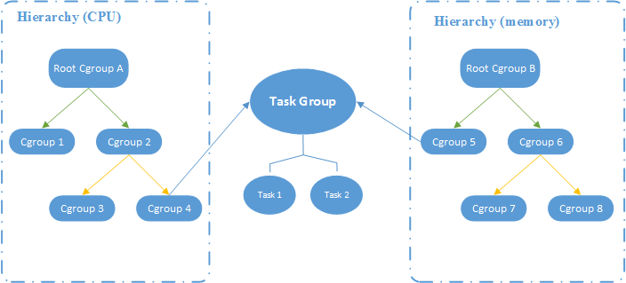
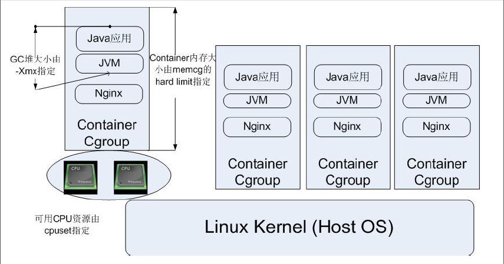

## cgroup是什么
CGroup 是 Control Groups 的缩写，是 Linux 内核提供的一种可以限制、记录、隔离进程组 (process groups) 所使用的物力资源 (如 cpu， memory， i/o 等等) 的机制


## cgroup做什么
CGroup 技术被广泛用于 Linux 操作系统环境下的物理分割。不仅可以限制被namespace隔离起来的资源，还可以为资源设置权重、计算使用量、操控进程启停等等

## cgroup的基本概念
#### 任务（task）

在 cgroups 中，任务就是系统的一个进程

#### 控制族群（control group）
控制族群就是一组按照某种标准划分的进程。Cgroups 中的资源控制都是以控制族群为单位实现。一个进程可以加入到某个控制族群，也从一个进程组迁移到另一个控制族群。一个进程组的进程可以使用 cgroups 以控制族群为单位分配的资源，同时受到 cgroups 以控制族群为单位设定的限制


#### 层级（hierarchy）

控制族群可以组织成 hierarchical 的形式，既一颗控制族群树。控制族群树上的子节点控制族群是父节点控制族群的孩子，继承父控制族群的特定的属性



#### 子系统（subsystem）

一个子系统就是一个资源控制器，比如 cpu 子系统就是控制 cpu 时间分配的一个控制器。子系统必须附加（attach）到一个层级上才能起作用，一个子系统附加到某个层级以后，这个层级上的所有控制族群都受到这个子系统的控制。

## cgroup的结构



## cgroup怎么使用

#### cgroup的安装

```
apt-get install cgroup-bin
```


```
yum install cgroup-bin
```

#### cgroup的启停

```
/etc/init.d/cgconfig  stop/start/status
```

```
 service cgconfig start/stop/status
```
#### cgroup的配置文件cgconfig.conf文件介绍


cgroup相关的命令
lssubsys-am
lscgroup
cgcreate
cgdelete


## cgroup的延伸
lxc = namespace + cgroup


参考：
http://www.ibm.com/developerworks/cn/linux/1506_cgroup/index.html#icomments