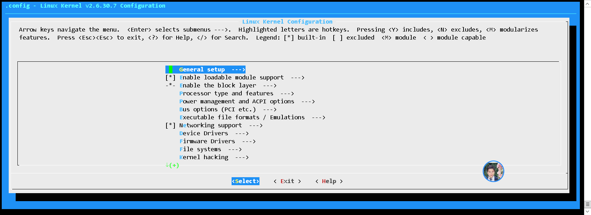

### 获取linux内核

```
wget http://www.kernel.org/pub/linux/kernel/v2.6/linux-2.6.30.7.tar.bz2
```

### 配置内核

有五种配置方式（其实本质只有两种，图形化和非图形化）

1. make config 
2. make defconfig
3. make menuconfig
4. gconfig
5. xconfig

#### make config

一系列输出后，会看到

```
* Linux Kernel Configuration
*
*
* General setup
*
Prompt for development and/or incomplete code/drivers (EXPERIMENTAL) [N/y/?] (NEW)
```

内核配置程序将逐步跟踪每一个配置选项，并询问你是否要启用该选项。

通常情况下，选项以【Y/m/n/？】的形式列出，其中大写字母是默认配置项，只需按下 Enter键就能选中。四个选项含义如下：
y	直接构建为内核的一部分。
n	完全不构建到内核中。
m	构建成模块，在需要时加载。
?	打印简短的描述信息并继续显示提示符。

#### make defconfig

内核包含近**两千个不同**的配置选项，配置所有选项需要很长时间。我们可以使用make defconfig命令生成默认配置

```

# make defconfig
*** Default configuration is based on 'x86_64_defconfig'
#
# configuration written to .config
#

```

#### make menuconfig

如果使用make menuconfig则可以调出一个简单的彩色交互界面




**gconfig和xcofig可以使用图形化配置方式**

### 构建内核

#### 全部构建make

使用make则可以开始构建内核的，同时可以使用-j参数并行构建，-j后面的数字可以是处理器数量的两倍

```
make -j 2
```

使用O参数可以指定目录

#### 部分构建

```
make drivers/usb/serial
make M=drivers/usb/serial
```


### 安装并引导内核

几乎所有的发行版都提供了 installkerne脚本，这样不需要开发者做任何额外的T作，内核构建系统就可以通过它把内核自动安装到正确的位置井修改 bootloader。

```
# make modules_install
INSTALL crypto/echainiv.ko
  INSTALL drivers/thermal/x86_pkg_temp_thermal.ko
  INSTALL fs/efivarfs/efivarfs.ko
  INSTALL net/ipv4/netfilter/ipt_MASQUERADE.ko
  INSTALL net/ipv4/netfilter/iptable_nat.ko
  INSTALL net/ipv4/netfilter/nf_log_arp.ko
  INSTALL net/ipv4/netfilter/nf_log_ipv4.ko
  INSTALL net/ipv4/netfilter/nf_nat_ipv4.ko
  INSTALL net/ipv4/netfilter/nf_nat_masquerade_ipv4.ko
  INSTALL net/ipv6/netfilter/nf_log_ipv6.ko
  INSTALL net/netfilter/nf_log_common.ko
  INSTALL net/netfilter/nf_nat.ko
  INSTALL net/netfilter/nf_nat_ftp.ko
  INSTALL net/netfilter/nf_nat_irc.ko
  INSTALL net/netfilter/nf_nat_sip.ko
  INSTALL net/netfilter/xt_LOG.ko
  INSTALL net/netfilter/xt_addrtype.ko
  INSTALL net/netfilter/xt_mark.ko
  INSTALL net/netfilter/xt_nat.ko
  DEPMOD  4.4.55

```

#### 自动安装

```
make istall
```

1. 内核构建系统将会验证内核是否成功构建。
2. 构建系统会把内核静态部分安装到/ boot目录，并以所构建内核的版本号命名此可执行文件。
3. 内核构建系统将使用构建好的模块自动创建启动阶段需要使用的初始 ramdisk映像
4. 通知引导程序（ bootloader）添加新内核，新内核将被加入到适当的菜单中，以便用户在下次启动的时候选择。
5. 重启启用新内核。如果新内核出现问题，可以改成旧内核启动

#### 手动安装

1. 安装模块

```
# make modules_install
# make kernelversion
4.4.55
```

2. 将编译好的内核cp到/boot下
3. 为新内核修改BootLoader
不同的linux版本在不同的配置文件下，本系统在/etc/grub2.cfg
```
menuentry 'CentOS Linux (5.2.11-1.el7.elrepo.x86_64) 7 (Core)' --class centos --class gnu-linux --class gnu --class os --unrestricted $menuentry_id_option 'gnulinux-5.2.11-1.el7.elrepo.x86_64-advanced-2c04c946-7fee-41c2-a99f-f53e2532e4f7' {
        load_video
        set gfxpayload=keep
        insmod gzio
        insmod part_msdos
        insmod ext2
        set root='hd0,msdos1'
        if [ x$feature_platform_search_hint = xy ]; then
          search --no-floppy --fs-uuid --set=root --hint='hd0,msdos1'  2c04c946-7fee-41c2-a99f-f53e2532e4f7
        else
          search --no-floppy --fs-uuid --set=root 2c04c946-7fee-41c2-a99f-f53e2532e4f7
        fi
        linux16 /boot/vmlinuz-5.2.11-1.el7.elrepo.x86_64 root=UUID=2c04c946-7fee-41c2-a99f-f53e2532e4f7 ro crashkernel=auto console=ttyS0 console=tty0 panic=5 net.ifnames=0 biosdevname=0 
        initrd16 /boot/initramfs-5.2.11-1.el7.elrepo.x86_64.img
}

```
4. 重启

### 应用补丁
1. 下载补丁包
2. 应用补丁包
```
path -p1 ../patch
```
3. 查看内核版本
```
head -n 5 Makefile
```

### 更改内核配置

```
make oldconfig
```


### 定制内核

内核参数可以在以下地方找到

```
ls /proc/config.gz
```

或者源代码目录

```
/usr/src/kernels/{version}/.config
```

#### /sys/class/

该目录下包含所有注册在kernel里面的设备类型，这是按照设备功能分类的设备模型，每个设备类型表达具有一种功能的设备

```
# ls /sys/bus/pci/devices/ 
# cd 0000:00:00.0/
# cat vendor 
0x8086
# cat device 
0x1237

```

### 内核参数

#### 磁盘

##### USB 

查看是否支持

```
# lspci | grep -i usb
00:01.2 USB controller: Intel Corporation 82371SB PIIX3 USB [Natoma/Triton II] (rev 01)
```


1. USB存储设备实际是通过USB接口通信的USB SCSI设 备 。因 此，必须首先启用SCSI子 系统。
   磁盘

```
Device Drivers
	SCSI Device Support
		[*]SCSI Device Support
```


2. 同样，在SCSI 系统中，为了使设备能够正常挂载，必须启 用 “SCSI disk support"

```
Device Drivers
	SCSI Device Support
		[*] SCSI disk support
```

3. 启用USB 存储设备支持。

```
Device Drivers 
	USB Support
		[M] USB Mass Storage support
```

   #### IDE

查看是否支持IDE

```
# lspci | grep -i IDE
00:01.1 IDE interface: Intel Corporation 82371SB PIIX3 IDE [Natoma/Triton II]
```

### 内核配置选项

序号|参数选项|说明
---|---|---
1 |LOCALVERSION|此选项允许你在内核版本号后附加一些文字。例如，它将显示在uname 命令的输出中
2|AUDIT|审计支持。可被其他内核系统使用的审计基础，如SELinux
3|IKCONFIG |内核.config  支持此选项将内核.config完整内容全部存储在内核中
4|MODULES|启用内核模块支持
5|IOSCHED_NOOP|NOOP调度程序
6|IOSCHED_AS|Anticipatory I/O调度程序，默认的磁盘调度程序，通常性能很好，在大负载下性能欠佳
7|IOSCHED_DEADLINE|某些繁 重的数据库工作负 载下表现很好
8|IOSCHED_CFQ|CFQ  I/O调度程序尝试给系统中所有的进程分fid相等的带宽，适合桌面系统
9|SMP|对称多处理支持，如果只有一个CPU，则选择否
10|NR_CPUS|CPU最大数 置 （ 2〜255）
11|SCHED_SMT|(超线程）调度支持
12|PREEMPT_NONE|非强制抢占（推荐用于服务器）,面向最大吞吐量和科学计算
13|PREEMPT_VOLUNTARY|自愿内核抢占（推荐用于桌面系统）。此选项通过在内核代码屮加入更多的“抢占点”来减少延迟
14|PREEMPT|可抢占内核（推荐用于毫 秒级低延迟桌面系统）
15|PREEMPT_BKL|抢占大型内核锁。此选项通过使大型内核锁可抢占来减少延时，适合桌面系统
16|FLATMEM_MANUAL|此选项允许你改变Linux内部管理内存的模式
17|SPARSEMEM_MANUAL|稀疏内存,对于某些系统，包括内存热插拔系统，这是唯一的选择
18|SECCOMP|启用seccomp安全执行不可信任代码，只有嵌入式系统才应当使用否
19|KEXEC|实现了关闭当前内核并启动另一个内核的功能 ，类似于不依赖固件的重启
20|HOTPLUG_CPU|支持热插拔CPU
21|PM|电源管理支持
22|SOFTWARE_SUSPEND|启用软件休眠
23|ACPI|Linux对高级配置和电源接口（ACPI)的支持
24|CPU_FREQ|CPU频率调节以动态调节CPU的时钟频率
25|CPU_FREQ_DEFAULT_GOV_PERFORMANCE|将CPU设置在最高频率
26|CPU_FREQ_DEFAULT_GOV_USERSPACE|可以让你手动设置CPU的频率或使用用户空间程序动态设置CPU频率。
27|CPU_FREQ_GOV_PERFORMANCE|静态地将CPU频率设置在所支持的最高值
28|CPU_FREQ_GOV_POWERSAVE|节能模式
29|CPU_FREQ_GOV_USERSPACE|需要手动设置CPU频率，则开启
30|CPU_FREQ_GOV_ONDEMAND|一有cpu计算量的任务，就会立即达到最大频率运行，等执行完毕就立即回到最低频率
31|CPU_FREQ_GOV_CONSERVATIVE|按需使用CPU频率
32|PCI|除非特殊理由，否则启用
33|PCCARD|在Linux计筧机上使用PCMCIA或PC卡时淸选择启用
34|PCMCIA|大多数情况下，使用16位PCMCIA卡，需要相应软件的支抟
35|HOTPLUG_PCI|PCI热插拔支持
36|NET Networking |除非万不得已，不要关闭
37|UNIX|UNIX套接字
38|INET|TCP/IP网络互联
39|IP_ADVANCED_ROUTER|echo "1" > /proc/sys/net/ipv4/ip_forward开启
40|NETFILTER|
41|NET_SCHED|服务质量和/或公平队列。如果在这里选择否，你将会得到标准的(先进先出）数据包调度程序——FIFO调度程序。如果选择是，你可以从儿个算法中选择并将其应用于不同的网络设备
42|BT|蓝牙子系统支持
43|IEEE802154|
44|MTD|内 存 技术设 备 （MTD）的支持
45|PARPORT|并行端口支持
46|PNP|即插即用支持
47|IDE|ATA/ATAPI/MFM/RLL 支持
48|SCSI|SCSI设备支持
49|BLK_DEV_SD|SCSI 磁盘支持。SCSI硬盘、光纤通道磁盘、USB存储器、SCSI或并行端口版的IOMEGA ZIP驱动
50|BLK_DEV_SR|SCSI CD-ROM支持
51|CHR_DEV_SG|SCSI通用支持。SCSI扫描仪 、音乐合成器、CD烧录机等
52|MD|多设备驱动程序支持（RAID和LVM)，允许通过一个逻辑设备来操作多个物理设备
53|BLK_DEV_MD|RAID 支持
54|BLK_DEV_DM|设备映射支持
55|IEEE1394|IEEE1394高性能的串行总线
56|NETDEVICES|网络设备支持
57|ETHERNET|
58|PPP|点对点协议支持
59|PPPOE|基于以太网的PPP
60|ISDN
61|INPUT|任何连接到计算机的输入设备（如鼠标、键盘、写字板、控制杆、方向盘等），选择是
62|VT|虚拟终端。选是
63|VT_CONSOLE|基于虚拟终端的控制台支持
64|SERIAL_8250|8250/16550和兼容串口支持
65|AGP|dev/agpgari (AGP支持）
66|DRM|直接渲染器。提供对同步、安全和DMA传输的支持
67|I2C|I2C支持。由飞利浦开发的低速串行总线协议，用在很多微控制器程序上
68|SPI|SPI支持
69|HWMON|硬件监视器，如温度传感器、电甩传感器、风扇的速度等
70|FB|帧缓冲
71|VGA_CONSOLE|VGA文本控制台，允许你通过符合VGA标准的显示器在文本模式使用linux
72|LOGO|引导时显示企鹅LOGO
73|SOUND|声卡支持
74|SND|高级Linux声音架构
75|USB|USB支持
76|USB_EHCI_HCD|主机控制器支持USB2.0，应该选择这个HCD
77|USB_OHCI_HCD|如果USB控制器遵循OHCI标准，选择是
78|EXT2_FS|ext2支持
79|EXT3_FS|ext3支持
80|EXT4_FS|ext4支持
81|EXT4_USE_FOR_EXT2|
82|REISERFS_FS|
83|JFS_FS|
84|XFS_FS|
85|BTRFS_FS|
86|GFS2_FS|
87|QUOTA|配额支持。启用针对用户的磁盘用量限制功能
88|AUTOFS4_F|内核自动挂载器支持
89|FUSE_FS|用户空间文件系统支持
90|SMB_FS|SMB文件系统支持（例如挂载Windows共享文件系统）
91|CIFS|CIFS支持（ win2019 已经废弃了CIFS1.1的协议）
92|PROFILING|用以启用类似OProfile等评测使用的扩展评测机制支持
93|OPROFILE|OProfile是一个评测系统，该系统以分析整个系统包括内核、内核模块、库和应用程序
94|KPROBES|Kprobes可以让CPU在内核几乎所有地方陷入并执行一个回调函数。register_kprobe()建立一个探测点并指定一个回调函数。Kprobes 对于内核调试、非侵入式监视和测试很有用
95|PRINTK_TIME|PRINTK打印时间
96|MAGIC_SYSRQ|选择是，即使在系统崩溃后你也可以通过按住SysRq(Alt+PrintScreen)按键，并按下其他按键来控制系统。
97|DEBUG_KERNEL|调试内核
98|DEBUG_FS|debugfs是内核开发者放置调试文件的虚拟文件系统。启用这个 选项以读写这些文件
99|SECURITY|启用不同的安全模型
100|SECURITY_SELINUX|SELINUX支持

### 其他

Ketchup是一个非常方便的用干更新和切换不同版本内核的工具