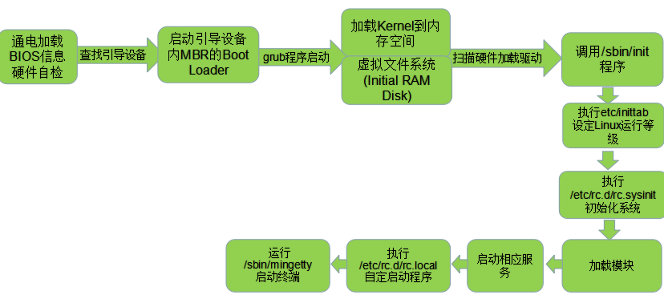
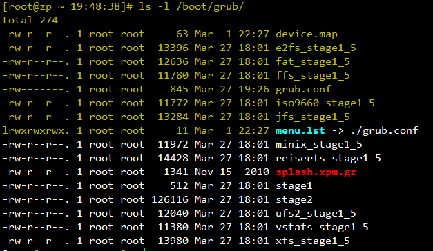
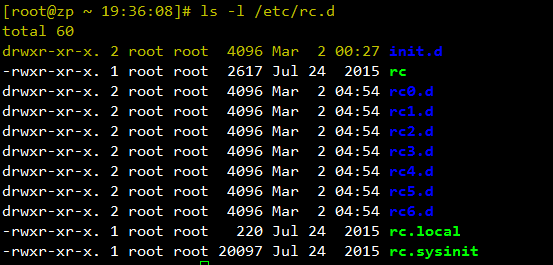
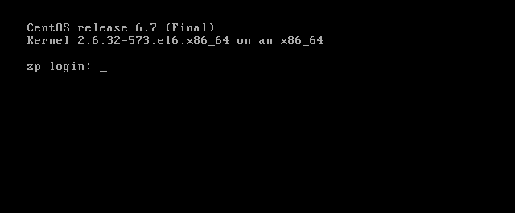

本文来自https://blog.51cto.com/zhangpenglinux/176020

### **Linux开机流程：**

**BIOS:**

(Basic Input Output System)基本输入输出系统,它是一组固化到计算机内主板上一个ROM芯片 上的程序，保存着计算机最重要的基本输入输出的程序、开机后自检程序和系统自启动程序，可从CMOS中读写系统设置的具体信息。

**MBR**: Master Boot Record，主要引导记录区。

**Boot Loader**：启动引导程序。

### **二、详细流程**

**第一步：****加载BIOS**

打开计算机电源，计算机硬件会自动加载BIOS，读取BIOS内相关硬件信息及进行硬件系统的自检，随后根据BIOS配置找到第一个有引导程序的的设备。

**第二步：****读取MBR**

硬盘上第0磁道第一个扇区被称为MBR，即主引导记录，大小是512字节，存放了预启动信息、分区表信息。系统找到BIOS所指定的硬盘的MBR后，就会将其复制到物理内存中，被复制到物理内存的内容就是Boot Loader（lilo或者grub）。

**第三步：****启动Boot Loader**

Boot Loader 就是在操作系统内核运行之前运行的一段小程序。通过这段小程序，我们可以初始化硬件设备、建立内存空间的映射图，从而将系统的软硬件环境带到一个合适的状态，以便为最终调用操作系统内核做好一切准备。
Boot Loader有若干种，其中Grub、Lilo是常见的Loader。
本文以Grub为例讲解，grub功能：提供一个菜单，允许用户选择要启动的系统或不同的内核版本；把用户选定的内核装载到RAM中的特定空间中，解压、展开。

系统读取内存中的grub配置信息（一般为menu.lst或grub.conf），并依照此配置信息来加载指定内核。

**第四步：****加载内核**

grub把系统控制权移交给内核，内核开始探测可识别到的所有硬件设备及尝试挂载根目录以获取其驱动程序。此时就需要首先加载磁盘驱动程序以便读取磁盘，而磁盘驱动程序又保存在磁盘内，这样就会导致linux无法启动。此时需要通过伪文件系统来解决这一问题。

虚拟文件系统 (Initial RAM Disk) 即/boot/initramfs-release.img ，这个文件的特色是，能够通过boot loader 来加载到内存中， 然后这个文件会被解压缩并且在内存当中模拟成一个根目录，且此模拟在内存当中的文件系统能够提供一支可运行的程序，透过该程序来加载启动过程中所最需要的核心模块，通常这些模块就是 U盘, RAID, LVM, SCSI 等文件系统与磁盘的驱动程序。等加载完成后， 会帮助核心重新呼叫 /sbin/init 来开始后续的正常启动流程。

 注：RamDisk是辅助性文件，并非必须，取决于内核是否能直接驱动根文件系统所在的设备。

**第五步：****运行/sbin/init程序，设定linux的运行等级**

内核加载完毕后，运行用户空间内第一个应用程序就是/sbin/init，然后读取/etc/inttab文件，依据文件配置设定系统运行等级；

**第六步：init进程执行rc.sysinit**

设定了运行等级后，Linux系统执行/etc/rc.d/rc.sysinit系统初始化脚本程序。初始化包括：设置主机名、设置欢迎信息、激活Udex和seliux、挂载/etc/fstab文件中定义的所有文件系统、检测根文件系统、设置系统时钟、根据/etc/sysctl.conf文件来设置内核参数、激活LVM及软RAID设备、激活swap设备、加载额外设备的驱动程序、执行清理操作。

**第七步：****启动内核模块**

具体是依据/etc/sysconfig/modules文件目录下的文件来装载内核模块。

**第八步：****执行 run-level 的各个服务启动 (script 方式)**

根据运行级别的不同，系统会运行rc0.d到rc6.d中的相应的脚本程序，来完成相应的初始化工作和启动相应的服务。

**第九步：****执行/etc/rc.d/rc.local**

rc.local就是在一切初始化工作后，Linux留给用户进行个性化的地方。你可以把你想设置和启动的东西放到这里。

**第十步：****执行/bin/login程序，进入登录状态**

Linux 就会启动终端机或者是 X Window 来等待使用者登陆。

