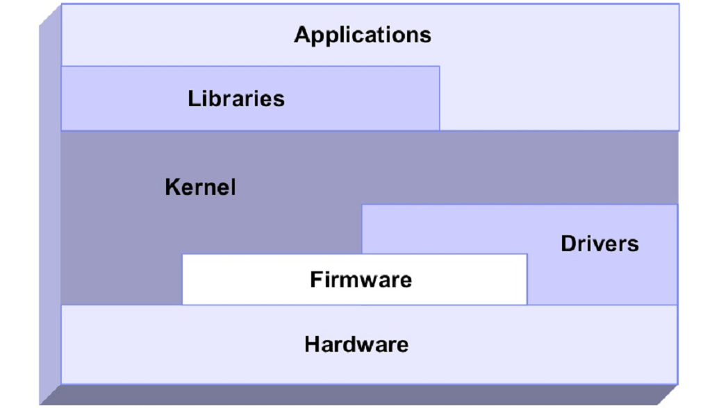
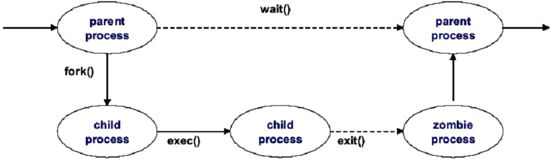
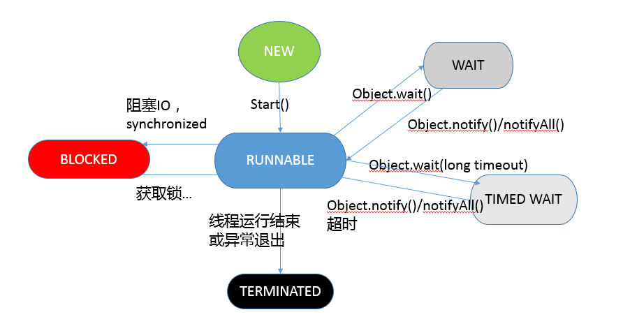

linux功能结构




## linux进程

#### 进程结构

进程是在处理器中执行的实例，内核调度各类资源来满足进程的需求

进程是最小的资源分配单位

线程是调度的基本单位

所有运行在Linux操作系统的进程都被task_struct这个结构体管理

线程是单个进程中生成的执行单元。多个线程在同一个进程中并发运行。它们共享内存、地址空间、打开文件等等资源，还能访问同样的应用数据集。

#### 进程生命周期




1. 当一个进程创建一个新的进程，创建进程的进程（父进程）使用名为fock()的系统调用。当fork()被调用的时候，它会为新创建的进程（子进程）获得一个进程描述符，并且设置新的进程ID。复制父进程的进程描述符给子进程。这时候，不会复制父进程的地址空间，而是父子进程使用同样的地址空间。
2. exec()系统调用把新程序复制到子进程的地址空间。由于共享同样的地址空间，写入新进程的数据会引发页错误的异常。此时，内核给子进程分配新的物理页。这个延迟的操作叫做Copy	On	Write。子进程和父进程执行的程序通常不一样，它执行自己的程序。这个操作避免了不必要的开销，因为，复制整个地址空间是很慢且低效率的，还会消耗很多的处理器时间和资源。
3. 当程序执行完成，子进程使用exit()系统调用终止。exit()会释放进程的大部分数据结构，并且把这个终止的消息通知给父进程。这时候，子进程被称为zombie	process(僵尸进程)。直到父进程通过wait()系统调用知悉子进程终止之前，子进程都不会被完全的清除。一旦父进程知道子进程终止，它会清除子进程的所有数据结构和进程描述符

#### 线程库

在当前的Linux实现中，线程由POSIX的兼容库(pthread)提供。Linux支持多线程。

##### LinuxThreads
从Linux	Kernel2.0以后，LinuxThreads就是Linux上的默认线程实现方法了。LinuxThreads和POSIX标准有一些不兼容的地方。本地POSIX线程库（Native	POSIXThread	Library，NPTL）正在取代LinuxThreads。LinuxThreads将会被未来的Linux企业发行版所抛弃

##### Native	POSIX	Thread	Library（NPTL）
NPTL最开始是有红帽公司开发的，它和POSIX标准更加兼容。由于它在kernel2.6中具备增强的clone()新系统调用、信号处理实现等，它比LinuxThreads具备更好的性能和可扩展性

##### LD_ASSUME_KERNEL环境变量

用LD_ASSUME_KERNEL环境变量，你可以为你的应用程序选择使用哪一种线程库


#### 进程优先级

进程优先级由动态优先级和静态优先级决定，它是决定进程在CPU中执行顺序的数字。进程优先级越高的进程被处理器执行的机会越大

内核使用启发式算法决定开启或关闭动态优先级

通过nice级别直接修改进程的静态优先级

Linux支持的nice级别从19（最低优先级）到-20（最高优先级），默认只是0。要以root用户身份，才能把进程的nice级别调整为负数

nice

renice


#### 上下文切换

在进程执行过程中，进程的信息存放在处理器的寄存器和缓存中。这部分执行中进程存放在寄存器中的数据就叫做context，上下文

上下文通常存储在进程描述符和内核态栈中。进程切换就叫做上下文切换（context	switching）

因为处理器每次都要为新进程刷新寄存器和缓存，可能引发性能上的问题，所以不应该拥有太多的上下文切换


#### 中断

中断处理是最高优先级别的任务之一。

中断通常由I/O设备产生，譬如网络接口、键盘、磁盘控制器。中断处理器把例如键盘输入、网络帧到达这类事件通知给内核，它告诉内核尽快中断进程执行，因为某些设备需要快速的回应。

当中断信号到达内核，内核必须切换当前执行中的进程到新的进程，处理中断。这就意味着会发生上下文切换，同时也意味着大量的的中断会导致系统性能下降


##### 硬中断与软中断

硬中断是由设备产生的需要做出响应的中断，例如磁盘I/O中断，网卡中断，键盘和鼠标中断。

软中断用于任务处理，可以推迟，例如TCP/IP操作、SCSI洗容易操作。可以在/proc/interrupts中看到相关的硬中断信息

```
# cat /proc/interrupts 
           CPU0       
  0:        145   IO-APIC   2-edge      timer
  1:          9   IO-APIC   1-edge      i8042
  4:       1117   IO-APIC   4-edge      ttyS0
  6:          3   IO-APIC   6-edge      floppy
  8:          0   IO-APIC   8-edge      rtc0
  9:          2   IO-APIC   9-fasteoi   acpi
 11:          0   IO-APIC  11-fasteoi   uhci_hcd:usb1, virtio3
 12:         15   IO-APIC  12-edge      i8042
 14:   11906739   IO-APIC  14-edge      ata_piix
 15:          0   IO-APIC  15-edge      ata_piix
 24:          0   PCI-MSI 65536-edge      virtio1-config
 25:   88020951   PCI-MSI 65537-edge      virtio1-req.0
 26:          5   PCI-MSI 81920-edge      virtio2-config
 27:   15563679   PCI-MSI 81921-edge      virtio2-req.0
 28:         10   PCI-MSI 49152-edge      virtio0-config
 29:  181386043   PCI-MSI 49153-edge      virtio0-input.0
 30:       1945   PCI-MSI 49154-edge      virtio0-output.0
NMI:        724   Non-maskable interrupts
LOC: 2750592199   Local timer interrupts
SPU:          0   Spurious interrupts
PMI:        724   Performance monitoring interrupts
IWI:        111   IRQ work interrupts
RTR:          0   APIC ICR read retries
RES:          0   Rescheduling interrupts
CAL:          0   Function call interrupts
TLB:          0   TLB shootdowns
TRM:          0   Thermal event interrupts
THR:          0   Threshold APIC interrupts
DFR:          0   Deferred Error APIC interrupts
MCE:          0   Machine check exceptions
MCP:      37216   Machine check polls
HYP:          0   Hypervisor callback interrupts
HRE:          0   Hyper-V reenlightenment interrupts
HVS:          0   Hyper-V stimer0 interrupts
ERR:          0
MIS:          0
PIN:          0   Posted-interrupt notification event
NPI:          0   Nested posted-interrupt event
PIW:          0   Posted-interrupt wakeup event
```


#### 线程状态和进程状态




##### 僵尸进程
当进程已经收到信号而终止，正常情况下，完全结束之前，它有一些时间来完成所有的任务（例如关闭打开的文件）。在这个很短的的正常的时间片里，这个进程是僵尸


#### 	进程内存段

