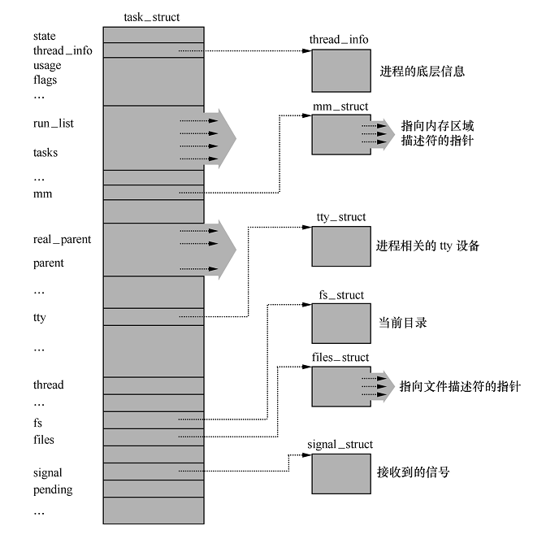
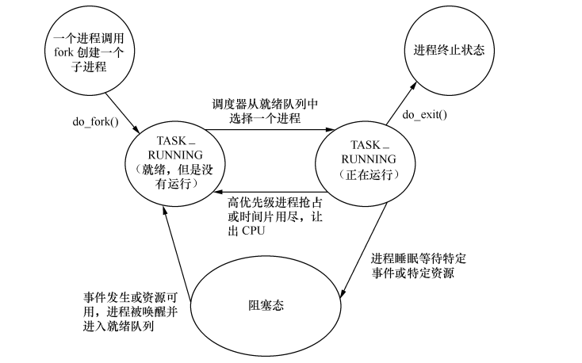

## 一、进程结构

在Linux内核中用一个数据结构struct task_struct来描述进程（文件是linux-4.4.240\include\linux\sched.h）。定义非常大，有接近500行，是操作系统最核心的代码之一。

```
struct task_struct {
#ifdef CONFIG_THREAD_INFO_IN_TASK
	/*
	 * For reasons of header soup (see current_thread_info()), this
	 * must be the first element of task_struct.
	 */
	struct thread_info thread_info;
#endif
	volatile long state;	/* -1 unrunnable, 0 runnable, >0 stopped */
	void *stack;
	atomic_t usage;
	unsigned int flags;	/* per process flags, defined below */
	unsigned int ptrace;

#ifdef CONFIG_SMP
	struct llist_node wake_entry;
	int on_cpu;
#ifdef CONFIG_THREAD_INFO_IN_TASK
	unsigned int cpu;	/* current CPU */
#endif
	unsigned int wakee_flips;
	unsigned long wakee_flip_decay_ts;
	struct task_struct *last_wakee;

	int wake_cpu;
#endif
	int on_rq;

	int prio, static_prio, normal_prio;
	unsigned int rt_priority;
	const struct sched_class *sched_class;
	struct sched_entity se;
	struct sched_rt_entity rt;
#ifdef CONFIG_CGROUP_SCHED
	struct task_group *sched_task_group;
#endif
	struct sched_dl_entity dl;

#ifdef CONFIG_PREEMPT_NOTIFIERS
	/* list of struct preempt_notifier: */
	struct hlist_head preempt_notifiers;
#endif

#ifdef CONFIG_BLK_DEV_IO_TRACE
	unsigned int btrace_seq;
#endif

	unsigned int policy;
	int nr_cpus_allowed;
	cpumask_t cpus_allowed;

#ifdef CONFIG_PREEMPT_RCU
	int rcu_read_lock_nesting;
	union rcu_special rcu_read_unlock_special;
	struct list_head rcu_node_entry;
	struct rcu_node *rcu_blocked_node;
#endif /* #ifdef CONFIG_PREEMPT_RCU */
#ifdef CONFIG_TASKS_RCU
	unsigned long rcu_tasks_nvcsw;
	bool rcu_tasks_holdout;
	struct list_head rcu_tasks_holdout_list;
	int rcu_tasks_idle_cpu;
#endif /* #ifdef CONFIG_TASKS_RCU */

#ifdef CONFIG_SCHED_INFO
	struct sched_info sched_info;
#endif

	struct list_head tasks;
#ifdef CONFIG_SMP
	struct plist_node pushable_tasks;
	struct rb_node pushable_dl_tasks;
#endif

	struct mm_struct *mm, *active_mm;
	/* per-thread vma caching */
	u64 vmacache_seqnum;
	struct vm_area_struct *vmacache[VMACACHE_SIZE];
#if defined(SPLIT_RSS_COUNTING)
	struct task_rss_stat	rss_stat;
#endif
/* task state */
	int exit_state;
	int exit_code, exit_signal;
	int pdeath_signal;  /*  The signal sent when the parent dies  */
	unsigned long jobctl;	/* JOBCTL_*, siglock protected */

	/* Used for emulating ABI behavior of previous Linux versions */
	unsigned int personality;

	/* scheduler bits, serialized by scheduler locks */
	unsigned sched_reset_on_fork:1;
	unsigned sched_contributes_to_load:1;
	unsigned sched_migrated:1;
	unsigned :0; /* force alignment to the next boundary */

	/* unserialized, strictly 'current' */
	unsigned in_execve:1; /* bit to tell LSMs we're in execve */
	unsigned in_iowait:1;
#ifdef CONFIG_MEMCG
	unsigned memcg_may_oom:1;
#endif
#ifdef CONFIG_MEMCG_KMEM
	unsigned memcg_kmem_skip_account:1;
#endif
#ifdef CONFIG_COMPAT_BRK
	unsigned brk_randomized:1;
#endif
#ifdef CONFIG_CGROUPS
	/* disallow userland-initiated cgroup migration */
	unsigned no_cgroup_migration:1;
#endif

	unsigned long atomic_flags; /* Flags needing atomic access. */

	struct restart_block restart_block;

	pid_t pid;
	pid_t tgid;

#ifdef CONFIG_CC_STACKPROTECTOR
	/* Canary value for the -fstack-protector gcc feature */
	unsigned long stack_canary;
#endif
	/*
	 * pointers to (original) parent process, youngest child, younger sibling,
	 * older sibling, respectively.  (p->father can be replaced with
	 * p->real_parent->pid)
	 */
	struct task_struct __rcu *real_parent; /* real parent process */
	struct task_struct __rcu *parent; /* recipient of SIGCHLD, wait4() reports */
	/*
	 * children/sibling forms the list of my natural children
	 */
	struct list_head children;	/* list of my children */
	struct list_head sibling;	/* linkage in my parent's children list */
	struct task_struct *group_leader;	/* threadgroup leader */

	/*
	 * ptraced is the list of tasks this task is using ptrace on.
	 * This includes both natural children and PTRACE_ATTACH targets.
	 * p->ptrace_entry is p's link on the p->parent->ptraced list.
	 */
	struct list_head ptraced;
	struct list_head ptrace_entry;

	/* PID/PID hash table linkage. */
	struct pid_link pids[PIDTYPE_MAX];
	struct list_head thread_group;
	struct list_head thread_node;

	struct completion *vfork_done;		/* for vfork() */
	int __user *set_child_tid;		/* CLONE_CHILD_SETTID */
	int __user *clear_child_tid;		/* CLONE_CHILD_CLEARTID */

	cputime_t utime, stime, utimescaled, stimescaled;
	cputime_t gtime;
	struct prev_cputime prev_cputime;
#ifdef CONFIG_VIRT_CPU_ACCOUNTING_GEN
	seqlock_t vtime_seqlock;
	unsigned long long vtime_snap;
	enum {
		VTIME_SLEEPING = 0,
		VTIME_USER,
		VTIME_SYS,
	} vtime_snap_whence;
#endif
	unsigned long nvcsw, nivcsw; /* context switch counts */
	u64 start_time;		/* monotonic time in nsec */
	u64 real_start_time;	/* boot based time in nsec */
/* mm fault and swap info: this can arguably be seen as either mm-specific or thread-specific */
	unsigned long min_flt, maj_flt;

	struct task_cputime cputime_expires;
	struct list_head cpu_timers[3];

/* process credentials */
	const struct cred __rcu *ptracer_cred; /* Tracer's credentials at attach */
	const struct cred __rcu *real_cred; /* objective and real subjective task
					 * credentials (COW) */
	const struct cred __rcu *cred;	/* effective (overridable) subjective task
					 * credentials (COW) */
	char comm[TASK_COMM_LEN]; /* executable name excluding path
				     - access with [gs]et_task_comm (which lock
				       it with task_lock())
				     - initialized normally by setup_new_exec */
/* file system info */
	struct nameidata *nameidata;
#ifdef CONFIG_SYSVIPC
/* ipc stuff */
	struct sysv_sem sysvsem;
	struct sysv_shm sysvshm;
#endif
#ifdef CONFIG_DETECT_HUNG_TASK
/* hung task detection */
	unsigned long last_switch_count;
#endif
/* filesystem information */
	struct fs_struct *fs;
/* open file information */
	struct files_struct *files;
/* namespaces */
	struct nsproxy *nsproxy;
/* signal handlers */
	struct signal_struct *signal;
	struct sighand_struct *sighand;

	sigset_t blocked, real_blocked;
	sigset_t saved_sigmask;	/* restored if set_restore_sigmask() was used */
	struct sigpending pending;

	unsigned long sas_ss_sp;
	size_t sas_ss_size;

	struct callback_head *task_works;

	struct audit_context *audit_context;
#ifdef CONFIG_AUDITSYSCALL
	kuid_t loginuid;
	unsigned int sessionid;
#endif
	struct seccomp seccomp;

/* Thread group tracking */
	u64 parent_exec_id;
	u64 self_exec_id;
/* Protection of (de-)allocation: mm, files, fs, tty, keyrings, mems_allowed,
 * mempolicy */
	spinlock_t alloc_lock;

	/* Protection of the PI data structures: */
	raw_spinlock_t pi_lock;

	struct wake_q_node wake_q;

#ifdef CONFIG_RT_MUTEXES
	/* PI waiters blocked on a rt_mutex held by this task */
	struct rb_root pi_waiters;
	struct rb_node *pi_waiters_leftmost;
	/* Deadlock detection and priority inheritance handling */
	struct rt_mutex_waiter *pi_blocked_on;
#endif

#ifdef CONFIG_DEBUG_MUTEXES
	/* mutex deadlock detection */
	struct mutex_waiter *blocked_on;
#endif
#ifdef CONFIG_TRACE_IRQFLAGS
	unsigned int irq_events;
	unsigned long hardirq_enable_ip;
	unsigned long hardirq_disable_ip;
	unsigned int hardirq_enable_event;
	unsigned int hardirq_disable_event;
	int hardirqs_enabled;
	int hardirq_context;
	unsigned long softirq_disable_ip;
	unsigned long softirq_enable_ip;
	unsigned int softirq_disable_event;
	unsigned int softirq_enable_event;
	int softirqs_enabled;
	int softirq_context;
#endif
#ifdef CONFIG_LOCKDEP
# define MAX_LOCK_DEPTH 48UL
	u64 curr_chain_key;
	int lockdep_depth;
	unsigned int lockdep_recursion;
	struct held_lock held_locks[MAX_LOCK_DEPTH];
	gfp_t lockdep_reclaim_gfp;
#endif

/* journalling filesystem info */
	void *journal_info;

/* stacked block device info */
	struct bio_list *bio_list;

#ifdef CONFIG_BLOCK
/* stack plugging */
	struct blk_plug *plug;
#endif

/* VM state */
	struct reclaim_state *reclaim_state;

	struct backing_dev_info *backing_dev_info;

	struct io_context *io_context;

	unsigned long ptrace_message;
	siginfo_t *last_siginfo; /* For ptrace use.  */
	struct task_io_accounting ioac;
#if defined(CONFIG_TASK_XACCT)
	u64 acct_rss_mem1;	/* accumulated rss usage */
	u64 acct_vm_mem1;	/* accumulated virtual memory usage */
	cputime_t acct_timexpd;	/* stime + utime since last update */
#endif
#ifdef CONFIG_CPUSETS
	nodemask_t mems_allowed;	/* Protected by alloc_lock */
	seqcount_t mems_allowed_seq;	/* Seqence no to catch updates */
	int cpuset_mem_spread_rotor;
	int cpuset_slab_spread_rotor;
#endif
#ifdef CONFIG_CGROUPS
	/* Control Group info protected by css_set_lock */
	struct css_set __rcu *cgroups;
	/* cg_list protected by css_set_lock and tsk->alloc_lock */
	struct list_head cg_list;
#endif
#ifdef CONFIG_FUTEX
	struct robust_list_head __user *robust_list;
#ifdef CONFIG_COMPAT
	struct compat_robust_list_head __user *compat_robust_list;
#endif
	struct list_head pi_state_list;
	struct futex_pi_state *pi_state_cache;
#endif
#ifdef CONFIG_PERF_EVENTS
	struct perf_event_context *perf_event_ctxp[perf_nr_task_contexts];
	struct mutex perf_event_mutex;
	struct list_head perf_event_list;
#endif
#ifdef CONFIG_DEBUG_PREEMPT
	unsigned long preempt_disable_ip;
#endif
#ifdef CONFIG_NUMA
	struct mempolicy *mempolicy;	/* Protected by alloc_lock */
	short il_next;
	short pref_node_fork;
#endif
#ifdef CONFIG_NUMA_BALANCING
	int numa_scan_seq;
	unsigned int numa_scan_period;
	unsigned int numa_scan_period_max;
	int numa_preferred_nid;
	unsigned long numa_migrate_retry;
	u64 node_stamp;			/* migration stamp  */
	u64 last_task_numa_placement;
	u64 last_sum_exec_runtime;
	struct callback_head numa_work;

	struct list_head numa_entry;
	struct numa_group *numa_group;

	/*
	 * numa_faults is an array split into four regions:
	 * faults_memory, faults_cpu, faults_memory_buffer, faults_cpu_buffer
	 * in this precise order.
	 *
	 * faults_memory: Exponential decaying average of faults on a per-node
	 * basis. Scheduling placement decisions are made based on these
	 * counts. The values remain static for the duration of a PTE scan.
	 * faults_cpu: Track the nodes the process was running on when a NUMA
	 * hinting fault was incurred.
	 * faults_memory_buffer and faults_cpu_buffer: Record faults per node
	 * during the current scan window. When the scan completes, the counts
	 * in faults_memory and faults_cpu decay and these values are copied.
	 */
	unsigned long *numa_faults;
	unsigned long total_numa_faults;

	/*
	 * numa_faults_locality tracks if faults recorded during the last
	 * scan window were remote/local or failed to migrate. The task scan
	 * period is adapted based on the locality of the faults with different
	 * weights depending on whether they were shared or private faults
	 */
	unsigned long numa_faults_locality[3];

	unsigned long numa_pages_migrated;
#endif /* CONFIG_NUMA_BALANCING */

#ifdef CONFIG_ARCH_WANT_BATCHED_UNMAP_TLB_FLUSH
	struct tlbflush_unmap_batch tlb_ubc;
#endif

	struct rcu_head rcu;

	/*
	 * cache last used pipe for splice
	 */
	struct pipe_inode_info *splice_pipe;

	struct page_frag task_frag;

#ifdef	CONFIG_TASK_DELAY_ACCT
	struct task_delay_info *delays;
#endif
#ifdef CONFIG_FAULT_INJECTION
	int make_it_fail;
#endif
	/*
	 * when (nr_dirtied >= nr_dirtied_pause), it's time to call
	 * balance_dirty_pages() for some dirty throttling pause
	 */
	int nr_dirtied;
	int nr_dirtied_pause;
	unsigned long dirty_paused_when; /* start of a write-and-pause period */

#ifdef CONFIG_LATENCYTOP
	int latency_record_count;
	struct latency_record latency_record[LT_SAVECOUNT];
#endif
	/*
	 * time slack values; these are used to round up poll() and
	 * select() etc timeout values. These are in nanoseconds.
	 */
	unsigned long timer_slack_ns;
	unsigned long default_timer_slack_ns;

#ifdef CONFIG_KASAN
	unsigned int kasan_depth;
#endif
#ifdef CONFIG_FUNCTION_GRAPH_TRACER
	/* Index of current stored address in ret_stack */
	int curr_ret_stack;
	/* Stack of return addresses for return function tracing */
	struct ftrace_ret_stack	*ret_stack;
	/* time stamp for last schedule */
	unsigned long long ftrace_timestamp;
	/*
	 * Number of functions that haven't been traced
	 * because of depth overrun.
	 */
	atomic_t trace_overrun;
	/* Pause for the tracing */
	atomic_t tracing_graph_pause;
#endif
#ifdef CONFIG_TRACING
	/* state flags for use by tracers */
	unsigned long trace;
	/* bitmask and counter of trace recursion */
	unsigned long trace_recursion;
#endif /* CONFIG_TRACING */
#ifdef CONFIG_MEMCG
	struct mem_cgroup *memcg_in_oom;
	gfp_t memcg_oom_gfp_mask;
	int memcg_oom_order;

	/* number of pages to reclaim on returning to userland */
	unsigned int memcg_nr_pages_over_high;
#endif
#ifdef CONFIG_UPROBES
	struct uprobe_task *utask;
#endif
#if defined(CONFIG_BCACHE) || defined(CONFIG_BCACHE_MODULE)
	unsigned int	sequential_io;
	unsigned int	sequential_io_avg;
#endif
#ifdef CONFIG_DEBUG_ATOMIC_SLEEP
	unsigned long	task_state_change;
#endif
	int pagefault_disabled;
/* CPU-specific state of this task */
	struct thread_struct thread;
/*
 * WARNING: on x86, 'thread_struct' contains a variable-sized
 * structure.  It *MUST* be at the end of 'task_struct'.
 *
 * Do not put anything below here!
 */
};
```

可以画出简要的结构



## 二、进程状态转换图



1. linux fork了进程，进程就是running状态，不管是不是得到cpu的运行时间（与操作系统理论中稍有不同）
2. 对于一个正在运行的进程，调用用户态库函数exit()会陷入内核执行该内核函数do_exit()，也就是终止进程，那么会进入 TASK_ZOMBIE 状态，即进程的终止状态。TASK_ZOMBIE状态的进程一般叫作僵尸进程，Linux 内核会在适当的时候把僵尸进程给处理掉，处理掉之后进程描述符被释放了，该进程才从 Linux 系统里消失。也就是说，任何进程都会短暂进入到僵尸态。
3. 一个正在运行的进程在等待特定的事件或资源时会进入阻塞态。阻塞态也有两种：TASK_INTERRUPTIBLE 和 TASK_UNINTERRUPTIBLE。
4. 用于管理进程数据结构的双向链表 struct list_head tasks是一个很关键的进程链表，把所有的进程用双向链表链起来