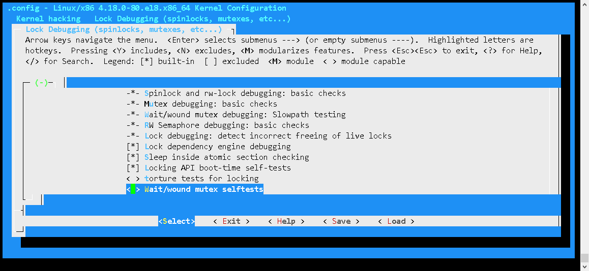

Linux内核提供死锁调试模块Lockdep，跟踪每个锁的自身状态和各个锁之间的依赖关系，经过一系列的验证规则来确保锁之间依赖关系是正确的。

死锁是指两个或多个进程因争夺资源而造成的互相等待的现象。

常见的死锁有如下两种：

1. 递归死锁：中断等延迟操作中使用了锁，和外面的锁构成了递归死锁。
2. AB-BA死锁：多个锁因处理不当而引发死锁，多个内核路径上的所处理顺序不一致也会导致死锁。

Linux内核提供死锁调试模块==Lockdep==，跟踪每个锁的自身状态和各个锁之间的依赖关系，经过一系列的验证规则来确保锁之间依赖关系是正确的。

Lockdep检测的锁包括==spinlock、rwlock、mutex、rwsem====的死锁，锁的错误释放，原子操作中睡眠==等错误行为。

## 配置

进入/usr/src/kernels/$kernel_version/执行make menuconfig

在内核中配置路径为：Kernel hacking->Lock Debugging (spinlocks, mutexes, etc...)。



或者直接打开该文件夹下的.config文件

## 选项

序号|名称|解释
---|---|---
1|CONFIG_DEBUG_RT_MUTEXES=y|检测rt mutex的死锁，并自动报告死锁现场信息。
2|CONFIG_DEBUG_SPINLOCK=y|检测spinlock的未初始化使用等问题。配合NMI watchdog使用，能发现spinlock死锁。
3|CONFIG_DEBUG_MUTEXES=y|检测并报告mutex错误
4|CONFIG_DEBUG_WW_MUTEX_SLOWPATH=y|检测wait/wound类型mutex的slowpath测试。
5|CONFIG_DEBUG_LOCK_ALLOC=y|检测使用中的锁(spinlock/rwlock/mutex/rwsem)被释放，或者使用中的锁被重新初始化，或者在进程退出时持有锁。
6|CONFIG_PROVE_LOCKING=y|使内核能在死锁发生前报告死锁详细信息。参见/proc/lockdep_chains。
7|CONFIG_LOCKDEP=y|整个Lockdep的总开关。参见/proc/lockdep、/proc/lockdep_stats。
8|CONFIG_LOCK_STAT=y|记锁持有竞争区域的信息，包括等待时间、持有时间等等信息。参见/proc/lock_stat。
9|CONFIG_DEBUG_LOCKDEP=y|会对Lockdep的使用过程中进行更多的自我检测，会增加很多额外开销。
10|CONFIG_DEBUG_ATOMIC_SLEEP=y|在atomic section中睡眠可能造成很多不可预测的问题，这些atomic section包括spinlock持锁、rcu读操作、禁止内核抢占部分、中断处理中等等。

重新编译内核后，proc目录下会有lockdep lockdep_stats lockdep_chains说明lockdep模块已经生效

## 内核节点
序号|名称|解释
---|---|---
1|/proc/sys/kernel/lock_stat|置位则可以查看/proc/lock_stat统计信息，清楚则关闭lockdep统计信息。
2|/proc/sys/kernel/max_lock_depth|
3|/proc/sys/kernel/prove_locking|
4|/proc/locks|
5|/proc/lock_stat|关于锁的使用统计信息
6|/proc/lockdep|存在依赖关系的锁
7|/proc/lockdep_stats|存在依赖关系锁的统计信息
8|/proc/lockdep_chains|依赖关系锁链表
内核还提供了了Tracepoint协助发现锁的使用问题：/sys/kernel/debug/tracing/events/lock


## 样例程序

```
#include <linux/kernel.h>
#include <linux/module.h>
#include <linux/init.h>
#include <linux/slab.h>
static spinlock_t hack_spinA;
static spinlock_t hack_spinB;

void hack_spinAB(void)
{
  printk("hack_lockdep:A->B\n");
  spin_lock(&hack_spinA);
  spin_lock(&hack_spinB);
}

void hack_spinBA(void)
{
  printk("hack_lockdep:B->A\n");
  spin_lock(&hack_spinB);
}

static int __init lockdep_test_init(void)
{
  printk("al: lockdep error test init\n");
  hack_spinAB();
  hack_spinBA();
  return 0;
}
```

执行insmod lock.ko 后，控制台显示如下。

首先从死锁描述大概可以知道死锁类型。

然后详细介绍了产生死锁的点，这时就可以大概知道是哪个锁，有哪些地方调用导致了死锁。

接着是详细的发生死锁的backtrace，有助于分析死锁产生时的栈回溯。

 

> al: lockdep error test init
> hack_lockdep:A->B
> hack_lockdep:B->A
>
> =============================================
> [ INFO: possible recursive locking detected ]---------------------------------------------------------------检测到的死锁描述：递归死锁类型
> 4.0.0+ #87 Tainted: G O 
> \---------------------------------------------
> insmod/658 is trying to acquire lock:---------------------------------------------------------------------------死锁细节描述：欲持锁点和已持锁点
> (hack_spinB){+.+...}, at: [<bf002030>] lockdep_test_init+0x30/0x3c [lock]--------------------------lockdep_test_init中调用hack_spinBA再次持有hack_spinB锁
>
> but task is already holding lock:
> (hack_spinB){+.+...}, at: [<bf000038>] hack_spinAB+0x38/0x3c [lock]--------------------------------hack_spinB已经在hack_spinAB函数中被持有
>
> other info that might help us debug this:-----------------------------------------------------------------------锁的其它补充信息
> Possible unsafe locking scenario:
>
> CPU0
> \----
> lock(hack_spinB);
> lock(hack_spinB);
>
> *** DEADLOCK ***
>
> May be due to missing lock nesting notation
>
> 2 locks held by insmod/658:----------------------------------------------------------------------------------------进程共持有两个锁
> \#0: (hack_spinA){+.+...}, at: [<bf000030>] hack_spinAB+0x30/0x3c [lock]
> \#1: (hack_spinB){+.+...}, at: [<bf000038>] hack_spinAB+0x38/0x3c [lock]
>
> stack backtrace:--------------------------------------------------------------------------------------------------------栈回溯信息：可以看出从lockdep_test_init->_raw_spin_lock->lock_acquire的调用路径。
> CPU: 0 PID: 658 Comm: insmod Tainted: G O 4.0.0+ #87
> Hardware name: ARM-Versatile Express
> [<c00171b4>] (unwind_backtrace) from [<c0012e7c>] (show_stack+0x20/0x24)
> [<c0012e7c>] (show_stack) from [<c05ade10>] (dump_stack+0x8c/0xb4)
> [<c05ade10>] (dump_stack) from [<c006b988>] (__lock_acquire+0x1aa4/0x1f64)
> [<c006b988>] (__lock_acquire) from [<c006c55c>] (lock_acquire+0xf4/0x190)
> [<c006c55c>] (lock_acquire) from [<c05b4ec8>] (_raw_spin_lock+0x60/0x98)
> [<c05b4ec8>] (_raw_spin_lock) from [<bf002030>] (lockdep_test_init+0x30/0x3c [lock])
> [<bf002030>] (lockdep_test_init [lock]) from [<c0008a28>] (do_one_initcall+0x9c/0x1e8)
> [<c0008a28>] (do_one_initcall) from [<c05abf30>] (do_init_module+0x70/0x1c0)
> [<c05abf30>] (do_init_module) from [<c00a4ddc>] (load_module+0x18b0/0x1f90)
> [<c00a4ddc>] (load_module) from [<c00a55fc>] (SyS_init_module+0x140/0x150)
> [<c00a55fc>] (SyS_init_module) from [<c000ec80>] (ret_fast_syscall+0x0/0x4c)
> INFO: rcu_sched self-detected stall on CPU
> 0: (2099 ticks this GP) idle=5ed/140000000000001/0 softirq=13024/13024 fqs=1783 
> (t=2100 jiffies g=-51 c=-52 q=22)
> Task dump for CPU 0:
> insmod R running 0 658 657 0x00000002
> [<c00171b4>] (unwind_backtrace) from [<c0012e7c>] (show_stack+0x20/0x24)
> [<c0012e7c>] (show_stack) from [<c0052874>] (sched_show_task+0x128/0x184)
> [<c0052874>] (sched_show_task) from [<c0055dd0>] (dump_cpu_task+0x48/0x4c)
> [<c0055dd0>] (dump_cpu_task) from [<c0082878>] (rcu_dump_cpu_stacks+0x9c/0xd4)
> [<c0082878>] (rcu_dump_cpu_stacks) from [<c008665c>] (rcu_check_callbacks+0x640/0x968)
> [<c008665c>] (rcu_check_callbacks) from [<c008b628>] (update_process_times+0x4c/0x74)
> [<c008b628>] (update_process_times) from [<c009a1d4>] (tick_periodic+0x54/0xf8)
> [<c009a1d4>] (tick_periodic) from [<c009a3d8>] (tick_handle_periodic+0x38/0x98)
> [<c009a3d8>] (tick_handle_periodic) from [<c00164a4>] (twd_handler+0x40/0x50)
> [<c00164a4>] (twd_handler) from [<c007dfc4>] (handle_percpu_devid_irq+0xd8/0x1dc)
> [<c007dfc4>] (handle_percpu_devid_irq) from [<c0079a7c>] (generic_handle_irq+0x3c/0x4c)
> [<c0079a7c>] (generic_handle_irq) from [<c0079dc4>] (__handle_domain_irq+0x6c/0xc4)
> [<c0079dc4>] (__handle_domain_irq) from [<c0008740>] (gic_handle_irq+0x34/0x6c)
> [<c0008740>] (gic_handle_irq) from [<c0013a44>] (__irq_svc+0x44/0x5c)
> Exception stack(0xed5c9d18 to 0xed5c9d60)
> 9d00: 00000000 00010000
> 9d20: 0000ffff c02f3898 bf0001b0 c0b1d248 123cc000 00000000 0c99b2c5 00000000
> 9d40: 00000000 ed5c9d84 ed5c9d60 ed5c9d60 c0070cb4 c0070cb4 60000013 ffffffff
> [<c0013a44>] (__irq_svc) from [<c0070cb4>] (do_raw_spin_lock+0xf0/0x1e0)
> [<c0070cb4>] (do_raw_spin_lock) from [<c05b4eec>] (_raw_spin_lock+0x84/0x98)
> [<c05b4eec>] (_raw_spin_lock) from [<bf002030>] (lockdep_test_init+0x30/0x3c [lock])
> [<bf002030>] (lockdep_test_init [lock]) from [<c0008a28>] (do_one_initcall+0x9c/0x1e8)
> [<c0008a28>] (do_one_initcall) from [<c05abf30>] (do_init_module+0x70/0x1c0)
> [<c05abf30>] (do_init_module) from [<c00a4ddc>] (load_module+0x18b0/0x1f90)
> [<c00a4ddc>] (load_module) from [<c00a55fc>] (SyS_init_module+0x140/0x150)
> [<c00a55fc>] (SyS_init_module) from [<c000ec80>] (ret_fast_syscall+0x0/0x4c)
> BUG: spinlock lockup suspected on CPU#0, insmod/658------------------------------------------------------------错误类型是spinlock，下面的backtrace和上面基本一致。
> lock: hack_spinB+0x0/0xfffffedc [lock], .magic: dead4ead, .owner: insmod/658, .owner_cpu: 0-----------发生死锁的是hack_spinB
> CPU: 0 PID: 658 Comm: insmod Tainted: G O 4.0.0+ #87
> Hardware name: ARM-Versatile Express
> [<c00171b4>] (unwind_backtrace) from [<c0012e7c>] (show_stack+0x20/0x24)
> [<c0012e7c>] (show_stack) from [<c05ade10>] (dump_stack+0x8c/0xb4)
> [<c05ade10>] (dump_stack) from [<c0070b2c>] (spin_dump+0x8c/0xd0)
> [<c0070b2c>] (spin_dump) from [<c0070cd0>] (do_raw_spin_lock+0x10c/0x1e0)
> [<c0070cd0>] (do_raw_spin_lock) from [<c05b4eec>] (_raw_spin_lock+0x84/0x98)
> [<c05b4eec>] (_raw_spin_lock) from [<bf002030>] (lockdep_test_init+0x30/0x3c [lock])
> [<bf002030>] (lockdep_test_init [lock]) from [<c0008a28>] (do_one_initcall+0x9c/0x1e8)
> [<c0008a28>] (do_one_initcall) from [<c05abf30>] (do_init_module+0x70/0x1c0)
> [<c05abf30>] (do_init_module) from [<c00a4ddc>] (load_module+0x18b0/0x1f90)
> [<c00a4ddc>] (load_module) from [<c00a55fc>] (SyS_init_module+0x140/0x150)
> [<c00a55fc>] (SyS_init_module) from [<c000ec80>] (ret_fast_syscall+0x0/0x4c)

 

## 3.2 mutex测试

执行insmod /data/mutexlock.ko，稍后结果如下。

首先是死锁类型介绍。

然后是产生死锁的两个点的调用者，再详细给出了两个点的栈回溯。

最后是死锁点的详细栈回溯。

[](javascript:void(0);)

```
======================================================
[ INFO: possible circular locking dependency detected ]
4.0.0+ #92 Tainted: G           O   
-------------------------------------------------------
kworker/1:1/343 is trying to acquire lock:
 (mutex_a){+.+...}, at: [<bf000080>] lockdep_test_worker+0x24/0x58 [mutexlock]

but task is already holding lock:
 ((&(&delay_task)->work)){+.+...}, at: [<c0041078>] process_one_work+0x130/0x60c

which lock already depends on the new lock.


the existing dependency chain (in reverse order) is:

-> #1 ((&(&delay_task)->work)){+.+...}:
       [<c00406f4>] flush_work+0x4c/0x2bc
       [<c0041cc4>] __cancel_work_timer+0xa8/0x1d0
       [<c0041e28>] cancel_delayed_work_sync+0x1c/0x20
       [<bf000138>] lockdep_thread+0x84/0xa4 [mutexlock]
       [<c0046ee0>] kthread+0x100/0x118
       [<c000ed50>] ret_from_fork+0x14/0x24

-> #0 (mutex_a){+.+...}:
       [<c006c55c>] lock_acquire+0xf4/0x190
       [<c05b09e4>] mutex_lock_nested+0x90/0x480
       [<bf000080>] lockdep_test_worker+0x24/0x58 [mutexlock]
       [<c0041138>] process_one_work+0x1f0/0x60c
       [<c0041fd0>] worker_thread+0x54/0x530
       [<c0046ee0>] kthread+0x100/0x118
       [<c000ed50>] ret_from_fork+0x14/0x24

other info that might help us debug this:

 Possible unsafe locking scenario:

       CPU0                    CPU1
       ----                    ----
  lock((&(&delay_task)->work));
                               lock(mutex_a);
                               lock((&(&delay_task)->work));
  lock(mutex_a);

 *** DEADLOCK ***

2 locks held by kworker/1:1/343:
 #0:  ("events"){.+.+.+}, at: [<c0041078>] process_one_work+0x130/0x60c
 #1:  ((&(&delay_task)->work)){+.+...}, at: [<c0041078>] process_one_work+0x130/0x60c

stack backtrace:
CPU: 1 PID: 343 Comm: kworker/1:1 Tainted: G           O    4.0.0+ #92
Hardware name: ARM-Versatile Express
Workqueue: events lockdep_test_worker [mutexlock]
[<c00171b4>] (unwind_backtrace) from [<c0012e7c>] (show_stack+0x20/0x24)
[<c0012e7c>] (show_stack) from [<c05ade10>] (dump_stack+0x8c/0xb4)
[<c05ade10>] (dump_stack) from [<c0065e80>] (print_circular_bug+0x21c/0x344)
[<c0065e80>] (print_circular_bug) from [<c006be44>] (__lock_acquire+0x1f60/0x1f64)
[<c006be44>] (__lock_acquire) from [<c006c55c>] (lock_acquire+0xf4/0x190)
[<c006c55c>] (lock_acquire) from [<c05b09e4>] (mutex_lock_nested+0x90/0x480)
[<c05b09e4>] (mutex_lock_nested) from [<bf000080>] (lockdep_test_worker+0x24/0x58 [mutexlock])
[<bf000080>] (lockdep_test_worker [mutexlock]) from [<c0041138>] (process_one_work+0x1f0/0x60c)
[<c0041138>] (process_one_work) from [<c0041fd0>] (worker_thread+0x54/0x530)
[<c0041fd0>] (worker_thread) from [<c0046ee0>] (kthread+0x100/0x118)
[<c0046ee0>] (kthread) from [<c000ed50>] (ret_from_fork+0x14/0x24)
```

[](javascript:void(0);)

上面的backtrace，和下面的代码流程对照，只有在打开CONFIG_PROVE_LOCKING才会打印相关信息。

[](javascript:void(0);)

```
lockdep_test_worker
  ->mutex_lock(&mutex_a)
    ->mutex_lock_nested
      ->__mutex_lock_common
        ->mutex_acquire_nest
          ->lock_acquire_exclusive
            ->lock_acquire
              ->__lock_acquire-----------------------------------------下面的validate_chain在打开CONFIG_PROVE_LOCKING才会进行检查。
                ->validate_chain->...->print_circular_bug
```

参考：https://www.cnblogs.com/arnoldlu/p/8580387.html


