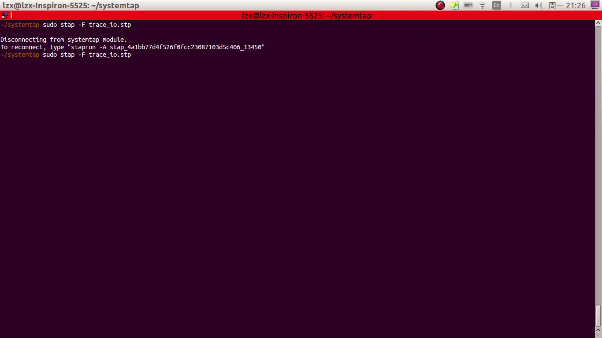

# 2.3. 运行SystemTap脚本

SystemTap包含了许多用于监控系统活动的命令行工具。`stap`命令从SystemTap脚本中读取探测指令，把它们转化为C代码，构建一个内核模块，并加载到当前的Linux内核中。`staprun`命令会运行SystemTap检测模块，比如SystemTap通过交叉检测创建的内核模块。

运行`stap`和`staprun`需要较高的系统权限。由于不是每个运行SystemTap的用户都可以被授予root权限，对于那些没有权限的用户，你可以把他们的帐号加入到下面的用户组中：

1. **stapdev**
该组内的成员可以使用`stap`运行SystemTap脚本，或`staprun`运行SystemTap检测模块。
运行`stap`命令包括把SystemTap脚本编译成内核模块并加载进内核。这一操作需要较高的系统访问权限。所以`stapdev`用户组下的成员会拥有较高的权限。不幸的是，这也意味着他们可以做到许多只有root用户才能做到的事。所以，你应该只把那些原可以拥有root权限的用户加到这个用户组中。

2. **stapusr**
该组内的成员仅能使用`staprun`命令来运行SystemTap检测模块。另外，他们也只能在`/lib/modules/kernel_version/systemtap/`文件夹下运行模块。注意这个文件夹必须仅由root用户所拥有，而且仅对root用户可写。

`stap`命令从文件或标准输入中读取SystemTap脚本。要想让`stap`从文件中读取SystemTap脚本，需要在命令行中指定文件名：

```
stap file_name
```

要想让`stap`从标准输入中读取SystemTap脚本，需要用`-`换掉文件名。记得把用到的命令行选项挪到`-`之前。举个例子，要让`stap`输出更多的运行信息，输入：

```
echo "probe timer.s(1) {exit()}" | stap -v -
```

下面列出常用的`stap`命令行选项：

**-v**
让SystemTap会话输出更加详细的信息。你可以重复该选项多次来提高执行信息的详尽程度，举个例子：
```
stap -vvv script.stp
```
当你的脚本在运行时发生了错误，可以加下这个选项查看更详细的输出信息。关于SystemTap错误信息的更多内容，请参考第6章，“解读错误信息”

**-o file_name**
将标准输出重定向到`file_name`

**-S size[,count]**
将输出文件的最大大小限制成`size`MB，存储文件的最大数目为`count`。这个命令实现了logrotate的功能，每个输出文件会以序列号作为后缀。（译注：logrotate会把日志切割成xxx.1, xxx.2, xxx.3的形式。每当一个日志文件达到最大大小时，新开一个日志文件。当日志文件数达到最大数目时，旧的日志文件会被删掉。）

**-x process_id**
设置SystemTap处理函数`target()`为指定PID。关于`target()`的更多信息，请参考[SystemTap函数列表](http://linux.die.net/man/5/stapfuncs)。

**-c 'command'**
运行`command`，并在`command`结束时退出。该选项同时会把`target()`设置成`command`运行时的PID

**-e 'code'**
直接执行给定的`code`。（译注：如`stap -v -e 'probe vfs.read {printf("read performed\n"); exit()}'`）

**-F**
进入SystemTap的飞行记录仪模式（flight recorder mode），并在后台运行该脚本。关于的更多信息，请参考下面的“飞行记录仪模式”。

关于`stap`的更多信息，请参考`stap(1)` man page。关于`staprun`和交叉检测的更多信息，请参考第2.2节“为其它计算机生成检测模块”，或`staprun(8)` man page。

## 飞行记录仪模式

SystemTap的飞行记录仪模式允许你长时间运行一个SystemTap脚本，并关注最新的输出。飞行记录仪模式会限制输出的生成量。

飞行记录仪模式还可以分成两种：内存型（in-memory）和文件型（file）。无论是哪一种，SystemTap脚本都是作为后台进程运行。

### 内存型飞行记录仪模式

当飞行记录仪模式（`-F`）没有跟输出文件选项（`-o`）一起使用时，SystemTap会把脚本输出结果存储在内核内存的缓冲区内。一旦SystemTap检测模块被加载并开始探测，检测过程会分离到后台运行。当感兴趣的事件发生后，你可以重新载入检测过程来查看内存缓冲区中最近的输出和之后的输出。

要想在内存型飞行记录仪模式下运行SystemTap，带`-F`选项运行`stap`命令：

```
stap -F iotime.stp
```

一旦脚本启动了，`stap`会输出类似于如下的信息，告诉你怎么重新连接运行的脚本：

```
Disconnecting from systemtap module.
To reconnect, type "staprun -A stap_5dd0073edcb1f13f7565d8c343063e68_19556"
```

当感兴趣的事件发生后，运行对应的命令来连接当前运行的脚本，输出内存缓冲区中的最近的数据，并获取之后的输出：

```
staprun -A stap_5dd0073edcb1f13f7565d8c343063e68_19556
```

默认情况下，缓冲区大小为1MB.你可以使用`-s`来调整这个值（单位是MB，会向2的幂取整）。举个例子，`-s2`将指定缓冲区大小为2MB.



### 文件型飞行记录仪模式

在飞行记录仪模式下，你也可以把输出存储在文件中。你可以通过`-o`选项指定文件名，还可以通过`-S`选项来控制输出文件的大小和数目。

下面的命令会以文件型飞行记录仪模式启动SystemTap，输出到`/tmp/iotime.log.[0-9]+`，每个文件不超过1MB，保留最新的两个文件：

```
stap -F -o /tmp/pfaults.log -S 1,2  pfaults.stp
```

这个命令会把PID输出到标准输出。稍候片刻，给这个进程发个`SIGTERM`终止它的运行：

```
kill -s SIGTERM 7590
```

在这个例子里，仅仅有最新的两个文件被保留下来：其余的旧文件都被SystemTap移除了。使用`ls -sh /tmp/pfaults.log.*`验证下：

```
1020K /tmp/pfaults.log.5    44K /tmp/pfaults.log.6
```

要想查看最新数据，读取序号最大的输出文件，在这里指的是`/tmp/pfaults.log.6`。
