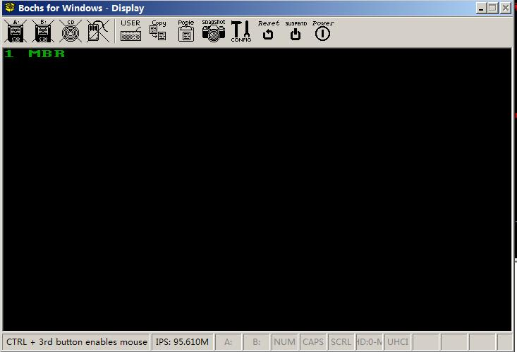

bochs是研究内核经常使用的软件，相当于是一个虚拟机。赵炯维护的网站oldlinux可以下载到：http://oldlinux.org/Linux.old/bochs/Bochs/

最高版本是2.6.1

如果想从零开始创建一个内核，初始步骤如下：

1. 安装bochs

2. 创建一个所需的硬盘。

```
.\bximage.exe  -hd -mode="flat" -size=20 -q ermao.img
```
最后的ermao.img就是启动所需的硬盘。后面写MBR的时候还会用到
创建成功后会显示“The following line should appear in your bochsrc:
  ata0-master: type=disk, path="ermao.img", mode=flat, cylinders=40, heads=16, spt=63”
  注意把“ata0-master: type=disk, path="ermao.img", mode=flat, cylinders=40, heads=16, spt=63”这一串复制下来，写到配置文件中
3. 编写bochs配置文件
```
megs:32
romimage:file=$BXSHARE/BIOS-bochs-latest
vgaromimage:file=$BXSHARE/VGABIOS-lgpl-latest
vga:extension=vbe
floppya:1_44=bootimage-0.11-20040305,status=inserted
floppyb:1_44=rootimage-0.11-20040305,status=inserted
boot:disk
log:bochsout.txt
mouse:enabled=0
keyboard_mapping:enabled=1,map=$BXSHARE/keymaps/x11-pc-us.map
#ips:15000000
ata0:enabled=1,ioaddr1=0x1f0,ioaddr2=0x3f0,irq=14
ata0-master: type=disk, path="ermao.img", mode=flat, cylinders=40, heads=16, spt=63
#vga_update_interval:150000
#i440fxsupport:enabled=1
#gdbstub:enabled=1,port=1234,text_base=0,data_base=0,bss_base=0
```
保存为bochs_fd.bxrc。这个文件就是告诉bochs你的虚拟机是什么样子的。
4. 安装nasm
    下载地址：https://www.nasm.us/pub/nasm/releasebuilds/2.11.02/win32/

5. 编写启动的汇编文件
```
SECTION MBR vstart=0x7c00
    mov ax ,cs
    mov ds,ax
    mov es,ax
    mov ss,ax
    mov fs,ax
    mov sp,0x7c00

    INT 0x10

    mov ax,0x600
    mov bx,0x700
    mov cx,0
    mov dx,0x184f
    int 0x10
    mov ah,3
    mov bh,0

    int 0x10

    mov ax,message
    mov bp,ax

    mov cx,20
    mov ax,0x1301

    mov bx,0x2

    int 0x10

    jmp $

    message db "1 MBR"
    times 510-($-$$) db 0
    db 0x55 ,0xaa
    
```
mov cx,20表示要写的字符串长度，message这一行就是要写的内容

6. 用nasm编译该文件
```
nasm.exe -o MBR.bin d:/bochs/MBR.S
```
7. 下载安装windows下的dd并将编译好的文件写入到ermao.img中，或者使用rawrite2，效果也一样
下载地址：http://www.chrysocome.net/downloads/

```
./ddrelease64.exe  if="C:\Program Files (x86)\nasm\MBR.bin" of="C:\Program Files (x86)\Bochs-2.6.1\ermao.img" bs=512 count=1 conv=notruc
```

8. 启动bochs
```
.\bochs.exe  -f D:\bochs\os\bochs_fd.bxrc
```
可以看到启动界面

