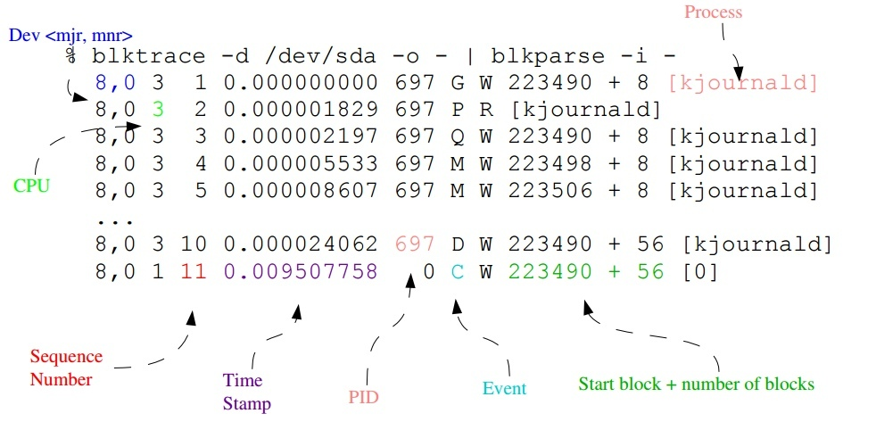
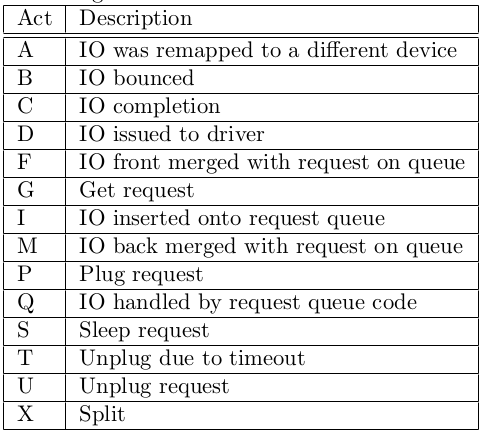

在Linux系统上，如果I/O发生性能问题，有没有办法进一步定位故障位置呢？iostat等最常用的工具肯定是指望不上的，【[容易被误读的iostat](http://linuxperf.com/?p=156)】一文中解释过await表示单个I/O所需的平均时间，但它同时包含了I/O Scheduler所消耗的时间和硬件所消耗的时间，所以不能作为硬件性能的指标，至于iostat的==svctm更是一个废弃的==指标，手册上已经明确说明了的。blktrace在这种场合就能派上用场，因为它能记录I/O所经历的各个步骤，从中可以分析是IO Scheduler慢还是硬件响应慢。

##### blktrace的原理

一个I/O请求进入block layer之后，可能会经历下面的过程：

- Remap: 可能被DM(Device Mapper)或MD(Multiple Device, Software RAID) remap到其它设备
- Split: 可能会因为I/O请求与扇区边界未对齐、或者size太大而被分拆(split)成多个物理I/O
- Merge: 可能会因为与其它I/O请求的物理位置相邻而合并(merge)成一个I/O
- 被IO Scheduler依照调度策略发送给driver
- 被driver提交给硬件，经过HBA、电缆（光纤、网线等）、交换机（SAN或网络）、最后到达存储设备，设备完成IO请求之后再把结果发回。

blktrace能记录I/O所经历的各个步骤，来看一下它记录的数据，包含9个字段，下图标示了其中8个字段的含义，大致的意思是“哪个进程在访问哪个硬盘的哪个扇区，进行什么操作，进行到哪个步骤，时间戳是多少”：

[](http://linuxperf.com/wp-content/uploads/2016/11/blktrace-event-output.jpeg)

第7个字段在上图中没有标出来，它表示操作类型，具体含义是：”R” for Read, “W” for Write, “D” for block, “B” for Barrier operation。

第6个字段是Event，代表了一个I/O请求所经历的各个阶段，具体含义在blkparse的手册页中有解释，其中最重要的几个阶段如下：

Q – 即将生成IO请求
|
G – IO请求生成
|
I – IO请求进入IO Scheduler队列
|
D – IO请求进入driver
|
C – IO请求执行完毕

根据以上步骤对应的时间戳就可以计算出I/O请求在每个阶段所消耗的时间：

Q2G – 生成IO请求所消耗的时间，包括remap和split的时间；
G2I – IO请求进入IO Scheduler所消耗的时间，包括merge的时间；
I2D – IO请求在IO Scheduler中等待的时间；
D2C – IO请求在driver和硬件上所消耗的时间；
Q2C – 整个IO请求所消耗的时间(Q2I + I2D + D2C = Q2C)，相当于iostat的await。

如果I/O性能慢的话，以上指标有助于进一步定位缓慢发生的地方：
==D2C可以作为硬件性能==的指标；
==I2D可以作为IO Scheduler性能==的指标。

附上event速查表：

##### blktrace的用法

使用blktrace需要挂载debugfs：
$ mount -t debugfs debugfs /sys/kernel/debug

利用blktrace查看实时数据的方法，比如要看的硬盘是sdb：
$ blktrace -d /dev/sdb -o – | blkparse -i –
需要停止的时候，按Ctrl-C。

以上命令也可以用下面的脚本代替：
$ btrace /dev/sdb

利用blktrace把数据记录在文件里，以供事后分析：
$ blktrace -d /dev/sdb
缺省的输出文件名是 sdb.blktrace.<cpu>，每个CPU对应一个文件。
你也可以用-o参数指定自己的输出文件名。

利用blkparse命令分析blktrace记录的数据：
```
$ blktrace -d /dev/sdb
$ blkparse -i sdb
  # 第一个IO开始：
  8,16   1        1     0.000000000 18166  Q   R 0 + 1 [dd]
  8,16   1        0     0.000009827     0  m   N cfq18166S  /user.slice alloced
  8,16   1        2     0.000010451 18166  G   R 0 + 1 [dd]
  8,16   1        3     0.000011056 18166  P   N [dd]
  8,16   1        4     0.000012255 18166  I   R 0 + 1 [dd]
  8,16   1        0     0.000013477     0  m   N cfq18166S  /user.slice insert_request
  8,16   1        0     0.000014526     0  m   N cfq18166S  /user.slice add_to_rr
  8,16   1        5     0.000016643 18166  U   N [dd] 1
  8,16   1        0     0.000017522     0  m   N cfq workload slice:300
  8,16   1        0     0.000018880     0  m   N cfq18166S  /user.slice set_active wl_class:0 wl_type:2
  8,16   1        0     0.000020594     0  m   N cfq18166S  /user.slice fifo=          (null)
  8,16   1        0     0.000021462     0  m   N cfq18166S  /user.slice dispatch_insert
  8,16   1        0     0.000022898     0  m   N cfq18166S  /user.slice dispatched a request
  8,16   1        0     0.000023786     0  m   N cfq18166S  /user.slice activate rq, drv=1
  8,16   1        6     0.000023977 18166  D   R 0 + 1 [dd]
  8,16   0        1     0.014270153     0  C   R 0 + 1 [0]
  # 第一个IO结束。
  8,16   0        0     0.014278115     0  m   N cfq18166S  /user.slice complete rqnoidle 0
  8,16   0        0     0.014280044     0  m   N cfq18166S  /user.slice set_slice=100
  8,16   0        0     0.014282217     0  m   N cfq18166S  /user.slice arm_idle: 8 group_idle: 0
  8,16   0        0     0.014282728     0  m   N cfq schedule dispatch
  # 第二个IO开始：
  8,16   1        7     0.014298247 18166  Q   R 1 + 1 [dd]
  8,16   1        8     0.014300522 18166  G   R 1 + 1 [dd]
  8,16   1        9     0.014300984 18166  P   N [dd]
  8,16   1       10     0.014301996 18166  I   R 1 + 1 [dd]
  8,16   1        0     0.014303864     0  m   N cfq18166S  /user.slice insert_request
  8,16   1       11     0.014304981 18166  U   N [dd] 1
  8,16   1        0     0.014306368     0  m   N cfq18166S  /user.slice dispatch_insert
  8,16   1        0     0.014307793     0  m   N cfq18166S  /user.slice dispatched a request
  8,16   1        0     0.014308763     0  m   N cfq18166S  /user.slice activate rq, drv=1
  8,16   1       12     0.014308962 18166  D   R 1 + 1 [dd]
  8,16   0        2     0.014518615     0  C   R 1 + 1 [0]
  # 第二个IO结束。
  8,16   0        0     0.014523548     0  m   N cfq18166S  /user.slice complete rqnoidle 0
  8,16   0        0     0.014525334     0  m   N cfq18166S  /user.slice arm_idle: 8 group_idle: 0
  8,16   0        0     0.014525676     0  m   N cfq schedule dispatch
  # 第三个IO开始：
  8,16   1       13     0.014531022 18166  Q   R 2 + 1 [dd]
  ...
```
注：
在以上数据中，有一些记录的event类型是”m”，那是IO Scheduler的调度信息，对研究IO Scheduler问题有意义：

- cfq18166S – cfq是IO Scheduler的名称，18166是进程号，”S”表示Sync(同步IO)，如果异步IO则用“A”表示(Async)；
- 它们的第三列sequence number都是0；
- 它们表示IO Scheduler内部的关键函数，上例中是cfq，代码参见block/cfq-iosched.c，以下是各关键字所对应的内部函数：
  alloced <<< cfq_find_alloc_queue()
  insert_request <<< cfq_insert_request()
  add_to_rr <<< cfq_add_cfqq_rr()
  cfq workload slice:300 <<< choose_wl_class_and_type()
  set_active wl_class:0 wl_type:2 <<< __cfq_set_active_queue()
  fifo= (null) <<< cfq_check_fifo()
  dispatch_insert <<< cfq_dispatch_insert()
  dispatched a request <<< cfq_dispatch_requests()
  activate rq, drv=1 <<< cfq_activate_request()
  complete rqnoidle 0 <<< cfq_completed_request()
  set_slice=100 <<< cfq_set_prio_slice()
  arm_idle: 8 group_idle: 0 <<< cfq_arm_slice_timer()
  cfq schedule dispatch <<< cfq_schedule_dispatch()

##### 利用btt分析blktrace数据

blkparse只是将blktrace数据转成可以人工阅读的格式，由于数据量通常很大，人工分析并不轻松。btt是对blktrace数据进行自动分析的工具。

btt不能分析实时数据，只能对blktrace保存的数据文件进行分析。使用方法：
把原本按CPU分别保存的文件合并成一个，合并后的文件名为sdb.blktrace.bin：
$ blkparse -i sdb -d sdb.blktrace.bin
执行btt对sdb.blktrace.bin进行分析：
$ btt -i sdb.blktrace.bin

下面是一个btt实例：
```
...
            ALL           MIN           AVG           MAX           N
--------------- ------------- ------------- ------------- -----------
 
Q2Q               0.000138923   0.000154010   0.014298247       94558
Q2G               0.000001154   0.000001661   0.000017313       94559
G2I               0.000000883   0.000001197   0.000012011       94559
I2D               0.000004722   0.000005761   0.000027286       94559
D2C               0.000118840   0.000129201   0.014246176       94558
Q2C               0.000125953   0.000137820   0.014270153       94558
 
==================== Device Overhead ====================
 
       DEV |       Q2G       G2I       Q2M       I2D       D2C
---------- | --------- --------- --------- --------- ---------
 (  8, 16) |   1.2050%   0.8688%   0.0000%   4.1801%  93.7461%
---------- | --------- --------- --------- --------- ---------
   Overall |   1.2050%   0.8688%   0.0000%   4.1801%  93.7461%
...
```

我们看到93.7461%的时间消耗在D2C，也就是硬件层，这是正常的，我们说过D2C是衡量硬件性能的指标，这里单个IO平均0.129201毫秒，已经是相当快了，单个IO最慢14.246176 毫秒，不算坏。Q2G和G2I都很小，完全正常。I2D稍微有点大，应该是cfq scheduler的调度策略造成的，你可以试试其它scheduler，比如deadline，比较两者的差异，然后选择最适合你应用特点的那个。

##### 利用blktrace数据自制分析工具

blktrace在block layer采集了每一个I/O的数据，可以用于完成一些非常深入的分析任务，以下是一个利用它分析应用系统的I/O模式的例子：

主要利用了Event “Q”和”C”，分别表示IO开始和IO完成，两者之间的耗时就相当于iostat看到的await，但blktrace可以精确到单个IO

```
#!/bin/bash
 
if [ $# -ne 1 ]; then
        echo "Usage: $0 <block_device_name>"
        exit
fi
if [ ! -b $1 ]; then
        echo "could not find block device $1"
        exit
fi
 
duration=10
echo "running blktrace for $duration seconds to collect data..."
timeout $duration blktrace -d $1 >/dev/null 2>&1
 
DEVNAME=`basename $1`
 
echo "parsing blktrace data..."
blkparse -i $DEVNAME |sort -g -k8 -k10 -k4 |awk '
BEGIN   {
        total_read=0;
        total_write=0;
        maxwait_read=0;
        maxwait_write=0;
}
{
        if ($6=="Q") {
                queue_ts=$4;
                block=$8;
                nblock=$10;
                rw=$7;
        };
        if ($6=="C" && $8==block && $10==nblock && $7==rw) {
                await=$4-queue_ts;
                if (rw=="R") {
                        if (await>maxwait_read) maxwait_read=await;
                        total_read++;
                        read_count_block[nblock]++;
                        if (await>0.001) read_count1++;
                        if (await>0.01) read_count10++;
                        if (await>0.02) read_count20++;
                        if (await>0.03) read_count30++;
                }
                if (rw=="W") {
                        if (await>maxwait_write) maxwait_write=await;
                        total_write++;
                        write_count_block[nblock]++;
                        if (await>0.001) write_count1++;
                        if (await>0.01) write_count10++;
                        if (await>0.02) write_count20++;
                        if (await>0.03) write_count30++;
                }
        }
} END   {
        printf("========\nsummary:\n========\n");
        printf("total number of reads: %d\n", total_read);
        printf("total number of writes: %d\n", total_write);
        printf("slowest read : %.6f second\n", maxwait_read);
        printf("slowest write: %.6f second\n", maxwait_write);
        printf("reads\n> 1ms: %d\n>10ms: %d\n>20ms: %d\n>30ms: %d\n", read_count1, read_count10, read_count20, read_count30);
        printf("writes\n> 1ms: %d\n>10ms: %d\n>20ms: %d\n>30ms: %d\n", write_count1, write_count10, write_count20, write_count30);
        printf("\nblock size:%16s\n","Read Count");
        for (i in read_count_block)
                printf("%10d:%16d\n", i, read_count_block[i]);
        printf("\nblock size:%16s\n","Write Count");
        for (i in write_count_block)
                printf("%10d:%16d\n", i, write_count_block[i]);
}'
```
输出
```
========
summary:
========
total number of reads: 1081513
total number of writes: 0
slowest read : 0.032560 second
slowest write: 0.000000 second
reads
> 1ms: 18253
>10ms: 17058
>20ms: 17045
>30ms: 780
writes
> 1ms: 0
>10ms: 0
>20ms: 0
>30ms: 0
 
block size:      Read Count
       256:           93756
       248:            1538
        64:           98084
        56:            7475
         8:          101218
        48:           15889
       240:            1637
       232:            1651
       224:            1942
        40:           21693
       216:            1811
        32:          197893
       208:            1907
        24:           37787
       128:           97382
        16:          399850
```