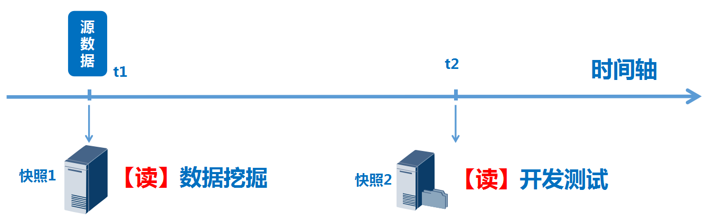

# 前言

存储网络行业协会SNIA（StorageNetworking Industry Association）快照的定义：关于指定数据集合的一个完全可用拷贝，该拷贝包括相应数据在某个时间点（拷贝开始的时间点）的映像。快照可以是其所表示的数据的一个副本，也可以是数据的一个复制品。

**需要注意的是：快照是完全可用的拷贝，但==不是一份完整的拷贝==，至于为什么，后面会详细讲。**

# 存储快照的使用场景

**场景一：**

存储快照，是一种数据保护措施，可以对源数据进行一定程度的保护，通俗地讲，可以理解为----后悔药。

如上图，假设在t0时刻，有一份完整的源数据，我们在t1时刻，针对这份源数据创建一份快照。

t2时刻，若因为各种原因（误操作、系统错误等）导致源数据损毁，那么，我们可以通过回滚（rollback）快照，将源数据恢复至快照创建时的状态（即t1时刻），这样，可以尽量降低数据损失（损失的数据，是t1到t2之间产生的数据）。

这种功能，常用于银行、公安户籍、科研单位等。操作系统、软件升级或机房设备更替，一般会选择在夜间或其他无生产业务时，进行高危操作，操作前会对数据进行快照，若操作失败，则将快照进行rollback，将源数据恢复至操作前的状态。

**场景2：**

前言中说过，快照是一份完全可用的副本，那么，它完全可以被上层业务当做源数据。

如上图，针对源数据，创建快照后，将快照卷映射给其他上层业务，可以用于数据挖掘和开发测试等工作，针对快照的读操作不影响源卷的数据。

这种功能，常用于直播（视频&图片）鉴黄、科研数据模拟开发测试等，比如，视频直播平台需要将某一段时间的视频提供给执法机构进行筛查分析，那么可以通过对特定时间点保存的数据创建快照，将快照映射给执法机构的业务主机去进行挖掘分析。

# 存储快照的实现原理

目前，快照的实现方式均由各个厂商自行决定，但主要技术分为2类，一种是写时拷贝COW（Copy On Write），另一种，是写重定向ROW（Redirect On Write）。

### ==写时拷贝COW==

COW(Copy-On-Write)，写时拷贝，也称为写前拷贝。

创建快照以后，如果源卷的数据发生了变化，那么快照系统会首先将原始数据拷贝到快照卷上对应的数据块中，然后再对源卷进行改写。

**写操作：**

如上图简要示例，**快照创建以后**，若上层业务对源卷写数据X，X在缓存中排队，快照系统将X即将写入的位置（逻辑地址）上的数据Y，拷贝到快照卷中对应的位置（逻辑地址）上，同时，生成一张映射表，表中一列记录源卷上数据变化的逻辑地址，另一列记录快照卷上数据变化的逻辑地址。我们可以看到，上层业务每下发一个数据块，存储上，发生了两次写操作：一次是源卷将数据写入快照卷（即图中Y），一次是上层业务将数据写入源卷（即图中X）。

 **读操作：**

如上图，快照卷若映射给上层业务进行数据分析等用途时，**针对快照**进行读操作时，首先由快照系统判断，上层业务需要读取的数据是否在快照卷中，若在，直接从快照卷读取，若不在，则查询映射表，去对应源卷的逻辑地中读取（这个查表并去源卷读的操作，也叫**读重定向**）。这一点，恰好就解释了为什么快照是一份完全可用的副本，它没有对源卷进行100%的拷贝，但对上层业务来说，却可以将快照看做是和源卷“一模一样”的副本。

**针对源卷**进行读操作时，与快照卷没有数据交互。

我们可以看到，快照对源卷的数据具有很好的保护措施，快照可以单独作为一份可以读取的副本，但并没有像简单的镜像那样，一开始就占用了和源卷一样的空间，而是根据创建快照后上层业务产生的数据，来实时占用必需的存储空间。

**快照回滚（rollback）：**

如上图，回滚操作的前提条件是，锁定源卷（暂停对待回滚的逻辑地址上的IO操作），然后通过查映射表，将快照卷上的对应数据回拷到源卷中。

**快照删除：**

采用COW技术的快照，其源卷即保存着完整的实时数据，因此，删除快照时，直接销毁了快照卷和映射表，与源卷不存在数据交互。

### ==写时重定向ROW==

ROW(Redirect-on-write )，也称为写时重定向。

创建快照以后，快照系统把对数据卷的写请求重定向给了快照预留的存储空间，直接将新的数据写入快照卷。上层业务读源卷时，创建快照前的数据从源卷读，创建快照后产生的数据，从快照卷读。

**写操作：**

如上图简要示例，**快照创建以后**，若上层业务对源卷写数据X，X在缓存中排队，快照系统判断X即将写入源卷的逻辑地址，然后将数据X写入快照卷中预留的对应逻辑地址中，同时，将源卷和快照卷的逻辑地址写入映射表，即写重定向。我们可以看到，上层针对源卷写入一个数据块X，存储上只发生一次写操作，只是写之前进行了重定向。

**读操作：**

若**快照创建以后**，上层业务**对源卷进行读**，则有两种情况：1）若读取的数据，在创建快照前产生，数据是保存在源卷上的，那么，上层就从源卷进行读取；2）若需要读取的数据是创建快照以后才产生的，那么上层就查询映射表，从快照卷进行读取（即读重定向）。

若**快照创建以后**，上层业务**对快照卷进行读**，同样也有两种情况：1）若读取的数据，在创建快照前产生，数据是保存在源卷上的，那么上层就查询映射表，从源卷进行读取；2）若需要读取的数据是创建快照以后才产生的，那么上层就直接从快照卷进行读取。

我们可以看到，ROW快照也是根据创建快照后上层业务产生的数据，来实时占用必需的存储空间。

**快照回滚（rollback）：**

采用ROW技术的快照，其源卷始终保存着快照创建前的完整数据，快照创建后，上层业务产生的数据都写入了快照中，因此，快照的回滚只是取消了对源卷的读重定向操作。通俗地说，就是源卷上没有进行任何数据操作，上层业务对源卷的读，仅限于读源卷（即不会去读取快照卷的数据）。

**快照删除：**

采用ROW技术的快照，其源卷始终保存着快照创建前的完整数据，快照创建后，上层业务产生的数据都写入了快照中。因此，若要删除快照，必然要先将快照卷中的数据，回拷到源卷中，拷贝完成才能删除，如上图。此时我们可以设想，如果，针对一份源数据，在18:00创建了快照，上层业务持续产生大量新的数据，19:00又创建了快照，20:00又创建了快照……那么，在有多份快照的情况下，如果需要删除快照，就会出现，多个快照向源卷回拷数据的情况，可能导致回拷量非常大，耗时很长。

### 两种技术对比

如上表，COW的写时拷贝，导致每次写入都有拷贝操作，大量写入时，源卷的写性能会有所下降，而读源卷是不会受到任何影响的，删除快照时，只是解除了快照和源卷的关系，同时删除了快照卷的数据而已。ROW在每次写入仅做了重定向操作，这个操作耗时是几乎可以忽略不计的，源卷的写性能几乎不会受到影响，但读源卷时，则需要判断数据是创建快照前还是创建快照后，导致大量读时，性能受到一定影响，比较致命的是，若源卷有多个快照，在删除快照时，所有快照的数据均需要回拷到源卷才可以保证源卷数据的完整性。

## 拆分镜像

拆分镜像快照技术在快照时间点到来之前，首先要为源数据卷创建并维护一个完整的物理镜像卷，类似于RAID1：同一个数据的两个副本分别保存在由源数据卷和镜像卷组成的镜像对。

# 结语

上面简单地介绍了存储快照的实现原理，实际上，快照特性应用广泛，其应用对象是很多的：

目前，主流厂商在自研产品上，对上面的ROW和COW技术都有小范围的改动，也有一些新兴的快照技术已经诞生，但这个行业里，==没有最好的快照技术==。技术为业务服务，只有针对业务类型做好本地化适配，才能达到最佳效用。

来自：https://www.cnblogs.com/qcloud1001/p/9322321.html

《存储技术原理分析：基于Linux_2.6内核源代码》