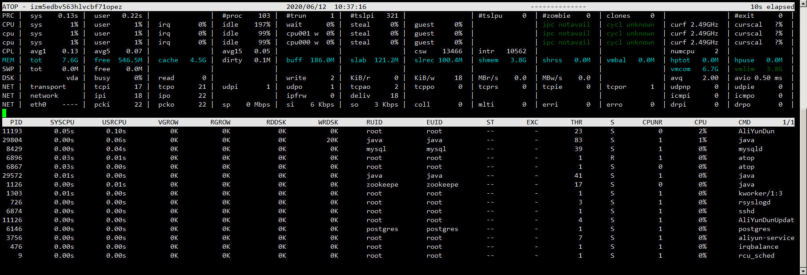

atop是一个功能非常强大的linux服务器监控工具，它的数据采集主要包括：CPU、内存、磁盘、网络、进程等，并且内容非常的详细，特别是当那一部分存在压力它会以特殊的颜色进行展示，如果颜色是红色那么说明已经非常严重了

### 参数解释

**atop:**改行列出了服务器的host、当前时间、信息收集的频率

**PRC:**该列展示整个系统的性能状况；

1. sys:过去10s所有的进程在内核态运行的时间总和
2. usr:过去10s所有的进程在用户态的运行时间总和
3. \#proc:进程总数
4. \#trun:过去10s转换的进程数
5. \#zombie：过去10s僵死进程的数量
6. \#exit：在10s采样周期期间退出的进程数量

**CPU:** cpu列展示了服务器的CPU整体的一个状态信息，包括内核和用户所占的比例、处理中断所占的比例、CPU的处于空闲下比例（这里是100%*cpu核心数，CPU有时候也会因为由于磁盘性能问题出现等待的空闲）

1. sys:cpu在处理进程时处于内核态的时间所占的比例
2. usr:cpu在处理进程时处于用户态的时间所占的比例
3. irq:cpu在处理进程的中断请求所占的实际比例
4. idle:cpu处于空闲状态下的时间比例（除了本身空闲，还有比如等待磁盘io的情况下也会处于空闲状态）

**cpu**:每个核心的状态信息，和总的CPU信息一样，每列加起来的总和就是总的CPU的状态信息。

**CPL:**cpl也反应了服务器整体的性能，展示信息包括进程等待队列数，分别从过去1分钟、5分钟、15分钟的采样信息。

1. avg1:过去1分钟进程等待队列数
2. avg5:过去5分钟进程等待队列数
3. avg15:过去15分钟进程等待队列数
4. csw(context swapping)：上下文交换次数
5. intr(interrupt):中断发生的次数
6. numcpu:cpu的核心数

**mem:该列主要展示内存的使用信息。**

1. tot：物理内存总量
2. free：空闲内存的大小（不能单单从这个字段就判断内存不足，还需要参考free -m中的-/+ buffers/cache:free因为这块的内容随时就可以拿过来使用，还可以从是否有使用Swap来判断是否内存不足）
3. cache：用于页缓存的内存大小
4. dirty：内存中的脏页大小
5. buff：用于文件缓存的内存大小
6. slab：系统内核占用的内存大小

**SWP：交换空间使用情况**

1. tot:交换空间总量
2. free:交换空间剩余空间总量

**PAG列**：虚拟内存分页情况

1. swin:换入内存页数
2. swout：换出内存页数

**LVM/DSK:**每个分区信息以一列来进行展示

1. busy：磁盘忙时所占比例
2. read、KiB/r 、MBr/s：每秒读的请求数和请求的kb、mb数
3. write、KiB/w 、MBr/w：每秒写的请求数和请求的kb、mb数
4. avq:磁盘平均队列长度（根据实际的监控该列好像是磁盘平均请求数avgrq）
5. avio:磁盘的平均io时间

 

**NET**:展示了传输层（TCP/UDP）、网络层（ip）、网络接口的网络传输信息。

**transport：**传输层（TCP/UDP）的数据输入输出的展示，例如在服务器的内部进程之间的数据传输就是在传输层展示，以为还不需要往下通过网络进行传输。

**network：**网络层（ip）的数据输入输出的展示；

**eth0：**默认的网络接口的数据输入输出的展示，也就是通过etho的ip的数据传输的展示，

1. sp:网卡的带宽（1000M）
2. pcki：传入的数据包的大小
3. pcko：传出的数据包的大小
4. si:每秒传入的数据大小
5. so：每秒传出的数据大小
6. coll（collisions）：每秒的冲突数
7. mlti（MULTICAST）：每秒的多路广播的数量
8. erri/erro:每秒输入输出的错误数
9. drpi/drpo:每秒的输入输出的丢包数

**lo:**通过127.0.0.1网络接口的数据传输的数据展示，参数和上面的eth0是一样的

**进程列**

进程列展示了每个进程在过去10S内的数据

**m模式：内存状态模式**

SYSCPU:过去10s内进程处于内核模式占用的CPU时间

USRCPU:过去10S进程处于用户模式占用的CPU时间

VSIZE:过去10S进程占用的虚拟空间大小

RSIZE:过去10S进程占用的内存空间大小

PSIZE:过去10S进程占用的页大小

VGROW：过去10S进程增长的虚拟空间大小

RGROW：过去10S进程增长的内存大小

SWAPSZ:过去10S进程使用交换空间的大小。

MEM:过去10S进程占用内存百分比

**d模式：磁盘状态模式**

RDDSK:过去10S进程读磁盘的数据量

WRDSK:过去10S进程写磁盘的数据量

DSK:过去10S进程所占磁盘的百分比

CMD:进程名 

**p模式：**进程状态模式，同一个名称的进程显示一列，根据进程名进行分组显示

NPROCS:相同名称的进程数量

其它的参数上面已经有列出

**v模式：线程状态模式**

**u模式：用户模式**

根据用户进行分组显示

**g模式：标准模式**

s:进程当前的状态，包括：s(sleeping),R(runing)等