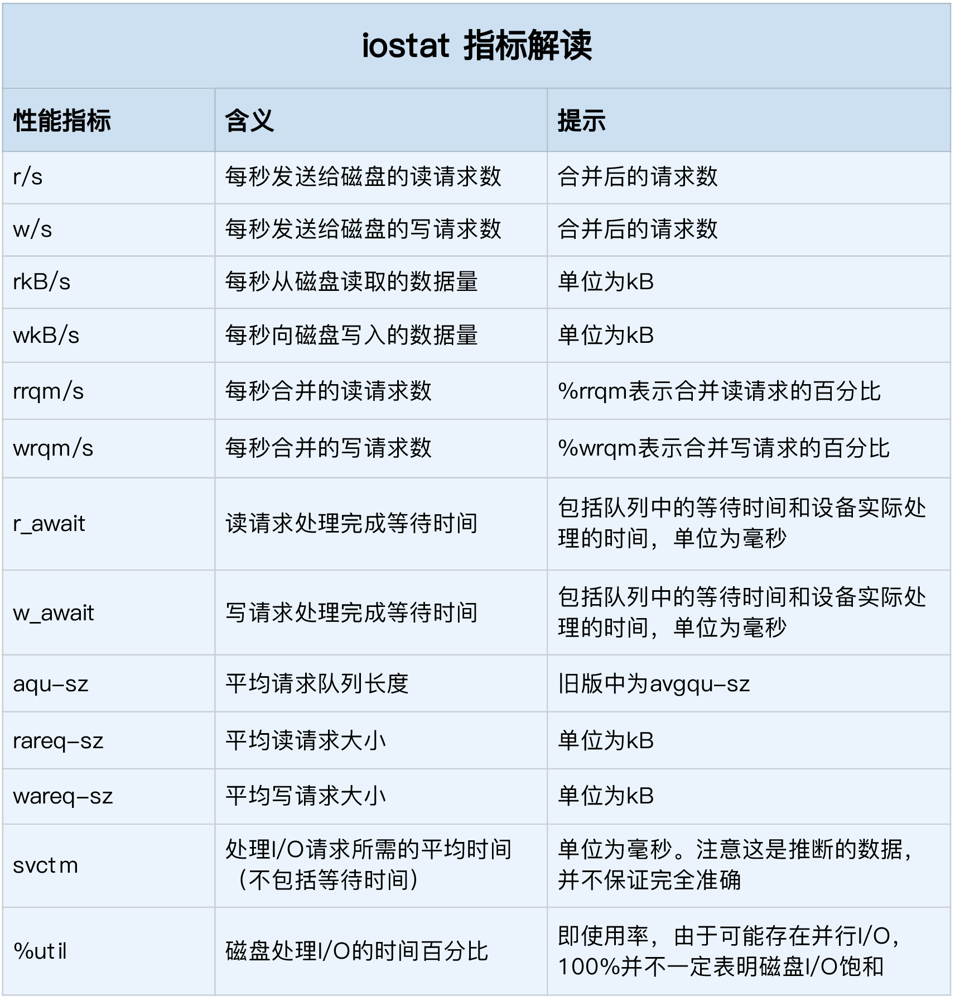

- 磁盘为系统提供了最基本的持久化存储。
- 文件系统则在磁盘的基础上，提供了一个用来管理文件的树状结构。

## 索引节点和目录项
- linux中，一切皆文件：普通文件和目录，块设备、套接字、管道等
- 为方便管理，linux为每个文件分配两个数据结构，索引节点（index node）和目录项（directory entry）
1. 索引节点，简称inode，用来记录文件元数据（inode编号、文件大小、访问权限、修改日期、数据位置）。索引节点同样占用磁盘空间
2. 目录项，简称dentry，记录文件名字、索引节点指针以及其他目录项的关联观念西。多个关联的目录项，构成文件系统目录结构。目录项由内核维护的内存数据结构，也通常叫目录项缓存
- 索引节点和目录项纪录了文件的元数据以及文件间的目录关系
- 文件系统把连续的扇区组成逻辑块，每次都以逻辑块为最小单元管理数据，常见逻辑块大小4KB（连续的8个扇区）

- 注意点
1. 目录项本身是内存缓存，而索引节点是存储在磁盘中的数据，文件内容会缓存到cache中，索引节点也会缓存到cache中加速访问
2. 磁盘在执行文件系统格式化时，会分成三个区域：超级块（存储整个文件系统的状态）、索引节点区（存储索引节点）、数据块区（存储文件数据）
## 虚拟文件系统
- 目录项、索引节点、逻辑块、超级块，构成linux文件系统的四大基本要素。
- 为了支持不同的文件系统，linux在用户进程和文件系统之间引入抽象层虚拟文件系统VFS（virtual file system）
- VFS定义了一组所有文件系统都支持的数据结构和标准接口。

- 文件系统分三类
1. 第一类基于磁盘的文件系统，常见的是ext4、xfs等
2. 第二类是基于内存的文件系统（虚拟文件系统），会占内存但无需磁盘空间，如/proc和/sys
3. 第三类是网络文件系统，NFS、SMB、iSCSI
- 文件系统需要挂载到VFS目录树中的某个子目录（挂载点），才能访问其中的文件
#### 文件系统IO
VFS提供了一组标准的文件访问接口，比如cat命令（open，read，write）
```
int open(const char *pathname, int flags, mode_t mode); 
ssize_t read(int fd, void *buf, size_t count); 
ssize_t write(int fd, const void *buf, size_t count); 

```
- 文件读写方式各种差异，所以IO多种多样：缓冲与非缓冲IO、直接与非直接IO、阻塞与非阻塞IO、同步与非同步IO等
1. 根据是否利用标准库缓存，可以把文件分为缓冲IO（利用标准库缓存加速文件访问，标准库内部再通过文件系统调度访问文件）和非缓冲IO（直接通过系统调用来访问文件）
2. 是否利用操作系统缓存，分为直接IO（使用O_DIRECT标志）和非直接IO（文件读写时经过系统的页缓存然后再由内核或额外的系统调用真正写盘，默认）。如果不经过文件系统直接写磁盘，就是裸IO
3. 应用是否阻塞自身运行，分为阻塞IO（默认）和非阻塞IO（不阻塞当前线程继续执行任务，随后通过轮训或者事件通知的形式获取调用结果，比如管道或者网络套接字的O_NONBLOCK标志）
4. 根据是否等待响应结果，分为同步IO（比如设置了O_SYNC或者O_DSYNC）和异步IO（O_ASYNC）

#### df查看磁盘容量
```
df -h /dev/sda1 
Filesystem      Size  Used Avail Use% Mounted on 
/dev/sda1        29G  3.1G   26G  11% / 

```

```
# df -ih /dev/vcsa1
Filesystem     Inodes IUsed IFree IUse% Mounted on
devtmpfs         976K   341  975K    1% /dev
```
- 如果空间不足，df却还有余量，可以查看inode是否够用。
- 索引节点（inode个数）在格式化磁盘时已经设定好
- 
#### 缓存
- free 或 vmstat观察页缓存大小
- free 输出cache（页缓存和可回收slab缓存的和），与/proc/meminfo得到相同
```
# cat /proc/meminfo | grep -E "SReclaimable|Cached" 
Cached:          4407708 kB
SwapCached:            0 kB
SReclaimable:     342136 kB

# vmstat
procs -----------memory---------- ---swap-- -----io---- -system-- ------cpu-----
 r  b   swpd   free   buff  cache   si   so    bi    bo   in   cs us sy id wa st
 1  0      0 165032 209660 4771824    0    0     0     3    1    1  0  0 99  0  0
 
 # free
              total        used        free      shared  buff/cache   available
Mem:        8009696     2863056      165156         620     4981484     4818104
Swap:             0           0           0
```
- /proc/meminfo给出了slab整体大小
- /proc/slabinfo给出具体每种slab缓存
- slabtop（按c键根据缓存大小排序，按a根据活跃对象排序）
```
# slabtop 

 Active / Total Objects (% used)    : 947449 / 1019555 (92.9%)
 Active / Total Slabs (% used)      : 41380 / 41380 (100.0%)
 Active / Total Caches (% used)     : 73 / 96 (76.0%)
 Active / Total Size (% used)       : 341579.35K / 350396.71K (97.5%)
 Minimum / Average / Maximum Object : 0.01K / 0.34K / 8.00K

  OBJS ACTIVE  USE OBJ SIZE  SLABS OBJ/SLAB CACHE SIZE NAME                   
196215 196215 100%    1.01K  13081	 15    209296K ext4_inode_cache
 78736  78711  99%    0.57K   5624	 14     44992K radix_tree_node
323115 260156  80%    0.10K   8285	 39     33140K buffer_head
162477 162477 100%    0.19K   7737	 21     30948K dentry
 21456  20158  93%    0.64K   1788	 12     14304K proc_inode_cache
  9776   9214  94%    0.58K    752	 13      6016K inode_cache
 69564  67577  97%    0.04K    682	102	 2728K ext4_extent_status
 53975  51540  95%    0.05K    635	 85	 2540K shared_policy_node
   624    599  95%    3.95K     78	  8	 2496K task_struct
```

## 磁盘IO工作原理
- 常见磁盘分两类：
1. 机械磁盘（硬盘，缩写HDD），机械磁盘由盘片和读写磁头组成，数据存储在盘片的环状磁道中；读写数据前移动磁头定位磁道然后访问。顺序访问快，随机访问慢
2. 固态硬盘（SSD），固态电子元件组成，随机IO也比连续IO慢
- 固态磁盘存在“先擦除再写入”限制；随机读写会导致大量的垃圾回收
- 连续IO可以采取预读方式，减少IO请求次数
- 机械磁盘和固态磁盘有最小的读写单位：机械磁盘最小单位是扇区，一般大小为512字节；固态磁盘最小读写是页，通常4kb，8kb
- 按照接口分类，硬盘为IDE（intergrated drive electronics）、SCSI（small computer system interface）、SAS（serial attached scsi）、SATA（serial ata）、FC（fibre channel）等
- 磁盘接入服务器后，按照不同的使用方式，可以分为不同架构
1. 独立磁盘使用，还可以根据需要划分不同的逻辑分区
2. 多个磁盘组成一个逻辑磁盘构成冗余阵列（raid），有多个级别RAID0、RAID1、RAID5、RAID10等
3. 磁盘组合成一个网络存储集群，使用NFS、SMB、iSCSI等网络存储协议暴露给服务器
- ==磁盘是作为一个块设备管理==，以块为单位读写数据，并且支持随机读写
#### 通用块层
- 处在文件系统和磁盘驱动之间的一个块设备抽象层，主要有俩功能
1. 第一个功能与虚拟文件系统功能类似，向上为文件系统和应用程序，提供访问块设备的标准接口，向下把各种异构的磁盘设备抽象为统一的块设备，并提供统一的框架管理设备的驱动程序
2. 通用块层还会给文件系统和应用程序发来的IO请求排队，并通过重新排序请求合并的方式提高磁盘读写效率。即IO调度
3. linux支持4种IO调度算法，分别是NONE，NOOP，CFQ，Deadline
- 磁盘IO调度算法
1. NONE，确切不能算IO算法，因为完全不适用IO调度器，对文件系统和应用程序IO并不做处理，常用在虚拟机中，完全由物理机负责
2. NOOP，最简单的IO调度算法，先入先出，简单做一些基本的请求合并，常用于SSD磁盘
3. CFQ，完全公平调度，默认的IO调度。维护了一个IO调度队列，按照时间片均匀分布每个进程的IO请求。还支持IO优先级调度，适用于运行大量进程的系统
4. deadline。分别为读写请求创建了不同的IO队列，可以提高机械磁盘的吞吐量，并确保达到最终期限deadline的请求被优先处理，多用于IO压力重的场景，比如数据库等

## IO栈
linux存储系统的IO栈，由上到下三个层次：文件系统层、通用块层、设备层

1. 文件系统层，包括虚拟文件系统和其他文件系统的具体实现，它为上层的应用程序提供标准的文件访问接口，对下的通用块层来存储和管理磁盘数据
2. 通用块层，包括块设备IO队列和IO调度器
3. 设备层，包括存储设备和响应的驱动程序，负责最终物理设备的IO操作
- ==存储系统的IO，通常是整个系统最慢的一环==，所以linux通过多种缓存机制来优化IO效率

## swap原理
- 前面提到，Swap说白了就是把一块磁盘空间或者一个本地文件，当成内存来使用。它包括换出和换入两个过程。
1. 所谓换出，就是把进程暂时不用的内存数据存储到磁盘中，并释放这些数据占用的内存。
2. 换入，则是在进程再次访问这些内存的时候，把它们从磁盘读到内存中来。
## 磁盘性能指标
磁盘性能有5个指标，就是我们经常用到的：使用率、饱和度、IOPS、吞吐量及响应时间等
- 使用率，是指磁盘处理IO的时间百分比。过高的使用率（超80%），通常意味着磁盘IO存在性能瓶颈
- 饱和度，是指磁盘处理IO的繁忙程度。过高的饱和度，意味着严重的性能瓶颈，当饱和度为100%时，无法接受新的IO请求
- IOPS，每秒IO数
- 吞吐量，是指每秒IO请求的大小
- 响应时间，是指IO请求发出到响应的时间

## io观察

```
# iostat -d -x 1
Linux 3.10.0-862.11.6.el7.x86_64 (izm5edbv563hlvcbf71opjz) 	09/17/2019 	_x86_64_	(2 CPU)

Device:         rrqm/s   wrqm/s     r/s     w/s    rkB/s    wkB/s avgrq-sz avgqu-sz   await r_await w_await  svctm  %util
vda               0.00     0.29    0.01    0.62     0.64     6.74    23.20     0.00    5.81    8.04    5.76   0.46   0.03

Device:         rrqm/s   wrqm/s     r/s     w/s    rkB/s    wkB/s avgrq-sz avgqu-sz   await r_await w_await  svctm  %util
vda               0.00    11.00    0.00    5.00     0.00    64.00    25.60     0.01    1.00    0.00    1.00   0.40   0.20
```


## 进程IO观测
#### pidstat -d
```
# pidstat -d 1
Linux 3.10.0-862.11.6.el7.x86_64 (izm5edbv563hlvcbf71opez) 	09/17/2019 	_x86_64_	(2 CPU)

10:06:10 PM   UID       PID   kB_rd/s   kB_wr/s kB_ccwr/s  Command
10:06:11 PM     0     10551    134.65      3.96      0.00  AliYunDun
10:06:11 PM  1000     29749      0.00     23.76      0.00  java

10:06:11 PM   UID       PID   kB_rd/s   kB_wr/s kB_ccwr/s  Command
10:06:12 PM     0       267      0.00     44.00      0.00  jbd2/vda1-8
```
从 pidstat 的输出你能看到，它可以实时查看每个进程的 I/O 情况，包括下面这些内容。
1. 用户 ID（UID）和进程 ID（PID）  。
2. 每秒读取的数据大小（kB_rd/s） ，单位是 KB。
3. 每秒发出的写请求数据大小（kB_wr/s） ，单位是 KB。
4. 每秒取消的写请求数据大小（kB_ccwr/s） ，单位是 KB。
5. 块 I/O 延迟（iodelay），包括等待同步块 I/O 和换入块 I/O 结束的时间，单位是时钟周期。
#### iotop
```
# iotop
Total DISK READ :       0.00 B/s | Total DISK WRITE :       0.00 B/s
Actual DISK READ:       0.00 B/s | Actual DISK WRITE:       0.00 B/s
  TID  PRIO  USER     DISK READ  DISK WRITE  SWAPIN     IO>    COMMAND                                                                                           
23024 be/4 root        0.00 B/s    0.00 B/s  0.00 %  0.02 % [kworker/1:0]
    1 be/4 root        0.00 B/s    0.00 B/s  0.00 %  0.00 % systemd --system --deserialize 21
    2 be/4 root        0.00 B/s    0.00 B/s  0.00 %  0.00 % [kthreadd]
    3 be/4 root        0.00 B/s    0.00 B/s  0.00 %  0.00 % [ksoftirqd/0]
```
