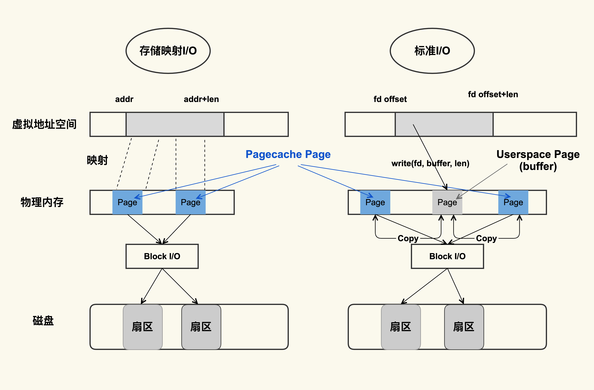

## 一、page cache是什么
#### 1.1 Page Cache 是内核管理的内存，也就是说，它属于内核不属于用户。


#### 1.2 page cache的查看

free、vmstat、/proc/meminfo都可以查看

####  1.3 page cache计算

```
Buffers + Cached + SwapCached = Active(file) + Inactive(file) + Shmem + SwapCached
```

左右两边都等于 page cache

Page Cache 中，Active(file)+Inactive(file) 是 File-backed page（与文件对应的内存页），是最需要关注的部分。因为你平时用的 mmap() 内存映射方式和 buffered I/O 来消耗的内存就属于这部分，**这部分在真实的生产环境上也最容易产生问题**

SwapCached 是在打开了 Swap 分区后，把 Inactive(anon)+Active(anon) 这两项里的匿名页给交换到磁盘（swap out），然后再读入到内存（swap in）后分配的内存。由于读入到内存后原来的 Swap File 还在，所以 SwapCached 也可以认为是 File-backed page，即属于 Page Cache

SwapCached 只在 Swap 分区打开的情况下才会有，而建议在生产环境中关闭 Swap 分区，**因为 Swap 过程产生的 I/O 会很容易引起性能抖动**

#### 1.4 为什么需要page cache

标准 I/O 和内存映射会先把数据写入到 Page Cache，这样做会通过减少 I/O 次数来提升读写效率。

#### 1.5 buffer与cache的区别

最简单的理解方式，buffer是缓存裸设备的读写，cache是缓存文件系统的读写。


## 二、page cache如何产生

Page Cache 的产生有两种不同的方式：

1. Buffered I/O（标准 I/O）：标准 I/O 是写的 (write(2)) 用户缓冲区 (Userpace Page 对应的内存)，然后再将用户缓冲区里的数据拷贝到内核缓冲区 (Pagecache Page 对应的内存)；如果是读的 (read(2)) 话则是先从内核缓冲区拷贝到用户缓冲区，再从用户缓冲区读数据，也就是 buffer 和文件内容不存在任何映射关系。
2. Memory-Mapped I/O（存储映射 I/O）：对于存储映射 I/O 而言，则是直接将 Pagecache Page 给映射到用户地址空间，用户直接读写 Pagecache Page 中内容



显然，存储映射 I/O 要比标准 I/O 效率高一些，毕竟少了“用户空间到内核空间互相拷贝”的过程。这也是很多应用开发者发现，为什么使用内存映射 I/O 比标准 I/O 方式性能要好一些的主要原因。（查看零拷贝相关概念）


#### 2.2 查看page cache

```
cat /proc/vmstat | egrep "dirty|writeback"
nr_dirty 30
nr_writeback 0
nr_writeback_temp 0
nr_dirty_threshold 11666
nr_dirty_background_threshold 3885
```

nr_dirty 表示当前系统中积压了多少脏页，nr_writeback 则表示有多少脏页正在回写到磁盘中，他们两个的单位都是 Page(4KB)


## 三、page cache的回收

Page Cache 的方式来申请到内存，回收的方式主要是两种：直接回收和后台回收

观察 Page Cache 直接回收和后台回收最简单方便的方式是使用 sar：

```
# sar -B 1
Linux 4.18.0-80.el8.x86_64 (VM-112-34-centos) 	11/20/2020 	_x86_64_	(1 CPU)

04:10:20 PM  pgpgin/s pgpgout/s   fault/s  majflt/s  pgfree/s pgscank/s pgscand/s pgsteal/s    %vmeff
04:10:21 PM     32.00      0.00   8069.00      0.00   5848.00      0.00      0.00      0.00      0.00
04:10:22 PM     32.00      0.00   3479.00      0.00   2540.00      0.00      0.00      0.00      0.00
04:10:23 PM     32.00      0.00   3518.00      0.00   2455.00      0.00      0.00      0.00      0.00
```

下面是这些指标的具体含义：
参数|说明
---|---
pgscank/s | kswapd(后台回收线程) 每秒扫描的 page 个数。即/proc/vmsta的pgscan_kswapd 
pgscand/s| Application 在内存申请过程中每秒直接扫描的 page 个数。即/proc/vmsta的pgscan_direct 
pgsteal/s|扫描的 page 中每秒被回收的个数。pgsteal_kswapd 与pgsteal_direct 之和
%vmeff| pgsteal/(pgscank+pgscand), 回收效率，越接近 100 说明系统越安全，越接近 0 说明系统内存压力越大。

来自于/proc/vmstat

```
# cat /proc/vmstat 
……
pgsteal_kswapd 799346331
pgsteal_direct 38420849
pgscan_kswapd 5308229834
pgscan_direct 372897957
pgscan_direct_throttle 0
……
```


## 四、page cache引起的问题（难以回收和容易回收两方面）

#### 4.1 直接内存回收引起 load 飙高或者业务时延抖动

#### 4.2 系统中脏页积压过多引起的 load 飙高

#### 4.3 统 NUMA 策略配置不当引起的 load 飙高

#### 4.4 误操作而导致 Page Cache 被回收掉，进而导致业务性能下降明显

#### 4.5 内核的一些机制导致业务 Page Cache 被回收，从而引起性能下降


