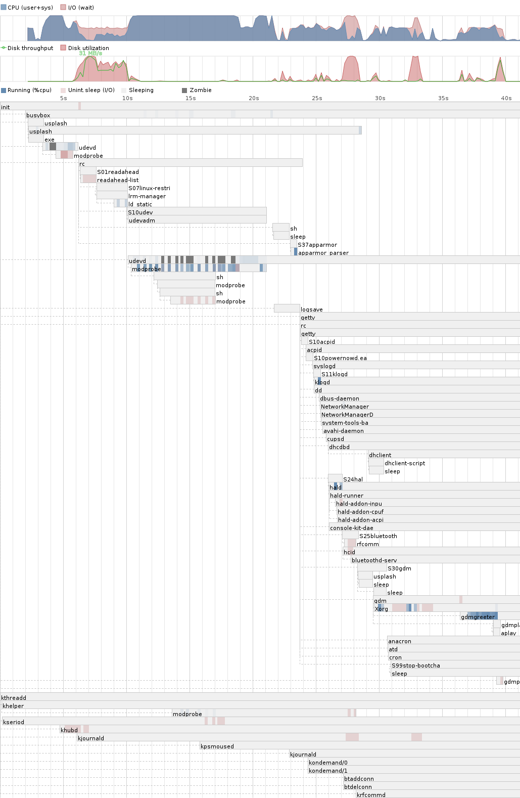
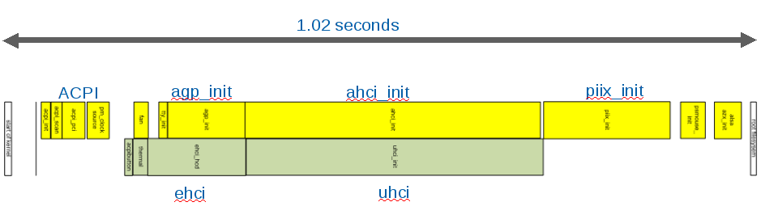
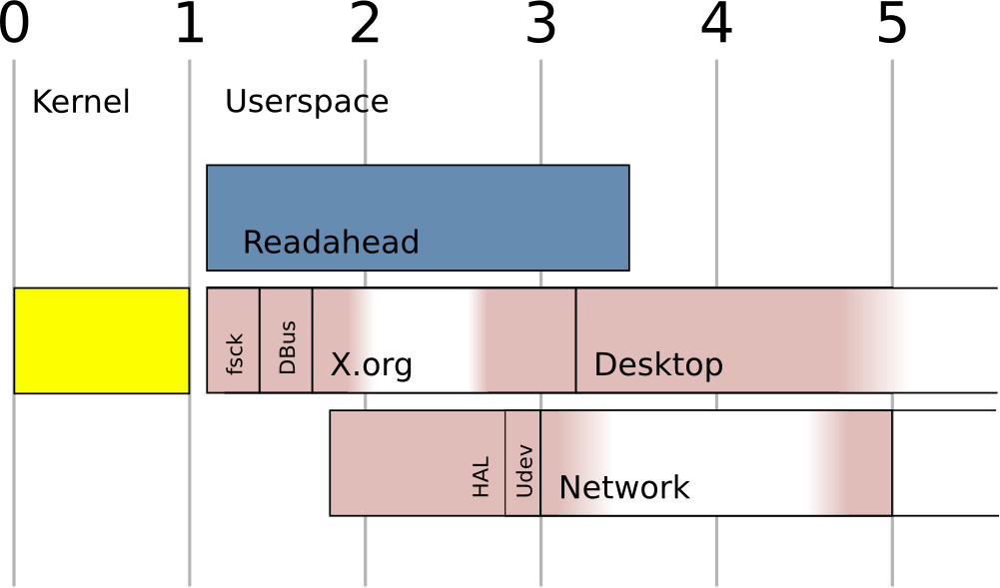
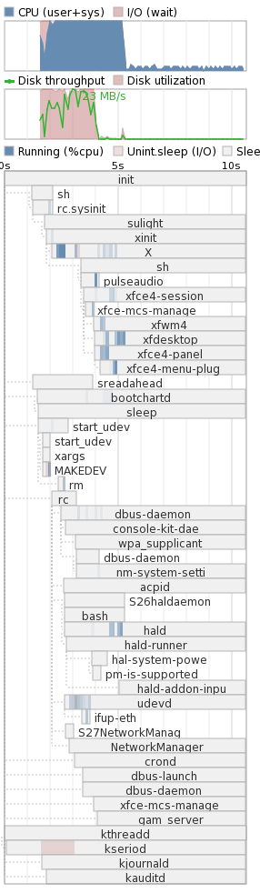

原文：https://lwn.net/Articles/299483/  （文章比较老，但很有参考价值）

September 22, 2008 This article was contributed by [Don Marti](http://zgp.org/~dmarti/)
```
At the Linux Plumbers Conference Thursday, [Arjan van de Ven](http://www.fenrus.org/), Linux developer at Intel and author of PowerTOP, and Auke Kok, another Linux developer at Intel's [Open Source Technology Center](http://oss.intel.com/en-us/), demonstrated a Linux system booting in five seconds. The hardware was an Asus EEE PC, which has solid-state storage, and the two developers beat the five second mark with two software loads: one modified [Fedora](http://fedoraproject.org/) and one modified [Moblin](http://www.moblin.org/). They had to hold up the EEE PC for the audience, since the time required to finish booting was less than the time needed for the projector to sync.
```
在周四的Linux Plumbers Conference会议上，intel的linux开发者和PowerTop的作者Arjan van de Ven，和另一个intel的开源技术中心的linux开发者Auke Kok，展示了一个5秒启动的系统。硬件是华硕EEE个人电脑，有SSD硬盘。两位开发者让两个软件系统可以在五秒内加载：修改版的fedora和修改版的moblin
```
How did they do it? Arjan said it starts with the right attitude. "It's not about booting faster, it's about booting in 5 seconds." Instead of saving a second here and there, set a time budget for the whole system, and make each step of the boot finish in its allotted time. And no cheating. "Done booting means CPU and disk idle," Arjan said. No fair putting up the desktop while still starting services behind the scenes. (An audience member pointed out that Microsoft does this.) The "done booting" time did not include bringing up the network, but did include starting NetworkManager. A system with a conventional hard disk will have to take longer to start up: Arjan said he has run the same load on a ThinkPad and achieved a 10-second boot time.
```
他们如何做到？Arjan说，要从正确的态度开始。“这不是关于更快启动，而是关于5秒启动”。不是从这里省一秒那里省一秒，设定一个整个系统的时间预算，然后让每一步在分配的时间内启动，并且不用作弊手段。“cpu和磁盘空闲代表启动完成”，Arjan说。启动了桌面却在后台启动服务是不公平的。“启动完成”时间不包括拉起网络，但包括启动NetworkManager。使用老式硬盘的系统会用更长的时间启动，Arjan说他启动在Thinkpad上同样的系统花了10秒。
```
Out of the box, Fedora takes 45 seconds from power on to GDM login screen. A tool called Bootchart, by Ziga Mahkovec, offers some details. In a Bootchart graph of the Fedora boot (fig. 1), the system does some apparently time-wasting things. It spends a full second starting the loopback device—checking to see if all the network interfaces on the system are loopback. Then there's two seconds to start "sendmail." "Everybody pays because someone else wants to run a mail server," Arjan said, and suggested that for the common laptop use case—an SMTP server used only for outgoing mail—the user can simply run ssmtp.
```
另外，fedora从加电开始使用了45秒到GDM登录界面。Ziga Mahkovec的bootchart工具，提供了一些细节。fedora启动的Bootchart图里系统的确明显做了浪费时间的事情。它花费了整一秒启动loopback接口设备的检查以确定系统所有的网络接口都是loopback。然后使用了2秒去启动sendmail。一些人想运行邮件服务器却导致所有人埋单，Arjan说。他建议普通笔记本使用case，一个SMTP服务器，只外发邮件。用户运行ssmtp即可。

```
Another time-consuming process on Fedora was "setroubleshootd," a useful tool for finding problems with Security Enhanced Linux (SELinux) configuration. It took five seconds. Fedora was not to blame for everything. Some upstream projects had puzzling delays as well. The X Window System runs the C preprocessor and compiler on startup, in order to build its keyboard mappings.

Ubuntu's boot time is about the same: two seconds shorter (fig. 2). It spends 12 seconds running modprobe running a shell running modprobe, which ends up loading a single module. The tool for adding license-restricted drivers takes 2.5 seconds—on a system with no restricted drivers needed. "Everybody else pays for the binary driver," Arjan said. And Ubuntu's GDM takes another 2.5 seconds of pure CPU time, to display the background image.
Both distributions use splash screens. Arjan and Auke agreed, "We hate splash screens. By the time you see it, we want to be done." The development time that distributions spend on splash screens is much more than the Intel team spent on booting fast enough not to need one.
```
另外一个耗时的fedora进程是setroubleshootd，一个用于发现selinux配置问题的有用工具，它耗时5秒。fedora并不为所有事情背锅，一些上游应用也有令人迷惑的延迟。X window系统执行C预处理和编译，以建立它的键盘映射。
ubuntu启动时间也差不多，只短2秒。



耗费12秒运行modprobe，最终却只加载了单一模块。一个添加有license限制的驱动的工具用了2.5秒，而系统却完全不需要这种驱动。“每个人都为二进制驱动埋单”Arjan说。ubuntu的GDM用了2.5秒的纯cpu时间去展示后台图片。
两个发行版都使用启动页。 Arjan 和 Auke都赞同“我们讨厌启动页。当你看到它的时候，我们希望是已完成“。**发行版花费在开发启动页的时间，远比intel团队花费在**

```
How they did it: the kernel
Step one was to make the budget. The kernel gets one second to start, including all modules. "Early boot" including init scripts and background tasks, gets another second. X gets another second, and the desktop environment gets two.

The kernel has to be built without initrd, which takes half a second with nothing in it. So all modules required for boot must be built into the kernel. "With a handful of modules you cover 95% of laptops out there," Arjan said. He suggested building an initrd-based image to cover the remaining 5%.

Some kernel work made it possible to do asynchronous initialization of some subsystems. For example, the modified kernel starts the Advanced Host Controller Interface (AHCI) initialization, to handle storage, at the same time as the Universal Host Controller Interface (UHCI), in order to handle USB (fig.3). "We can boot the kernel probably in half a second but we got it down to a second and we stopped," Arjan said. The kernel should be down to half a second by 2.6.28, thanks to a brand-new fix in the AHCI support, he added.
One more kernel change was a small patch to support readahead. The kernel now keeps track of which blocks it has to read at boot, then makes that information available to userspace when booting is complete. That enables readahead, which is part of the early boot process.
```
## 他们如何做到：内核
第一步，制定时间预算。内核有1秒时间启动，包括所有模块。”早期启动“包括初始化脚本和后台任务，有1秒时间。X界面有另外1秒钟，桌面环境有2秒。
内核必须脱离initrd创建，它花费了半秒却什么也没做。所以所有的启动必须模块必须都编译进内核。”只要少量模块就能覆盖95%笔记本启动所需，“Arjan说。它建议创建基于initrd的image以满足剩下的5%。
一些内核工作使得一些子系统的异步初始化成为可能。比如，修改版内核启动AHCI初始化以处理存储，同时UHCI处理USB



”我们能在半秒内启动内核，但我们花费了1秒，没有继续优化“，Arjan说。由于一个AHCI的全新修复，2.6.28版本之后内核可以在半秒启动。
另外一个内核更改是支持预读的小补丁。内核现在可以追踪启动时必须读取的块，然后在启动完成时提供给用户空间。这启用了预读，也是早期启动过程的一部分。
## 他们如何做到：预读和初始化
```
Fedora uses Upstart as a replacement for the historic "init" that traditionally is the first userspace program to run. But the Intel team went back to the original init. The order of tasks that init handles is modified to do three things at the same time: first, an "sReadahead" process, to read blocks from disk so that they're cached in memory, second, the critical path: filesystem check, then the D-Bus inter-process communication system, then X, then the desktop. And the third set of programs to start is the Hardware Abstraction Layer (HAL), then the udev manager for hot-plugged devices, then networking. udev is used only to support devices that might be added later—the system has a persistent, old-school /dev directory so that boot doesn't depend on udev.

The arrangement of tasks helps get efficient use out of the CPU. For example, X delays for about half a second probing for video modes, and that's when HAL does its CPU-intensive startup (fig. 4).
```
fedora使用了upstart取代历史上的init，init是传统的第一个运行的用户态程序。但intel团队回到了原始的init。init处理任务的顺序被修改成同时处理：第一，sReadahead程序，从磁盘读取块数据一边缓存到内存；第二，关键路径，文件系统检查，D-总线跨进程通信系统，X 系统，然后是桌面。程序启动的第三步是硬件抽象层（HAL），然后热插拔的udev manager，然后是网络。udev仅仅在需要延后添加的设备上使用，即那些持久化、老旧设备。所以启动并不依赖于udev
任务的安排帮助提升cpu的使用。比如，X延迟了半秒以检测视频模式，也就是HAL在做cpu密集的启动的时候。



```
In a graph of disk and CPU use, both are at maximum for most of the boot time, thanks to sReadahead. When X starts, it never has to wait to read from disk, since everything it needs is already in cache. sReadahead is based on Fedora Readahead, but is modified to take advantage of the kernel's new list of blocks read. sReadahead is to be released next week on moblin.org, and the kernel patch is intended for mainline as soon as Arjan can go over it with ext3 filesystem maintainer Ted Ts'o. (Ted, in the audience, offered some suggestions for reordering blocks on disk to speed boot even further.)

There's a hard limit of 75MB of reads in order to boot, set by the maximum transfer speed of the Flash storage: 3 seconds of I/O at 25MB/s. So, "We don't read the whole file. We read only the pieces of the file we actually use," Arjan said. sReadahead uses the "idle" I/O scheduler, so that if anything else needs the disk it gets it. With readahead turned off, the system boots in seven seconds, but with readahead, it meets the target of five.

X is still problematic. "We had to do a lot of damage to X," Arjan said. Some of the work involved eliminating the C compiler run by re-using keyboard mappings, but other work was more temporary. The current line of X development, though, puts more of the hardware detection and configuration into the kernel, which should cut the total startup time. Since part of the kernel's time budget is already spent waiting for hardware to initialize, and it can initialize more than one thing at a time, it's a more efficient use of time to have the kernel initialize the video hardware at the same time it does USB and ATA. X developer Keith Packard, in the audience and also an Intel employee, offered help. Setting the video mode in the kernel would not let the kernel initialize it at the same time as the rest of the hardware, as shown in figure 3. The fast-booting system does not use GDM but boots straight to a user session, running the XFCE desktop environment. Instead of GDM, Arjan said later, a distribution could boot to the desktop session of the last user, but start the screensaver right away. If a different user wanted to log in, he or she could use the screensaver's "switch user" button.
```
磁盘和cpu使用率的图显示，由于sReadahead预读，两者在启动时都处于最大使用状态。X window启动时，它所需的一切已经在缓存中，无需从磁盘读取而等待。sReadahead给予fedora的预读，但被修改以利用内核的新块读取。sReadahead会在下周的moblin.org上发布，一旦Arjan和ext3文件系统维护者Ted复核，内核补丁预计在主线上发布。
有一个75MB的启动硬性限制，由flash存储的最大传输速度决定：3秒IO，25M每秒。所以我们不读取整个文件，我们只读取我们需要使用的文件区域，Arjan说。sReadahead使用idle IO调度，以便任何需要磁盘的进程可以随意使用。不预读，系统会在7秒内启动，但使用预读，则达到了5秒目标。
X 依旧造成困难。我们不得不对X造成一些破坏。Arjan说。一些工作减少键盘映射所需C编译，但其他是临时性的。当前的X开发基线，导入更多硬件检测和配置到内核中，可减少整体的启动时间。既然部分内核时间预算用在了等待硬件初始化，它可以被一次性初始化多个事情，在内核初始化视频硬件同时初始化USB和ATA更高效。X开发者Keith Packard，在观众席，也是一个intel员工，提供了帮助。设置视频模式在内核，不会让内核初始化其他硬件的同时初始化它，如图3.


