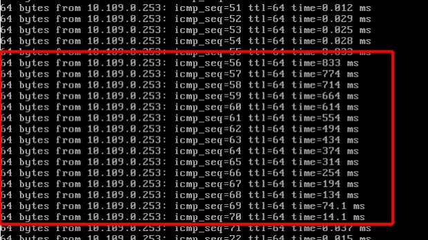
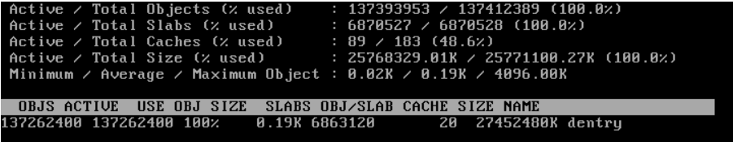
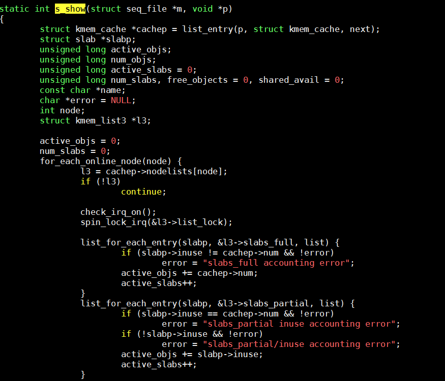

阿里云性能抖动问题的排查过程，比较经典，能给人不少启示

## 抖动的特点

1. 短时性，很难即时抓住发生的现场从而展开分析
2. 随机性，无法预测，很难重现，所以侵入性比较强、比较重的排查手段（日志等）就不方便使用

## 问题现象

用户的应用日志记录了百毫秒甚至1-2秒级别的延迟，而且发生较为频繁，由于业务的实时性要求较高，因此对业务的影响较大

## 分析过程

分析的方法论一般是，由大到小，缩小范围；大胆猜想，小心求证；重证据重逻辑。

#### 初步排查

发现ping过程也产生网络抖动



初看也仅仅是一些百毫秒延迟的集中发生而已，但是仔细观察就会发现每次发生都有这样的情况，就是延迟在一组连续的ping上发生的，并且延迟是倒序排列的。

首先他意味着并没有丢包发生，所以的ICMP请求都被系统发出并且收到回复，但是这样的倒序排列，更像是在问题时间段内所有的回复都没有被第一时间处理，而是突然在800ms之后系统处理了所有之前发生回复，因此才会产生这样的现象。那么我们此时可以有一个假设，在这800ms之前系统停止了对网络包的处理。那么什么样的情况会导致系统停止对网络包的处理呢？

答案是中断禁用，硬件中断是系统处理网络包的第一也是必须步骤，中断禁用会导致系统的软中断和中断都不能在CPU上发生，从而使得当前在CPU上运行的指令是无法被打断的，这经常被用于一些可能存在竞争风险的内核代码片段上，这些代码片段可能会因为被中断打断而导致数据不同步甚至损坏。

#### slab

使用slabtop查看，系统的slab占用量相比正常系统要高出不少



我们可以看到其中dentry在slab中的占用量达到了非常高的程度，dentry是内存中表示目录和文件的对象，作为与inode的链接存在，在一般情况下如此高数字的dentry项可能代表这系统有大量被打开的文件。



这是一段计算slab总量的代码，我们注意到它是以遍历链表的方式来统计slab总量的，而在进入链表之前调用了spin_lock_irq函数，我们来看看它的实现：

```
static inline void __spin_lock_irq(spinlock_t *lock)
{
local_irq_disable();
}
```


于是我们可以确认在统计slab信息的时候，系统的行为是首先禁用中断，然后遍历链表统计slab，最后再次启用中断。那么整个禁用中断的时间将取决于链表中对象的个数，如果其对象数量惊人，很可能就会导致禁用中断时间过长

## 验证

运行cat /proc/slabinfo在获取slab信息，那么以上函数也将会被调用，同时观察ping测试输出符合以上问题点的情况，即可以大致确认问题原因了

## 解决方法

对dentry项是作为文件系统缓存的一部分存在的，也就是真正的文件信息是存放于磁盘上的，dentry只不过是在系统打开文件系统缓存在内存中的对象而已，即使缓存被清空，未来系统一样可以通过读取磁盘文件来重新生成dentry信息，因此我们可以通过类似echo 2 > /proc/sys/vm/drop_caches && sync的方式来释放缓存，缓解问题


## 遗留问题

事情远远没有就此结束，我们需要注意两个关键性的问题：

1. 是什么程序在反复地获取slab信息，产生类似cat /proc/slabinfo的效果

2. 这么多dentry生成的原因是什么