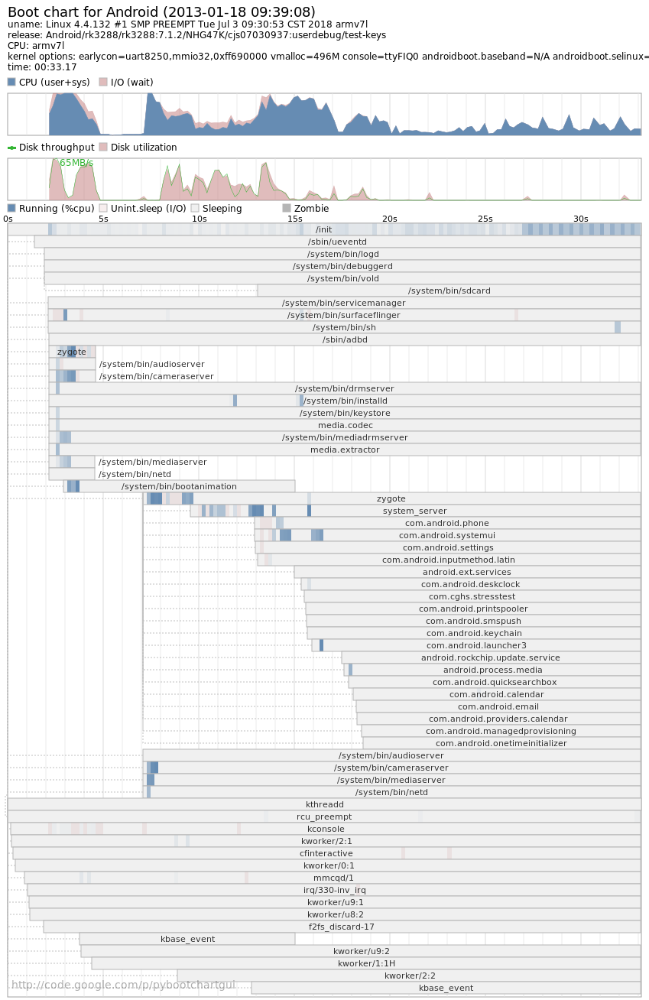

### 1. bootchart 简介

bootchart 是一个用于 linux 启动过程性能分析的开源工具软件，在系统启动过程中自动收集 CPU 占用率、磁盘吞吐率、进程等信息，并以图形方式显示分析结果，可用作指导优化系统启动过程。

bootchart 让用户可以很直观的查看系统启动的过程和各个过程耗费的时间，以便让用户能够分析启动过程，从而进行优化以提高启动时间。

它由 bootchartd 服务和 bootchart-render 两部分组成，后者主要负责生成启动流程的分析结果图。

### 2. bootchart 在 android8.1 中的应用

Android 系统源码中有 bootchart 的实现，路径在 system/core/init/bootchart.cpp 中, bootchart 通过内嵌在 init 进程中实现，在后台执行测量。不过 bootchart 的测量时段是 init 进程启动之后，不包含 uboot 和 kernel 的启动时间。

### 3. bootchart 在 android 平台的使用步骤

在 android 源码路径 system/core/init/README.md 中包含了对 bootchart 的使用说明。

##### 3.1. 编译 bootchart

在 Android 5.1 之前 bootchart 是没有编译进系统的，需要使用下面的宏手动打开编译，在 Android 6.0 以上系统默认已经编译了 bootchart，可以 adb shell 命令进入文件系统，可以看到 data 下面已经有 bootchart 的目录了。

```
rk3288:/data/bootchart # ls

12
```

##### 3.2 打开 bootchart 收集开机数据

```
1. adb shell 'touch /data/bootchart/enabled'
   首先使能 bootchart，bootchart 操作的前提是存在 enable 标记，所以
   在你不需要收集数据的时候别忘了删除这个标记。

2. - sudo apt-get install pybootchartgui
   - $ANDROID_BUILD_TOP/system/core/init/grab-bootchart.sh
   grab-bootchart.sh 脚本是 Google 封装的一系列操作的合集跟使用下面手动操作的结果是一样的。
   
   * 手动操作
   1. (可选) echo $TIME_OUT > /data/bootchart/start
   添加 bootchart timeout 时间
   2. reboot 重启
   3. 可以看到 bootchart 生成的数据文件和 log 都被保存在 /data/bootchart 路径下
   4. tar -zcf boochart.tgz *
   5. 使用 adb pull 命令将文件拷贝出来
123456789101112131415
```

##### 3.3 在 Linux PC 机上生成 bootchart 图表

##### PC 机安装 bootchart 工具

```
sudo apt-get install bootchart
sudo apt-get install pybootchartgui 
12
```

##### 生成 bootchar 图表

拷贝 bootchart.tgz 到 PC 中，并执行下面的命令生成图表

```
bootchart bootchart.tgz
1
```

#### 4. bootchart 图形分析小技巧



整个图表以时间线为横轴，图标上方为 CPU 和 磁盘的利用情况，下方是各进程的运行状态条，显示各个进程的开始时间与结束时间以及对 CPU、I/O 的利用情况，我们关心的各个进程的运行时间以及 CPU 的使用情况，进而优化系统。


性能分析工具 — bootchart 工具使用 https://blog.csdn.net/qq_19923217/article/details/81043736