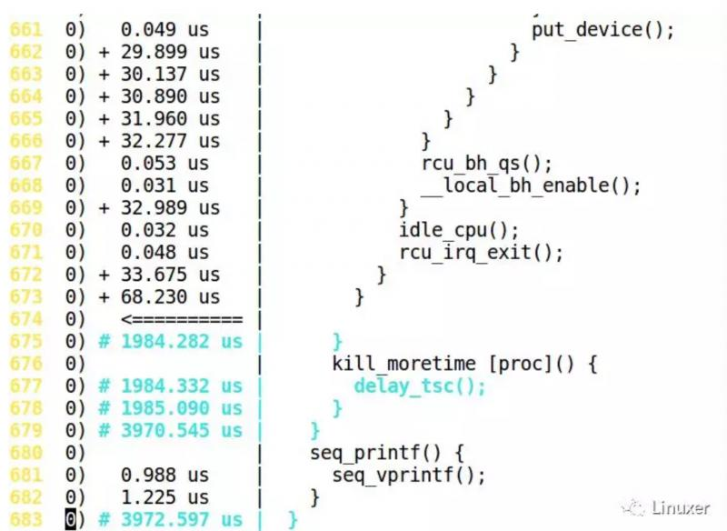
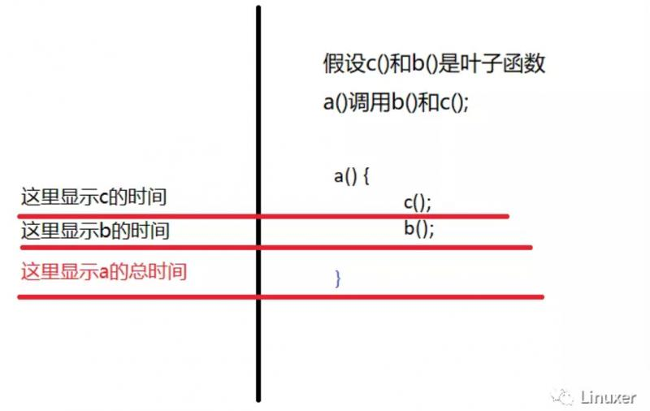

本文来自https|//www.ibm.com/developerworks/cn/linux/l-cn-ftrace/
https://www.cnblogs.com/sky-heaven/p/5321542.html
https://www.cnblogs.com/yhp-smarthome/p/7518275.html

## 一、ftrace简介

ftrace 的作用是帮助开发人员了解 Linux 内核的运行时行为，以便进行故障调试或性能分析。

最早 ftrace 是一个 function tracer，仅能够记录内核的函数调用流程。如今 ftrace 已经成为一个 framework，采用 plugin 的方式支持开发人员添加更多种类的 trace 功能。

Ftrace 的设计目标简单，本质上是一种静态代码插装技术，不需要支持某种编程接口让用户自定义 trace 行为。静态代码插装技术更加可靠，不会因为用户的不当使用而导致内核崩溃。 ftrace 代码量很小，稳定可靠。

从 2.6.30 开始，ftrace 支持 event tracer，其实现和功能与 LTTng 非常类似。 ftrace 有定义良好的 ASCII 接口，可以直接阅读，这对于内核开发人员非常具有吸引力，因为只需内核代码加上 cat 命令就可以工作了，相当方便； LTTng 则采用 binary 接口，更利于专门工具分析使用。此外他们内部 ring buffer 的实现不相同，ftrace 对所有 tracer 都采用同一个 ring buffer，而 LTTng 则使用各自不同的 ring buffer 。

## 二、ftrace现状

Ftrace 由 RedHat 的 Steve Rostedt 负责维护。到 2.6.30 为止，已经支持的 tracer 包括
tracer名称|解释
---|---
Function tracer 和 Function graph tracer| 跟踪函数调用。
Schedule switch tracer| 跟踪进程调度情况。
Wakeup tracer|跟踪进程的调度延迟，即高优先级进程从进入 ready 状态到获得 CPU 的延迟时间。该 tracer 只针对实时进程。
Irqsoff tracer|当中断被禁止时，系统无法相应外部事件，比如键盘和鼠标，时钟也无法产生 tick 中断。这意味着系统响应延迟，irqsoff 这个 tracer 能够跟踪并记录内核中哪些函数禁止了中断，对于其中中断禁止时间最长的，irqsoff 将在 log 文件的第一行标示出来，从而使开发人员可以迅速定位造成响应延迟的罪魁祸首。
Preemptoff tracer|和前一个 tracer 类似，preemptoff tracer 跟踪并记录禁止内核抢占的函数，并清晰地显示出禁止抢占时间最长的内核函数。
Preemptirqsoff tracer| 同上，跟踪和记录禁止中断或者禁止抢占的内核函数，以及禁止时间最长的函数。
Branch tracer| 跟踪内核程序中的 likely/unlikely 分支预测命中率情况。 Branch tracer 能够记录这些分支语句有多少次预测成功。从而为优化程序提供线索。
Hardware branch tracer|利用处理器的分支跟踪能力，实现硬件级别的指令跳转记录。在 x86 上，主要利用了 BTS 这个特性。
Initcall tracer|记录系统在 boot 阶段所调用的 init call 。
Mmiotrace tracer|记录 memory map IO 的相关信息。
Power tracer|记录系统电源管理相关的信息。
Sysprof tracer|缺省情况下，sysprof tracer 每隔 1 msec 对内核进行一次采样，记录函数调用和堆栈信息。
Kernel memory tracer| 内存 tracer 主要用来跟踪 slab allocator 的分配情况。包括 kfree，kmem_cache_alloc 等 API 的调用情况，用户程序可以根据 tracer 收集到的信息分析内部碎片情况，找出内存分配最频繁的代码片断，等等。
Workqueue statistical tracer|这是一个 statistic tracer，统计系统中所有的 workqueue 的工作情况，比如有多少个 work 被插入 workqueue，多少个已经被执行等。开发人员可以以此来决定具体的 workqueue 实现，比如是使用 single threaded workqueue 还是 per cpu workqueue.
Event tracer| 跟踪系统事件，比如 timer，系统调用，中断等。

## 三、ftrace的使用

### 1.传统ftrace的使用

#### 步骤

使用传统的 ftrace 需要如下几个步骤：

- 选择一种 tracer
- 使能 ftrace
- 执行需要 trace 的应用程序，比如需要跟踪 ls，就执行 ls
- 关闭 ftrace
- 查看 trace 文件

#### 步骤详解

1. 用户创建debugfs

```
# mkdir /debug
# mount -t debugfs nodev /debug/
# cd /debug/
# ls
acpi  block      boot_params  cleancache  dri            extfrag    gpio  iio         kprobes  pinctrl  ras     sched_features  tracing  virtio-ports    x86
bdi   bluetooth  btrfs        dma_buf     dynamic_debug  frontswap  hid   intel_lpss  mce      pwm      regmap  suspend_stats   usb      wakeup_sources

```

可以看到 tracing 目录。 Ftrace 的控制接口就是该目录下的文件。

##### 文件介绍

文件名|说明
---|---
current_tracer|用于设置或显示当前使用的跟踪器；使用 echo 将跟踪器名字写入该文件可以切换到不同的跟踪器。系统启动后，其缺省值为 nop ，即不做任何跟踪操作。在执行完一段跟踪任务后，可以通过向该文件写入 nop 来重置跟踪器。
available_tracers|记录了当前编译进内核的跟踪器的列表，可以通过 cat 查看其内容；其包含的跟踪器与图 3 中所激活的选项是对应的。写 current_tracer 文件时用到的跟踪器名字必须在该文件列出的跟踪器名字列表中。
trace|文件提供了查看获取到的跟踪信息的接口。可以通过 cat 等命令查看该文件以查看跟踪到的内核活动记录，也可以将其内容保存为记录文件以备后续查看。
tracing_enabled|用于控制 current_tracer 中的跟踪器是否可以跟踪内核函数的调用情况。写入 0 会关闭跟踪活动，写入 1 则激活跟踪功能；其缺省值为 1 。
set_graph_function|设置要清晰显示调用关系的函数，显示的信息结构类似于 C 语言代码，这样在分析内核运作流程时会更加直观一些。在使用 function_graph 跟踪器时使用；缺省为对所有函数都生成调用关系序列，可以通过写该文件来指定需要特别关注的函数。
buffer_size_kb|用于设置单个 CPU 所使用的跟踪缓存的大小。跟踪器会将跟踪到的信息写入缓存，每个 CPU 的跟踪缓存是一样大的。跟踪缓存实现为环形缓冲区的形式，如果跟踪到的信息太多，则旧的信息会被新的跟踪信息覆盖掉。注意，要更改该文件的值需要先将 current_tracer 设置为 nop 才可以。
tracing_on|用于控制跟踪的暂停。有时候在观察到某些事件时想暂时关闭跟踪，可以将 0 写入该文件以停止跟踪，这样跟踪缓冲区中比较新的部分是与所关注的事件相关的；写入 1 可以继续跟踪。
available_filter_functions|记录了当前可以跟踪的内核函数。对于不在该文件中列出的函数，无法跟踪其活动。
set_ftrace_filter和 set_ftrace_notrace|在编译内核时配置了动态 ftrace （选中 CONFIG_DYNAMIC_FTRACE 选项）后使用。前者用于显示指定要跟踪的函数，后者则作用相反，用于指定不跟踪的函数。如果一个函数名同时出现在这两个文件中，则这个函数的执行状况不会被跟踪。这些文件还支持简单形式的含有通配符的表达式，这样可以用一个表达式一次指定多个目标函数；具体使用在后续文章中会有描述。注意，要写入这两个文件的函数名必须可以在文件 available_filter_functions 中看到。缺省为可以跟踪所有内核函数，文件 set_ftrace_notrace 的值则为空

其中available_tracers文件表示当前内核支持的跟踪器列表
跟踪器|说明
---|---
nop|跟踪器不会跟踪任何内核活动，将 nop 写入 current_tracer 文件可以删除之前所使用的跟踪器，并清空之前收集到的跟踪信息，即刷新 trace 文件。
function|跟踪器可以跟踪内核函数的执行情况；可以通过文件 set_ftrace_filter 显示指定要跟踪的函数。
function_graph|跟踪器可以显示类似 C 源码的函数调用关系图，这样查看起来比较直观一些；可以通过文件 set_grapch_function 显示指定要生成调用流程图的函数。
sched_switch|跟踪器可以对内核中的进程调度活动进行跟踪。
irqsoff|跟踪器和 preemptoff跟踪器分别跟踪关闭中断的代码和禁止进程抢占的代码，并记录关闭的最大时长，preemptirqsoff跟踪器则可以看做它们的组合

ftrace 还支持其它一些跟踪器，比如 initcall、ksym_tracer、mmiotrace、sysprof 等

2. 选择 tracer 的控制文件

控制文件叫作 current_tracer 。选择 tracer 就是将 tracer 的名字写入这个文件，比如，用户打算使用 function tracer，可输入如下命令：

```
# echo function > current_tracer
```
文件 tracing_enabled 控制 ftrace 的开始和结束。
```
#echo 1 >/debug/tracing/tracing_enable
#echo 1 >/debug/tracing/tracing_on
```
ftrace 的输出信息主要保存在 3 个文件中。
1. Trace，该文件保存 ftrace 的输出信息，其内容可以直接阅读。
2. latency_trace，保存与 trace 相同的信息，不过组织方式略有不同。主要为了用户能方便地分析系统中有关延迟的信息。
3. trace_pipe 是一个管道文件，主要为了方便应用程序读取 trace 内容。

#### 操作步骤
```
mkdir /debug；mount -t debugs nodev /debug; /*挂载debugfs到创建的目录中去*/
cd /debug; cd tracing; /*如果没有tracing目录，则内核目前还没有支持ftrace，需要配置参数，重新编译*/。
echo nop > current_tracer;//清空tracer
echo function_graph > current_tracer;//使用图形显示调用关系
echo ip_rcv > set_graph_function;//设置过滤函数,可以设置多个
echo 1 > tracing_enabled开始追踪
```
追踪的结果在文件trace中，可以使用cat，vim等工具进行查看



查看方法：


### 2. Non-Tracer Tracer 的使用

