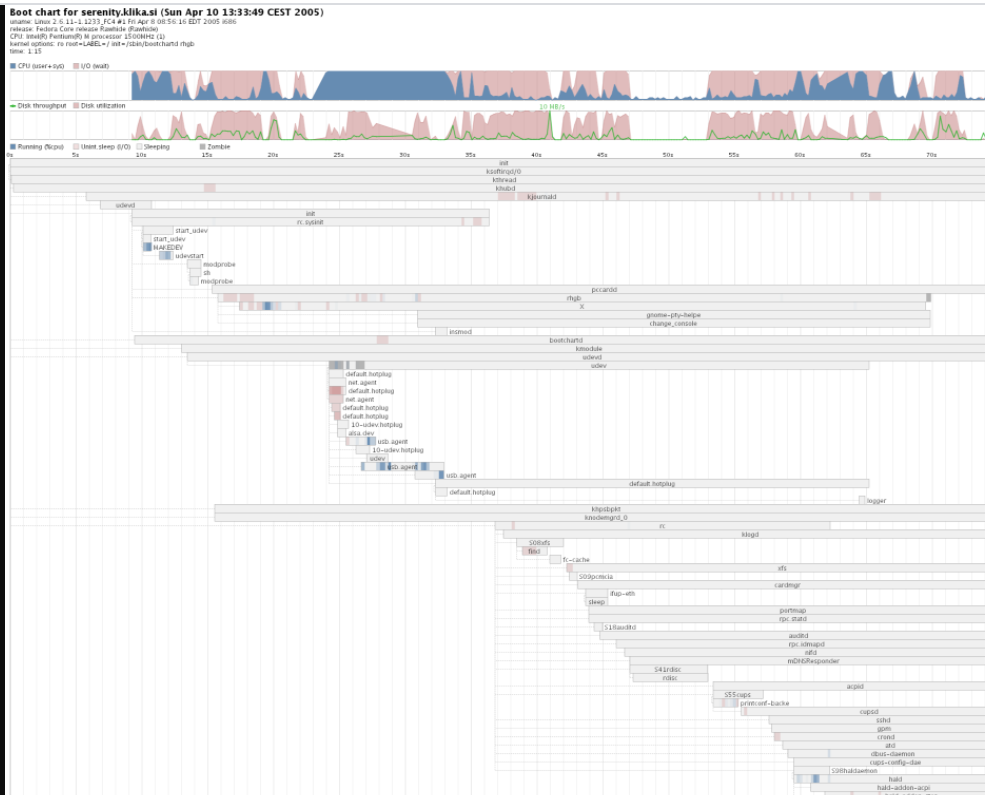
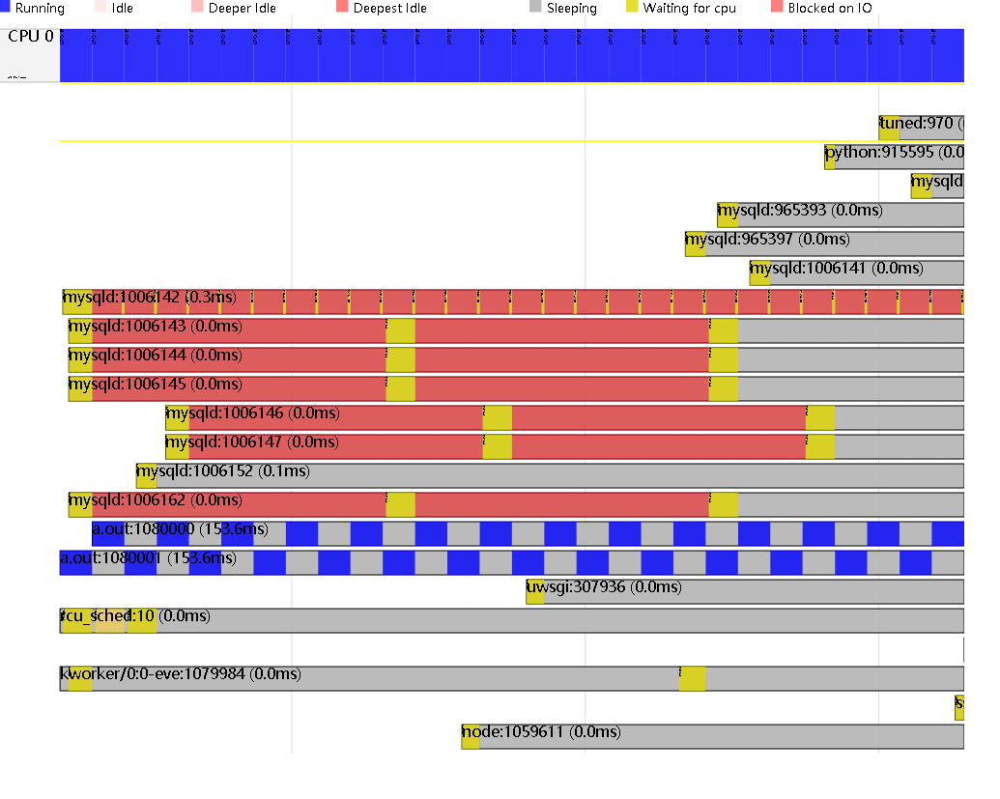

火焰图特别适合分析运行时热点（无论是on-cpu、off-cpu、还是内存等，火焰图的想象力可以无穷放大），但是你要分析一个的如果是一个时序问题，比如系统启动的慢、一个软件启动的慢，用火焰图固然可能有一点帮助，但是帮助肯定很微小


来自：宋宝华：当Linux内核遭遇鲨鱼—kernelshark  https://blog.csdn.net/21cnbao/article/details/108414081

Linux界有一个杀手级分析Linux本身启动慢的工具，叫做bootchart，它其实把启动过程中进程的IO,CPU占用情况进行了描述。注意这类图都有一个共同特点，横轴是时间，纵轴是CPU、线程等的状态（运行、睡眠、IO什么的）



bootchart确实有利于分析开机过程，但是你平时某个软件启动慢呢？或者更广泛地说，某个特定过程特别慢呢？或者更加更加广泛地说，我写的程序在系统里面是怎么在运行，几个线程怎么在跑？我们则要描绘出它的时序图。

这个时候，我们可以用perf的timechart，比如，下面我们写一个很简单的包含了2个线程周期循环做事情和睡眠的代码：

```
#include<pthread.h>
#include<unistd.h>
#include<stdio.h>
void* thread_fun1(void* param){
    while(1)
    {
        int i=0,j=0;
        for(i=0;i<100;++i){
            j++;        
        }
        j=0;
    }
    return NULL;
}

void* thread_fun2(void* param){
    while(1)
    {
        int i=0,j=0;
        for(i=0;i<100;++i){
            j++;      
        }
        j=0;
    }
    return NULL;
}

int main(void){
    pthread_t tid1,tid2;
    pthread_create(&tid1,NULL,thread_fun1,NULL);
    pthread_create(&tid2,NULL,thread_fun2,NULL);
    pthread_join(tid1,NULL);
    pthread_join(tid2,NULL);
}
```

编译（注意加上-lpthread，否则会报错。）
```
gcc perf_test.c -lpthread
```

然后执行，并获取perf数据，最后画图
```
# perf sched record -a
# perf timechart
Written 10.6 seconds of trace to output.svg.
```



使用kernelshark更加方便

```
# trace-cmd record -e 'sched_wakeup*' -e sched_switch -e 'sched_migrate*'
Hit Ctrl^C to stop recording
^CCPU0 data recorded at offset=0x41f000
    557056 bytes in size

```

```
# kernelshark trace.dat
```
注意需要安装图形界面