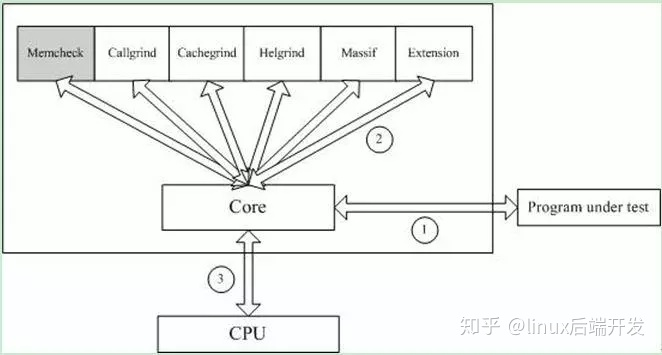

## 一、valgrind简介

#### 1. 介绍
Valgrind是一套Linux下，开放源代码（GPL V2）的仿真调试工具的集合。Valgrind由内核（core）以及基于内核的其他调试工具组成。内核类似于一个框架（framework），它模拟了一个CPU环境，并提供服务给其他工具；而其他工具则类似于插件 (plug-in)，利用内核提供的服务完成各种特定的内存调试任务。Valgrind的体系结构如下图所示：




#### 2. 工具

Valgrind支持很多工具:memcheck，addrcheck，cachegrind，Massif，helgrind和Callgrind等。在运行Valgrind时，你必须指明想用的工具,如果省略工具名，默认运行memcheck。

序号|工具|简介
---|---|---
1|Memcheck|最常用的工具，用来检测程序中出现的内存问题，所有对内存的读写都会被检测到，一切对malloc()/free()/new/delete的调用都会被捕获。所以，它能检测以下问题：<br/>对未初始化内存的使用；<br/>读/写释放后的内存块；<br/>读/写超出malloc分配的内存块；<br/>读/写不适当的栈中内存块；<br/>内存泄漏，指向一块内存的指针永远丢失；<br/>不正确的malloc/free或new/delete匹配；<br/>memcpy()相关函数中的dst和src指针重叠。
2|Callgrind|和gprof类似的分析工具，但它对程序的运行观察更是入微，能给我们提供更多的信息。和gprof不同，它不需要在编译源代码时附加特殊选项，但加上调试选项是推荐的。Callgrind收集程序运行时的一些数据，建立函数调用关系图，还可以有选择地进行cache模拟。在运行结束时，它会把分析数据写入一个文件。callgrind_annotate可以把这个文件的内容转化成可读的形式
3|Cachegrind|Cache分析器，它模拟CPU中的一级缓存l1，D1和二级缓存，能够精确地指出程序中cache的丢失和命中。如果需要，它还能够为我们提供cache丢失次数，内存引用次数，以及每行代码，每个函数，每个模块，整个程序产生的指令数。
4|Helgrind|它主要用来检查多线程程序中出现的竞争问题。Helgrind寻找内存中被多个线程访问，而又没有一贯加锁的区域，这些区域往往是线程之间失去同步的地方，而且会导致难以发掘的错误。Helgrind实现了名为“Eraser”的竞争检测算法，并做了进一步改进，减少了报告错误的次数。不过，Helgrind仍然处于实验阶段。
5|Massif|堆栈分析器，它能测量程序在堆栈中使用了多少内存，告诉我们堆块，堆管理块和栈的大小。Massif能帮助我们减少内存的使用，在带有虚拟内存的现代系统中，它还能够加速我们程序的运行，减少程序停留在交换区中的几率。
6|lackey|Lackey是小型工具，很少用到
7|Nulgrind|为开发者展示如何创建一个工具。

## 二、valgrind的使用方法

用法: 
```
valgrind [options] prog-and-args 
```
\[options\]:    常用选项，适用于所有Valgrind工具

选项|解释
---|---
--tool=<name> |最常用的选项。运行 valgrind中名为toolname的工具。默认memcheck。
-h --help|显示所有选项的帮助，包括内核和选定的工具两者。
--version|显示valgrind内核的版本，每个工具都有各自的版本。
-q --quiet|安静地运行，只打印错误信息。
--verbose|更详细的信息。
--trace-children=<yes|no>|跟踪子线程? [default: no]
--track-fds=<yes|no>|跟踪打开的文件描述？[default: no]
--time-stamp=<yes|no>|增加时间戳到LOG信息? [default: no]
--log-fd=<number>|输出LOG到描述符文件 [2=stderr]
--log-file=<file>|将输出的信息写入到filename.PID的文件里，PID是运行程序的进行ID
--log-file-exactly=<file>|输出LOG信息到 file
--xml=yes|将信息以xml格式输出，只有memcheck可用
--num-callers=<number>|show <number> callers in stack traces [12]
--error-exitcode=<number>|如果发现错误则返回错误代码 [0=disable]
--db-attach=<yes|no>|当出现错误，valgrind会自动启动调试器gdb。[default: no]
--db-command=<command>|启动调试器的命令行选项[gdb -nw %f %p]

适用于Memcheck工具的相关选项：

--leak-check=<no|summary|full>

要求对leak给出详细信息? Leak是指，存在一块没有被引用的内存空间，或没有被释放的内存空间，如summary，只反馈一些总结信息，告诉你有多少个malloc，多少个free 等；如果是full将输出所有的leaks，也就是定位到某一个malloc/free。 [default: summary]

--show-reachable=<yes|no>

如果为no，只输出没有引用的内存leaks，或指向malloc返回的内存块中部某处的leaks [default: no]


https://zhuanlan.zhihu.com/p/75416381

https://zhuanlan.zhihu.com/p/111556601

https://wenku.baidu.com/view/9d735f234793daef5ef7ba0d4a7302768f996ff8.html


