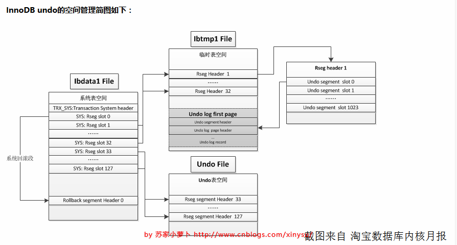

本文来自：https://www.cnblogs.com/wyy123/p/7880077.html
https://blog.csdn.net/weixin_33935777/article/details/92978510?utm_medium=distribute.pc_relevant.none-task-blog-baidujs-5

https://blog.csdn.net/n88Lpo/article/details/86710366

## undo是什么

undo日志用于存放数据修改被修改前的值，假设修改 tba 表中 id=2的行数据，把Name='B' 修改为Name = 'B2' ，那么undo日志就会用来存放Name='B'的记录，如果这个修改出现异常，可以使用undo日志来实现回滚操作，保证事务的一致性


## undo的参数

参数|含义
---|---
innodb_undo_directory<br>[=/opt/mysql/undo]|Innodb为还原日志创建的独立表空间的相对或绝对路径。通常用于日志被放置在哪些不同的存储设备上。配合参数innodb_undo_logs和innodb_undo_tablespaces，这决定了系统表空间外还原日志的磁盘分布。默认目录为innodb默认创建它的其他日志文件的目录。如果想转移undo文件的位置，只需要修改下该配置，并将undo文件拷贝过去就可以了。
innodb_rollback_segments[=128]|定义在一个事务中innodb使用的系统表空间中回滚段的个数。如果观察到同回滚日志有关的互斥争用，可以调整这个参数以优化性能。早期为innodb_rollback_segments，后来改为innodb_undo_logs，现在改回innodb_rollback_segments了
innodb_undo_tablespaces[=4]|用于设定创建的undo表空间的个数，在mysql_install_db时初始化后，就再也不能被改动了；默认值为0，表示不独立设置undo的tablespace，默认记录到ibdata中；否则，则在undo目录下创建这么多个undo文件，例如假定设置该值为4，那么就会创建命名为undo001~undo004的undo tablespace文件，每个文件的默认大小为10M。修改该值会导致Innodb无法完成初始化，数据库无法启动，但是另两个参数可以修改；

## undo的初始化

#### 1. undo 表空间物理文件的建立

本过程调用函数srv_undo_tablespaces_init

```
#0  srv_undo_tablespaces_init (create_new_db=true, n_conf_tablespaces=4, n_opened=0x2ef55b0)
    at /root/mysqlc/percona-server-locks-detail-5.7.22/storage/innobase/srv/srv0start.cc:824
#1  0x0000000001bbd7e0 in innobase_start_or_create_for_mysql () at /root/mysqlc/percona-server-locks-detail-5.7.22/storage/innobase/srv/srv0start.cc:2188
#2  0x00000000019ca74e in innobase_init (p=0x2f2a420) at /root/mysqlc/percona-server-locks-detail-5.7.22/storage/innobase/handler/ha_innodb.cc:4409
#3  0x0000000000f7ec2a in ha_initialize_handlerton (plugin=0x2fca110) at /root/mysqlc/percona-server-locks-detail-5.7.22/sql/handler.cc:871
#4  0x00000000015f9edf in plugin_initialize (plugin=0x2fca110) at /root/mysqlc/percona-server-locks-detail-5.7.22/sql/sql_plugin.cc:1252
```

本过程主要有如下几个步骤：

- 根据参数innodb_undo_tablespaces 的配置通过调用srv_undo_tablespace_create分别进行文件建立，默认建立的大小为10M：

```
for (i = 0; create_new_db && i < n_conf_tablespaces; ++i) //n_conf_tablespaces 为innodb_undo_tablespaces的配置的个数 /** Default undo tablespace size in UNIV_PAGEs count (10MB). */const ulint SRV_UNDO_TABLESPACE_SIZE_IN_PAGES =    ((1024 * 1024) * 10) / UNIV_PAGE_SIZE_DEF;...        err = srv_undo_tablespace_create(            name, SRV_UNDO_TABLESPACE_SIZE_IN_PAGES); //建立undo文件...
```

本步骤会有一个注释如下：

```
/* Create the undo spaces only if we are creating a new    instance. We don't allow creating of new undo tablespaces    in an existing instance (yet).  This restriction exists because    we check in several places for SYSTEM tablespaces to be less than    the min of user defined tablespace ids. Once we implement saving    the location of the undo tablespaces and their space ids this    restriction will/should be lifted. */
```

简单的讲就是建立undo tablespace只能在初始化实例的时候，因为space id已经固定了。

- 分别对4个undo tablespace调用srv_undo_tablespace_open 其主要调用fil_space_create 和 fil_node_create将新建立的undo tablespace加入Innodb的文件体系。

```
for (i = 0; i < n_undo_tablespaces; ++i) {....err = srv_undo_tablespace_open(name, undo_tablespace_ids[i]); //打开UNDO文件 建立 file node...}
```

- 分别对4个undo tablespace 进行fsp header初始化

```
for (i = 0; i < n_undo_tablespaces; ++i) {             fsp_header_init( //初始化fsp header 明显 space id 已经写入                undo_tablespace_ids[i],                SRV_UNDO_TABLESPACE_SIZE_IN_PAGES, &mtr); //SRV_UNDO_TABLESPACE_SIZE_IN_PAGES 默认的undo大小 10MB        }
```

做完这个步骤只是生成了4个大小为10MB的 undo tablespace文件，并且已经加入到Innodb文件体系，但是里面没有任何类容

#### 2. ibdata中system segment header的初始化

本步骤调用 trx_sys_create_sys_pages->trx_sysf_create进行，本步骤除了初始化transaction system segment以外还会初始化其header( ibdata page no 5)信息如下

```
/* Create the trx sys file block in a new allocated file segment */    
block = fseg_create(TRX_SYS_SPACE, 0, TRX_SYS + TRX_SYS_FSEG_HEADER, mtr); //建立segment    buf_block_dbg_add_level(block, SYNC_TRX_SYS_HEADER);     
ut_a(block->page.id.page_no() == TRX_SYS_PAGE_NO);     
page = buf_block_get_frame(block); //获取内存位置     
mlog_write_ulint(page + FIL_PAGE_TYPE, FIL_PAGE_TYPE_TRX_SYS, //写入block 的类型             MLOG_2BYTES, mtr);     ...    
/* Start counting transaction ids from number 1 up */   
mach_write_to_8(sys_header + TRX_SYS_TRX_ID_STORE, 1); // 初始化TRX_SYS_TRX_ID_STORE     
/* Reset the rollback segment slots.  Old versions of InnoDB    define TRX_SYS_N_RSEGS as 256 (TRX_SYS_OLD_N_RSEGS) and expect    that the whole array is initialized. */    
ptr = TRX_SYS_RSEGS + sys_header;    
len = ut_max(TRX_SYS_OLD_N_RSEGS, TRX_SYS_N_RSEGS)* TRX_SYS_RSEG_SLOT_SIZE;//TRX_SYS_OLD_N_RSEGS 为256个    
memset(ptr, 0xff, len); //将slot的信息的全部初始化为ff    
ptr += len;    
ut_a(ptr <= page + (UNIV_PAGE_SIZE - FIL_PAGE_DATA_END));     /* Initialize all of the page.  This part used to be uninitialized. */    
memset(ptr, 0, UNIV_PAGE_SIZE - FIL_PAGE_DATA_END + page - ptr); //将剩下的空间设置为0x00     mlog_log_string(sys_header, UNIV_PAGE_SIZE - FIL_PAGE_DATA_END + page - sys_header, mtr);     /* Create the first rollback segment in the SYSTEM tablespace */    
slot_no = trx_sysf_rseg_find_free(mtr, false, 0);    
page_no = trx_rseg_header_create(TRX_SYS_SPACE, univ_page_size,ULINT_MAX, slot_no, mtr); //将第一个slot固定在ibdata中
```

完成了这一步过后ibdata的 block 5 就初始化完了，而且我们看到所有的rollback segment slots 都初始化完成(源码所示有256个，实际上最多只会有128个，其中0号solt固定在ibdata中)，注意这里的槽大小是TRX_SYS_RSEG_SLOT_SIZE设置的大小为8字节，4字节space id ,4字节 page no，它们会指向 rollback segment header所在的位置

#### 3.进行rollback segment header的初始化

调用 trx_sys_create_rsegs进行初始化。

- 说明一下关于innodb_undo_logs参数和innodb_rollback_segments参数，他们作用就是设置rollback segment 的个数，本文以128为例。

根据注释和代码innodb_undo_logs已经是个淘汰的参数，应该用innodb_rollback_segments代替（二者代码基本一样）。这两个参数默认是就是TRX_SYS_N_RSEGS及 128 其实不用设置的。本文也用128进行讨论

UNDO内部由多个回滚段组成，即 Rollback segment，一共有128个，保存在ibdata系统表空间中，分别从resg slot0 - resg slot127，每一个resg slot，也就是每一个回滚段，内部由1024个undo segment 组成。

回滚段（rollback segment）分配如下：

- slot 0 ，预留给系统表空间；
- slot 1- 32，预留给临时表空间，每次数据库重启的时候，都会重建临时表空间；
- slot33-127，如果有独立表空间，则预留给UNDO独立表空间；如果没有，则预留给系统表空间；

回滚段中除去32个提供给临时表事务使用，剩下的 128-32=96个回滚段，可执行 96*1024 个并发事务操作

```
ulint   new_rsegs = n_rsegs - n_used; //eg:128 -33 = 95 
        for (i = 0; i < new_rsegs; ++i) { //对每个rollback segment进行初始化
            ulint   space_id;
            space_id = (n_spaces == 0) ? 0
                : (srv_undo_space_id_start + i % n_spaces); //获取 undo space_id 采用 取模的方式循环初始化 1 2 3 4 
            ut_ad(n_spaces == 0|| srv_is_undo_tablespace(space_id)); 
            if (trx_rseg_create(space_id, 0) != NULL)
```

i % n_spaces的取模方式,n_spaces为我们innodb_undo_tablespaces参数设置的值，因此每个rollback segment 是轮序的方式分布到4个不同的undo tablespace中的

每个事务占用一个 undo segment slot，注意，如果事务中有临时表事务，还会在临时表空间中的 undo segment slot 再占用一个 undo segment slot，即占用2个undo segment slot

如果错误日志中有：`Cannot find a free slot for an undo log。`则说明并发的事务太多了，需要考虑下是否要分流业务。




## 

