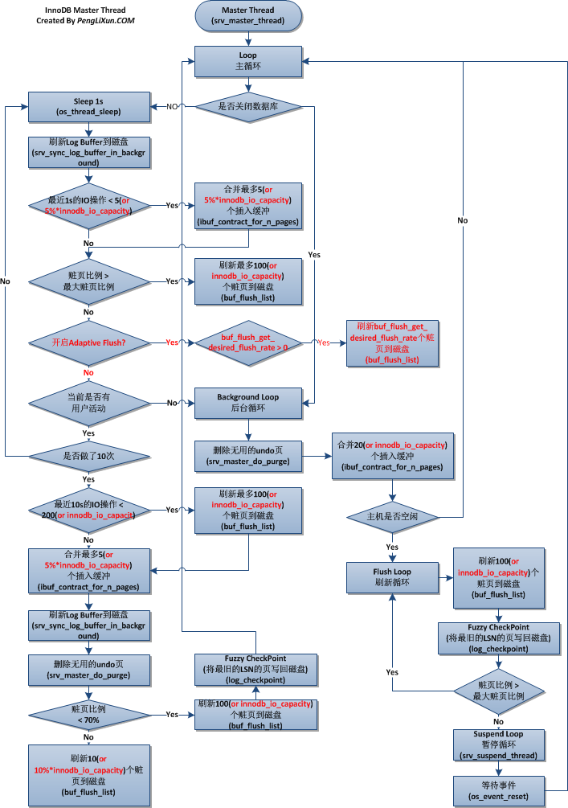

## 概述
- innodb由 innobase oy公司开发，该公司2006年被Oracle收购
- windows下mysql默认引擎
- innodb默认后台线程有7个：4个IO 线程，1个mater 线程，一个锁监控线程，一个错误监控线程。
- linux下不可调整，但windows下由参数innodb_file_io_threads控制，默认为4
- mariadb 5.6使用的是innodb plugin版本， 有两个参数：innodb_read_io_threads 和innodb_write_io_threads，默认都是4

```
> show engine innodb status \G
*************************** 1. row ***************************
  Type: InnoDB
  Name: 
Status: 
=====================================
190528 10:11:04 INNODB MONITOR OUTPUT
=====================================
Per second averages calculated from the last 4 seconds
-----------------
BACKGROUND THREAD
-----------------
srv_master_thread loops: 28920 1_second, 28920 sleeps, 2632 10_second, 2605 background, 2605 flush
srv_master_thread log flush and writes: 84012
----------
SEMAPHORES
----------
OS WAIT ARRAY INFO: reservation count 6728, signal count 2099
Mutex spin waits 551, rounds 24090, OS waits 666
RW-shared spins 11899, rounds 359427, OS waits 5153
RW-excl spins 680, rounds 27240, OS waits 849
Spin rounds per wait: 43.72 mutex, 30.21 RW-shared, 40.06 RW-excl
--------
FILE I/O
--------
I/O thread 0 state: waiting for completed aio requests (insert buffer thread)
I/O thread 1 state: waiting for completed aio requests (log thread)
I/O thread 2 state: waiting for completed aio requests (read thread)
I/O thread 3 state: waiting for completed aio requests (read thread)
I/O thread 4 state: waiting for completed aio requests (read thread)
I/O thread 5 state: waiting for completed aio requests (read thread)
I/O thread 6 state: waiting for completed aio requests (write thread)
I/O thread 7 state: waiting for completed aio requests (write thread)
I/O thread 8 state: waiting for completed aio requests (write thread)
I/O thread 9 state: waiting for completed aio requests (write thread)
Pending normal aio reads: 0 [0, 0, 0, 0] , aio writes: 0 [0, 0, 0, 0] ,
 ibuf aio reads: 0, log i/o's: 0, sync i/o's: 0
Pending flushes (fsync) log: 0; buffer pool: 0
11840490 OS file reads, 5084 OS file writes, 3179 OS fsyncs
0.00 reads/s, 0 avg bytes/read, 0.00 writes/s, 0.00 fsyncs/s
-------------------------------------
INSERT BUFFER AND ADAPTIVE HASH INDEX
-------------------------------------
Ibuf: size 1, free list len 3, seg size 5, 0 merges
merged operations:
 insert 0, delete mark 0, delete 0
discarded operations:
 insert 0, delete mark 0, delete 0
Hash table size 18749, node heap has 20 buffer(s)
0.00 hash searches/s, 0.00 non-hash searches/s
---
LOG
---
Log sequence number 3353109338
Log flushed up to   3353109338
Last checkpoint at  3353109338
Max checkpoint age    7782360
Checkpoint age target 7539162
Modified age          0
Checkpoint age        0
0 pending log writes, 0 pending chkp writes
1628 log i/o's done, 0.00 log i/o's/second
----------------------
BUFFER POOL AND MEMORY
----------------------
Total memory allocated 9699328; in additional pool allocated 0
Total memory allocated by read views 104
Internal hash tables (constant factor + variable factor)
    Adaptive hash index 481888 	(149992 + 331896)
    Page hash           10216 (buffer pool 0 only)
    Dictionary cache    567241 	(38992 + 528249)
    File system         83536 	(82672 + 864)
    Lock system         24528 	(24152 + 376)
    Recovery system     0 	(0 + 0)
Dictionary memory allocated 528249
Buffer pool size        575
Buffer pool size, bytes 9420800
Free buffers            0
Database pages          555
Old database pages      184
Modified db pages       0
Pending reads 0
Pending writes: LRU 0, flush list 0, single page 0
Pages made young 16155573, not young 0
0.00 youngs/s, 0.00 non-youngs/s
Pages read 11840349, created 18, written 2680
0.00 reads/s, 0.00 creates/s, 0.00 writes/s
No buffer pool page gets since the last printout
Pages read ahead 0.00/s, evicted without access 0.00/s, Random read ahead 0.00/s
LRU len: 555, unzip_LRU len: 0
I/O sum[257]:cur[0], unzip sum[0]:cur[0]
--------------
ROW OPERATIONS
--------------
0 queries inside InnoDB, 0 queries in queue
1 read views open inside InnoDB
0 transactions active inside InnoDB
0 out of 1000 descriptors used
---OLDEST VIEW---
Normal read view
Read view low limit trx n:o 136FA3
Read view up limit trx id 136FA3
Read view low limit trx id 136FA3
Read view individually stored trx ids:
-----------------
Main thread process no. 9465, id 140247791478528, state: flushing log
Number of rows inserted 12, updated 768, deleted 0, read 70157795
0.00 inserts/s, 0.00 updates/s, 0.00 deletes/s, 0.00 reads/s
------------
TRANSACTIONS
------------
Trx id counter 136FA3
Purge done for trx's n:o < 136FA0 undo n:o < 0
History list length 1351
LIST OF TRANSACTIONS FOR EACH SESSION:
---TRANSACTION 0, not started
MySQL thread id 4479, OS thread handle 0x7f8df2445700, query id 51275 localhost root
show engine innodb status
----------------------------
END OF INNODB MONITOR OUTPUT
============================

```

```
-----------知识点----------------------
> show variables like "%innodb_version%"


```

## innodb 内存
#### 缓冲池（buffer pool）:innodb_buffer_pool_size
1. 占最大内存部分
2. innodb工作方式：先读取页文件（16K）到buffer pool，按照LRU算法保留缓存数据；先修改缓冲池的数据（即脏页），然后flush到文件

```
> show engine innodb status\G;
………………
………………
Buffer pool size        575
Buffer pool size, bytes 9420800
Free buffers            0
Database pages          537
Old database pages      178
Modified db pages       0

```
3. 缓存的内容有索引页，数据页，undo页，插入缓冲，自适应哈希索引，innodb的锁信息，数据字典（data dictionary）等

- 重做日志缓冲池（redo log buffer  pool）:innodb_log_buffer_size
1. 将重做日志放入这个内存区，按照一定的频率刷新到重做日志文件
2. 频率一般为1秒一次

#### 额外内存池（additional memory pool）:innodb_additional_mem_pool_size
1. 对一些数据结构分配内存时，需要从额外内存池申请，若不够，则从缓冲池申请
2. 每个缓冲池的帧缓冲（frame buffer）以及对应的缓冲控制对象（记录了LRU，锁，等待等方面的信息），需要从额外缓冲池申请
3. 因此，申请了很大的innodb 缓冲池，则对应需要增加额外内存池

## master thread
#### innodb的主要工作是在master thread中完成的



#### 优先级别最高
#### 由主循环（main loop），后台循环（background loop），刷新循环（flush loop），暂停循环（suspend loop）组成
- main loop：大部分操作都在其中，有每秒操作和每10秒操作的两个循环<p>
**每秒操作**
---
1. 日志缓冲刷新到磁盘，即使事务还没提交（总是）<p>
==所以再大的事务提交也是很快的==
2. 合并插入缓冲（可能）
并非必然发生；如果当前1秒内发生IO小于5次，则认为IO压力小，可合并插入缓冲
3. 至多刷新100个innodb缓冲池脏页到磁盘（可能）
4. 如果没有用户活动，切换到background loop（可能）<p>
**10秒操作**
---
1. 刷新100个脏页到磁盘（可能）
2. 合并至多5个插入缓冲（总是）
3. 将日志缓冲刷到磁盘（总是）
4. 删除无用的undo页（总是）
5. 刷新100个或者10个脏页到磁盘（总是）
6. 产生一个检查点（总是）
基本流程：
1. innodb判断过去的10秒内磁盘IO是否小于200次（小于200次说明当前磁盘IO能力足够）
2. 如果是，刷新100个脏页到磁盘，合并插入缓冲，并且日志缓冲刷新到磁盘
3. innodb执行full purge操作删除无用的undo页
4. innodb判断缓冲池中的脏页比例，如果大于70%，刷100个到磁盘；如果小于70%，刷10个
5. innodb产生一个checkpoint检查点，即模糊检查点（fuzzy checkpoint），将最老的LSN的页刷入磁盘（非全部脏页）

- background loop<p>
数据库空闲时会切换到background loop
1. 删除无用的undo页（总是）
2. 合并20个插入缓冲（总是）
3. 跳回到主循环（总是）
4. 不断刷新100个页，直到符合条件（可能。跳转到flush loop完成）
- suspend loop<p>
fluash loop也没有什么事情了，innodb会切换到suspend loop

##### master thread 的问题以及解决方法
- ==硬编码，缺乏弹性==，在压力大的数据库中，可能每秒产生大于100个脏页或者20个插入缓冲
- innodb plugin提供了 innodb_io_capacity 参数（默认值200），修改刷新页数量
1. 合并插入缓冲时，数量为innodb_io_capacity 的5%
2. 从缓冲区刷脏页的时候，数量为innodb_io_capacity

```
> show variables like "%capacity%";
+--------------------+-------+
| Variable_name      | Value |
+--------------------+-------+
| innodb_io_capacity | 200   |
+--------------------+-------+

MySQL 8
> show variables like "%innodb_io_capacity%";
+------------------------+-------+
| Variable_name          | Value |
+------------------------+-------+
| innodb_io_capacity     | 200   |
| innodb_io_capacity_max | 2000  |
+------------------------+-------+
2 rows in set (0.01 sec)

```

- innodb_max_dirty_pages_pct 值为90%，太大。innodb plugin修改为75%

```
> show variables like "%dirty%";
+----------------------------+-------+
| Variable_name              | Value |
+----------------------------+-------+
| innodb_max_dirty_pages_pct | 75    |
+----------------------------+-------+

```
- innodb_adaptive_flushing （自适应刷新，每秒刷新脏页数量）
原规则：如果脏页比例小于innodb_max_dirty_pages_pct，不刷新脏页；否则，刷新100个脏页
新规则：通过函数判断

```
> show variables like "%flushing%";
+---------------------------------+----------+
| Variable_name                   | Value    |
+---------------------------------+----------+
| innodb_adaptive_flushing        | ON       |
| innodb_adaptive_flushing_method | estimate |
+---------------------------------+----------+

```

## 关键特性
#### 插入缓冲
- 对于非聚集索引，并非每一次直接插入到索引页中，而是先判断非聚集索引页是否在缓冲池中
- 如果在，则直接插入；若不在，则先放入到插入缓冲池中，然后以一定的频率执行插入缓冲和非聚集索引页的合并操作<p>
  条件：
  1. 索引是非辅助索引
  2. 索引不是唯一

```
> show engine innodb status\G;
*************************** 1. row ***************************
  Type: InnoDB
  Name: 
Status: 

……
-------------------------------------
INSERT BUFFER AND ADAPTIVE HASH INDEX
-------------------------------------
Ibuf: size 1, free list len 3, seg size 5, 0 merges
merged operations:
 insert 0, delete mark 0, delete 0
discarded operations:
 insert 0, delete mark 0, delete 0

……

```
seg size：当前插入缓冲大小（单位：页，即16kb）
free list len：空闲列表长度
size： 已经合并记录页的数量
inserts： 插入的记录数
merges：合并的次数
merge recs： 合并页的数量

merges : merge recs 代表插入缓冲对非聚集索引的IO请求降低的次数比
- 插入缓冲可能导致占用太多缓存池内存，（percona）使用ibuff_pool_size_per_max_size控制
#### 两次写

共享表空间为2个区（extent），128个页，共2M
- 两次写提升可靠性
- 部分写失效：数据库宕机的时候，可能出现页未写完的情况
- 两次写步骤：
1. 缓冲池的脏页刷新时，通过memcpy拷贝到double write buffer
2. 通过double write buffer 分两次，每次1MB到的共享表空间磁盘，然后fsync函数同步到磁盘（顺序写，性能好）
3. double write页完成后，再将souble write buffer中的页写入到表空间的文件中（离散写）
4. 查看double write 命令如下：
```
> show global status like "%dblw%";
+----------------------------+-------+
| Variable_name              | Value |
+----------------------------+-------+
| Innodb_dblwr_pages_written | 7928  |
| Innodb_dblwr_writes        | 2394  |
+----------------------------+-------+

```
- 如果Innodb_dblwr_pages_written / Innodb_dblwr_writes 远小于64，说明压力不是很大
- skip_innodb_double_writer可以禁止double write
- 在一些已经有防止写失效的文件系统（zfs），可以关闭double write
#### 自适应哈希索引

1. innodb会监控表上索引的查找，如果观察到建立哈希索引可以带来速度的提升，则会自动建立，即“自适应”
2. 自适应哈希索引通过缓冲池的B+树构造而来，建立速度很快
3. innodb会根据访问的频率和模式来为**某些页**建立哈希索引

```
> show engine innodb status \G;
……………………
Hash table size 18749, node heap has 38 buffer(s)
0.00 hash searches/s, 0.00 non-hash searches/s

……………………
```

## 启动、关闭与恢复
- innodb_fast_shutdown
1. 取值可为0，1，2
2. 0代表需要完成full purge 和 merge insert buffer ，耗时较长
3. 1代表不需要full purge 和 merge insert buffer，但需要刷缓冲池脏页
4. 不需要full purge 和 merge insert buffer，也不需要刷缓冲池脏页，将日志写入日志文件，下次启动做recovery
- innodb_force_recovery
1. 默认为0，恢复时做所有恢复操作
2. 如果恢复失败，比如数据页corruption，mysql会宕机，写错误日志
3. 为1：SRV_FORCE_IGNORE_CORRUPT：忽略corrupt页
4. 为2: SRV_FORCE_NO_BACKGROUND：组织主线程执行，如果主线程需要执行full purge操作，则会crash
5. 为3：SRV_FORCE_NO_TRX_UNDO：不执行事务回滚
6. 为4：SRV_FORCE_NO_IBUF_MERGE：不执行插入缓冲合并
7. 为5：SRV_FORCE_NO_UNDO_LOG_SCAN：不查看撤销日志（undo log），把未提交的事务视为已提交
8. 为6：SRV_FORCE_NO_LOG_REDO：不执行前滚操作
9. 如果不为0，可以执行select，create，drop，但insert，update，delete不可


## innodb plugin
- 从mysql5.1.38，包含两个innodb引擎：build-in innodb，1.0.4的innodb
- 新功能：
1. 快速的索引重建
2. 更好的多核性能
3. 新的页结构
4. 页压缩功能
5. 更好的blob处理能力
