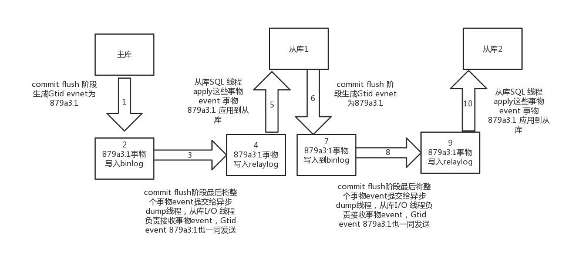

本文来自：
1. https://blog.csdn.net/weixin_33804990/article/details/91697873
2. https://www.jianshu.com/p/87f66cdeb49c
## 简述

-  从MySQL5.6开始增加了强大的**GTID（Global Transaction ID，全局事务ID）**这个特性，用来强化数据库的主备一致性， 故障恢复， 以及容错能力 

-  借助GTID，在发生主备切换的情况下，MySQL的其他slave可以自动在新主上找到正确的复制位置， 这大大简化了复杂复制拓扑下集群的维护，也减少了人为设置复制position发生误操作的风险。另外，基于GTID的复制可以忽略已经执行过的事务，减少了数据发生不一致的风险 

## GTID 结构
#### GTID 组成
- GTID是由server_uuid和事务id组成的，即GTID=server_uuid:transaction_id 
1. server_uuid，是在MySQL第一次启动时自动生成并持久化到auto.cnf文件（存放在数据目录下），每台机器的server_uuid都不一样

2. transaction_id，是一个从1开始的自增计数，表示在这个主库上执行的第n个事务。MySQL会保证事务与GTID之间的1:1映射，如：b6af5b5c-666f-11e9-bed3-000c29b85ea6:1

3. 一组连续的事务可以用 "-" 连接的事务序号范围表示。例如：b6af5b5c-666f-11e9-bed3-000c29b85ea6:1-5

4. GTID生命周期：整个生命周期中整个事务的Gtid号是没有改变的

 

#### server_uuid的生成
- server_uuid实际上是一个32字节+1字节(/0)的字符串。Mysql启动的时候会调用init_server_auto_options() 读取auto.cnf文件。如果没有读取到则调用generate_server_uuid()调用生成一个server_id
