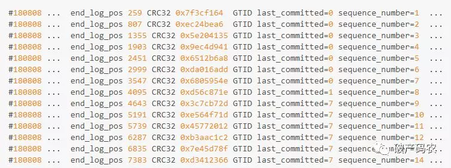
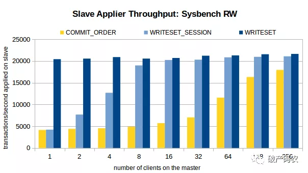
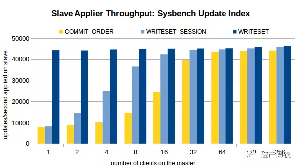
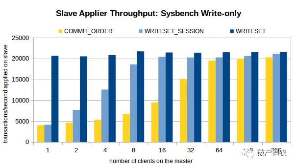

来源：https://www.cnblogs.com/wshenjin/p/10191786.html
姜承尧：速度提升5~10倍，基于WRITESET的MySQL并行复制 #M1013#（https://mp.weixin.qq.com/s/oj-DzpR-hZRMMziq2_0rYg）
## 简述

MySQL从5.6版本开始支持并行复制机制，官方称为：MTS（Multi-Thread Slave），经过几个版本的迭代，目前MTS支持以下几种机制：

| 版本       | MTS机制                     | 实现原理               |
| :--------- | :-------------------------- | :--------------------- |
| 5.6        | Database                    | 基于库级的并行复制     |
| 5.7        | COMMIT_ORDER                | 基于组提交的并行复制   |
| **5.7.22** | WRITESET / WRITESET_SESSION | 基于WRITESET的并行复制 |

#### 基于库级的并行复制

-   MySQL5.6的并行复制是库(schema)级别的，从库为每个库(schema)分配一个线程以此来提高复制效率 

- 基于Database级别的并行复制效果并不特别好，因为大多数生产的架构依然习惯于单库多表的架构，这种情况下MTS依然还是单线程的效果。

- 但Database级别并行复制的好处是可以兼容任何二进制日志，从机都可以进行库级别的并行回放。 

- 在MySQL 5.6版本之前，Slave服务器上有两个线程I/O线程和SQL线程。I/O线程负责接收二进制日志（更准确的说是二进制日志的event），SQL线程进行回放二进制日志。

- MySQL5.6开启并行复制时，从库SQL线程就变为了**coordinator线程**，coordinator线程主要负责以下两部分的内容：
1. 判断可以并行执行，那么选择worker线程执行事务的二进制日志
2. 判断不可以并行执行，如该操作是DDL，亦或者是事务跨schema操作，则等待所有的worker线程执行完成之后，再执行当前的日志。
- 这意味着coordinator线程并不是仅将日志发送给worker线程，自己也可以回放日志，但是所有可以并行的操作交付由worker线程完成。coordinator线程与worker是典型的生产者与消费者模型。

#### MySQL 5.7 基于组提交（LOGICAL_CLOCK）的并行复制

- MySQL5.7的并行复制是基于组提交（LOGICAL_CLOCK），主要思想是一个**组提交的事务都是可以并行回放到从**，原理是基于锁的冲突检测，因为这些事务都已进入到事务的prepare阶段，则说明事务之间没有任何冲突（否则就不可能提交）。 

-  MySQL5.7并行复制引入了两个值**last_committed**和**sequence_number**。last_committed表示事务提交的时候，上次事务提交的编号，在主库上同时提交的事务设置成相同的last_committed。如果事务具有相同的last_committed，表示这些事务都在一组内，可以进行并行的回放 

-  并发线程执行不同的事务只要在同一时刻能够commit（说明线程之间没有锁冲突），那么master节点就可以将这一组的事务标记并在slave机器上安全的进行并发重放主库提交的事务 

-  在代码实现中，同一组的事务拥有同一个parent_commit（父亲），在二进制日志中可以看到类似如下的内容: 

 

- last_commit相同可视为具有相同的parent_commit

- MySQL 5.7还做了额外的优化，思想是LOCK-BASED，即如果两个事务有**重叠**，则两个事务的锁依然是没有冲突的，依然可以并行回放 
- 如何知道事务是否在一组：
1. 在MySQL 5.7是将组提交的信息存放在GTID中。
2. 那么如果用户没有开启GTID功能，MySQL 5.7又引入了称之为Anonymous_Gtid的二进制日志event类型

##### 配置
-  为了兼容MySQL 5.6基于库的并行复制，5.7引入了新的变量**slave-parallel-type**，其可以配置的值有：
1. DATABASE：默认值，基于库的并行复制方式
2. LOGICAL_CLOCK：基于组提交的并行复制方式
- 主端相关参数：
1. binlog_group_commit_sync_delay：表示binlog提交后等待延迟多少时间再同步到磁盘，单位是微秒，默认0，不延迟。设置延迟可以让多个事务在同一时刻提交，提高binlog组提交的并发数和效率，从而提高slave的吞吐量
2. binlog_group_commit_sync_no_delay_count：表示在等待上面参数超时之前，如果有足够多的事务，则停止等待直接提交。单位是事务数，默认0。
- 从端参数：
1. slave_parallel_workers：设置为0，则MySQL 5.7退化为原单线程复制；设置为1，则SQL线程功能转化为coordinator线程，但是只有1个worker线程进行回放，也是单线程复制，性能反而比0还要差
2. slave_preserve_commit_order：slave上应用事务的顺序是无序的，和relay log中记录的事务顺序不一样，这样数据一致性是无法保证，所以需要开启slave_preserve_commit_order=1（此时slave_parallel_type只能是LOGICAL_CLOCK）


-  COMMIT_ORDER的并行复制机制需要有一个条件：每组提交事务要足够多，，业务量要足够大。但是当你的业务量比较小，并发度不够时，基于COMMIT_ORDER的并行复制依然会退化为单线程复制 
-  参数binlog_group_commit_sync_delay、binlog_group_commit_sync_no_delay_count来优化组提交的效率，但最终的效果其实并不理想 

## 基于写集合的并行复制
- writeset的思想是：不同事务的不同记录不重叠，则都可在从机上并行回放，可以看到并行的力度从组提交细化为记录级。原理：
1. MySQL 会对这个提交的事务中的一行记录做一个 HASH值，这些 HASH 值称为 writeset。
2. writeset会存入一张 HASH 表。其他事务提交时会检查这张 HASH 表中是否有相同的记录，如果不相同，则视为同组，如果有相同，则视为不同组。
3. 不同的记录，在MySQL中用WriteSet对象来记录每行记录，从源码来看WriteSet就是每条记录hash后的值（必须开启ROW格式的二进制日志），具体算法如下：
```
WriteSet=hash(index_name | db_name | db_name_length | table_name | table_name_length | value | value_length)

```
* index_name只记录唯一索引，主键也是唯一索引。
* 如果有多个唯一索引，则每条记录会产生对应多个WriteSet值。
* 另外，Value这里会分别计算原始值和带有Collation值的两种WriteSet
所以一条记录可能有多个WriteSet对象

#### 配置

- master端
```
[mysqld]
transaction_write_set_extraction=XXHASH64
binlog_transaction_dependency_tracking=WRITESET
```

- slave端

```
#slave
slave-parallel-type = LOGICAL_CLOCK

slave-parallel-workers = 32
```

  

- 参数transaction_write_set_extraction用来选择hash函数，推荐设置为XXHASH64，相比MURMUR32有更好的散列性 

-  产生的WriteSet对象会插入到WriteSet哈希表，哈希表的大小由参数binlog_transaction_dependency_history_size设置，默认25000。

- WriteSet哈希表的类型为std::map<uint64,int64>，保存每条记录的WriteSet值和对应的sequence_number 

#### 优劣对比

- WriteSet的性能比Commit_Order要快5~6倍，效果非常明显。如果是有延迟要追的，WriteSet毫无疑问是胜者。

- Commit_Order的瓶颈依然是需要主有足够的并发度，实际生产上确很难达到，除非是业务高峰期 

    

    

    