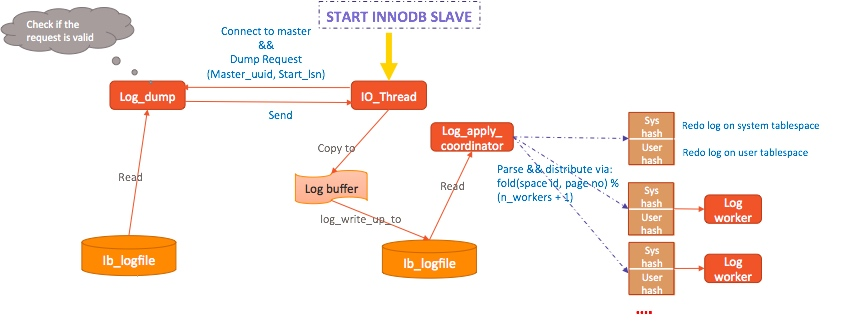

## 原生复制

- MySQL的每条读写事务都需要维持两份日志，一份是redo log，一份是binary log。

- MySQL使用两阶段提交协议，只有当redo 和binlog都写入磁盘时，事务才算真正的持久化了。

- 如果只写入redo，未写入binlog，这样的事务在崩溃恢复时需要回滚掉。

- MySQL通过XID来关联InnoDB的事务和binlog

-  MySQL的原生事务日志复制的优点 

1. Binary Log更加可读，有成熟的配套工具来进行解析。

2. 由于记录了行级别的更改，我们可以通过解析binlog，转换成DML语句来将数据变更同步到异构数据库 

3. 由于Binary log是一种统一的日志格式，你可以在主备上使用不同的存储引擎，例如当你需要测试某种新的存储引擎时，你可以搭建一个备库，将所有表alter到新引擎，然后开启数据复制进行观察 

4.  基于Binary Log你还可以构建起非常复杂的复制拓扑结构，尤其是在引入了GTID之后，这种优势尤为明显: 如果设计妥当，你可以实现相当复杂的复制结构。甚至可以做到多点写入 

     

- MySQL的原生事务日志复制的缺点

1.  MySQL需要记录两份日志：redo及binlog，只有当两份日志都fsync到磁盘，我们才能认为事务是持久化的，而众所周知，fsync是一种开销非常昂贵的操作。更多的日志写入还增加了磁盘IO压力。这两点都会影响到响应时间和吞吐量 

2.  Binlog复制还会带来复制延迟的问题。我们知道只有主库事务提交后，日志才会写入到binlog文件并传递到备库，这意味着备库至少延迟一个事务的执行时间 

3.  有些操作例如DDL，大事务等等，由于在备库需要继续保持事务完整性，这些执行时间很长的操作会长时间占用某个worker线程，而协调线程会碰到复制同步点，导致后续的任务无法分发到其他空闲的worker线程 

## 物理复制优点

-  当我们实现了物理复制后，就可以关闭binlog和gtid，大大减少了数据写盘量。这种情况下，最多只需要一次fsync既可以将事务持久化到磁盘。实例整体的吞吐量和响应时间都得到了非常大的提升 

-  通过物理复制，我们能获得更加理想的物理复制性能。事务在执行过程中产生的redo log只要写到文件中，就会被传送到备库。这意味着我们可以同时在主备库上执行事务，而无需等待主库上执行完成。

- 我们可以基于(space_id, page_no)来进行并发apply，同一个page上的变更也可以做到合并写操作，相比传统复制，具有更好的并发性。

- 最重要的是，基于物理变更的复制，可以最大程度保证主备的数据总是一致的。 

## 复制架构和原理

    

- 我们在备库上配置好连接后，执行START INNODB SLAVE，备库上会开启一个io线程，同时InnoDB层启动一个Log Apply协调线程以及多个worker线程。
- IO线程建立和主库的连接，并发送一个dump请求，请求的内容包括：
  1. master_uuid: 最近备库上日志最初产生所在的实例的server_uuid
  2. start_lsn: 开始复制的点

- 在主库上，一个log_dump线程被创建，先检查dump请求是否是合法的，如果合法，就去从本地的ib_logfile中读取日志，并发送到备库。
- 备库IO线程在接受到日志后，将其拷贝到InnoDB的Log Buffer中，然后调用log_write_up_to将其写入到本地的ib_logfile文件中。
- Log Apply协调线程被唤醒，从文件中读取日志进行解析，并根据fold(space id ,page no)% (n_workers + 1)进行分发，系统表空间的变更存放到sys hash中，用户表空间的变更存储到user hash中。协调线程在解析&&分发完毕后，也会参与到日志apply中。
- 当Apply日志时，我们总是先应用系统表空间，再是用户表空间。原因是我们需要保证undo日志先应用，否则外部查询检索用户表的btree，试图通过回滚段指针查询undo page，可能对应的Undo还没构成。

#### 日志管理

-  原生逻辑中，InnoDB采用循环写文件的方式 
-  在物理复制架构下，我们需要保留老的日志文件，这些文件既可以防止例如网络出现问题，日志未曾及时传送到备库，也可以用于备份目的 