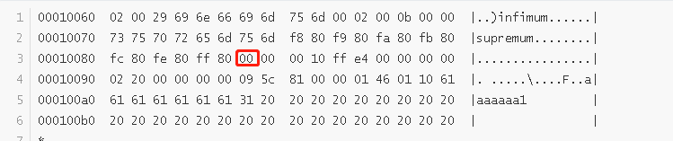
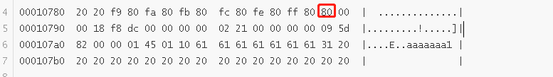
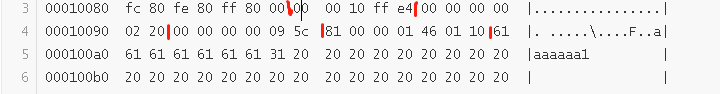
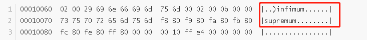

本文以compact为例，分析mysql的行格式

## 创建表并插入数据

```
create table test_rowformat(a char(255),b char(254) ,c int,d char(252),e char(251),f char(250),g char(249),h char(248)) ROW_FORMAT=compact;
insert into test_rowformat values('aaaaaaa1','bbbbbbb2',1,'ddddddd4','eeeeeee5','fffffff6','ggggggg7','hhhhhhh8');
```

## 使用hexdump查看二进制文件

为了保证可以单独查看我们的表，需要保证该表有单独的一个文件。这就需要设置参数

```
mysql> show variables like "%per_table%";
+-----------------------+-------+
| Variable_name         | Value |
+-----------------------+-------+
| innodb_file_per_table | ON    |
+-----------------------+-------+
1 row in set (0.01 sec)

```

保证每一个表都单独的一个文件

我们进入到目录下查看该文件

```
hexdump -C test_rowformat.ibd
```

-C表示可以同时查看ascii和16进制格式

```
00010060  02 00 29 69 6e 66 69 6d  75 6d 00 02 00 0b 00 00  |..)infimum......|
00010070  73 75 70 72 65 6d 75 6d  f8 80 f9 80 fa 80 fb 80  |supremum........|
00010080  fc 80 fe 80 ff 80 00 00  00 10 ff e4 00 00 00 00  |................|
00010090  02 20 00 00 00 00 09 5c  81 00 00 01 46 01 10 61  |. .....\....F..a|
000100a0  61 61 61 61 61 61 31 20  20 20 20 20 20 20 20 20  |aaaaaa1         |
000100b0  20 20 20 20 20 20 20 20  20 20 20 20 20 20 20 20  |                |
*
00010190  20 20 20 20 20 20 20 20  20 20 20 20 20 20 62 62  |              bb|
000101a0  62 62 62 62 62 32 20 20  20 20 20 20 20 20 20 20  |bbbbb2          |
000101b0  20 20 20 20 20 20 20 20  20 20 20 20 20 20 20 20  |                |
*
00010290  20 20 20 20 20 20 20 20  20 20 20 20 80 00 00 01  |            ....|
000102a0  64 64 64 64 64 64 64 34  20 20 20 20 20 20 20 20  |ddddddd4        |
000102b0  20 20 20 20 20 20 20 20  20 20 20 20 20 20 20 20  |                |
*
00010390  20 20 20 20 20 20 20 20  20 20 20 20 65 65 65 65  |            eeee|
000103a0  65 65 65 35 20 20 20 20  20 20 20 20 20 20 20 20  |eee5            |
000103b0  20 20 20 20 20 20 20 20  20 20 20 20 20 20 20 20  |                |
*
00010490  20 20 20 20 20 20 20 66  66 66 66 66 66 66 36 20  |       fffffff6 |
000104a0  20 20 20 20 20 20 20 20  20 20 20 20 20 20 20 20  |                |
*
00010590  20 67 67 67 67 67 67 67  37 20 20 20 20 20 20 20  | ggggggg7       |
000105a0  20 20 20 20 20 20 20 20  20 20 20 20 20 20 20 20  |                |
*
00010680  20 20 20 20 20 20 20 20  20 20 68 68 68 68 68 68  |          hhhhhh|
00010690  68 38 20 20 20 20 20 20  20 20 20 20 20 20 20 20  |h8              |
000106a0  20 20 20 20 20 20 20 20  20 20 20 20 20 20 20 20  |                |
*
00010780  20 20 00 00 00 00 00 00  00 00 00 00 00 00 00 00  |  ..............|
00010790  00 00 00 00 00 00 00 00  00 00 00 00 00 00 00 00  |................|
*
00013ff0  00 00 00 00 00 70 00 63  d8 fd 25 7c 01 15 7d 7b  |.....p.c..%|..}{|
00014000  00 00 00 00 00 00 00 00  00 00 00 00 00 00 00 00  |................|
*
0001c000

```

从数据上可以看到以下内容

1. 行格式如下：

   字段列表|null值列表|记录头信息|row_id|trx_id|roll_pointer|列1的值|列2的值|……|列n的值

2. 字段列表和定义顺序是逆序

   

   a字段是255长度，即ff，也就是红色方框中最后一个ff80表示的是a字段

3. 显示是否为null的字节顺序为逆序

   

   如果位为0，表示该位对应的字段不为空，否则为1

   00表示当前所有字段不为空。如果插入以下内容

   ```
   insert into test_rowformat values('aaaaaaa1','bbbbbbb2',1,'ddddddd4','eeeeeee5','fffffff6','ggggggg7',NULL);
   ```

   

   80二进制为10000000，最高位为1，而我们实际上是最后一个字段为空。说明是逆序的

   如果插入下面的值

   ```
   insert into test_rowformat values('aaaaaaa1','bbbbbbb2',1,'ddddddd4','eeeeeee5','fffffff6',NULL,'hhhhhhh8');
   ```

   则原来80的位置会显示40.

4. 记录头信息为5字节，row_id为6字节，trx_id为6字字节，roll_pointer为7字节

   

   其中00 00 10 ff e4是记录头部。记录头部格式为

   名称|大小（位）|描述
   ---|---|---
   预留位|1|没有使用
   预留位|1|没有使用
   delete_flag|1|标记该记录是否被删除
   min_rec_flag|1|B+树每层非叶子节点中最小目录项记录会添加该标记
   n_owned|4|
   heap_no|13|表示当前记录在页面中的相对位置
   record_type|3|表示记录类型。0为普通记录，1表示B+树非叶子节点记录，2是infimum记录，3是supremum记录
   next_record|16|下一条记录的相对位置

   那么对应起来看，delete_flag为0，说明该记录是并未被删除，可以查询得到。heap_no为0010（即0000 0000 0001 0000）的前13位，即0000 0000 00010，即2.为何不是1呢？因为infimum记录的heap_no是0，supremum的heap_no是1。record_type是000（二进制），说明是普通记录。

   row_id是00 00 00 00 02 20，trx_id是00 00 00 00 09 5c与当前transaction值比较接近（基本不会一样，因为事务是动态的，一直在递增，当前事务号一般大于该记录的事务号），roll_pointer是回滚指针。这三个列都是隐藏列，在查询的时候不会显示。

5. 对于char并未充满的字节，以空格填充（16进制的ascii码为20）

6. 关于infimum和supremum

   infimum和supremum的格式是【记录头（5字节） + infimum单词】，【记录头（5字节） + supremum单词】

   如图

   

   infimum的记录头是01 00 02 00 29。heap_no是00 02（即0000 0000 0000 0010）的前13位，0，说明是infimum记录。

   supremum的记录头是02 00 0b 00 00。同样可以得到heap_no是1，record_type是3，下一条记录是0（即无下一条记录）。

## dynamic格式

与compact很类似，主要还是在溢出页的处理上