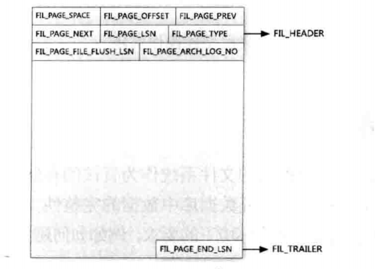
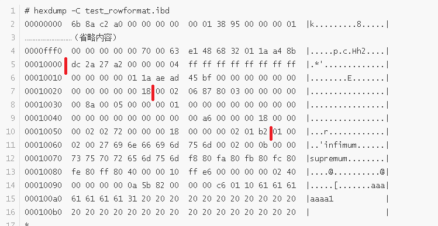

## 创建基本环境

创建表，添加一条记录

```

mysql> create table test_rowformat(a char(255),b char(254) ,c int,d char(252),e char(251),f char(250),g char(249),h char(248)) ;
Query OK, 0 rows affected (0.86 sec)

mysql> insert into test_rowformat values('aaaaaaa1','bbbbbbb2',1,'ddddddd4','eeeeeee5','fffffff6',NULL,'hhhhhhh8');
Query OK, 1 row affected (0.07 sec)

```

也就是当前表是新创建的，只有一条记录。我们就分析只有一条记录的页。

使用hexdump查看文件内容

```
# hexdump -C test_rowformat.ibd
00000000  6b 8a c2 a0 00 00 00 00  00 01 38 95 00 00 00 01  |k.........8.....|
…………………………（省略内容）
0000fff0  00 00 00 00 00 70 00 63  e1 48 68 32 01 1a a4 8b  |.....p.c.Hh2....|
00010000  dc 2a 27 a2 00 00 00 04  ff ff ff ff ff ff ff ff  |.*'.............|
00010010  00 00 00 00 01 1a ae ad  45 bf 00 00 00 00 00 00  |........E.......|
00010020  00 00 00 00 00 18 00 02  06 87 80 03 00 00 00 00  |................|
00010030  00 8a 00 05 00 00 00 01  00 00 00 00 00 00 00 00  |................|
00010040  00 00 00 00 00 00 00 00  00 a6 00 00 00 18 00 00  |................|
00010050  00 02 02 72 00 00 00 18  00 00 00 02 01 b2 01 00  |...r............|
00010060  02 00 27 69 6e 66 69 6d  75 6d 00 02 00 0b 00 00  |..'infimum......|
00010070  73 75 70 72 65 6d 75 6d  f8 80 fa 80 fb 80 fc 80  |supremum........|
00010080  fe 80 ff 80 40 00 00 10  ff e6 00 00 00 00 02 40  |....@..........@|
00010090  00 00 00 00 0a 5b 82 00  00 00 c6 01 10 61 61 61  |.....[.......aaa|
000100a0  61 61 61 61 31 20 20 20  20 20 20 20 20 20 20 20  |aaaa1           |
000100b0  20 20 20 20 20 20 20 20  20 20 20 20 20 20 20 20  |                |
*
00010190  20 20 20 20 20 20 20 20  20 20 20 20 62 62 62 62  |            bbbb|
000101a0  62 62 62 32 20 20 20 20  20 20 20 20 20 20 20 20  |bbb2            |
000101b0  20 20 20 20 20 20 20 20  20 20 20 20 20 20 20 20  |                |
*
00010290  20 20 20 20 20 20 20 20  20 20 80 00 00 01 64 64  |          ....dd|
000102a0  64 64 64 64 64 34 20 20  20 20 20 20 20 20 20 20  |ddddd4          |
000102b0  20 20 20 20 20 20 20 20  20 20 20 20 20 20 20 20  |                |
*
00010390  20 20 20 20 20 20 20 20  20 20 65 65 65 65 65 65  |          eeeeee|
000103a0  65 35 20 20 20 20 20 20  20 20 20 20 20 20 20 20  |e5              |
000103b0  20 20 20 20 20 20 20 20  20 20 20 20 20 20 20 20  |                |
*
00010490  20 20 20 20 20 66 66 66  66 66 66 66 36 20 20 20  |     fffffff6   |
000104a0  20 20 20 20 20 20 20 20  20 20 20 20 20 20 20 20  |                |
*
00010580  20 20 20 20 20 20 20 20  20 20 20 20 20 20 20 68  |               h|
00010590  68 68 68 68 68 68 38 20  20 20 20 20 20 20 20 20  |hhhhhh8         |
000105a0  20 20 20 20 20 20 20 20  20 20 20 20 20 20 20 20  |                |
*
00010680  20 20 20 20 20 20 20 00  00 00 00 00 00 00 00 00  |       .........|
00010690  00 00 00 00 00 00 00 00  00 00 00 00 00 00 00 00  |................|
*
00013ff0  00 00 00 00 00 70 00 63  dc 2a 27 a2 01 1a ae ad  |.....p.c.*'.....|
00014000  00 00 00 00 00 00 00 00  00 00 00 00 00 00 00 00  |................|
*
0001c000

```

## 页结构
#### 页

- innodb 访问的最小单位，默认16KB，由 UNIV_PAGE_SIZE 定义
  

| innodb的页结构                     | 说明                                                         |
| ---------------------------------- | ------------------------------------------------------------ |
| file header（文件头）              | 8部分，38字节<br>fil_page_space_or_checksum（4字节） mysql4.1之后表示checksum值<br>fil_page_offset（4字节）表空间中页的偏移值<br>fil_page_prev（4字节）,fil_page_next（4字节），顾名思义，表示前一个页面和后一个页面的指针<br>fil_page_LSN（8字节）该页最后修改的LSN<br>fil_page_type（2字节），页类型<br>fil_page_file_flush_LSN（8字节），在数据文件的某一个页才有，代表文件至少被更新到该LSN<br>fil_page_arch_log_no_or_space_id（4字节）mysql4.1开始代表数据页属于哪个表空间 |
| page header（页头）                | 14部分，56字节<br>PAGE_N_DIR_SLOTS（2字节） page directory 的slots数<br> PAGE_HEAP_TOP（2字节） 堆中第一个记录的指针<br> PAGE_N_HEAP（2字节）  堆中的记录数 <br> PAGE_FREE（2字节）指向空闲列表的首指针<br>PAGE_GARBAGE（2字节）已删除的字节数，即行记录结构中 delete flag为1的记录的数目<br>PAGE_LAST_INSERT（2字节） 最后插入记录的位置<br> PAGE_DIRECTION（2字节）插入的方向 <br> PAGE_N_DIRECTION（2字节）一个方向连续插入的数量<br>PAGE_N_RECS（2字节）该页中记录的数量<br> PAGE_MAX_TRX_ID（8字节）当前页的最大事务ID<br> PAGE_LEVEL（2字节）当前页在索引中的位置，0x00代表叶子节点<br> PAGE_INDEX_ID（8字节）当前页属于哪个索引ID <br> PAGE_BTR_SEG_LEAF（10字节）B+树叶节点中文件段的首指针位置，仅B+树的root页中定义<br>PAGE_BTR_SEG_TOP（10字节）B+树非叶节点中文件段的首指针位置，仅B+树的root页中定义<br> |
| infimum + supremum records         | innodb 每个数据页会有两个虚拟行记录以限定记录边界，infimum记录比任何主键还小的值，supremum记录比任何主键还大的值<br>页建立的时候创建，并任何情况都不会删除 |
| user records（用户记录，即行记录） | innodb是索引组织表                                           |
| free space（空闲空间）             | 链表数据结构；记录被删除时，会加入到空闲链表中               |
| page directory（页目录）           | 存放了记录的相对位置                                         |
| file trailer（文件结尾信息）       | 为了页面写入时候的完整性，file trailer只有8字节的FIL_PAGE_END_LSN<br>前4个字节是本页的checksum，后四个字节与 FIL_PAGE_LSN 的LSN相同<br>前4字节与fil_page_space_or_checksum比较，后4字节与FIL_PAGE_LSN比较，确认是否相同 |

- fil_page_offset 是4字节，所以一个表空间最大数据是2^32 * 页面大小（默认16kb） = 64TB
- FIL_PAGE_LSN 与FIL_PAGE_END_LSN如果一致，则页是完整的，由函数buf_page_is_corrupted判断

#### file trailer

其中file trailer用来保证页面完整性，有8个字节，前4个是页的校验和，后4个是最后修改的LSN的后4字节。在上图中，就分别对应dc 2a 27 a2   和01 1a ae ad。

#### file header

LSN不仅在页面尾部存在，也在页面首部存在。首尾参照，就可以保证页写的是完整的。

属性|大小|说明
---|---|---
fil_page_space_or_checksum|（4字节） |mysql4.1之后表示checksum值
fil_page_offset|（4字节）|表空间中页的偏移值
fil_page_prev|（4字节）|
fil_page_next|（4字节）|顾名思义，表示前一个页面和后一个页面的指针
fil_page_LSN|（8字节）|该页最后修改的LSN
fil_page_type|（2字节）|页类型
fil_page_file_flush_LSN|（8字节）|在数据文件的某一个页才有，代表文件至少被更新到该LSN
fil_page_arch_log_no_or_space_id|（4字节）|mysql4.1开始代表数据页属于哪个表空间

其中，页类型又分为以下类型：

类型|十六进制|描述
---|---|---
FIL_PAGE_TYPE_ALLOCATED|0X0000|最新分配，还未使用
FIL_PAGE_UNDO_LOG|0x0002|undo日志页
FIL_PAGE_INODE|0x0003|存储段信息
FIL_PAGE_IBUF_FREE_LIST|0x0004|change buffer空闲列表
FIL_PAGE_IBUF_BITMAP|0x0005|change buffer的一些属性
FIL_PAGE_TYPE_SYS|0x0006|存储一些系统数据
FIL_PAGE_TYPE_TRX_SYS|0x0007|事务系统数据
FIL_PAGE_TYPE_FSP_HDR|ox0008|表空间头部信息
FIL_PAGE_TYPE_XDES|0x0009|存储区的一些属性
FIL_PAGE_TYPE_BLOB|0x000A|溢出页
FIL_PAGE_INDEX|0x45bf|索引页，也就是我们说的数据页

fil_page_prev和fil_page_next将各个页面组成了一个双向链表，可以通过指针遍历。



从上图中表的二进制数据，file header可以对应到dc到18的这个部分：

fil_page_space_or_checksum是dc 2a 27 a2，

fil_page_offset是00 00 00 04，

fil_page_prev和fil_page_next都是ff ff ff ff ，

fil_page_LSN00 00 00 00 01 1a ae ad （后4字节是01 1a ae ad，与file trailer的01 1a ae ad对应），

fil_page_type是45 bf，代表索引页也就是普通页。

fil_page_file_flush_LSN在系统表空间的第一个页中定义，此处为00 00 00 00 00 00 00 00，

fil_page_arch_log_no_or_space_id是00 00 00 18

#### page header 

page header 对应的是后两个红色横杠之间的部分

属性|字节|说明
---|---|---
PAGE_N_DIR_SLOTS|（2字节）| page directory 的slots数，对应此处为00 02 
PAGE_HEAP_TOP|（2字节） |堆中第一个记录的指针，对应此处为06 87 
PAGE_N_HEAP|（2字节）| 堆中的记录数，对应此处为80 03（？） 
PAGE_FREE|（2字节）|指向空闲列表的首指针，对应此处为00 00
PAGE_GARBAGE|（2字节）|已删除的字节数，即行记录结构中 delete flag为1的记录的数目，<br>对应此处为0000，因为是新表，没有任何记录删除
PAGE_LAST_INSERT|（2字节）| 最后插入记录的位置,对应此处为00 8a 
PAGE_DIRECTION|（2字节）|插入的方向，对应此处为00 05 
PAGE_N_DIRECTION|（2字节）|一个方向连续插入的数量，对应此处为00 00
PAGE_N_RECS|（2字节）|该页中记录的数量，对应此处为00 01，即一条记录 
PAGE_MAX_TRX_ID|（8字节）|当前页的最大事务ID，该值仅在耳机索引页面中定义。对应此处为 00 00 00 00 00 00 00 00
PAGE_LEVEL|（2字节）|当前页在索引中的位置，0x00代表叶子节点，对应此处为00 00 
PAGE_INDEX_ID|（8字节）|当前页属于哪个索引ID，对应此处为00 00 00 00 00 00 00 a6 
PAGE_BTR_SEG_LEAF|（10字节）|B+树叶节点中文件段的首指针位置，仅B+树的root页中定义，对应此处为00 00 00 18 00 00 00 02 02 72
PAGE_BTR_SEG_TOP|（10字节）|B+树非叶节点中文件段的首指针位置，仅B+树的root页中定义，对应此处为00 00 00 18  00 00 00 02 01 b2
