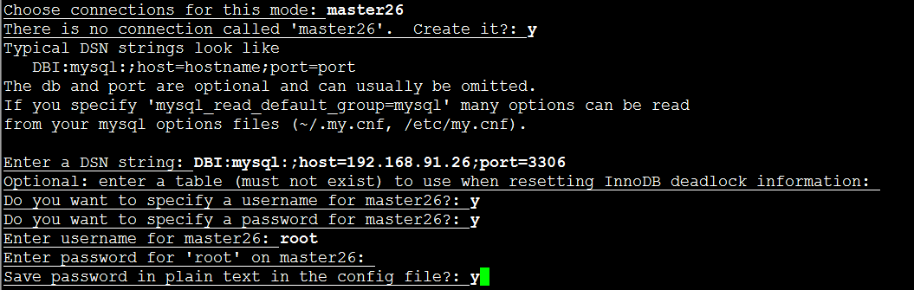

本文参考：https://www.cnblogs.com/ivictor/p/5101506.html
https://blog.csdn.net/jc_benben/article/details/70598724

https://www.cnblogs.com/ivictor/p/5101506.html

## 一、简介

Innotop是一款十分强大的MySQL监控工具，用perl所写，通过文本模式展示MysQL服务器和Innodb的运行状况。

## 二、安装

两种方法

#### 1. 编译安装

下载地址：https://github.com/innotop/innotop

#### 2. yum安装

```
yum install innotop
```

## 三、innotop的参数

```
# innotop --help
Usage: innotop <options> <innodb-status-file>

  --askpass          Prompt for a password when connecting to MySQL
  --[no]color   -C   Use terminal coloring (default)
  --config      -c   Config file to read
  --count            Number of updates before exiting
  --delay       -d   Delay between updates in seconds
  --help             Show this help message
  --host        -h   Connect to host
  --[no]inc     -i   Measure incremental differences
  --mode        -m   Operating mode to start in
  --nonint      -n   Non-interactive, output tab-separated fields
  --password    -p   Password to use for connection
  --port        -P   Port number to use for connection
  --skipcentral -s   Skip reading the central configuration file
  --socket      -S   MySQL socket to use for connection
  --spark            Length of status sparkline (default 10)
  --timestamp   -t   Print timestamp in -n mode (1: per iter; 2: per line)
  --user        -u   User for login if not current user
  --version          Output version information and exit
  --write       -w   Write running configuration into home directory if no config files were loaded

innotop is a MySQL and InnoDB transaction/status monitor, like 'top' for
MySQL.  It displays queries, InnoDB transactions, lock waits, deadlocks,
foreign key errors, open tables, replication status, buffer information,
row operations, logs, I/O operations, load graph, and more.  You can
monitor many servers at once with innotop. 
```

## 四、innotop交互选项
进入交互界面之后，使用?查看交互选项

```
[RO] Dashboard (? for help)                                                                                                                                            localhost, 333d, 0.00 QPS, 3/2/3 con/run/cac thds, 8.0.16

Switch to a different mode:
   A  Dashboard         I  InnoDB I/O Info     Q  Query List
   B  InnoDB Buffers    K  InnoDB Lock Waits   R  InnoDB Row Ops
   C  Command Summary   L  Locks               S  Variables & Status
   D  InnoDB Deadlocks  M  Replication Status  T  InnoDB Txns
   F  InnoDB FK Err     O  Open Tables         U  User Statistics

Actions:
   d  Change refresh interval        q  Quit innotop
   k  Kill a query's connection      r  Reverse sort order
   n  Switch to the next connection  s  Choose sort column
   p  Pause innotop                  x  Kill a query

Other:
 TAB  Switch to the next server group   /  Quickly filter what you see
   !  Show license and warranty         =  Toggle aggregation
   #  Select/create server groups       @  Select/create server connections
   $  Edit configuration settings       \  Clear quick-filters
Press any key to continue
```

### 1. Dashboard

使用A进入界面

```

Uptime  MaxSQL  ReplLag  QPS   Cxns  Run  Miss  Lock  Tbls  Repl  SQL
  333d                   0.70     2       0.00     0   938           
```

参数|说明
---|---
Uptime|当前MySQL服务器持续运行的时长
QPS|当前数据库的QPS
Cxns|客户端连接数
Run|正在执行查询（show processlist中command为query状态）的客户端连接数
Miss|查询缓存未命中的次数
Lock|当前发生锁等待的记录数
Tbls|历史打开表数量，从open_tables中取值（show open tables）
SQL|当前从库正在执行的SQL语句缩写

### 2. Q Query List
Q进入
```
[RO] Query List (? for help)                                                                                                                                           localhost, 333d, 9.41 QPS, 3/2/3 con/run/cac thds, 8.0.16

When   Load  Cxns  QPS   Slow  Se/In/Up/De%  QCacheHit  KCacheHit  BpsIn   BpsOut
Now    0.19     2  9.41     0   0/ 0/ 0/ 0       0.00%    100.00%  236.17  31.78k
Total  0.00   151  0.00     0   5/ 1/ 0/ 0       0.00%    100.00%    4.50   0.23 

Cmd     ID      State               User      Host       DB      Time          Query
Daemon       5  Waiting on empty q  event_sc  localhost          333+04:18:22       
```
参数|说明
---|---
Load |是负载
QPS (Query Per Second) |表示每秒的查询率
Slow |代表慢查询的个数
Se/In/Up/De%|查询/插入/更新/删除的比例
QCacheHit|查询缓冲的命中率
KCacheHit|索引的命中率
BpsIn （bytes Per Second in） |每秒输入的字节数
BpsOut（bytes Per Second Out）|每秒输出的字节数

在这个页面，可输入e、f、o等键

- e键 : 按e并输入thread ID,就能显示该SQL的执行计划
- f键 : 显示当前正在运行的完整SQL语句
- o键 : 显示当前SQL被mysql内部优化后的SQL

### 3.**B InnoDB Buffers**
显示有关InnoDB Buffer Pool，页面统计，插入缓冲，自适应哈希索引。  使用的是show innodb status的数据。

```
[RO] InnoDB Buffers (? for help)                                                                                                                       localhost, 333d, InnoDB 13s :-), 0.66 QPS, 3/2/3 con/run/cac thds, 8.0.16

___________________________ Buffer Pool ___________________________
Size   Free Bufs  Pages  Dirty Pages  Hit Rate  Memory   Add'l Pool
8.00k       1020   7159            0  --        131.00M            

_____________________ Page Statistics _____________________
Reads   Writes  Created  Reads/Sec  Writes/Sec  Creates/Sec
239967  337170   331783       0.00        0.00         0.00

______________________ Insert Buffers ______________________
Inserts  Merged Recs  Merges  Size  Free List Len  Seg. Size
                   0       0     1              0          2

__________________ Adaptive Hash Index ___________________
Size    Cells Used  Node Heap Bufs  Hash/Sec  Non-Hash/Sec
33.87k                           1      0.00          0.00
```
#### buffer pool
参数|说明
---|---
Size | 某sql使用Buffer Pool的大小
Free Bufs | Innodb_buffer_pool_pages_free的值,空页数;
Pages| Innodb_buffer_pool_pages_data的值, 包含数据的页数(脏或干净)
Dirty Pages | Innodb_buffer_pool_pages_dirty的值,当前的脏页数
Hit Rate|命中率
Memory | Innodb_buffer_pool_size 的值.
Add'l Pool| innodb_additional_mem_pool_size的值

#### Page Statistics
参数|说明
---|---
Reads |Innodb_pages_read 的值,读取的页数
Writes| Innodb_pages_written 的值,写入的页数
Created | Innodb_pages_created 的值,创建的页数
Reads/Sec | 每秒读取的页数
Writes/Sec | 每秒写入的页数
Creates/Sec |每秒创建的页数

#### Insert Buffers
参数|说明
---|---
Inserts | 表示执行insert 次数
Merged Recs |表示执行 insert 索引树合并的次数
Merges| insert 语句合并的次数
Size|写缓冲的大小
Free List Len|空闲列表长度
Seg. Size| 段块大小

Adaptive Hash Index 自适应哈希索引
参数|说明
---|---
Size| 哈希索引占用大小
Cells Used|
Node Heap Bufs|
Hash/Sec:|每秒哈希索引量
Non-Hash/Sec|每秒非哈希索引的量

#### 4. D InoDB Deadlocks
```
[RO] InnoDB Deadlocks (? for help)                                                                                                                      localhost, 333d, InnoDB 4s :-), 1.34 QPS, 3/2/3 con/run/cac thds, 8.0.16

______________________ Deadlock Transactions ______________________
ID  Timestring  User  Host  Victim  Time  Undo  LStrcts  Query Text

____________________ Deadlock Locks ____________________
ID  Waiting  Mode  DB  Table  Index  Special  Ins Intent
```
参数|说明
---|---
D|连接线程ID号
Timestring |死锁发生的时间
User|用户名
Host|主机
Victim|Yes表示这个死锁SQL被强行终止了.No表示这个SQL正在执行
Time|这条SQL的运行时间
Undo | 回滚
LStrcts|不知道是什么的缩写
Query Text | 死锁执行的SQL

#### 5.I InnoDB I/O Info

显示InnoDB的I / O统计，包括I / O线程，挂起的I / O，文件I / O，日志统计

```
[RO] InnoDB I/O Info (? for help)                                                                                                                      localhost, 333d, InnoDB 25s :-), 4.16 QPS, 3/2/3 con/run/cac thds, 8.0.16

_________________________ I/O Threads __________________________
Thread  Purpose               Thread Status                     
     0  insert buffer thread  waiting for completed aio requests
     1  log thread            waiting for completed aio requests
     2  read thread           waiting for completed aio requests
     3  read thread           waiting for completed aio requests
     4  read thread           waiting for completed aio requests
     5  read thread           waiting for completed aio requests
     6  write thread          waiting for completed aio requests
     7  write thread          waiting for completed aio requests
     8  write thread          waiting for completed aio requests
     9  write thread          waiting for completed aio requests

____________________________ Pending I/O _____________________________
Async Rds  Async Wrt  IBuf Async Rds  Sync I/Os  Log Flushes  Log I/Os
                                                           0          

________________________ File I/O Misc _________________________
OS Reads  OS Writes  OS fsyncs  Reads/Sec  Writes/Sec  Bytes/Sec
  239990    5363995     109721       0.00        0.00          0

_____________________ Log Statistics _____________________
Sequence No.  Flushed To  Last Checkpoint  IO Done  IO/Sec
6305185804    6305185804  6305185804       5014798    0.00
```
参数|说明
---|---
Pending I/O |挂起的IO
Async Rds |Asynchronous Reads 异步读
Async Wrt| Asynchronous Write 异步写
IBuf Async Rds| Innodb Buffer Asynchronous Reads 缓冲池的异步读
Sync I/Os|Asynchronous Input/Output:的异步
Log Flushes | log Flushes
Log I/Os | Input/Output 异步写入/读出日志
File I/O |Misc(文件IO)
OS Reads|系统I./O的读
OS Writes| 系统.I/O的写
OS fsyncs|系统文件同步
Reads/Sec| 每秒多少次读
Writes/Sec|每秒多少次写
Bytes/Sec| 每秒多少字节的输入输出
Log Statistics|(日志统计)
Sequence No| Innodb buffer 里面的 LSN 号
Flushed To| 刷新到事务日志的LSN号
Last Checkpoint| LSN的检查点
IO Done| 多少I/O已经完成` 
IO/Sec|每秒I/O次数

#### 6.K  innodb lock waits

锁等待信息

```
[RO] InnoDB Lock Waits (? for help)                                                                                                                                       localhost, 333d, 0 QPS, 3/0/0 con/run/cac thds, 8.0.16

WThread  Waiting Query  WWait  BThread  BRowsMod  BAge  BWait  BStatus  Blocking Query
```

#### 7.R innodb rows ops

R：innodb DML操作信息和信号量的信息

```
[RO] InnoDB Row Ops (? for help)                                                                                                                      localhost, 333d, InnoDB 44s :-), 9.76k QPS, 3/2/3 con/run/cac thds, 8.0.16

_____________________ InnoDB Row Operations _____________________
Ins       Upd  Read      Del  Ins/Sec  Upd/Sec  Read/Sec  Del/Sec
67109603  733  67126907  345     0.00     0.00      0.00     0.00

___________________ Row Operation Misc ____________________
Queries Queued  Queries Inside  Rd Views  Main Thread State
             0               0         0  sleeping         

_____________________________ InnoDB Semaphores _____________________________
Waits  Spins  Rounds  RW Waits  RW Spins  Sh Waits  Sh Spins  Signals  ResCnt
                           258     18010         9     16594                 

____________________________ InnoDB Wait Array _____________________________
Thread  Time  File  Line  Type  Readers  Lck Var  Waiters  Waiting?  Ending?
```

#### 8. command summary

C进入

```
[RO] Command Summary (? for help)                                                                                                                                    localhost, 333d, 464.11 QPS, 3/2/3 con/run/cac thds, 8.0.16

___________________ Command Summary ____________________
Name                    Value  Pct     Last Incr  Pct   
Com_show_fields          1097  25.26%       1097  25.26%
Com_admin_commands       1021  23.51%       1021  23.51%
Com_show_status           977  22.50%        977  22.50%
Com_show_processlist      248   5.71%        248   5.71%
Com_show_engine_status    246   5.67%        246   5.67%
Com_select                194   4.47%        194   4.47%
Com_show_variables         72   1.66%         72   1.66%
Com_show_master_status     66   1.52%         66   1.52%
Com_create_table           62   1.43%         62   1.43%
Com_show_tables            58   1.34%         58   1.34%
Com_show_databases         43   0.99%         43   0.99%
Com_insert_select          32   0.74%         32   0.74%
Com_insert                 32   0.74%         32   0.74%
Com_change_db              26   0.60%         26   0.60%
Com_set_option             26   0.60%         26   0.60%
Com_show_slave_status      25   0.58%         25   0.58%
Com_show_open_tables       22   0.51%         22   0.51%
Com_delete                 16   0.37%         16   0.37%
Com_begin                  13   0.30%         13   0.30%
Com_commit                  8   0.18%          8   0.18%
Com_alter_user              7   0.16%          7   0.16%
Com_slave_start             6   0.14%          6   0.14%
Com_alter_table             5   0.12%          5   0.12%
Com_drop_table              5   0.12%          5   0.12%
Com_show_table_status       5   0.12%          5   0.12%
```


#### 9. variables 和 status

大写S

```
[RO] Locks (? for help)                                                                                                                                 localhost, 333d, InnoDB 5s :-), 1.01 QPS, 3/2/3 con/run/cac thds, 8.0.16

_______________________________ InnoDB Locks _______________________________
ID  Type  Waiting  Wait  Active  Mode  DB  Table  Index  Ins Intent  Special
                QPS           Commit_PS     Rollback_Commit        Write_Commit           R_W_Ratio            Opens_PS    Table_Cache_Used          Threads_PS   Thread_Cache_Used       CXN_Used_Ever        CXN_Used_Now
                  0                   0                0.25               33.25                0.68                   0                   0                   0               33.33                3.31                1.32
```

#### 10.复制状态信息（replication status）

```
[RO] Replication Status (? for help)                                                                                                                                   localhost, 333d, 1.13 QPS, 3/2/3 con/run/cac thds, 8.0.16

______________________________________________________________________________________________ Slave SQL Status ______________________________________________________________________________________________
Channel  Master         Master UUID                           On?  TimeLag  Catchup  Temp  Relay Pos  Last Error                                                         Retrieved GTID Set  Executed GTID Set
         47.104.149.52  caac3cb7-a765-11e9-b63b-00163e04816e  No     00:00     0.00              369  Error executing row event: 'Table 'test.warehouse' doesn't exist'  N/A                 N/A              

_______________________________________________ Slave I/O Status _______________________________________________
Channel  Master         Master UUID                           On?  File              Relay Size  Pos       State
         47.104.149.52  caac3cb7-a765-11e9-b63b-00163e04816e  No   mysql-bin.000002     111.34M  54042373       

____________________________________________ Master Status ____________________________________________
Channel  File           Position  Binlog Cache  Executed GTID Set  Server UUID                         
         binlog.000004    186244        20.65%  N/A                6193bf94-b6bc-11e9-b409-00163e0691a7
```

#### 11.innodb Txns事务信息

T进入

```
[RO] InnoDB Txns (? for help)                                                                                                                           localhost, 333d, InnoDB 7s :-), 0.75 QPS, 3/2/3 con/run/cac thds, 8.0.16

History  Versions  Undo  Dirty Buf  Used Bufs  Txns  MaxTxnTime  LStrcts
     21                      0.00%     87.39%     2       00:00         

ID  User  Host  Txn Status  Time  Undo  Query Text
```

#### 12.innodb FK Err外键错误信息

F进入

```
[RO] InnoDB FK Err (? for help)                                                                                                                         localhost, 333d, InnoDB 2s :-), 2.58 QPS, 3/2/3 con/run/cac thds, 8.0.16

No foreign key error data.
```

#### 13 .OPEN TABLES 打开的表

O进入

```
[RO] Open Tables (? for help)                                                                                                                                             localhost, 333d, 0 QPS, 3/0/0 con/run/cac thds, 8.0.16

______ Open Tables ______
DB  Table  In Use  Locked
```

该信息来自show open tables

#### 14. locks

大写字母L

```
[RO] Locks (? for help)                                                                                                                                 localhost, 333d, InnoDB 5s :-), 1.01 QPS, 3/2/3 con/run/cac thds, 8.0.16

_______________________________ InnoDB Locks _______________________________
ID  Type  Waiting  Wait  Active  Mode  DB  Table  Index  Ins Intent  Special
```

## 五、监控多个服务器

#### 方法1

进入到交互式界面后，点击@键，会进入到连接配置界面

```
You can enter the name of a new connection to create it.

_____________________ Choose from _____________________
localhost   DBI:mysql:;;mysql_read_default_group=client

Choose connections for this mode: 
```



#### 方法2

利用配置文件

innotop --write，进入交互式界面后退出。会在当前目录下生成一个.innotop/innotop.conf。该配置文件中有关连接的配置信息，默认有一个localhost