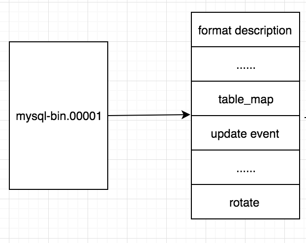
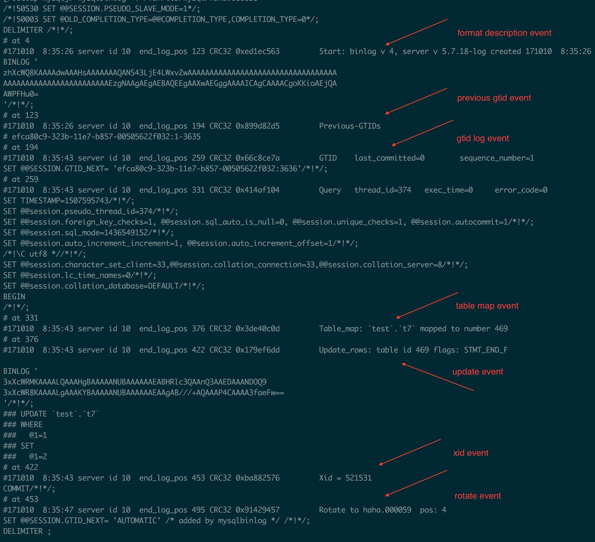

目前MySQL的flashback功能是利用binlog完成的，第一个实现该功能的是阿里云的彭立勋， 他在MySQL 5.5版本上就已实现，并将其提交给MariaDB。
https://www.cnblogs.com/waynechou/p/mysql_flashback_intro.html

美团点评又出了另一款闪回工具MyFlash，据说比 mysqlbinlog 具有更高效的闪回效果，项目地址：https://github.com/Meituan-Dianping/MyFlash

https://zhuanlan.zhihu.com/p/31217864

早期要想恢复数据，只能让业务人员根据线上操作日志，构造误删除的数据，或者DBA使用binlog和备份的方式恢复数据，不管那种，都非常费时费力，而且容易出错。

## 一、闪回工具现状

#### 1.mysqlbinlog工具配合sed、awk。

该方式先将binlog解析成类SQL的文本，然后使用sed、awk把类SQL文本转换成真正的SQL。

- 优点：当SQL中字段类型比较简单时，可以快速生成需要的SQL，且编程门槛也比较低。
- 缺点：当SQL中字段类型比较复杂时，尤其是字段中的文本包含HTML代码，用awk、sed等工具时，就需要考虑极其复杂的转义等情况，出错概率很大。

#### 2.给数据库源码打patch。

该方式扩展了mysqlbinlog的功能，增加Flashback选项。

- 优点：复用了MySQL Server层中binlog解析等代码，一旦稳定之后，无须关心复杂的字段类型，且效率较高。
- 缺点：在修改前，需要对MySQL的复制代码结构和细节需要较深的了解。版本比较敏感，在MySQL 5.6上做的patch，基本不能用于MySQL 5.7的回滚操作。升级困难，因为patch的代码是分布在MySQL的各个文件和函数中，一旦MySQL代码改变，特别是复制层的重构，升级的难度不亚于完全重新写一个。

#### 3.使用业界提供的解析binlog的库，然后进行SQL构造，其优秀代表是binlog2sql。

- 优点：使用业界成熟的库，因此稳定性较好，且上手难度较低。
- 缺点：效率往往较低，且实现上受制于binlog库提供的功能。

上述几种实现方式，主要是提供的过滤选项较少，比如不能提供基于SQL类型的过滤，需要回滚一个delete语句，导致在回滚时，需要结合awk、sed等工具进行筛选。

总结了上述几种工具的优缺点，理想的闪回工具需要有以下特性。

1. 无需把binlog解析成文本，再进行转换。
2. 提供原生的基于库、表、SQL类型、位置、时间等多种过滤方式。
3. 支持MySQL多个版本。
4. 对于数据库的代码重构不敏感，利于升级。
5. 自主掌控binlog解析，提供尽可能灵活的方式。

**在这些特性中，binlog的解析是一切工作的基础。**

## 二、binlog格式

#### binlog格式概览

一个完整的binlog文件是由一个format description event开头，一个rotate event结尾，中间由多个其他event组合而成。

每个event都是由event header 和event data组成。下面简单介绍下几种常见的binlog event。

#### 几种常见的event