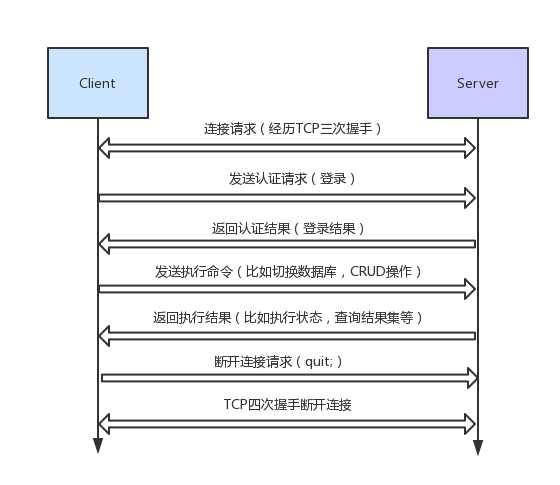

本文来自MySQL运维内参

- MySQL的语法文件写得特别复杂,也特别乱,可扩展性也特别差

- 在一般的数据库理论中,语句的执行要分为**词法分析、语法分析、语义分析、査询优化、计划生成**等步骤,但MySQL将这里面很多步骤都揉合到一起,完全没有层次划分

- 它的存储过程、函数的执行,将计划生成放在了语法、语义分析的过程中,这样一来很多方面受到局限,比如语句扩展、优化、性能等

## 网络交互过程

 

## 用户连接线程创建
- 服务器启动的过程中，只是创建了套接字且绑定了端口，还没形成服务器监听模式，这是在handle_connections_methods中完成
- handle_connections_methods处理3种连接方式：命名管道，套接字，共享内存。一般情况下用套接字。
- 一个大循环中有select或者poll，然后用过mysql_socket_accept生成一个新的套接字，用来监听连接请求；服务器的连接监听套接字会创建新的连接线程（create_new_thread）之后，返回循环中继续监控新的请求
- handle_connections_sockets处理套接字请求
- **create_new_thread是核心函数，创建新的连接**
- create_new_thread中有max_connections 判断条件，如果当前系统连接数大于max_connections，服务器拒绝连接，直接报错返回（此时还只是判断线程数目），create_thread_to_handle_connection真正处理连接
- MySQL中，用户连接退出后，服务器并没有真正销毁工作线程而是缓存起来，以后有新的连接请求，系统会将已经缓存的连接直接使用，提高性能

## MySQL处理请求
- packet中可以读取到请求信息，第一个字节代表请求类型（enum_server_command中枚举了请求类型）
- dispatch_command()使用巨大的switch语句分别处理各种请求类型
- 如果查询缓存存在，则直接取数据。MySQL查询缓存功能很弱，当只有语句完全相同（包括空格、大小写等完全相同才可以。所以MySQL8直接去掉了这个功能）
- 如果没有命中，则根据sql_yacc.yy进行语法分析，生成相应的语法树，然后通过mysql_execute_command执行
- 通过语法分析得到lex->sql_command得到当前的SQL语句的操作类型，然后调用对应的函数执行操作