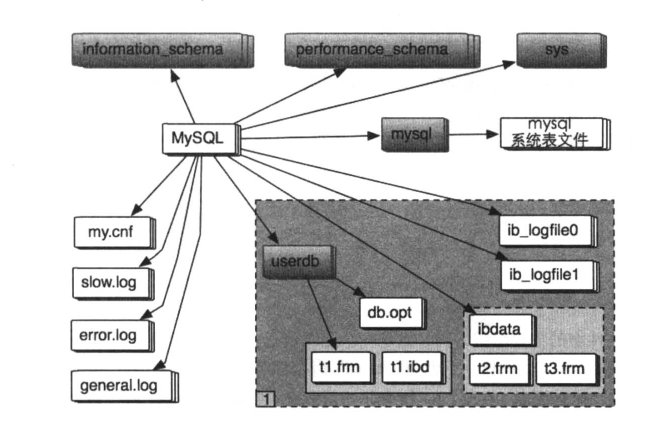

## 表空间的组成结构
- Innodb存储引擎在存储设计上模仿了Oracle的结构，用表空间进行管理。新建一个数据库时Innodb初始化一个名为ibdata1的表空间文件，如果innodb_file_per_table没有设置为true，所有的表都会放ibdata1上

- 如果innodb_file_per_table设置为True，每个表都有独立的表空间文件，存储B+数据、索引和插入缓冲等信息，其余还是存储于默认表空间
  表空间组织结构如下：

#### 段
- 段是表空间文件中的主要组织结构，是一个逻辑概念，用来管理物理文件，是构成索引、表、回滚段的基本元素
- 创建一个索引（B+树）会同时创建两个段，分别==是内节点段和叶节点段==，内节点段用来管理B+树中的非叶子节点的数据，叶子段用来管理B+树中的叶子节点数据
- 内节点分裂时新节点从内节点段中申请，叶子节点分裂时新节点从叶子段申请
- ibd文件，由多个段组成。段之间的物理位置没有关系
- innodb 的数据都是根据主键值以B+树形式组织的，也就是索引组织表（IOT）
- 段以区的形式组织空间
- 有的对象很小，不需要使用完整的区来保存，则先使用段的32个碎片页来保存
- 段是页和区混合管理，32个独立的页以及若干个区。申请先从32个页中分配，每次一个页，如果超出则每次从表空间获取一个区
- segment inode共192字节，每个页可以保存85（16*1024/192）个
变量 | 大小| 说明
---|---|---
FSEG_ID | 8 | 段ID
FSEG_NOT_FULL_N_USED | 4 | 链表FSEG_NOT_FULL中所有已经分配页的数量
FSEG_FREE | 16 | 空闲区链表
FSEG_NOT_FULL | 16 | 全部页未被使用的区链表
FSEG_FULL | 16 | 全部页已被使用的区链表
FSEG_MAGIC_N | 4 | 仅在调试模式下使用
FSEG_FRAG_ARR |128 | 碎片页链表,一共32个页,保存每个页在表空间中的偏移量 因此总共需要32x4个字节
- segment inode 依旧是索引页，页的分配依然从碎片区开始
- segment inode位置不固定，需要用segment header（10字节）指向它

###### segment header
变量 | 大小| 说明
---|---|---
FSEG_HDR_SPACE | 4 | segment  inode页所在的表空间ID
FSEG_HDR_PAGE_NO | 4 | segment inode页所在表空间的偏移量
FSEG_HDR_OFFSET | 2 | segment inode在页中的偏移量

- 用户表segment header 在索引的root页中；而其他segment header 可能存放于单独的页中，比如insert buffer

#### 簇（也就是区，extent）
- 簇是构成段的基本元素，一个簇是物理上连续分配的一段空间，一个簇大小是64个页面
- 簇之间的物理位置没有关系
- 簇区是innodb 空间申请的最小单位，为64*页大小（默认16kb）=1MB
- 簇区由space header（共112个字节） 管理，space header 存储于页(0,0)中

变量 | 大小| 说明
---|---|---
FSP_NOT_USED | 8 | 未使用
FSP_SIZE | 4 | 当前已经页的总大小
FSP_FREE_LIMIT | 4 | 当前已经用到的位置,大于该部分的位置表示还未被初始化
FSP_LOWEST_NO_WRITE | 4 | 未使用
FSP_FRAG_N_USED |4| 碎片区中已经使用页的总数
FSP_FREE | 16 | 空闲区链表
FSP_FREE_FRAG | 16 | 空闲碎片区列表
FSP_FULL_FRAG | 16 | 已经完全使用的碎片区列表
FSP_SEG_ID | 8 | 下一个段的ID
FSP_SEG_INODES_FULL | 16 | 已经使用的inode页链表
FSP_SEG_INODES_FREE | 16 | 空闲的inode页链表
- space header 中将区分为区（分配给段 ）和碎片区（frag segment）
- 通过区保存数据之前，先将数据保存在32个碎片页中，以节省空间
- 表空间可视为多个区组成的大文件块，从低到高申请
- FSP_FREE_LIMIT 当前已经用到的位置,大于该部分的位置表示还未被初始化
- fsp_fill_free_list 函数用来申请区；若允许，一次4个区；若包含碎片区，则一次5个区
- 区的分配和申请由space header完成，分配情况用区描述符表示
#### 页面
- 簇的基本组成单位，段端粒的最小单位，数据库文件管理的最小单位，文件中空间分配的最小单位
- 一个簇默认64页面，逻辑上（页面号从小到大连续）及物理上都是连续的
- innodb 访问的最小单位，默认16KB，由 UNIV_PAGE_SIZE 定义

innodb的页结构 |说明
---| ---|
file header（文件头） | 8部分，38字节 fil_page_space_or_checksum（4字节） mysql4.1之后表示checksum值 fil_page_offset（4字节）表空间中页的偏移值 fil_page_prev（4字节）,fil_page_next（4字节），顾名思义，表示前一个页面和后一个页面的指针 fil_page_LSN（8字节）该页最后修改的LSN fil_page_type（2字节），页类型 fil_page_file_flush_LSN（8字节），在数据文件的某一个页才有，代表文件至少被更新到该LSN fil_page_arch_log_no_or_space_id（4字节）mysql4.1开始代表数据页属于哪个表空间
page header（页头） | 14部分，56字节 PAGE_N_DIR_SLOTS（2字节） page directory 的slots数  PAGE_HEAP_TOP（2字节） 堆中第一个记录的指针  PAGE_N_HEAP（2字节）  堆中的记录数   PAGE_FREE（2字节）指向空闲列表的首指针 PAGE_GARBAGE（2字节）已删除的字节数，即行记录结构中 delete flag为1的记录的数目 PAGE_LAST_INSERT（2字节） 最后插入记录的位置  PAGE_DIRECTION（2字节）插入的方向   PAGE_N_DIRECTION（2字节）一个方向连续插入的数量 PAGE_N_RECS（2字节）该页中记录的数量  PAGE_MAX_TRX_ID（8字节）当前页的最大事务ID  PAGE_LEVEL（2字节）当前页在索引中的位置，0x00代表叶子节点  PAGE_INDEX_ID（8字节）当前页属于哪个索引ID   PAGE_BTR_SEG_LEAF（10字节）B+树叶节点中文件段的首指针位置，仅B+树的root页中定义 PAGE_BTR_SEG_TOP（8字节）B+树非叶节点中文件段的首指针位置，仅B+树的root页中定义 
infimum + supremum records | innodb 每个数据页会有两个虚拟行记录以限定记录边界，infimum记录比任何主键还小的值，supremum记录比任何主键还大的值 页建立的时候创建，并任何情况都不会删除
user records（用户记录，即行记录） | innodb是索引组织表
free space（空闲空间） | 链表数据结构；记录被删除时，会加入到空闲链表中
page directory（页目录） | 存放了记录的相对位置
file trailer（文件结尾信息） | 为了页面写入时候的完整性，file trailer只有8字节的FIL_PAGE_END_LSN 前4个字节是本页的checksum，后四个字节与 FIL_PAGE_LSN 的LSN相同 前4字节与fil_page_space_or_checksum比较，后4字节与FIL_PAGE_LSN比较，确认是否相同

- fil_page_offset 是4字节，所以一个表空间最大数据是2^32 * 页面大小（默认16kb） = 64TB
- FIL_PAGE_LSN 与FIL_PAGE_END_LSN如果一致，则页是完整的，由函数buf_page_is_corrupted判断
#### 段、簇、页面的组织结构
- 一个表空间可以有多个文件（至少1个，即0号文件），每个文件都有各自编号
- 每一个文件被切割成等长（默认16KB）的块，0号文件page_no为0的页面存储了所有段簇页管理入口
- page_no为0的页面头会占据一些空间，真正管理信息数据从页面便宜为FIL_PAGE_DATA(38)的位置开始，描述信息如下
1. FSP_SPACE_ID：当前表空间ID号。创建时唯一的ID号。
2. FSP_SIZE：当前表空间总的页面数，表空间扩张后会更新
3. FSP_FREE：表空间所有段中的簇由表空间统一管理。该地址是表头指针，表空间中所有的空闲簇以链表的形式存储其中
4. FSP_FREE_FRAG：一个簇有被分配的页面但未分配完，则这个簇为半满簇。FSP_FREE_FRAG是半满簇的链表头指针
5. FSP_FULL_FRAG:FSP_FULL_FRAG是满簇链表头指针
6. FSP_FRAG_N_USED：表示FSP_FREE_FRAG中已经被使用的页面数
7. FSP_SEG_ID：表空间中，每一个段都有一个唯一的ID号，这个值是下一个段的ID号
8. FSP_SEG_INODES_FULL：inode用来管理段，一个inode代表一个数据段。如果一个inode页面可以存储多个inode节点，如果页面所有空间都存放已经使用的inode，则称页面为满inode页面，否则为半满inode页面。FSP_SEG_INODES_FULL用来存储所有的满inode页面链表头指针
9. FSP_SEG_INODES_FREE：用来存储所有半满的inode页面的链表头指针
- iNode用来管理一个段，包括以下内容：
1. FSEG_ID：表示这个段的ID号，在创建时唯一分配
2. FSEG_NOT_FULL：用来存储所有半满簇的链表头指针
3. FSEG_NOT_FULL_N_USED：这个地址用来存储上面半满簇链表中所有已经使用的页面总数
4. FSEG_FREE：这个地址用来存储所有空闲簇的链表头指针
5. FSEG_FULL:用来存储所有满簇链表头指针
- 表空间控制信息中和inode信息中都有满簇链表、半满簇链表、空闲簇链表。一个管理自己段中的簇信息，而一个管理整个表空间
- 段通过三个链表将不同状态的簇管理起来，链表都是双向链表。链表节点就是簇，每个簇都有向前和向后指针。每一个簇通过结构体簇描述符表示：
1. XDES_ID：簇所属的段ID，对应FSEG_ID
2. XDES_FLST_NODE：存储簇的链表指针，包括向前和向后指针。
3. XDES_STATE:biaoshi当前簇的状态（XDES_FREE空闲簇，XDES_FREE_FRAG半满簇，XDES_FULL_FRAG满簇，XDES_FSEG属于一个段）
4. XDES_BITMAP：这个地址存储的是一个位图，管理一个簇中页面的使用情况。每一个簇用两个位表示，第一个表示页面是否使用，第二个暂时没使用

## 段的创建过程（这部分暂放，文字太多，头痛）
- 根据表空间ID得到表空间头信息
- 从得到的表空间头分配一个inode，先判断FSP_SEG_INODES_FREE是否还有空闲
- 给新分配的inode指定SEG_ID
- 初始化inode信息
- 