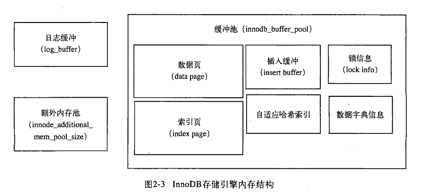

本文参考MySQL运维内参，MySQL技术内幕innodb引擎

## 源码结构简介

目录名|解释说明
---|---
btr|在这个目录中,实现了所有关于B+树的功能,包括创建销毁、搜索、增删改查等
buf|在这个目录中,实现了所有关于 buffer缓存的功能,包括载入、淘汰、刷盘等
dict|实现了 InnoDB数据字典的加载、存储、修改及内存管理等功能
fil|实现了 InnoDB中,关于物理文件的读写、内存对象管理、文件扩展等功能
fsp|包含所有 InnoDB中物理文件内部空间的管理,包括数据段、物理页面及簇
ibuf|实现了所有关于 insert buffer的功能,不过在最新版本里已经不只是 insert了,还包括了删除及更新操作,最新名字叫 change buffer
lock|实现了在 InnoDB中所有关于行锁及表锁的功能
log|实现了所有关于 InnoDB日志相关的功能,包括写日志及数据恢复
mem|实现了在 InnoDB内部用来内存管理的功能
mtr|很重要的模块,实现了连接上层事务与下层物理文件及日志的桥梁
os|封装了不同操作系统下,与操作系统交互的功能,包括同步、文件及线程等
page|实现了关于数据页面内数据管理的功能,包括插入、删除等
pars|包含了 InnoDB内部自己实现的语法、语义分析器
que|包含了 InnoDB内部自己实现的一个状态机执行器
rem|包含了在 InnoDB中对物理记录的管理,包括记录比较及转换计算等
row|包含了各种物理记录的操作实现,包括增删改査、回滚、 purge、合并等
srv|这里实现了 InnoDB系统后台的管理,著名的 master线程就在这里面实现
sync|实现了 InnoDB读写同步的功能,包括等待队列、读写锁及 mutex等实现
trx|实现了有关事务的功能,包括MVCC、回滚段、 purge、回滚记录及回滚提交等
ut|这里实现了很多内部使用的一些经典算法,包括链表、红黑树、堆排序等

## innodb文件组织
- slow.log文件,会记录慢査询日志,当一条语句执行时间超过在配置参数long_query_time中指定的值时,这条语句就会被记录在这个文件中
- error_log文件,会记录一些系统启动或运行时的错误或警告信息,通过配置参数log_error来设置
- general_log文件,会记录所有在数据库上执行的语句,经常用来追踪问题,但会影响一点性能,所以一般不会打开
#### 三个常用数据库：
- information_schema：
1. MySQL的meta数据，包括数据库名、数据库表、表列数据类型及访问权限等；
2. 有数个只读表（实际上是视图），通过show create table tablename/show create view viewname（实际效果一样）查看
3. 很多工具的信息来源，比如percona toolkit工具包
4. 每次查找的时候，**都会现场统计响应的信息**，需要将信息加载到内存中然后再将信息返回客户端。在表比较多的情况下可能会执行缓慢，造成不可预知的故障
- performance_schema
1. performance_schema是MySQL5.5新增，主要用于收集数据库性能参数
2. 提供进程等待的详细信息，包括锁、互斥变量、文件信息
3. 保存历史时间汇总信息
4. 添加或者删除监控事件点，并可以随意改变MySQL服务器的监控周期
- sys
1. MySQL5.7首次加入，类似于Oracle的动态视图
2. MySQL5.6版本可以手动导入，数据包在github，但功能不完善
3. 通过视图将information_schema和performance_schema接合的，结果让人易于理解


## innodb文件结构

- 最上层的部分，是提供给MySQL server和Innodb NoSQL的接口。公共接口对应的定义在sql/handler.h中
```
class handler :public Sql_alloc{
virtual int rename_table(const char *from, const char *to)
virtual int delete_table(const char *name)
virtual int open(const char *name, int mode, uint test_if_locked)=0;
virtual int close(void)=0;
virtual int index_init(uint idx, bool sorted)i active index= idx; return o
virtual int index_end(){active_index= MAX KEY; return 0; }
virtual int write_row(uchar *buf __attribute__ ((unused)))
virtual int update_row(const uchar *old_data MY_ATTRIBUTE((unused)),uchar *new_data MY_ATTRIBUTE((unused)))
virtual int delete_row(const uchar *buf MY_ATTRIBUTE((unused)))
.....
}
```
- 声明针对不同的存储引擎而设计的公共虚函数接口，相应的定义需要每个存储引擎自己来实现。
- 接下来是一些Innodb的逻辑对象：
1. 每一个访问都会涉及事务，事务处理会产生锁，包括行锁表锁等，处理的对象是表、索引（B树）；
2. 对数据页面的访问离不开mini-transaction（物理事务），为防止页面写入的不一致，对页面加读写锁（闩）
3. 为高效准确定位页面、管理B树页面、分配销毁某些页面等，需要“文件管理系统”
- 下一层是物理层，都是一些缓存（日志缓存、数据页缓存）
1. 日志是上层的逻辑事务在通过物理事务修改数据页面产生
2. 如果页面在buffer缓冲区，直接加锁修改并产生页面，如果不在，需要从ibdata中载入
- 再下一层是操作系统的IO层，主要处理下层物理文件与上层缓存（日志缓存及buffer数据页面缓存）之间的交互
1. REDO日志IO：缓冲区（一般几MB）满了，或者checkpoint或者逻辑事务提交（innodb_flush_log_at_trx_commit参数有关），日志刷盘，即日志IO
2. 数据页面IO：对于buffer缓冲区的IO，包括索引数据页面IO和回滚段页面IO

## innodb内存结构



innodb_buffer_pool_size控制缓冲池大小

索引页

数据页

undo页

insert buffer（change buffer）

自适应哈希索引

innodb存储的锁信息

数据字典

日志缓冲

额外内存池（innodb_additional_mem_pool_size控制大小，在MySQL高版本中已没有该参数）

## Innodb存储引擎的启动与关闭

#### Innodb启动过程
1. 调用结构：

2. 入口为innobase_init函数，最初的作用是初始化一些全局变量，为启动做准备
3. innodb_start_or_create_for_mysql主要完成Innodb的启动过程。初始化一些系统模块（srv_general_init初始化了同步控制系统、内存管理系统、日志恢复变量等，srv_init函数中初始化了后台线程srv_sys->sys_threads同步控制系统）
4. buf_pool_init函数根据innodb_buffer_pool_size和innodb_buffer_pool_instnaces初始化Innodb的buffer pool
5. 函数log_init初始化日志系统，包括日志写入、LSN管理、检查点、日志刷盘、数据恢复等操作
6. 创建innodb_write_io_threads + innodb_read_io_threads IO异步线程io_handler_thread。上层对buffer pool发出读写请求，主操作线程会交给异步IO线程。读操作需要等异步读完成才能进行；写操作不会等。
7. 函数recv_sys_init初始化日志恢复系统。数据库异常关闭再次启动会用初始化后的系统来存储、解析日志内容并做恢复
8. 执行函数open_or_create_date_files创建或者打开系统数据文件。如果是新系统，则创建新文件；如果是已存在数据文件，则打开它。然后打开日志文件，加入到文件管理系统中
9. srv_undo_tablespaces_init，设计回滚段的存储。5.6版本之前，回滚段是在ibdata与innodb系统表放同一个文件中。有时候因为误操作，会导致回滚段不提交而让ibdata撑大，所以将回滚段独立出来。回滚段的个数由新参数innodb_undo_tablespace控制，如果等于0，则使用5.6之前的方式，如果为1~126之间，则会创建相应个数的文件
10. 如果是新建库，首先初始化文件，执行函数fsp_header_init在系统文件ibdata开始处分配空间以便管理一些系统模块（事务系统，inode页面，回滚段页面，数据字典页面等）；然后执行trx_sys_create_sys_pages，初始化事务系统存储（ibdata的第六个页面，即5号页面，存储事务ID）；然后执行dict_create创建新的数据字典（分配ibdata的第八个页面，存储数据字典的ROWID，表ID，索引ID，当前最大表空间ID）；然后为每一个系统表创建一个B树；最后调用函数dict_boot将系统表加载到内存中
11. 如果是已存在的库，首先recv_recovery_from_checkpoint_start扫描日志文件分析其完整性，将完整日志按照页面好归类并REDO；然后dict_boot加载系统到到内存；然后执行trx_sys_init_at_db_start初始化事务系统，加载回滚段中需要处理的事务；然后执行recv_recovery_checkpoint_finish以回滚
12. buf_dblwr_create函数创建两次写缓存
13. 创建几个很重要的系统线程：master线程（每隔1秒钟一个后台循环，删除废弃表，检查日志空间是否足够，合并insert buffer，日志刷盘，checkpoint）；创建srv_ourge_coordinator_thread和srv_worker_thread，两线程相互配合完成Innodb的purge
14. 创建线程buf_flush_page_cleaner_thread，执行后台每隔一秒种刷新一次buffer页面（空闲状态每次刷100%，繁忙状态，刷一个比例）
15. 到此，innodb启动完成

## innodb关闭
- 首先，innodb_fast_shutdown对应真正参数名innodb_fast_shutdown
1. 如果关闭数据库时设置为0，则全量回滚段pruge、change buffer的merge、刷日志到磁盘、将所有buffer pool的脏页刷到数据文件及磁盘，然后安全地关闭
2. 如果设置为1，即默认方式，不做change buffer的merge和全量purge，其他都做
3. 如果设置为2，只将已经产生的日志刷入磁盘，即数据库异常退出（crash），重启时会做recovery
- innodb关闭步骤
1. logs_empty_and_files_at_shutdown将buffer pool脏页刷入磁盘，且将最新的LSN写入日志文件和ibdata相应位置（两步都需根据fast_shutdown参数定）
2. 通知并等待所有正在工作或者处理等待状态的线程退出，包括master线程、purge线程、所有的异步IO线程。线程退出后，关闭所有子模块和系统（change buffer、日志系统、锁管理系统、事务系统及数据字典系统）
3. 释放一些子模块，将innodb所占用的资源释放，比如操作系统的IO队列、文件系统等
4. 释放操作系统的多线程同步临界区和事件对象
5. 释放所有内存，（buffer pool内存堆heap等）