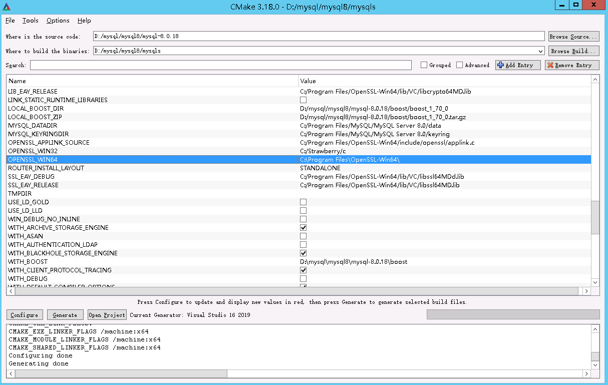

windows下的MySQL的编译其实并不困难，但网上的介绍都很简略，而且往往只说做什么而忽略是什么和为什么，导致一些细节阻碍了后来人。

#### 基础环境

1. 安装cmake

CMake是一个跨平台的安装编译工具，可以用简单的语句来描述所有平台的安装(编译过程)。他能够输出各种各样的makefile或者project文件，能测试编译器所支持的C++特性,类似UNIX下的automake。只是 CMake 的组态档取名为 CMakeLists.txt。

2. 安装bison

用于自动生成语法分析器程序，把LALR形式的上下文无关文法描述转换为可做语法分析的C或C++程序。安装的时候，务必注意安装路径中不能有空格，否则编译的时候会有“No such file or directory”找不到路径的报错。

3. 安装visual sudio

调试工具有很多，可以用eclipse，vsc等。此处用visual studio

#### 下载MySQL源码

该步骤略去。

#### 编译MySQL

1. 建立文件夹mysqls，存放编译结果，文件夹最好不设置在MySQL源码目录
2. 进入mysqls，执行

```
cmake ..\mysql-8.0.18 -DDOWNLOAD_BOOST=1 -DWITH_BOOST=D:\mysql\mysql8\mysql-8.0.18\boost  -G “Visual Studio 16 2019”
```

编译64bit需要加-G选项。-G选项具体书写方式可以使用cmake -G查看

```
cmake -G
Generators
* Visual Studio 16 2019        = Generates Visual Studio 2019 project files.
                                 Use -A option to specify architecture.
  Visual Studio 15 2017 [arch] = Generates Visual Studio 2017 project files.
                                 Optional [arch] can be "Win64" or "ARM".
  Visual Studio 14 2015 [arch] = Generates Visual Studio 2015 project files.
                                 Optional [arch] can be "Win64" or "ARM".
  Visual Studio 12 2013 [arch] = Generates Visual Studio 2013 project files.
                                 Optional [arch] can be "Win64" or "ARM".
  Visual Studio 11 2012 [arch] = Generates Visual Studio 2012 project files.
                                 Optional [arch] can be "Win64" or "ARM".
  Visual Studio 10 2010 [arch] = Generates Visual Studio 2010 project files.
                                 Optional [arch] can be "Win64" or "IA64".
  Visual Studio 9 2008 [arch]  = Generates Visual Studio 2008 project files.
                                 Optional [arch] can be "Win64" or "IA64".
  Borland Makefiles            = Generates Borland makefiles.
  NMake Makefiles              = Generates NMake makefiles.
  NMake Makefiles JOM          = Generates JOM makefiles.
  MSYS Makefiles               = Generates MSYS makefiles.
  MinGW Makefiles              = Generates a make file for use with
                                 mingw32-make.
  Unix Makefiles               = Generates standard UNIX makefiles.
  Green Hills MULTI            = Generates Green Hills MULTI files
                                 (experimental, work-in-progress).
  Ninja                        = Generates build.ninja files.
  Ninja Multi-Config           = Generates build-<Config>.ninja files.
  Watcom WMake                 = Generates Watcom WMake makefiles.
  CodeBlocks - MinGW Makefiles = Generates CodeBlocks project files.
  CodeBlocks - NMake Makefiles = Generates CodeBlocks project files.
  CodeBlocks - NMake Makefiles JOM
                               = Generates CodeBlocks project files.
  CodeBlocks - Ninja           = Generates CodeBlocks project files.
  CodeBlocks - Unix Makefiles  = Generates CodeBlocks project files.
  CodeLite - MinGW Makefiles   = Generates CodeLite project files.
  CodeLite - NMake Makefiles   = Generates CodeLite project files.
  CodeLite - Ninja             = Generates CodeLite project files.
  CodeLite - Unix Makefiles    = Generates CodeLite project files.
  Sublime Text 2 - MinGW Makefiles
                               = Generates Sublime Text 2 project files.
  Sublime Text 2 - NMake Makefiles
                               = Generates Sublime Text 2 project files.
  Sublime Text 2 - Ninja       = Generates Sublime Text 2 project files.
  Sublime Text 2 - Unix Makefiles
                               = Generates Sublime Text 2 project files.
  Kate - MinGW Makefiles       = Generates Kate project files.
  Kate - NMake Makefiles       = Generates Kate project files.
  Kate - Ninja                 = Generates Kate project files.
  Kate - Unix Makefiles        = Generates Kate project files.
  Eclipse CDT4 - NMake Makefiles
                               = Generates Eclipse CDT 4.0 project files.
  Eclipse CDT4 - MinGW Makefiles
                               = Generates Eclipse CDT 4.0 project files.
  Eclipse CDT4 - Ninja         = Generates Eclipse CDT 4.0 project files.
  Eclipse CDT4 - Unix Makefiles= Generates Eclipse CDT 4.0 project files.
```

注意，执行该命令，最容易遇到的问题是SSL问题“Cannot find appropriate system libraries for WITH_SSL=system”，可以如下执行

```
cmake ..\mysql-8.0.18 -DDOWNLOAD_BOOST=1 -DWITH_BOOST=D:\mysql\mysql8\mysql-8.0.18\boost  -DWITH_SSL='C:\Program Files\OpenSSL-Win64'   -G 'Visual Studio 16 2019'
```

cmake的选项很多，不能一一记清楚的话，可以使用cmake-gui工具帮助



configure按钮成功以后按generate按钮

3. 编译输出

```
cmake --build . --config relwithdebinfo --target package
```

如果没有发生错误，就可以在    下看到zip包，该包解压就是一个完整的mysql版本

#### 注意事项

cmake的locale问题

```
该文件包含不能在当前代码页(936)中表示的字符。请将该文件保存为 Unicode 格式以防止数据丢失
```

