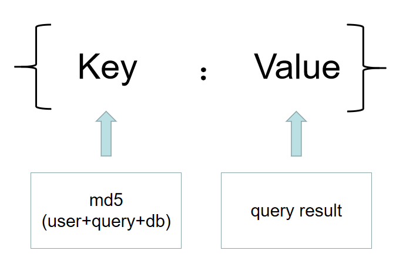
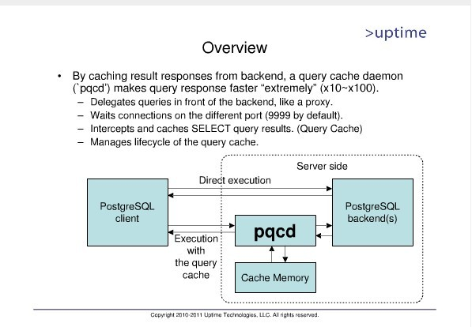

https://blog.csdn.net/chenyi8888/article/details/6999524

https://blog.csdn.net/chuofuxuan1936/article/details/100979188

## 简介

# pqc介绍

pqc（PostgreSQL Query Cache）是一个通过缓存查询结果集来提高查询性能的开源插件。它是基于memcached实现。memcached是一个分布式对象缓存系统，它是一个基于key-value的结果存储。其实memcached主要的作用就是用来缓存查询的结果，用以提高查询效率。



pqc对于查询结果的缓存实现为：

1. 当进行第一次查询时，pqc会把用户名user，查询语句query以及数据库db三个参数值做一个MD5校验值当做key，
2. 然后把query的查询结果当做value值，组成一对（key，value）。
3. 当进行下一次查询时，pqc继续对（user，query，db）生成MD5校验值，然后对比缓存中存储的key值，如果相同直接返回查询结果（即可以的value值），而不必再生成执行计划进行执行。所以在执行效率上会有一个飞跃的提升。



其实pqc还有pgpool连接池的功能，pqc缓存的查询结果集，就是存储在这些连接池的缓存中。所以只有通过pgpool连接池连接数据库时，才能通过缓存结果集返回查询结果。

## 安装

1. 安装libevent依赖

   libevent是一个事件通知库，是安装memcached系统所依赖的事件处理和网通通信工具。从网上下载源码：

https://github.com/libevent/libevent/releases/download/release-2.1.11-stable/libevent-2.1.11-stable.tar.gz

解压后，可直接：configure & make & make install编译安装，或者通过yum install libevent安装。

2. 安装memcached

  网上下载源码：

https://memcached.org/files/memcached-1.5.16.tar.gz

解压后，直接：configure & make & make install 编译安装。

3. 安装libmemcached

  memcached在系统中是以server端的角色存在，libmemcached是memcached的客户端库，用以实现对分布式管理及内存池的管理等。

https://launchpad.net/libmemcached/1.0/1.0.18/+download/libmemcached-1.0.18.tar.gz

解压后，直接：configure & make & make install 编译安装。

4. 安装pqc

上述依赖安装完之后，就可以安装pqc了。该插件可以从github上下载源码。

https://github.com/snaga/pqc

同样，下载源码后，解压，直接：configure & make & make install 编译安装。

## 配置

1. 配置pqcd.conf

```
# pqcd configuration file sample
 
# Host name or IP address to listen on: '*' for all, '' for no TCP/IP
# connections
listen_addresses = '*'
 
# Port number for pgpool
port = 9999
 
# Unix domain socket path.  (The Debian package defaults to
# /var/run/postgresql.)
socket_dir = '/tmp'
 
# Host name where PostgreSQL server is running on.  '' means localhost
# using Unix domain socket.
backend_host_name = ''
 
# port number PostgreSQL server is running on
backend_port = 5866
 
# Unix domain socket path for the backend.  (The Debian package defaults
# to /var/run/postgresql.)
backend_socket_dir = '/tmp'
 
# Host name where secondary PostgreSQL server is running on.  '' means
# localhost using Unix domain socket.
secondary_backend_host_name = ''
 
# Port number secondary PostgreSQL server is running on.  0 means no
# secondary PostgreSQL.
secondary_backend_port = 0
 
# Number of pre-forked child processes
num_init_children = 32
 
# Number of connection pools allowed for a child process
max_pool = 4
 
# If idle for this many seconds, child exits.  0 means no timeout.
child_life_time = 300
 
# If idle for this many seconds, connection to PostgreSQL closes.
# 0 means no timeout.
connection_life_time = 0
 
# If child_max_connections connections were received, child exits.
# 0 means no exit.
child_max_connections = 0
 
# Logging directory
logdir = '/tmp'
 
# Replication mode
replication_mode = false
 
# Set this to true if you want to avoid deadlock situations when
# replication is enabled.  There will, however, be a noticable performance
# degration.  A workaround is to set this to false and insert a /*STRICT*/
# comment at the beginning of the SQL command.
replication_strict = true
 
# When replication_strict is set to false, there will be a chance for
# deadlocks.  Set this to nonzero (in milliseconds) to detect this
# situation and resolve the deadlock by aborting current session.
replication_timeout = 5000
 
# Load balancing mode, i.e., all SELECTs except in a transaction block
# are load balanced.  This is ignored if replication_mode is false.
load_balance_mode = false
 
# Load balance weight for master and secondary.  The actual weight is
# calculated by weight_master divided by weight_secondary.  For
# example both
#
# weight_master = 10 and weight_secondary = 5
# weight_master = 4 and weight_secondary = 2
#
# are regarded as the master having double the weight compared to the
# secondary.  Master and secondary have the same weight in the default.
weight_master = 0.5
weight_secondary = 0.5
 
# If there is a data mismatch between master and secondary, start
# degeneration to stop replication mode.
replication_stop_on_mismatch = false
 
# If true, replicate SELECT statement when load balancing is disabled.
# If false, it is only sended to the master node.
replicate_select = false
 
# Semicolon separated list of queries to be issued at the end of a session
reset_query_list = 'ABORT; RESET ALL; SET SESSION AUTHORIZATION DEFAULT'
 
# If true print time stamp on each log line.
print_timestamp = true
 
# If true, operate in master/slave mode.
master_slave_mode = false
 
# If true, cache connection pool.
connection_cache = true
 
# Health check timeout.  0 means no timeout.
health_check_timeout = 20
 
# Health check period.  0 means no health check.
health_check_period = 0
 
# Health check user
health_check_user = 'nobody'
 
# If true, automatically lock table with INSERT statements to keep SERIAL
# data consistency.  An /*INSERT LOCK*/ comment has the same effect.  A
# /NO INSERT LOCK*/ comment disables the effect.
insert_lock = false
 
# If true, ignore leading white spaces of each query while pgpool judges
# whether the query is a SELECT so that it can be load balanced.  This
# is useful for certain APIs such as DBI/DBD which is known to adding an
# extra leading white space.
ignore_leading_white_space = false
 
# - What to Log -
 
# If true, print all statements to the log.  Like the log_statement option
# to PostgreSQL, this allows for observing queries without engaging in full
# debugging.
log_statement = false
 
# If true, incoming connections will be printed to the log.
log_connections = false
 
# If true, hostname will be shown in ps status. Also shown in
# connection log if log_connections = true.
# Be warned that this feature will add overhead to look up hostname.
log_hostname = false
 
# - HBA -
 
# If true, use pool_hba.conf for client authentication.
enable_pool_hba = true
 
memcached_bin = '/usr/local/bin/memcached'
query_cache_mode = 'active'
query_cache_expiration = 30
```


2. 配置pqcd_hba.conf

```
# TYPE  DATABASE    USER        CIDR-ADDRESS          METHOD
 
# "local" is for Unix domain socket connections only
local   all         all                               trust
# IPv4 local connections:
host    all         all         127.0.0.1/32          trust
```

## 启动数据库

```
pg_ctl start
```

## 启动pqcd

```
执行pqcd命令: pqcd
在启动pqcd命令的同时，会同时启动memcached进程，用于对缓存的管理
```

## 使用和测试
从pgpool连接池中连接数据库。