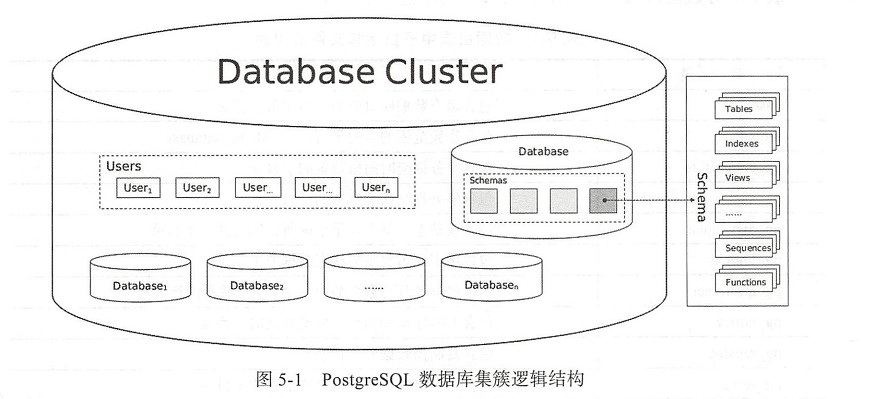
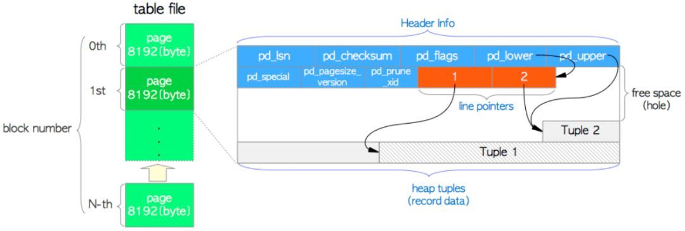
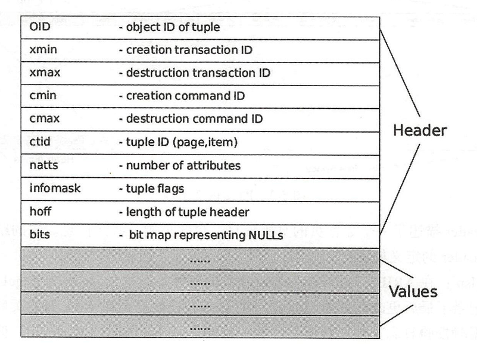
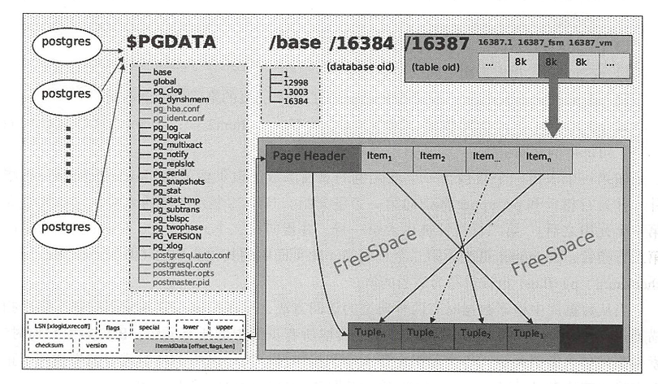

## 基本概念

#### postgresql数据库

PostgreSQL数据库是由一系列位于文件系统上的物理文件组成，在数据库运行过程中，通过整套高效严谨的逻辑管理这些物理文件，通常将这些物理文件称为**数据库**。

#### postgresql数据库实例

将postgresql的这些物理文件、管理这些物理文件的进程、进程管理的内存称为这个**数据库的实例**

#### postgresql数据库集簇

它是指由单个 PostgreSQL服务器实例管理的数据库集合，组成数据库集簇的这些数据库使用相同的全局配置文件和监听端口、共用进程和内存结构，并不是指“一组数据库服务器构成的集群”，在 PostgreSQL中说的某一个数据库实例通常是指某个数据库集簇，这一点和其他常见的关系型数据库有一定差异




## 物理结构

#### 目录结构

**数据库的文件默认保存在initdb时创建的数据库目录中，包括数据文件、参数文件、控制文件、数据库运行日志、预写日志等

```
# tree -L 1
.
├── base
├── global
├── pg_commit_ts
├── pg_dynshmem
├── pg_hba.conf
├── pg_ident.conf
├── pg_logical
├── pg_multixact
├── pg_notify
├── pg_replslot
├── pg_serial
├── pg_snapshots
├── pg_stat
├── pg_stat_tmp
├── pg_subtrans
├── pg_tblspc
├── pg_twophase
├── PG_VERSION
├── pg_wal
├── pg_xact
├── postgresql.auto.conf
├── postgresql.conf
├── postmaster.opts
└── postmaster.pid

17 directories, 7 files
```


目录|用途
---|---
base|包含每个数据库对应的子目录的子目录
global|包含集簇范围的表的子目录，比如 pg_database
pg_commit_ts|包含事务提交时间戳数据的子目录
pg_xact|包含事务提交状态数据的子目录
pg_dynshmem|包含被动态共享内存子系统所使用文件的子目录
pg_logical|包含用于逻辑复制的状态数据的子目录
pg_multixact|包含多事务状态数据的子目录（用于共享的行锁）
pg_notify|包含 LISTEN/NOTIFY状态数据的子目录
pg_replslot|包含复制槽数据的子目录
pg_serial|包含已提交的可序列化事务信息的子目录
pg_snapshots|包含导出的快照的子目录
pg_stat|包含用于统计子系统的永久文件的子目录
pg_stat_tmp|包含用于统计信息子系统临时文件的子目录
pg_subtrans|包含子事务状态数据的子目录
pg_tblspc|包含指向表空间的符号链接的子目录
pg_twophase|用于预备事务状态文件的子目录
pg_wal|保存预写日志


文件|用途
---|---
PG_VERSION|PostgreSQL主版本号文件
pg_hba.conf|客户端认证控制文件
postgresql.conf|参数文件
postgresql.auto.conf|参数文件，只保存 ALTER SYSTEM命令修改的参数记录
postmaster.opts|服务器最后一次启动时使用的命令行参数

#### 数据文件布局

#### oid
**postgresql所有数据库对象都由各自的对象标识符（oid无符号4字节整数）进行内部管理**
数据库oid存储在pg_database系统表中，oid字段是隐藏的，必须显式指定才看得到
```
# select oid,datname from pg_database ;
  oid  |  datname  
-------+-----------
 13858 | postgres
     1 | template1
 13857 | template0
(3 rows)
```
数据库的表、索引、序列等对象的oid存储于pg_class系统表中

```
# select oid,relname,relkind from pg_class where relname ~ 'tbl';
 oid  |              relname              | relkind 
------+-----------------------------------+---------
 3455 | pg_class_tblspc_relfilenode_index | i
(1 row)

# select oid,relname,relkind from pg_class where relname like  '%tbl%';
 oid  |              relname              | relkind 
------+-----------------------------------+---------
 3455 | pg_class_tblspc_relfilenode_index | i
(1 row)

```

##### 表空间

表空间是pg中最大的逻辑存储单位，数据库中创建的对象都保存在表空间中

创建数据库对象时，可以指定数据库对象的表空间，如果不指定，则使用默认的表空间

```
# \db
       List of tablespaces
    Name    |  Owner   | Location 
------------+----------+----------
 pg_default | postgres | 
 pg_global  | postgres | 
(2 rows)
```

初始化数据库的时候，会自动创建pg_default和pg_global表空间，

pg_global位于global目录中，保存系统表

pg_default位于base目录中，是模板数据库template0和template1的默认表空间

也可以自建表空间

```
# create tablespace test location '/opt/PostgreSQL/10/data/';
CREATE TABLESPACE
```

可以看到在/opt/PostgreSQL/10/data/下新增了目录PG_10_201707211,此时该目录为空，说明表空间没有任何数据。在该表空间下建表

```
# create table test1(a int) tablespace test;
CREATE TABLE
```

可以看到在PG_10_201707211下多了一个13858的文件夹，同时文件夹下多了一个文件16418

```
# select oid,datname from pg_database where oid=13858;
  oid  | datname  
-------+----------
 13858 | postgres
(1 row)

# select oid,relname,relkind from pg_class where relname like  '%test1%';
  oid  | relname | relkind 
-------+---------+---------
 16418 | test1   | r
(1 row)
```

说明是OID为13858对应的数据库（即postgres数据库）下新增了OID为16418的表（即test1表）

从上面可以看到数据库、表空间、表之间的关系。

##### 表的页结构

在 PostgreSQL中，将保存在磁盘中的块称为Page，而将内存中的块称为 Buffer，表和索引称为 Relation，行称为 Tuple。

数据的读写是以Page为最小单位，每个Page默认大小为&kB，在编译 PostgreSQL时指定的 BLCKSZ大小决定Page的大小。




#### PageHeader

描述了一个数据页的页头信息，包含页的一些元信息。它的结构及其结构指针 PageHeader的定义如下：

字段名|说明
---|---
pg_lsn|在 ARIES Recovery Algorithm的解释中，这个lsn称为 PageLSN，它确定和记录了最后更改此页的xlog记录的LSN，把数据页和WAL日志关联，用于恢复数据时校验日志文件和数据文件的一致性； pg_Isn的高位为 logic，低位记录偏移量；因为历史原因，64位的LSN保存为两个32位的值。
pg_flags|标识页面的数据存储情况。
pg_special|指向索引相关数据的开始位置，该项在数据文件中为空，主要是针对不同索引。
pg_lower|指向空闲空间的起始位置。
pg_upper|指向空闲空间的结束位置。
pg_pagesize_version|不同的 PostgreSQL版本的页的格式可能会不同。
pg_linp[1]|行指针数组，这些地址指向Tuple的存储位置。


#### Tuple

每个 Tuple包含两部分的内容，一部分为 HeapTupleHeader，用来保存 Tuple的元信息，包含该 Tuple的oID、xmin、cmin等；另一部分为 HeapTuple，用来保存 Tuple的数据。


```
# select xmin,xmax,cmin,cmax,ctid  from score;
 xmin | xmax | cmin | cmax | ctid  
------+------+------+------+-------
  598 |    0 |    0 |    0 | (0,1)
  598 |    0 |    0 |    0 | (0,2)
  598 |    0 |    0 |    0 | (0,3)
  598 |    0 |    0 |    0 | (0,4)
  598 |    0 |    0 |    0 | (0,5)
  598 |    0 |    0 |    0 | (0,6)
  598 |    0 |    0 |    0 | (0,7)
  598 |    0 |    0 |    0 | (0,8)
  598 |    0 |    0 |    0 | (0,9)
(9 rows)
```

其余列不能通过显式指定的方式查询得到


