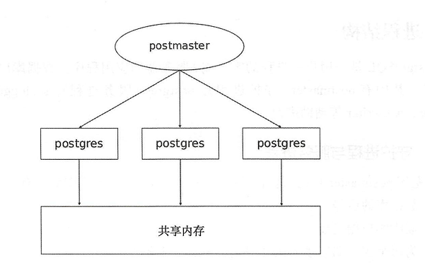
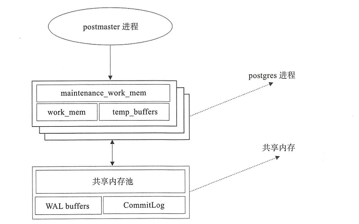

## postgresql的进程体系

1. postgresql是多进程结构（相对于MySQL的多线程结构）
2. postgresql是一个用户对应一个进程的应用程序
3. 数据库启动时会启动若干进程，有postmaster（守护进程）,postgres（服务进程）,syslogger,checkpointer,bgwriter,walwriter等辅助进程

## 守护进程与服务进程

#### 守护进程

守护进程的主要职责有：

1. 数据库的启停。
2. 监听客户端连接。
3. 为每个客户端连接fork单独的 postgres服务进程。
4. 当服务进程出错时进行修复。
5. 管理数据文件。
6. 管理与数据库运行相关的辅助进程。

#### 服务进程

#### 辅助进程

除了守护进程 postmaster和服务进程 postgres外， PostgreSQL在运行期间还需要一些辅助进程才能工作，这些进程包括：
进程名|说明
---|---
background writer|也可以称为 bgwrite进程， bgwriter进程很多时候都是在休眠状态 每次唤醒后它会搜索共享缓冲池找到被修改的页，并将它们从共享缓冲池刷出。
autovacuum launcher|自动清理回收垃圾进程WAL writer|定期将WAL缓冲区上的WAL数据写入磁盘。
statistics collector|统计信息收集进程。
logging collector|日志进程，将消息或错误信息写入日志。
archiver|WAL归档进程。
checkpointer|检查点进程。

## 内存结构

#### 本地内存

本地内存为每个后端服务进程分配给自己使用。

本地内存由三部分组成：work_mem、 maintenance_work_mem 、 temp_buffers
名称|说明
---|---
work mem|当使用 ORDER BY或 DISTINCT操作对元组进行排序时会使用这部分内存
maintenance work mem|维护操作，例如 VACUUM、 REINDEX、 CREATE INDEX等操作使用这部分内存。
temp_buffers|临时表相关操作使用这部分内存

#### 共享内存

共享内存在 PostgreSQL服务器启动时分配，由所有后端进程共同使用。共享内存主要由三部分组成

名称|说明
---|---
shared_buffer_pool|PostgreSQL将表和索引中的页面从持久存储装载到这里，并直接操作它们。
WAL_buffer|wAL文件持久化之前的缓冲区。
CommitLog_buffer|PostgreSQL在 Commit Log中保存事务的状态，并将这些状态保留在共享内存缓冲区中，在整个事务处理过程中使用

