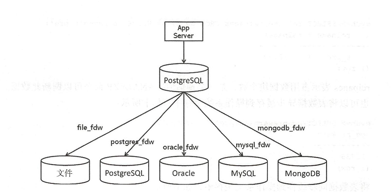

SQL/MED是 PostgreSQL另一特色功能，这一特性是指在 PostgreSQL数据库中通过SQL访问外部数据源数据，就像访问本地库数据一样，这和 Oracle中的 blink功能类似， SQL/MED示例如图16-1所示。



目前支持访问的外部数据源主要有以下几类：

1. 文件：在 PostgreSQL数据库中访问数据库主机文件，文件需具备一定的格式，常见的文件格式为csv和 text
2. 关系型数据库：在 PostgreSQL数据库中访问远程的数据库，例如 PostgreSQL、 Oracle、 MySQL、 SQL Server等。
3. 非关系型数据库：MongoDB、 Redis、 Cassandra等非关系数据库。
4. 大数据：Elastic Search、 Hadoop等。


##file_fdw

1. 创建extension

```
# create extension file_fdw ;
CREATE EXTENSION
```

2. 创建外部服务

外部服务定义了具体外部数据源的链接信息。如果是数据库，包含了数据库的IP，端口，名称等

```
# create server file_fdw_server foreign data wrapper file_fdw ;
CREATE SERVER
使用\des查看
# \des
              List of foreign servers
      Name       |  Owner   | Foreign-data wrapper 
-----------------+----------+----------------------
 file_fdw_server | postgres | file_fdw
(1 row)
```

3. 创建外部表

```
# create foreign table passwd(uaername text,pass text,uid int4,gid int4,gecos text,home text,shell text) server file_fdw_server  options(format 'text',filename '/etc/passwd',delimiter ':',null '');
CREATE FOREIGN TABLE
```

options指定了file_fdw外部扩展选项，如下：

1. filename:指定要访问的文件绝对路径和名称
2. format：指定文件格式，支持格式text，csv，binary，默认为text
3. header：指定文件是否包含字段名称，对csv有效
4. delimiter：指端分隔符
5. encoding：文件编码

除了filename选项，其他选项与copy命令一致

4. 外部表定义完成后，可以像访问本地表一样访问

```
# select * from passwd limit 5;
 uaername | pass | uid | gid | gecos  |      home      |     shell     
----------+------+-----+-----+--------+----------------+---------------
 root     | x    |   0 |   0 | root   | /root          | /bin/bash
 bin      | x    |   1 |   1 | bin    | /bin           | /sbin/nologin
 daemon   | x    |   2 |   2 | daemon | /sbin          | /sbin/nologin
 adm      | x    |   3 |   4 | adm    | /var/adm       | /sbin/nologin
 lp       | x    |   4 |   7 | lp     | /var/spool/lpd | /sbin/nologin
(5 rows)

# \det
      List of foreign tables
 Schema | Table  |     Server      
--------+--------+-----------------
 public | passwd | file_fdw_server
(1 row)
```

外部表并不存储数据，只是指向外部数据源的链接，所以只支持读

## postgres_fdw

通过postgres_fdw，可以远程访问postgres服务器上的数据，类似于dblink

1. 在本地服务上创建postgres_fdw扩展

```
# create extension postgres_fdw ;
CREATE EXTENSION

# \dew
                      List of foreign-data wrappers
     Name     |  Owner   |       Handler        |       Validator        
--------------+----------+----------------------+------------------------
 file_fdw     | postgres | file_fdw_handler     | file_fdw_validator
 postgres_fdw | postgres | postgres_fdw_handler | postgres_fdw_validator
(2 rows)
```

2. 本地服务上，先创建用户，再创建foreign server外部服务

```
# grant USAGE  on FOREIGN data wrapper postgres_fdw to postgres;
# create server fs_postgres_pghost foreign data wrapper postgres_fdw options (host 'univebook.cn' ,port '5432',dbname 'postgres');
CREATE SERVER
```
此处的host，port等都是远端服务器的设置
3. 创建映射用户

```
# create user MAPPING FOR postgres server fs_postgres_pghost options(user 'postgres',password '123456');
CREATE USER MAPPING
```
此处的user和password都是远端服务器的，而for后面跟着的用户是本地用户

4. 创建外部表,定义最好与远程表一致

```
---远端表
# create table test_fdw(id int ,info text);
CREATE TABLE

--外部表
# create foreign table test_fdw(id int,info text) server fs_postgres_pghost options(schema_name 'postgres',table_name 'test_fdw');
CREATE FOREIGN TABLE
```

这样就可以直接通过外部表对远端操作了。包括增删改查等操作

```
# select * from test_fdw;
 id |   info   
----+----------
  1 | test_fdw
(1 row)

# insert into test_fdw values(2,'test_fdw2');
INSERT 0 1
```

如果遇到报错

```
ERROR:  could not connect to server "fs_postgres_pghost"
DETAIL:  致命错误:  没有用于主机 "47.104.152.163", 用户 "postgres", 数据库 "postgres", SSL 关闭 的 pg_hba.conf 记录
```

则需要修改pg_hba.conf

```
# TYPE  DATABASE        USER            ADDRESS                 METHOD
host  postgres postgres 47.104.152.163/32 md5
```

**postgresql在10版本，提供了聚合函数下推，可以将一些操作在远端服务器上执行再传结果到外部表。这样可以节省带宽提高性能**

