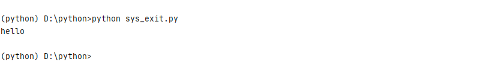

执行至主程序的末尾时,解释器会自动退出. 但是如果需要中途退出程序, 你可以调用 sys.exit 函数, 它带有一个可选的整数参数返回给调用它的程序。


## 使用sys.exit

```
import sys
print("hello")
sys.exit(1)
print("world")
```

保存为sys_exit.py，执行后结果是



该方式其实是触发一个exit的异常

```
An exception has occurred, use %tb to see the full traceback.

SystemExit: 1
```

捕获该异常，可以使用try

```
import sys
print("hello")
try:
	sys.exit(1)
except SystemExit:
    print("SystemExit")
print("world")
```

