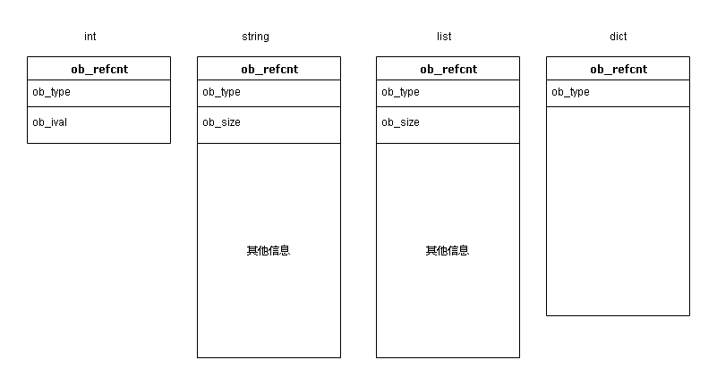

## 一、对象机制的基石— PyObject

在 Python中，所有的东西都是对象，而所有的对象都拥有一些相同的内容，这些内容在 Pyobject中定义， Pyobject是整个 Python对象机制的核心

[object.h]

```
typedef struct _object {
	PyObject_HEAD
} PyObject;
```

这个结构体是 Python对象机制的核心基石，从代码中可以看到， Python对象的秘密都隐藏在 Pyobject_HEAD这个宏中。

```
#ifdef Py_TRACE_REFS
/* Define pointers to support a doubly-linked list of all live heap objects. */
#define _PyObject_HEAD_EXTRA		\
	struct _object *_ob_next;	\
	struct _object *_ob_prev;

#define _PyObject_EXTRA_INIT 0, 0,

#else
#define _PyObject_HEAD_EXTRA
#define _PyObject_EXTRA_INIT
#endif

#define PyObject_HEAD			\
	_PyObject_HEAD_EXTRA		\
	Py_ssize_t ob_refcnt;		\
	struct _typeobject *ob_type;
```

由于release模式下，不定义_PyObject_HEAD_EXTRA。所以根据这两个定义，做一个简单的替换，可以得到_object的实际定义是

```
typedef struct _object {
	Py_ssize_t ob_refcnt;		\
	struct _typeobject *ob_type;
} PyObject;
```

- Py_ssize_t实际是int，ob_refcnt则是一个整形变量，用作引用计数来实现垃圾收集
- ob_type是一个指针，指定对象类型的类型对象（绕口^_^），即存储类型信息

### 不同类型的内存布局



ob_size指的是元素个数，而非字节数量。从图上看来，各种不同的对象，不管定长还是不定长，基础都是很类似的，来自于_object结构。

### 对象的多态性

通过 pyobject和 Py Typeobject, Python利用C语言完成了C+所提供的对象的多态的特性。

- 在 Python创建一个对象，比如 PyIntobject对象时，会分配内存，进行初始化。
- 然后 Python内部会用一个 object变量，而不是通过一个 PyIntobject*变量来保存和维护这个对象。
- *其他对象也与此类似，所以在 Python内部各个函数之间传递的都是种范型指针Pyobject *，正是通过这个域， Python实现了多态机制

### 引用计数

ob_refcnt变量维护引用计数，内部使用Py_INCREF(op) 和 Py_DECREF(op) 宏来增加或者减少引用计数