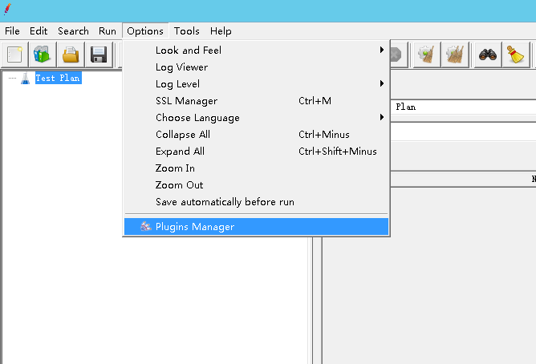
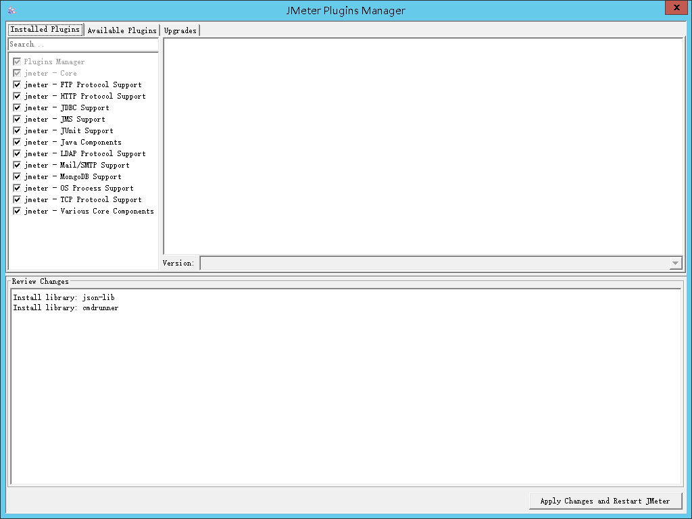

Jmeter作为一个开源的接口性能测试工具，其本身的小巧和灵活性给了测试人员很大的帮助，但其本身作为一个开源工具，相比于一些商业工具（比如LoadRunner），在功能的全面性上就稍显不足。

这篇博客，就介绍下jmeter的第三方插件**jmeter-plugins.org**和其中常用的几种插件使用方法

## 插件管理器下载与安装

#### 下载

要安装插件，必须先安装插件管理器，即jmeter-plugins-manager

下载链接：https://jmeter-plugins.org/install/Install/

#### 安装

下载完毕之后，将jmeter-plugins-manager-1.4.jar放置在lib/ext下，重启Jmeter即可

打开options选项，可以看到新增了“plugin manager”功能项

打开后

