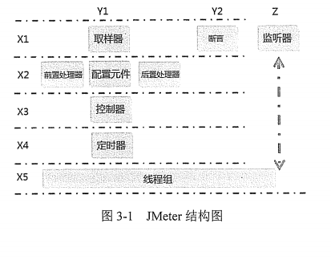
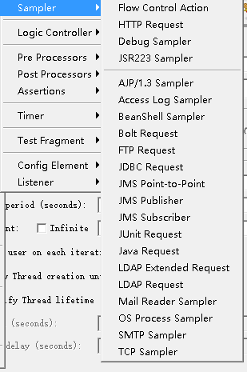
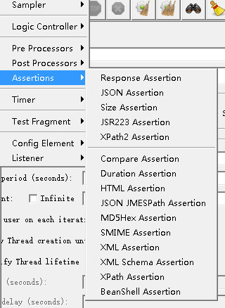
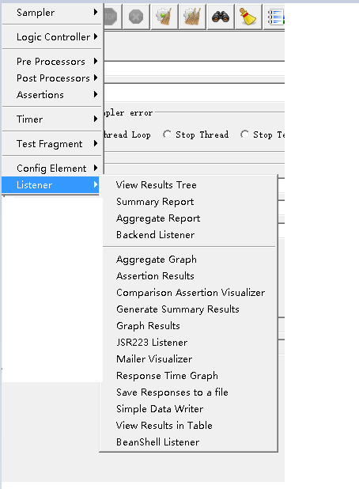
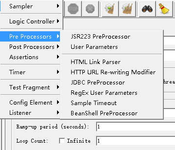
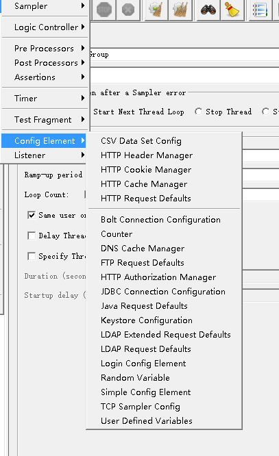
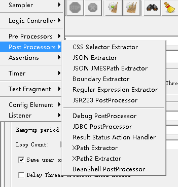

## jmeter结构

取样器：模拟用户操作，向被测系统发出HTTP请求、webservice请求、java请求等。HTTP请求元件可以看成是没有界面的浏览器，它可以发送HTTP请求接收服务器的响应数据，做数据交互。

jmeter2.11取样器有23个，5.2有21个

断言：断言用来验证结果是否正确，类似于loadrunner的检查点。jmeter2.11的断言有13个,5.2版本有15个

监听器：收集程序的测试结果。监听器有两个任务：保存结果和展示结果。2.11版本有19个监听器，5.2版本有16个

前置处理器：

前置处理器做一些环境或者参数的准备工作，比如建立数据库连接

配置元件

完成jmeter的参数化工作

后置处理器：一般用来放在取样器后，处理服务器的返回结果

控制器

定时器

线程组

测试片段（Test Fragment）

工作台

Jmeter运行原理

loadrunner可以选择进程或者线程方式运行，Jmeter是以线程方式运行